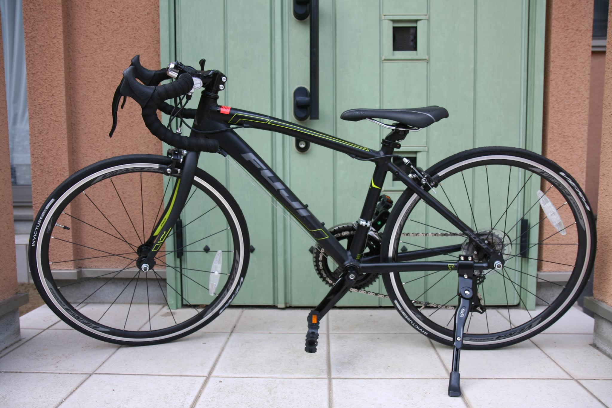
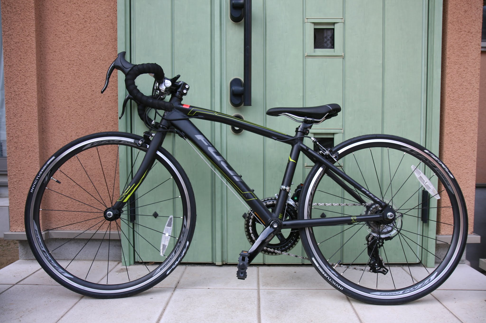
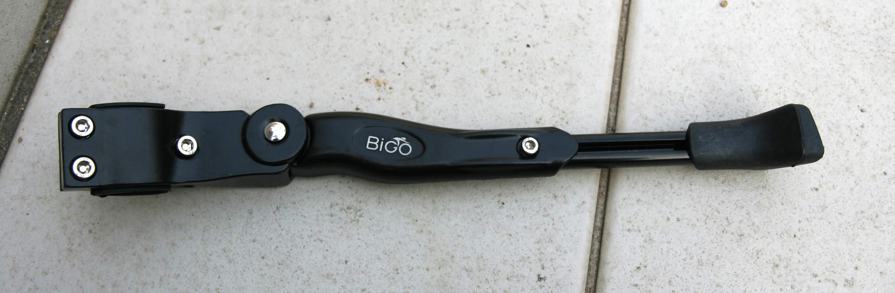
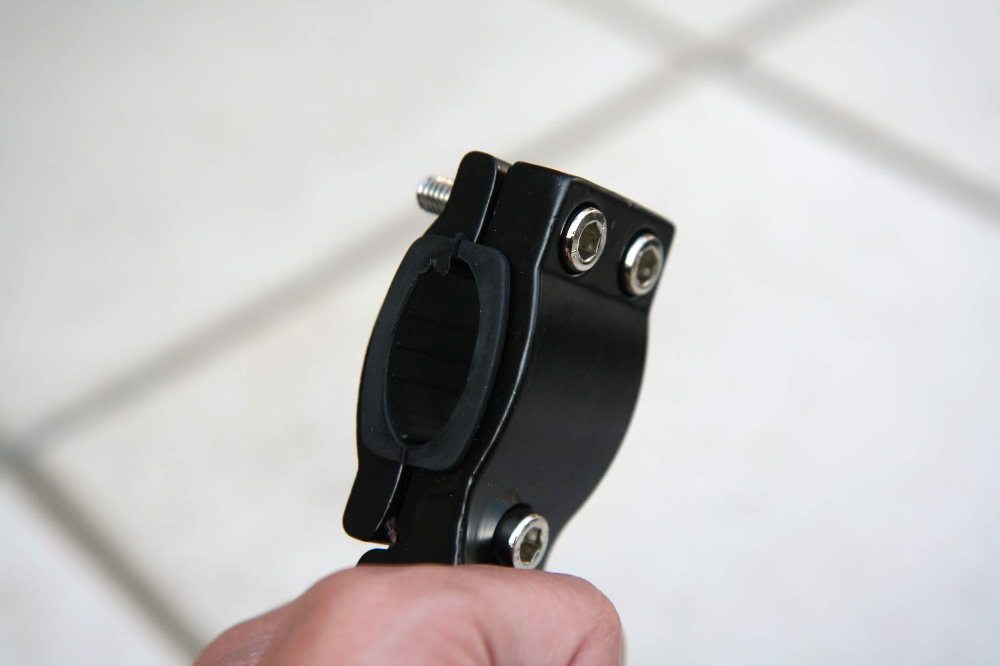
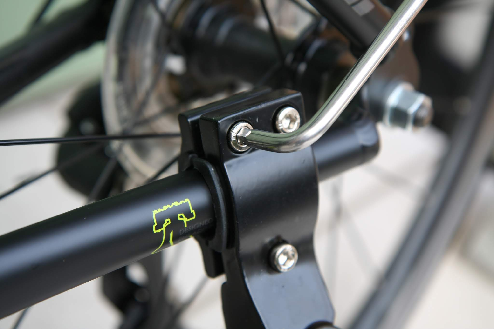
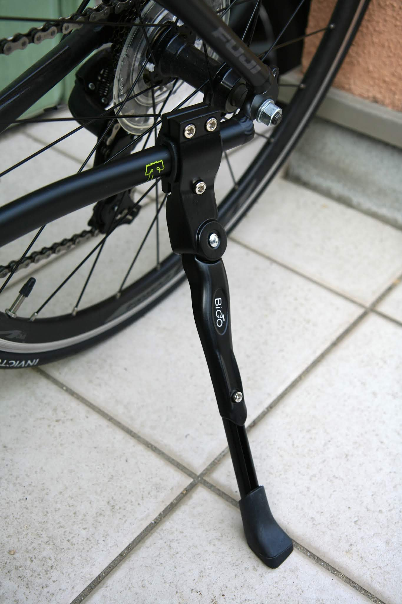
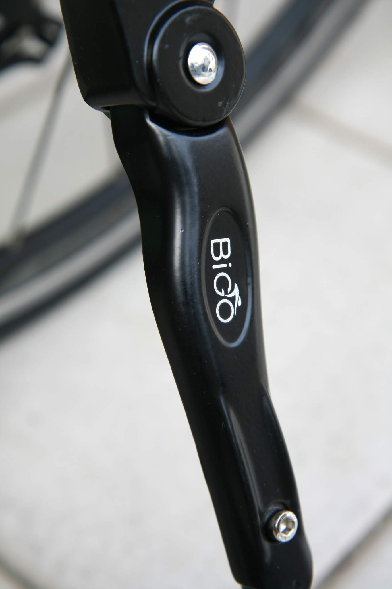
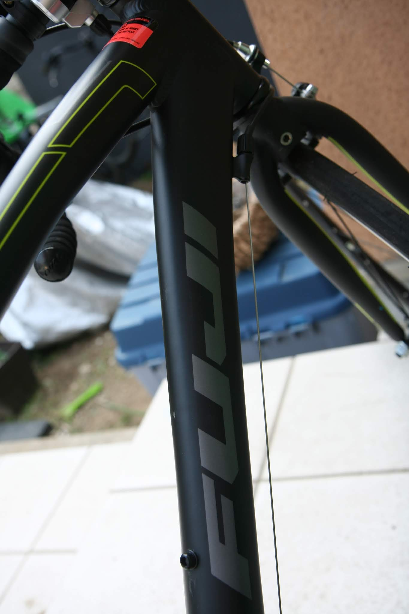

---
categories:
- 自転車
- bike
date: "2025-02-15T23:42:27+09:00"
draft: false
image: images/IMG_4453_01.jpg
summary: 子供の自転車にFuji ACE24を買いましたがスタンドが付いていないのでAmazonで購入し、DIYで付けてみました。
tags:
- スタンド
- Fuji ACE24
title: FUJI ACE24 スタンド取付
---

## FUJI ACE24 子供用自転車にスタンドを付けました

子供の自転車にFUJI ACE24を買いましたがスタンドが付いていないのでAmazonで購入。自分で付けてみました。

## そこそこ本格的なロードバイク

FUJI
ACE24は24インチの子供用自転車とはいえ、かっこよいアルミフレームにマットな黒塗装、ドロップハンドルエアロスポークと子供用としてはかなり凝った作りのロードバイクです。

## ペダルは付属、スタンドは無し

この価格帯の大人用クロスバイクや大抵のロードバイクと同様、スタンドは付属していません。ペダルは標準でプラスチック製のものが付いていました。普段使いではやはりスタンドが必要です。

## Amazonでスタンドを購入しました

24インチから対応で安いものを選定。1,000円くらいでBiGOという聞いたことのないロゴがついています。塗装に凹凸がありボルトのメッキも剥がれてきそうな感じですが実用上問題ないでしょう。

## スタンドの取付

自転車のステーを挟み込んで六角穴付きボルト3本でクランプするだけです。

 

スタンドの長さはスライドで調整できるようになっているので適当な長さにしてボルト1本で固定します。

 

取付後の全体です。スタンドが大きく主張している見た目になりました。結構安定しているので実用的かと思います。

Fuji ACE24は子供用とは思えないくらいかっこいいです。

