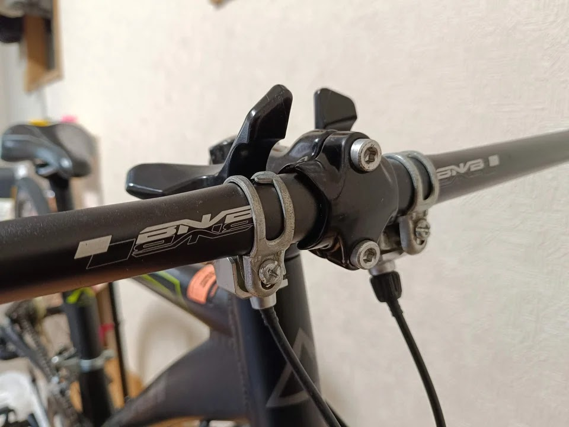

---
categories:
  - 自転車
  - bike
date: "2025-02-15T23:44:28+09:00"
description: 24インチの子供用ロードバイク、Fuji Ace 24。見た目Goodですが子供にはドロップハンドルが使いにくいようでしたのでフラットハンドルに交換、クロスバイク風に改造しました。
draft: false
images:
  - images/013.jpg
summary: 24インチの子供用ロードバイク、Fuji Ace 24。見た目Goodですが子供にはドロップハンドルが使いにくいようでしたのでフラットハンドルに交換、クロスバイク風に改造しました。
tags:
  - Fuji ACE24
  - ハンドル
  - フラットハンドル化
title: Fuji Ace 24 ドロップハンドルをフラットハンドルに交換
js: js/paad.ts
---

次男用に買った24インチのロードバイク風の自転車、Fuji Ace 24ですが、日常使いにはドロップハンドルが使いにくいようであまり乗られておらず、長男用のマウンテンバイクを共用で使っていました。三男も自転車に乗るようになり、1台の自転車を取り合いになる場面も出てきたのでFuji Ace 24をフラットハンドルに交換して普段使いできるようにしました。

## 購入したもの

-   フラットハンドルバー
-   グリップ
-   ブレーキレバー

ハンドルバーはBNVBというアマゾンの安いやつ、グリップも価格重視でROCKBROSのスポンジグリップを選びました。

ハンドルバーは、径がいろいろあるので事前に測っておく必要があります。Fuji
Ace
24は25.4mmでした。グリップとブレーキの径は、だいたいは22.2mmですが子供用自転車などでは19mmのものもあります。今回購入したハンドルは22.2mmなので同径を選びました。

ブレーキレバーはしっかりしたものにしたいのでシマノのClarisです。左右レバー＋ケーブルまで付いて3〜4千円程度とお得感があります。



## ハンドル交換作業

Fuji Ace
24のドロップハンドルです。フラットハンドルへ交換にあたり、ブレーキも交換が必要です。シフターも手元で操作できるものがいいのですが、まずは節約のため流用します。

ブレーキのゴムカバーをめくり、バーテープを剥がしていきます。

ブレーキはレバー奥のボルト1本で固定されていました。

ブレーキを外します。

ハンドルも外しました。

フラットハンドルを取付けます。ステムへの固定ボルトは、一般的なロードバイクだとM5
4本ですがこれはM6 2本と珍しいです。

シフターを前と同じ位置に取り付けます。

ブレーキレバー、グリップを取り付けます。

ブレーキケーブルも取付け完成です。フロントブレーキは、付属のアウターケーブルに交換しました。リアはこの自転車、子供用なのにケーブルがフレーム内を通っていたのでアウターケーブルの外し方がわからなかったので、アウターはそのまま使い、インナーワイヤーだけ交換しました。

ハンドル交換後の全体です。クロスバイク風になり印象がだいぶ変わりました。

ハンドルまわりです。普段使いとしては乗りやすくなっていそうですね。

## まとめ

子供用ロードバイクFuji Ace
24のドロップハンドルをフラットハンドルに交換しました。購入時にステムへの取付、グリップ、ブレーキの直径を注意必要ですが交換作業自体は簡単でした。シフターが流用できたので作業が少なく楽でした。


