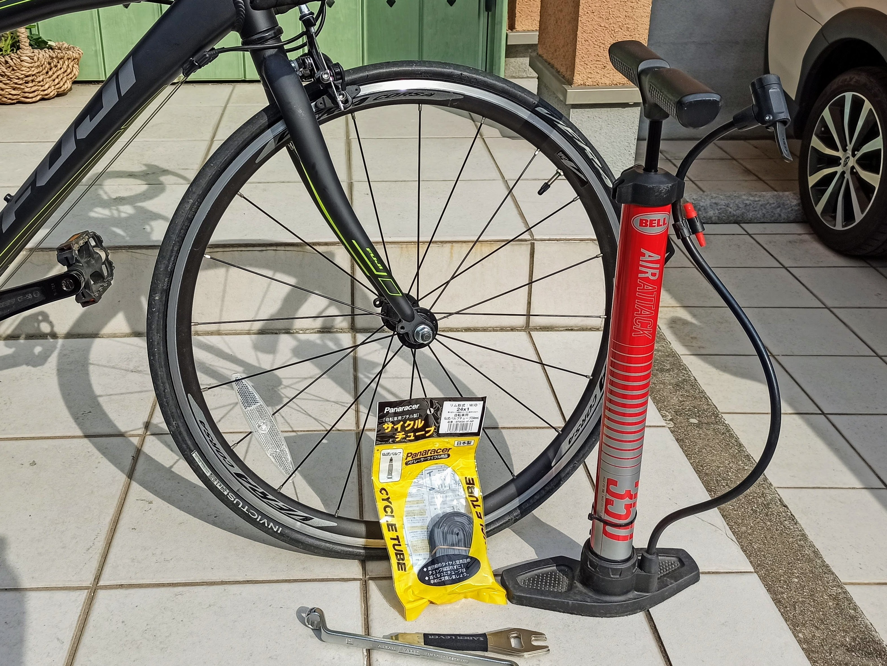
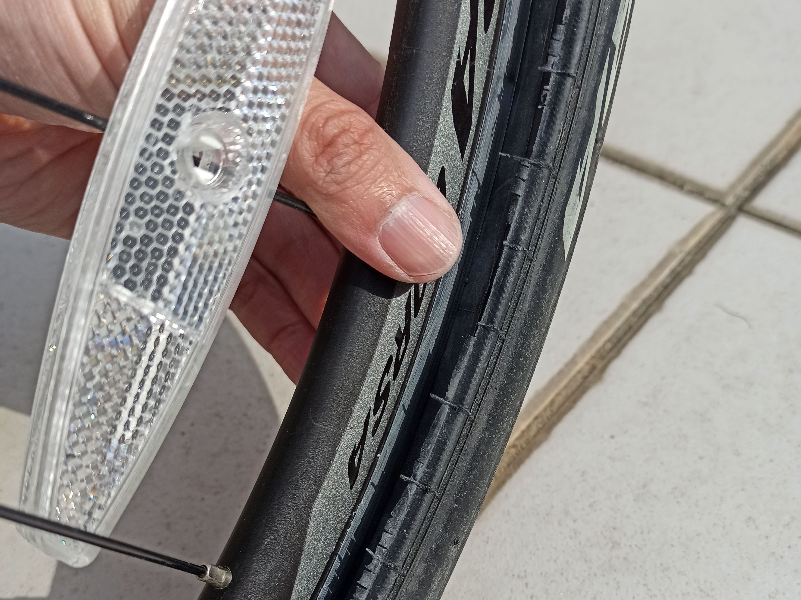

---
categories:
- 自転車
- bike
date: "2025-02-15T23:42:37+09:00"
draft: false
images: 
- images/IMG_20200220_100750.jpg
summary: 子供用の自転車 Fuji ACE24の前輪がパンクしたのでチューブ交換し修理しました。
tags:
- Fuji ACE24
- パンク
title: Fuji ACE24 前輪パンク修理
---

子供用の自転車 Fuji ACE24
の前輪がパンクしたのでチューブ交換し修理しました。

## 必要なもの

1.  交換用チューブ 24X1.0
2.  フロアポンプ
3.  15mm めがねレンチ
4.  タイヤレバー

## 前輪ホイールを外す

前輪ホイールはクイックリリースではなく、ナットで止まっています。ナットの二面幅は15mmでした。めがねレンチでナットを緩めます。

ナットが取れました。ナットの下には座金も入っています。

タイヤを抜くためにキャリパーブレーキのレバーを上げてブレーキを広げます。

ホイールを引き抜いたところです。フォークをダンボールなどで受けるとフレームは自立しました。

## チューブを交換する

まずタイヤレバーをビードに差し込みタイヤを外していきます。

片側一周外したところです。

バルブのナットも外しておきます。

チューブをタイヤとホイールの隙間より引き出し外します。

チューブが取れました。

リムやタイヤ裏側を見てパンクした原因（異物やバリなど）を探します。今回は特におかしなところはなかったのでそのまま新しいチューブを入れていきます。

チューブは一番安かった Panaracer の 24X1 を使いました。

バルブをホイールの穴に通します。

チューブに少し空気を入れるとこの後のチューブ入れが楽になります。バルブ通す前にやったほうがやりやすかったと思います。

タイヤをビード片側はホイールに入れ、もう片側を外した状態で、外した側のタイヤとホイールの間からチューブを入れていきます。

1周分入りました。

ビードをリム内側に入れていきます。

だんだんかたくなっていきますが頑張って手でビードを上げながら入れていきます。半分くらい入りました。

最後はぱっつんぱっつんになります。リムを傷つけないように両手の腹を利用してグッと入れるのがとても辛い、、、

と思いきや、意外とすんなり入りました。

タイヤを取り付けた状態です。

ここで、チューブがタイヤとホイールの間に噛み込むと空気を入れた際にパンクしてしまうので、タイヤとホイールの隙間からチューブが出ていないか1周×両側を目視で確認していきます。

問題なければフロアポンプで空気を入れます。

バルブナットとキャップを取り付けます。バルブが短めで、もともと付いていた長いバルブの方が好みです。

## ホイールを取り付け完成

ホイールをフォークに取り付け、ナットを締めてブレーキレバーを元に戻したら完成です。ロードはタイヤが細いのでパンクがつきものですね。

