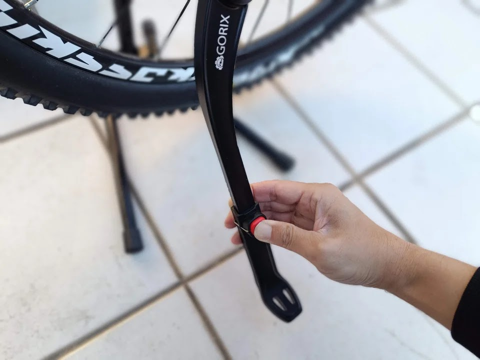
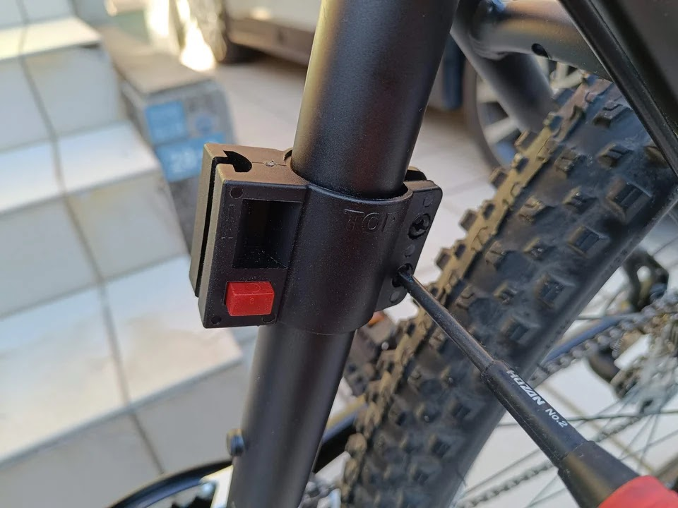

---
categories:
  - 自転車
  - bike
date: "2025-02-15T23:44:27+09:00"
description: マウンテンバイク、GT Agressorを街乗りで使うためにスタンドと堅牢なU字ロックを取付ました。Agressorはセンタースタンドが取付できないため注意です。
draft: false
images:
  - images/012.jpg
summary: マウンテンバイク、GT Agressorを街乗りで使うためにスタンドと堅牢なU字ロックを取付ました。Agressorはセンタースタンドが取付できないため注意です。
tags:
  - Agressor
  - スタンド
  - ロック
title: GT Agressor スタンドとU字ロック取付
js: js/paad.ts
---

マウンテンバイク、GT Agressorを街乗りで使うためにスタンドとU字ロックを取付ました。

先日センタースタンドを取付ようとして干渉、失敗したGT
Agressorですが、普通の後輪側に付けるスタンドを購入しました。

GORIXのスタンドです。写真下のプレートはディスクブレーキに干渉する場合に使うようですが、今回は不要でした。

フレームを挟んで固定する取付け方法で、ゴムシートでフレームに疵がつかないよう保護されています。

後輪フレーム部分です。2本のステーに固定します。

さて、取付ていきましょう。固定プレートを外します。

金具でステーを挟んでボルトを締めるだけです。

スタンドの長さを調整します。赤いボタンを押してスライドするだけ、ワンタッチで調整できるのがいいですね。

スタンドが付きました。

次は鍵です。KRYPTONITEのかなりゴツいU字ロックでフレームに固定できるようになっています。

シートチューブに固定用の部品を取り付けます。

こんな感じになります。結構ギリギリでした。

完成です。街乗りにはちょっとイカツイ外観ですが、これで大きくなった子供も子供用自転車から卒業できそうです。


