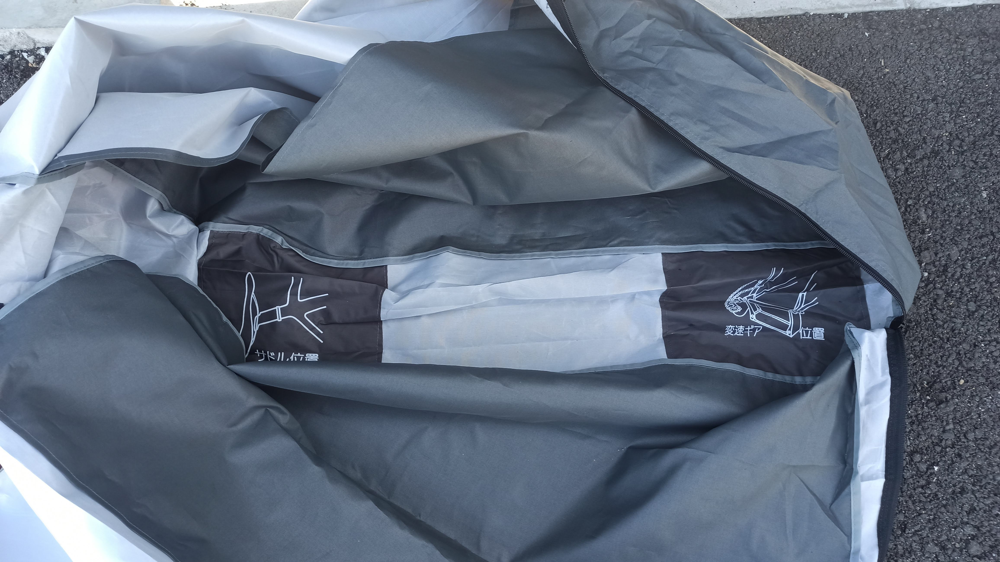
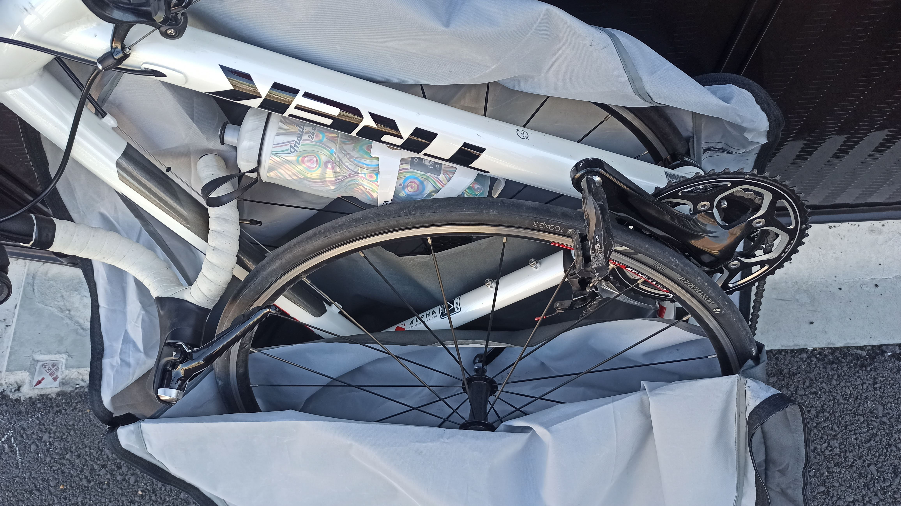
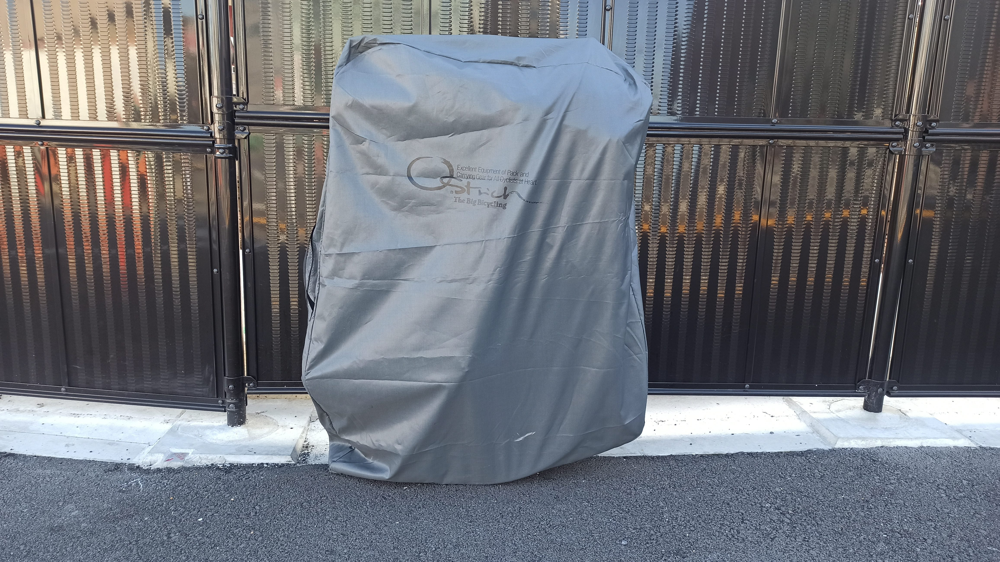

---
categories:
  - 自転車
  - bike
date: "2025-02-15T23:43:45+09:00"
description: ロードバイクを電車やバスに乗せて運ぶ輪行にチャレンジ。自転車をコンパクトに収納できる輪行袋、オーストリッチ(Ostrich)ロード320を使い初めての輪行をレポートします。
draft: false
images:
  - images/title.jpg
summary: ロードバイクに乗るようになってから自転車で遠出するようになりましたが、基本は家から自走で大阪界隈を走り、遠出する場合は車に自転車を載せたりしていました。電車で遠出する輪行にチャレンジするためついに輪行袋を購入しました。
tags:
  - 輪行
title: 輪行袋オーストリッチ Ostrich ロード320レビュー
---

ロードバイクに乗るようになってから自転車で遠出するようになりましたが、基本は家から自走で大阪界隈を走り、遠出する場合は車に自転車を載せたりしていました。電車で遠出する輪行にチャレンジするためついに輪行袋を購入しました。

## 輪行とは

はじめブログで「輪行」という言葉を見たときになんのことかわかりませんでした。輪行とは、自転車を電車やバスなど公共交通機関に乗せて移動することです。はい、文字からは全く想像できませんね。

## 輪行のメリット

家からの自走や車を使う場合に比べ、輪行はスタート地点に戻ってこなくてよいというのが多いなメリットになります。例えば自走や車を使う場合、50km走り目的地に着いたらまた50km戻る必要がありますが輪行だとある駅から出発し100km走り、そこから電車で帰ってくればよいため行動範囲が広がります。

## 輪行の不安

メリットは非常に大きい輪行ですが、なかなかやろうという気になれませんでした。輪行に対し、下記に挙げた不安がありました。

-   自転車を解体し輪行袋に入れるのが面倒、入るか不安
-   輪行袋を持っていくのが邪魔
-   大切な自転車に傷がつきそう
-   袋に入れた自転車を担ぐことになるので大変そう
-   電車に人が多いと他人の邪魔になりそう
-   ロードバイクのピチピチウェア、タイツで電車に乗るのが恥ずかしい

実際に輪行してみると、まさに上記の通りなのですがどれもまあ、許容できるかなという感じで輪行のメリットが勝るかなと個人的には思います。

## オーストリッチ(Ostrich)ロード320を買いました

輪行袋は様々なメーカーのものがありますが、老舗のオーストリッチはエンド金具を使いフレームを立てるように収納することでコンパクトになる独特な方式です。

L-100やSL-100といった超軽量でコンパクトになる輪行袋が持ち運びには便利そうです。（下のリンク左側）

しかしながら生地が薄そうで、初めてなので破ってしまわないか心配になり、ロード320という厚手のものを購入してみました。下のリンク右側がロード320です。

## ぶっつけ本番で初めての輪行と使い方

さて、買ったら早速家で練習してみることをお勧めします。。。が、ズボラな私はいきなり大阪の家から淀川を上がり京都の淀の河津桜を見て京阪線淀駅でぶっつけ本番でトライしてみました！

やはりぶっつけ本番はお勧めしません。説明書が入っていましたが風で飛ばされ拾ったり、絵ではよくわからずYoutubeを検索したりと散々で40分くらいかかってしまいました。。。なんとか帰れてよかった。

というわけで、以下2回目、こんどは自宅から奈良まで行き、平城宮跡を見た後に近鉄奈良線で大和西大寺駅でリベンジです。

まず、オーストリッチロード320は生地が丈夫な反面、でかいのでどうやって運ぶか頭を悩ませましたがAmazonのカメラバッグの横にくくりつけることにしています。

輪行袋を広げた中身です。エンド金具や固定、持ち運び用のスリングは付属しています。（付属していない単品モデルもあるので注意）オプションとして、別売りのチェーンを固定する輪ゴムのような部品（写真右端）も購入。チェーン周りに触れると手が汚れるのでゴム手袋も入れておきました。

まずは自転車をひっくり返します。アクションカメラを付けているので輪行袋を下に敷いて受けています。

ホイールを外します。フロントから。クイックリリースを緩めてホイールを外します。写真に無いですがブレーキのレバーもオープンしておきましょう。

次にリアです。

ホイールをチェーンから外すためにチェーンをハイ側に変速しておきます。

リアホイールをチェーンから外し引き抜きました。

チェーンを引っ掛ける輪ゴムのような部品をかけてチェーンを張ります。必ずしも必要では無いですが、ブラブラのチェーンがフレームに当たると汚れるのであると便利です。

チェーンの反対側はブレーキに掛けています。

ここでリア用エンド金具を取り出します。

こんな感じでリア用エンド金具をクイックリリースで固定します。

リア用エンド金具の向きに注意です。リア用エンド金具とシートで地面にフレームを立てる形になるのを意識して角度を決めます。写真はちょっとズレてますね。まあこんなもんで良いでしょう。

リア用エンド金具とシートを地面につけてフレームを立てます。

輪行袋を広げます。「サドル位置」、「変速ギア位置」と絵が描いてあるので向きに迷うことはありません。

輪行袋の上にフレームを立てます。

両脇のポケットにホイールを入れます。

ホイールは付属のバンドでダウンチューブと固定します。

ショルダーベルトの片側をチェーンステーに引っ掛けます。

反対側は上の写真右側にある穴に通します。下が通したあとの写真です。

チャックを閉めていきます。

ショルダーベルトの反対側はヘッドチューブに掛けます。

肩にかける部分にクッションを巻きます。

チャックを閉めて完成です。入れ方がまだ慣れていなくハンドル部がけっこうパツンパツンですね。厚い生地で良かったかもしれません。超軽量のモデルだと破けそうです。

反対側（というかこちらが正面ですね）です。コンパクトに収まるのですが、写真で見るより現物がでかいです。しかし肩にかけると不思議とまあまあ持ち運べます。

うーん、やはり存在感がすごい。混雑時には邪魔な存在になりそうなので空いている時間帯に乗る必要がありそうです。ラッシュアワーは絶対ムリです。

## 輪行してみた感想とまとめ

輪行袋に入れた自転車は思ったより大きく、レーパンで電車に乗るのは人目が気になりやや恥ずかしいのですが、持ち運びは意外と普通にできました。行ける所まで行き、「戻らなくて良い」のは行動範囲が大きく広がり、目的地に着いた達成感を味わい帰りの辛さがなくなるので精神的にも良いです。

これまでは遠すぎて候補にならなかった場所もいろいろと行けそうなので輪行袋を活用していきたいです。もっと上手に入れられるようになったら薄くてコンパクトな輪行袋も検討したいと思います。
