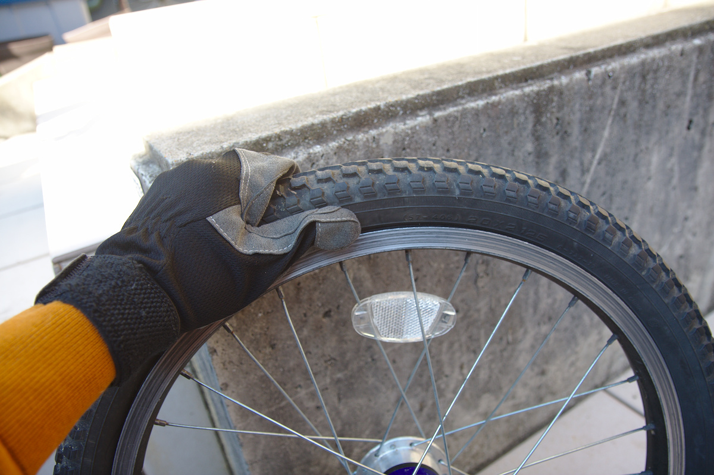

---
categories:
- 自転車
- bike
date: "2025-02-16T08:25:36+09:00"
draft: false
image: images/IMG_4880_01.jpg
summary: しばらく使っていなかった自転車、ブリヂストンのBikkeですが、久しぶりに子供を乗せて出かけようと思ったら前輪がパンクしていました。自分でチューブ交換してみた記録です。
tags:
- bikke
- パンク
title: Bikke 前輪パンク修理 チューブ交換
---

## 前輪がパンクした

しばらく使っていなかった自転車、ブリヂストンのBikkeですが、
久しぶりに子供を乗せて出かけようと思ったら前輪がパンクしていました。自分でチューブ交換してみた記録です。

## チューブ交換に必要なもの

-   チューブ (20X1.95～2.125)
-   レンチ (14mm)
-   タイヤレバー
-   フロアポンプ

チューブは一番安かったPanaracerを購入。タイヤ側面にサイズが書いてあるのでタイヤのサイズに合ったチューブを選びます。Bikkeの前輪は
20X2.125
でした。バルブは普通ママチャリは英式バルブですが、空気が入れやすく管理しやすい米式バルブを選択しました。

レンチはハブをフォークに止めているナットを外すために必要でママチャリの前輪は普通14mmです。結構かたく締まっていて力がいるのでモンキーレンチやオープンエンドのスパナよりメガネレンチかコンビネーションレンチのメガネ側を使うのがおすすめです。

タイヤレバーはLEZYNEの金属製を愛用しています。ロードバイクのリムとかだとリムを傷つける心配をして樹脂製を使いますがママチャリのリムは頑丈でタイヤも太いのでこれが使いやすいです。ちなみに反対側は薄口レンチと何故か栓抜きになっています。

## いざタイヤ交換！

まず始めに、てんとう虫というハブダイナモライトが付いているのでハブダイナモの配線を引っこ抜きます。ハブ固定ナットにはカバーが付いていて、これも引っこ抜いて外します。

ハブナットにレンチをかけて左回しに緩めナットを外します。

ナットが外れました。共締めされていた泥除けとカゴのステーを外し、ハブの軸を引き抜きタイヤを外します。

ブレーキがタイヤに引っかかりますがパンクしているためタイヤをつまんで細くしてブレーキの間から引き抜きます。タイヤに空気が入っていると抜けないので空気を抜くかブレーキワイヤを外しブレーキを広げて抜く必要があります。

外したタイヤです。

ハブを固定していたナット、ナットカバー、歯付き座金、ベロ付き座金、菊座金です。菊座金は片側のみ入っていました。何でだろう？

前輪を外したフレームです。ロードバイクとかだとフレームをひっくり返して置くと作業しやすいのですが、ママチャリは子乗せが付いているしそもそも重いのでひっくり返すのは無理ですが、フォークと泥除けで安定して自立してくれました。

バルブをリムの穴から抜くためにバルブの頭を緩め外します。写真は英式バルブにPanaracerの英式→米式変換アダプタを使っているため普通の英式バルブとは若干違います。

リムとタイヤのビード部の間にタイヤレバーを差し込みテコの原理でビードをリムから外します。

片側のビード全体を外したら、タイヤとリムの間からチューブを引き抜いていきます。

チューブ全体が外に出たら最後にバルブを穴から外します。

外したチューブです。

新しいチューブは米式バルブです。

新しいチューブを入れるときは外すのと逆でバルブをリムの穴に通し、ビードとリムの隙間にチューブを押し込んでいきます。

チューブを入れたらほんの少しだけ空気を入れるとタイヤにうまくチューブがおさまりビードをリムに入れるときにチューブを噛みにくくなります。

チューブが入ったらバルブ側からビードをリムに入れていきます。

最後はとてもかたいので手袋などをして手の平の付け根側を使い両手で気合を入れてエイヤッと押し上げるようにすると入ります。タイヤレバーを使っても良いですがチューブを挟んで傷つけないよう注意が必要です。

ビードがリムに入ったら全周にわたりタイヤとリムの隙間を目視でチューブがはみ出ていないか確認します。チューブはほんの少しだけ空気をいれて弱く膨らんでいる状態です。チューブがはみ出ていると空気を入れた際にビードとリムの間にチューブが挟まれパンクするので注意です。

確認が済んだらタイヤを自転車に取付けます。ブレーキの間をタイヤが入るように空気を一度抜いてから入れ、ハブシャフトに泥除けとカゴのステー、ワッシャーを元どおりに入れて最後にナットを締め付けます。

 

最後に空気を入れて完了です。

規定圧はタイヤ側面に書いてあり、40psiでした。まあ感覚で良いのでしょうがいちおうプレッシャーゲージを買っていたので測定して合わせておきました。英式バルブだと虫ゴムが逆流防止弁となっているため入れた空気の圧力を測定できませんが米式バルブはピンを押すと空気が逆流できる構造なので空気圧が測定できるメリットがあります。

チューブ交換後です。見た目は何も変わりません。ママチャリは後輪を外すのはかなり大変ですが前輪は比較的簡単に外せるので敷居が低いです。

## ちなみに、後輪がパンクした場合は

ママチャリの後輪を外すのはとても大変です。スプロケットを交換しようと四苦八苦して後輪を外した過程は下のリンクを参照ください。


