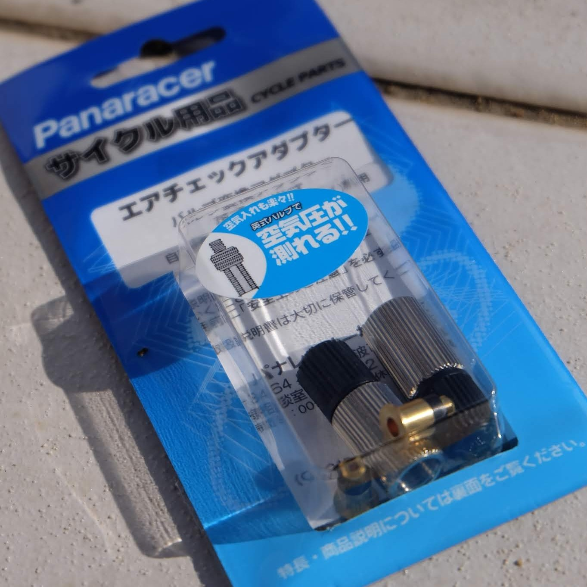
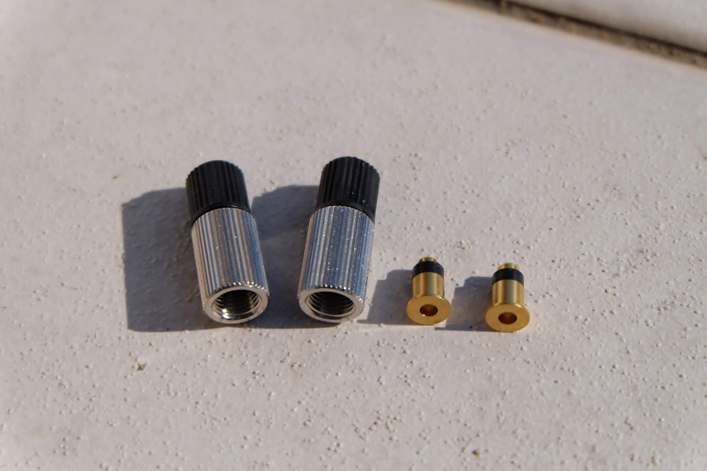
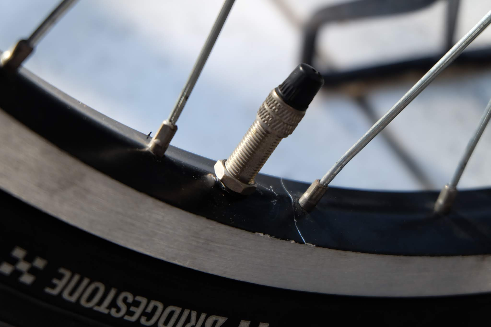
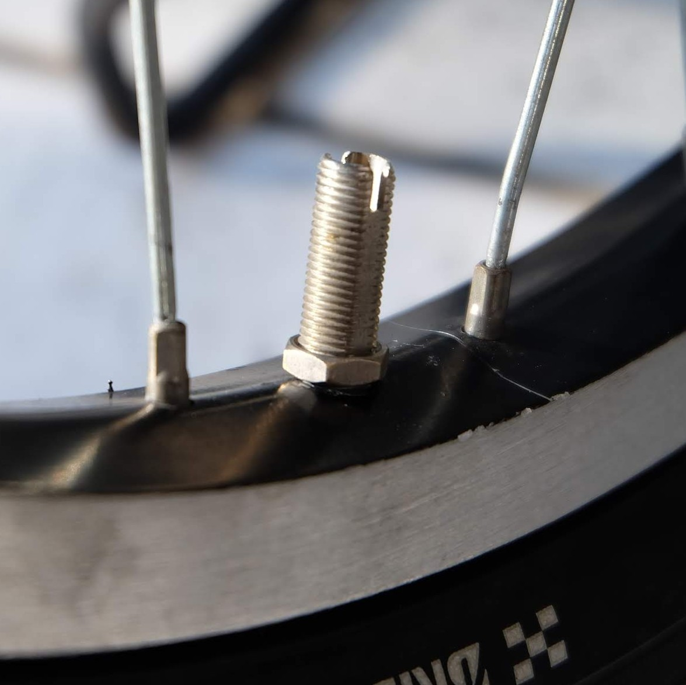
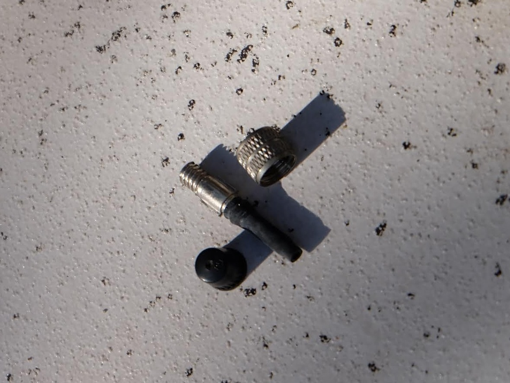
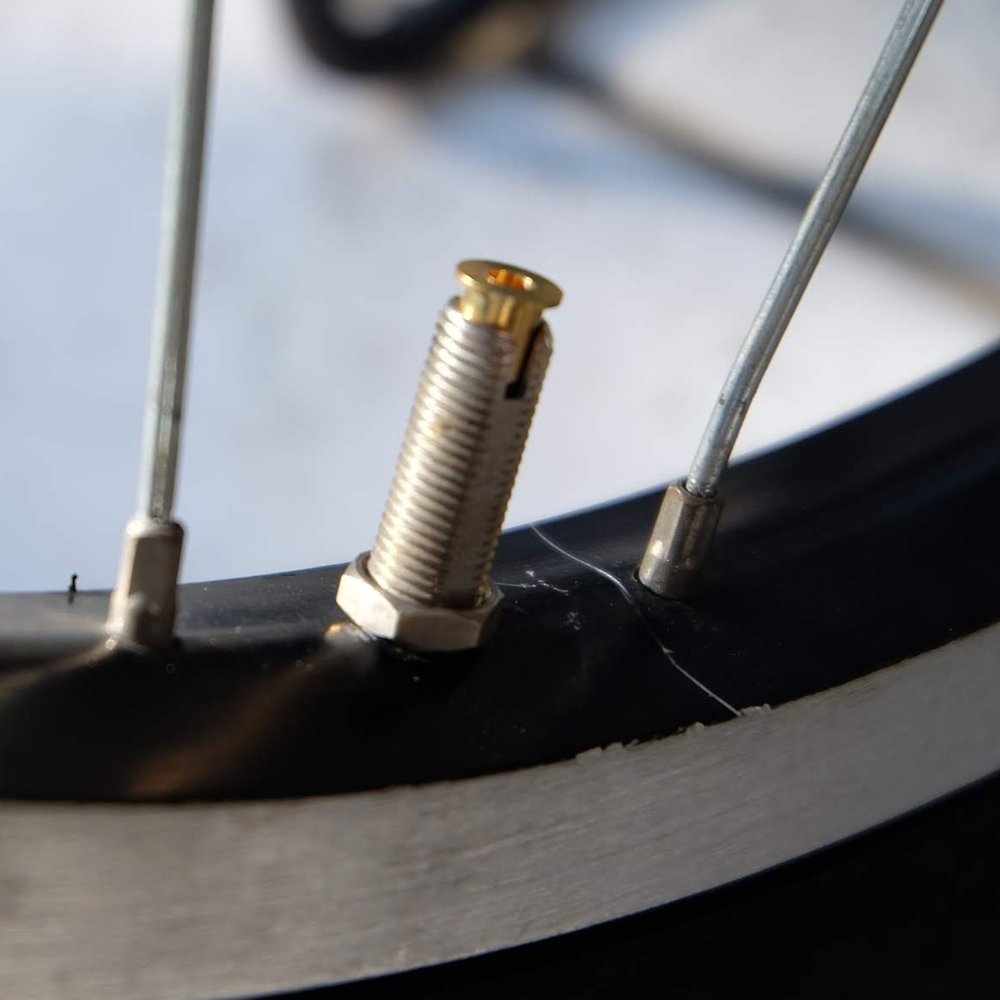
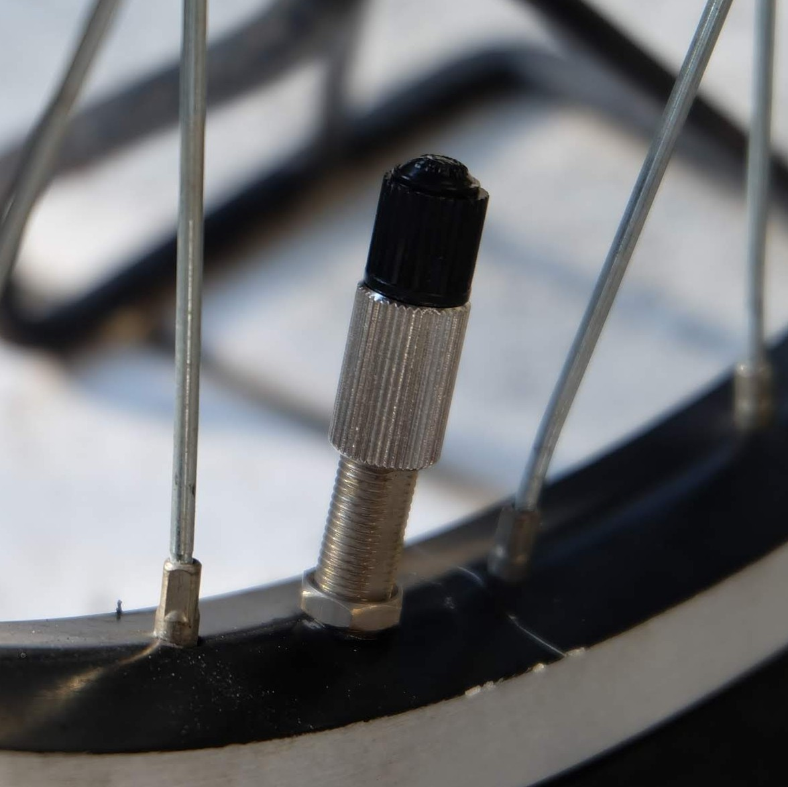
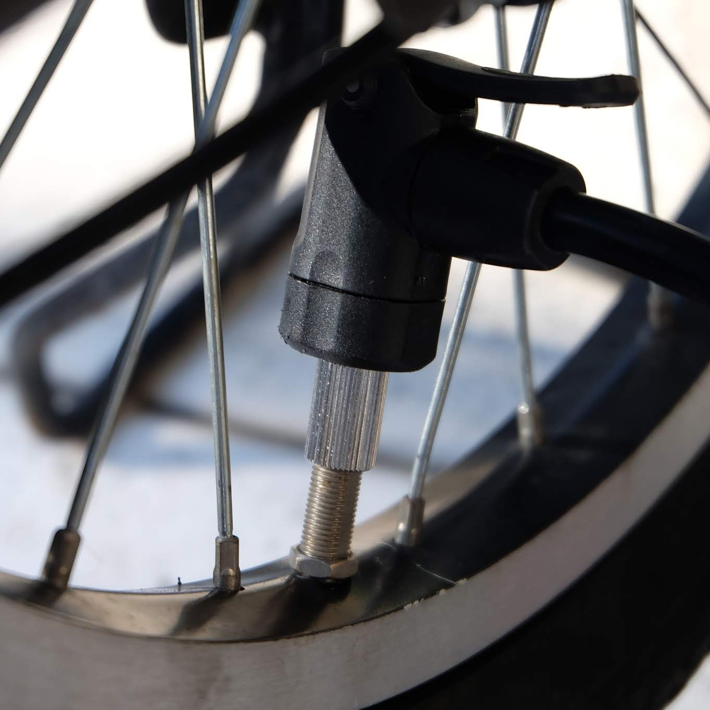
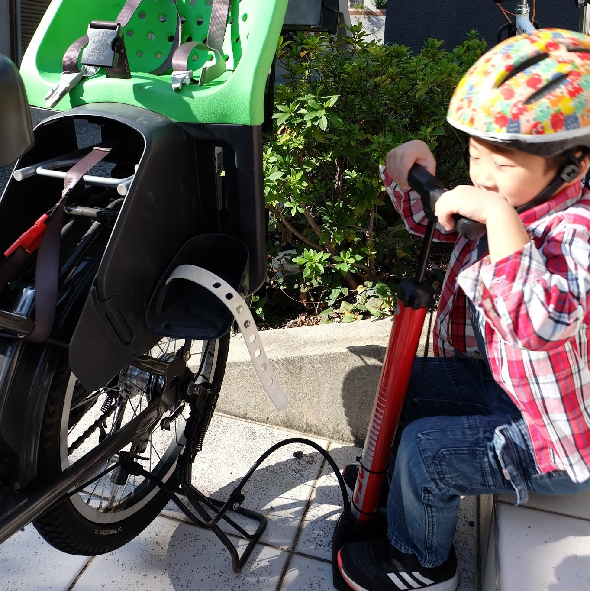
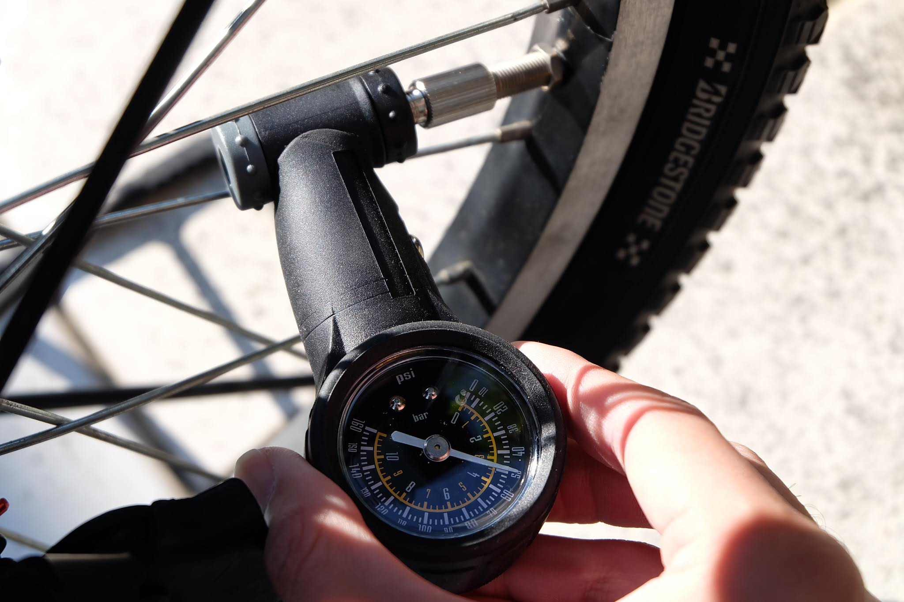

子乗せ用自転車 bikke
にPanaracerの英式→米式変換アダプターを付けてみました。タイヤ空気圧が測れるようになることに加えてポンピングが楽になることも期待です。

楽天で537円+送料300円でした。パッケージはこんな感じ。

 

もともと付いている英式バルブです。キャップと頭のネジを外します。

ねじを外すと中に虫ゴムの付いたバルブコアが入っているのでそれも抜きます。

 

バルブに真鍮の部品を入れます。

この上からアダプターをねじ込みます。これで完了！

米式バルブ用ヘッド付いたの空気入れでポンピング。軽くなるかなと思ったけどあまり違いはわからなかったです。

 

ゲージで圧力を測れるのがいいですね。リリース付きなので少し強めに入れておいて40psiに合わせます。

