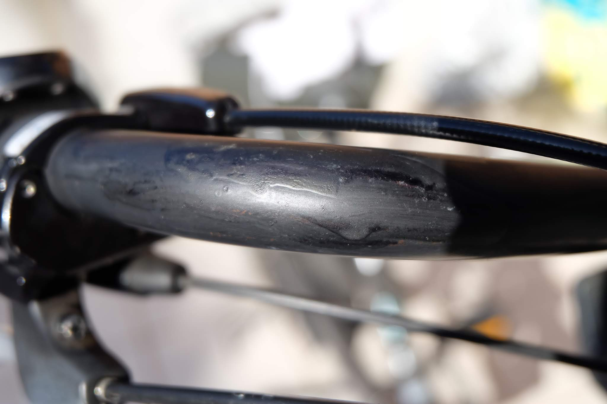

雨ざらしのママチャリ、ブリヂストン Bikke
です。ちなみに電動では無く子乗せは Yepp を付けてます。
ハンドルまわりなどに赤錆が出てきています。

 

錆転換剤とは、赤錆を黒錆にするものみたいなのですが、ちょうど黒塗装のハンドルなので黒くなれば目立たないかと思い、試してみます。まずはワイヤーブラシで錆の表面に浮いた粉と白い塗料のようなものが擦れて付いた跡をきれいにします。

そしてこれ、Permatex RT-8-A Rust
Treatment。ドロドロで茶色っぽい液体でした。

 

塗っていきます。15～20分待ち2度塗りします。

一晩経つと、それなりに黒くなった！？でも、赤錆のまま残っている部分もあるし液体が固まって白い膜が作られなんか思ったようにきれいにはなりませんでした。

チェーンカバーにも塗ってみましたがはこんな感じです。赤錆が残っているのがわかります。あと液が固まった部分は白くなり、爪で一生懸命擦ると剥がれますが大変です。

車のボディーには使わないことと注意書きがあったので何となく嫌な予感がしていましたがこんな感じで塗装が白っぽくなり見た目が微妙なためかもしれませんね。この膜を剥がすと下の塗装には侵食無いようなのでそのうち自然に剥がれていくのを期待です。
まあ、あまり、塗装面に使うのはおすすめではないですね。
