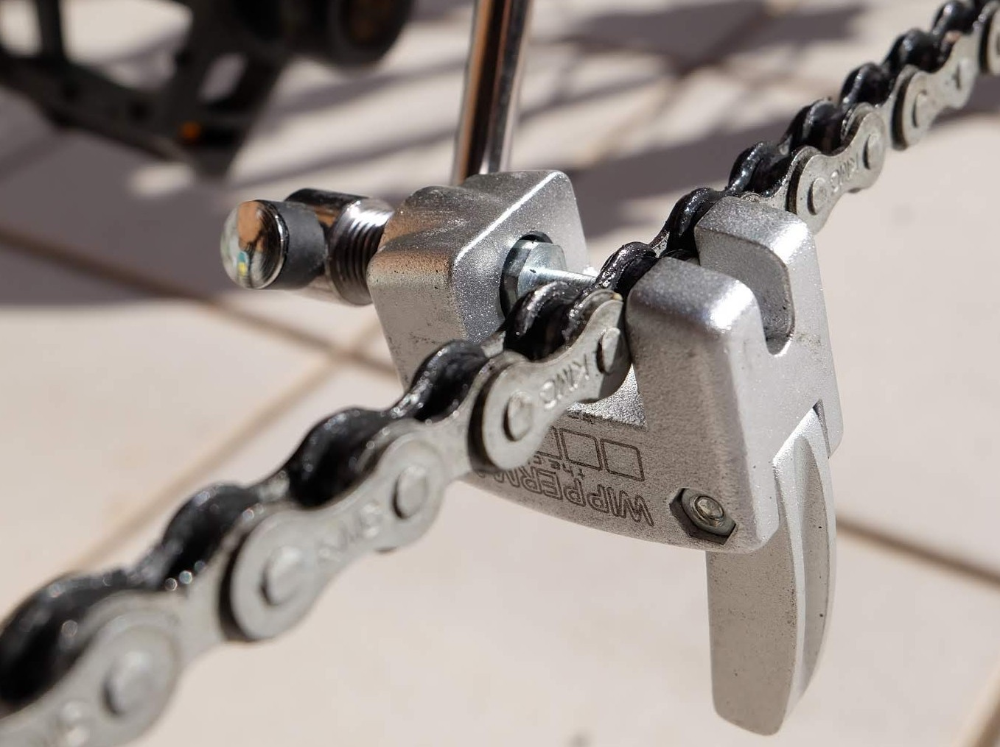
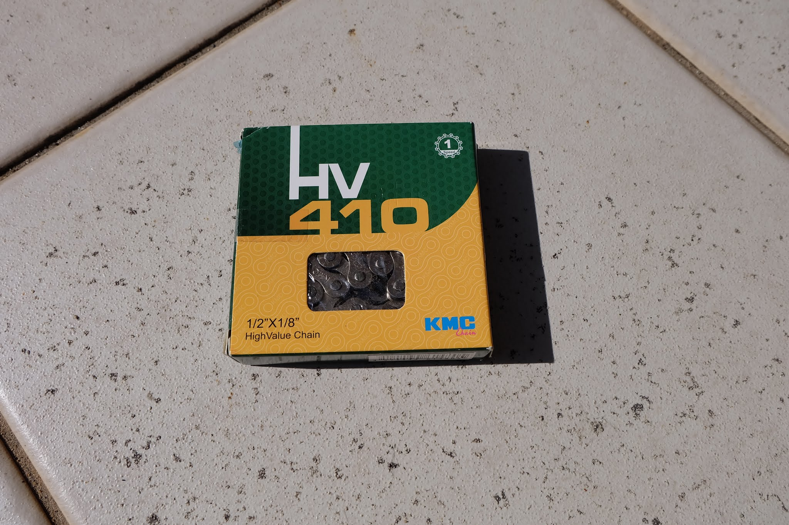
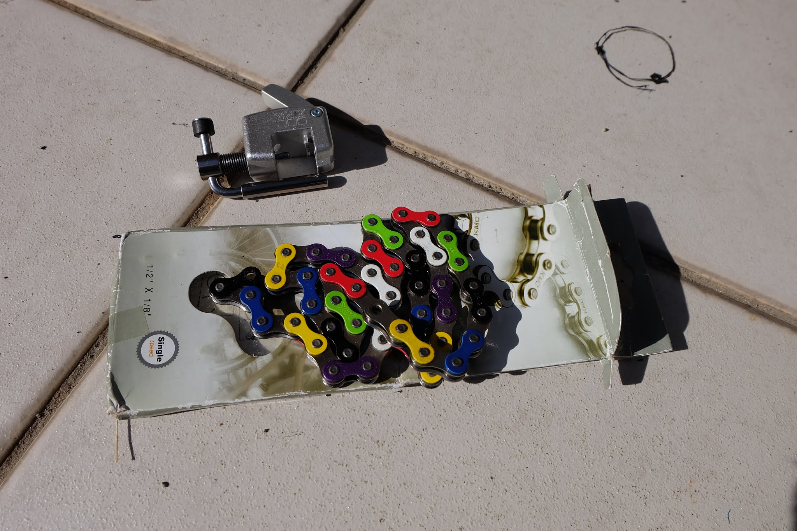

---
categories:
- 自転車
- bike
date: "2025-02-15T20:17:31+09:00"
draft: false
images: 
- images/DSCF4528.JPG
summary: 3段ギヤでは坂道が辛いママチャリ、Bikkeの小ギヤを交換してギヤ比を変更することで軽くらくらく坂道を登れるように改造しました。
tags:
- bikke
title: Bikke ギヤ比変更（小ギヤ交換）
---

Bchari家の小乗せ自転車Bikkeですが、ケチって電動アシスト無しのモデルです。
坂道の多い地域に最近引っ越したので上り坂が辛くてなかなか乗れてませんでした。何とか坂道を楽にできないかと思い調べてみた。

\(1\) 外装6段化
:   やれないことはなさそうだけどテンションプーリーを付けたり大変そう。スプロケットの汚れも気になりそう。

\(2\) 内装8段化
:   お値段高い&重いけど外装6段よりママチャリ感があって良い。が、内装3段とはエンド幅が異なる。無理やり広げた例も見つけたけどさすがにそこまでする勇気はない。

\(3\) チェーンリング交換
:   Bikkeはクランクと一体物なのでクランクごと交換になる。一体物は安いけど作りがチープで改造する気がおきない。

\(4\) 小ギヤ交換
:   小ギヤは500円程度で買えるし一番簡単そう。

ということで、(4) 小ギヤ交換で自転車改造にチャレンジしてみました。

とりあえずスタンドを外しミノウラのロードバイク用スタンドに乗せチェーンカバーを外します。スタンドはこんなに重いママチャリを乗せることは多分想定していないのでいっぱいいっぱいで安定感がありません。でもこのクソ思いBikkeを逆さまにするのは大変なのでこの状態で倒れないよう注意しながら作業します。

チェーンはジョイントリンクは使われておらずピンで連結されていた。どこがジョイント部かわからなかったので適当な場所でチェーンカッターを使いピンを抜いてチェーンを外します。

 

チェーンテンショナー、ブレーキと外していきます。ブレーキはローラーブレーキでした。さすが、ブリヂストンの自転車は高級品です。

ホイールが取れました。

バラバラにしたあとのフレームです。

ここで特殊工具「ロックリングプライヤー」登場！穴の無いスナップリングを外す工具です。車もバイクもいじらないbchariとしてはこのママチャリ小ギヤ外しでしか使わない、もしかすると今回最初で最後の工具かもしれません。ネットではマイナスドライバー２本で外す方法が出てきますが工具マニアの血が騒ぎ買っていまいました。

でも、工具が大きすぎてロックリングの割れ目の間に先端が入りません（泣

四苦八苦しなんとか無理やり外しました。右が元々付いていた16T、中央が今回交換する23Tです。左のスプロケットカバー（？）より大きい。

無事小ギヤが付きました。あとは外した部品を元に戻し組み付けていきます。

ここでちょっと問題が。ギヤが大きくなったぶんチェーンを長くする必要がありますが、買ってきたチェーンが短くて使えません。子乗せママチャリのチェーンすごく長いのですね。

 

仕方なく以前子供用自転車に付けたカラフルチェーンの余りを２リンクカットして元のチェーンに繋ぎました。

外見は変わらないですがかなり軽くなりました。16/23≒0.7で3割くらい漕ぐ力が軽くなったのでかなり変わったのがわかります。どうせスピード出さないしこれで坂道もなかなかいい感じです。
