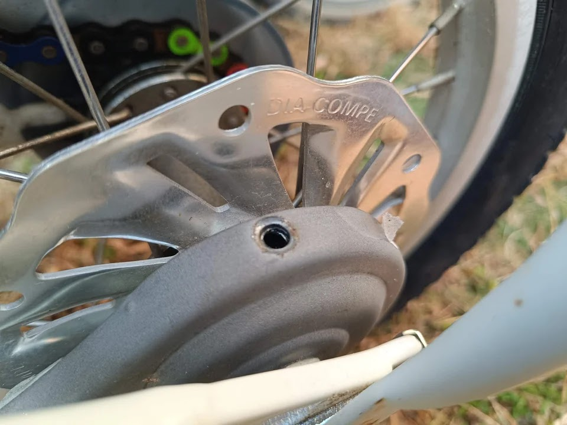

---
categories:
  - 自転車
  - bike
date: "2025-02-15T23:44:26+09:00"
description: 自転車の後輪ブレーキがローラーブレーキかメタルリンクブレーキの場合、専用グリスを定期的に補充する必要があります。グリスアップの方法を解説します。
draft: false
images:
  - images/006.jpg
summary: 自転車の後輪ブレーキがローラーブレーキかメタルリンクブレーキの場合、専用グリスを定期的に補充する必要があります。グリスアップの方法を解説します。
tags:
  - ブレーキ
  - ローラーブレーキ
  - メタルリンクブレーキ
  - ギュット・ステージ・22
  - クロスファイヤーキッズ
  - LGS-J12
title: ローラーブレーキ、メタルリンクブレーキのグリスアップ
js: js/paad.ts
---

我が家の電動アシスト自転車は後輪ブレーキがローラーブレーキです。子供用自転車2台はもともとバンドブレーキが付いていましたが、音鳴り対策のためにメタルリンクブレーキに交換しています。

このブレーキは、中にグリスが封入されており、グリス切れになると音鳴りがしたりブレーキが効きすぎるといった症状が出るようです。特にそういった問題はなく使えているのですが、もう4年以上乗っているためここでグリスを入れることにしました。

グリスはシマノのローラーブレーキグリス指定のため購入しました。真っ黒なグリスです。



## メタルリンクブレーキのグリスアップ

ルイガノLGS-J12のメタルリンクブレーキです。十字ネジで塞がれている穴が注油口です。

ネジを外します。

この穴にグリスを入れます。

専用グリスの先端を穴に突っ込みグリスを入れます。入っていく感触があまり無いし、どれだけ入ったかも見えないので手応えがまるでありません。

あまり入った気がしないのですが、溢れそうでもあるため、こんなものでしょうか？？

もう1台のクロスファイヤーキッズも同じように注油しました。

## ローラーブレーキのグリスアップ

次は電動アシスト自転車ギュット・ステージ22のローラーブレーキにグリスを入れます。

こちらは側面のゴムキャップを外し注油します。

専用グリスの先端をズボッと突っ込みグリスを入れました。こちらはメタルリンクブレーキに比べそれなりにグリスが入っていく手応えがあります。どれだけ入るのだろうとどんどん入れていくと反対側からはみ出してしまいました。

多いに越したことはない（？）、これでよしとしましょう。

## まとめ

メタルリンクブレーキ、ローラーブレーキのグリスアップをしました。もともと問題無く使えており、グリスアップ後に何か変わった実感もありませんが、数年に1回程度グリスアップしたほうがいいのでしょうね。自転車用のグリスは使用量が少ないのでこのローラーブレーキ用グリスも一生モノになってしまいそうです。


