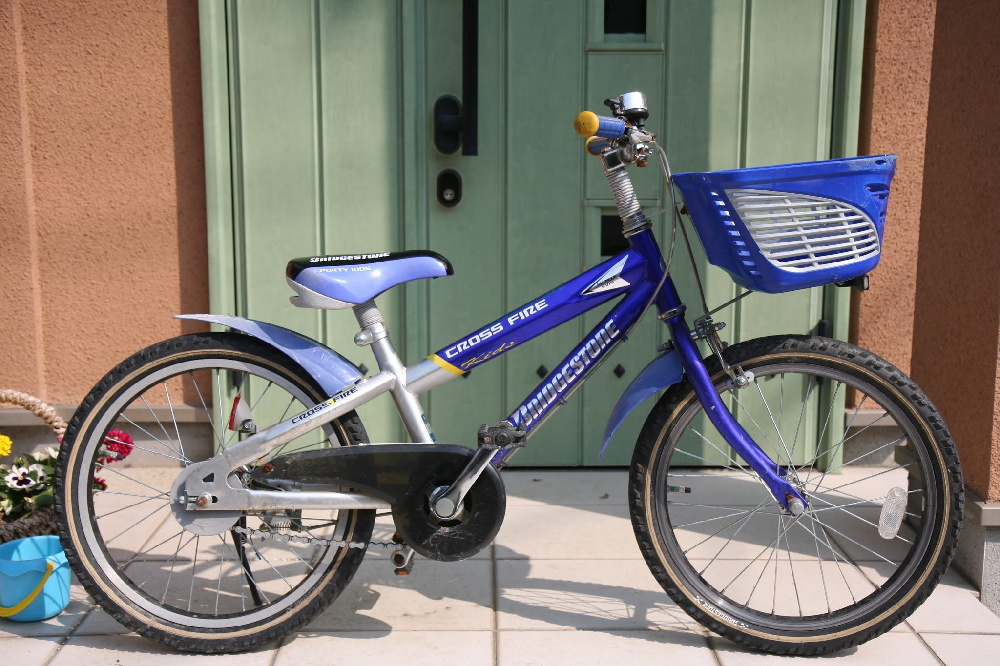

---
categories:
- 自転車
- bike
date: "2025-02-15T23:42:40+09:00"
draft: false
images: 
- images/IMG_4972.JPG
summary: 子ども用自転車、ブリヂストン クロスファイヤーキッズをこのたび3人目の子供が乗るようになりました。ところどころ錆びていたり、ワイヤーなどもボロボロになってきているため、DIYでオーバーホールに挑戦します。
tags: 
- クロスファイヤーキッズ
- クロスファイヤーキッズ オーバーホール計画
- 自転車メンテ
title: クロスファイヤーキッズ オーバーホール計画
---

子ども用自転車、ブリヂストン クロスファイヤーキッズを長男が幼稚園くらいの頃に購入しました。その後、2人目の子に引き継ぎ、このたび3人目の子供が乗るようになりました。なかなかしっかりとした自転車で、これまでノーメンテで使ってきましたがまだまだ使えそうです。

しかし、さすがによく見ると錆びていたり、ワイヤーなどもボロボロになってきているため、DIYでオーバーホールに挑戦したいと思います。

## クロスファイヤーキッズの状態

ブリヂストンのクロスファイヤーキッズです。リム径18インチの子供用自転車で、鉄フレームで頑丈です。

長い間雨ざらしになっていたので各部錆びたりしています。

一通りメンテと部品交換をしてそれなりの状態にしていきたいので何をするか計画したいと思います。

## オーバーホール計画

### メンテ項目：

-   [フロントブレーキのセンター調整](https://www.bchari.com/2020/04/parktool-obw-3.html)
    （ブレーキ交換までのメンテ）
-   ハブのグリスアップ
-   フリーのグリスアップ
-   ボトムブラケットのグリスアップ

### 部品交換：

-   [ペダル交換](https://www.bchari.com/2020/04/mks-mt-ft.html)
-   [ブレーキレバー交換](https://www.bchari.com/2020/04/tektro-jl530c-rs.html)
-   [ブレーキワイヤー、アウターケーブル交換](https://www.bchari.com/2020/08/blog-post_7.html)
-   [リアブレーキメタルリンクブレーキ化](https://www.bchari.com/2020/04/blog-post_19.html)
-   [フロントブレーキ交換](http://www.bchari.com/2020/04/tektro-810a.html)
-   [錆びたボルトの交換](https://www.bchari.com/2020/04/blog-post_15.html)
-   [グリップ交換](https://www.bchari.com/2020/04/tektro-jl530c-rs.html)

### 部品取り外し：

-   [泥除け取り外し](https://www.bchari.com/2020/04/blog-post_26.html)
-   ベル取り外し

### その他

-   [エアチェックアダプター取付](https://www.bchari.com/2020/04/aca-2-g.html)

基本的に、回転部のグリスアップと錆びた部分の部品交換で見栄えを良くしていきたいと思っています。
