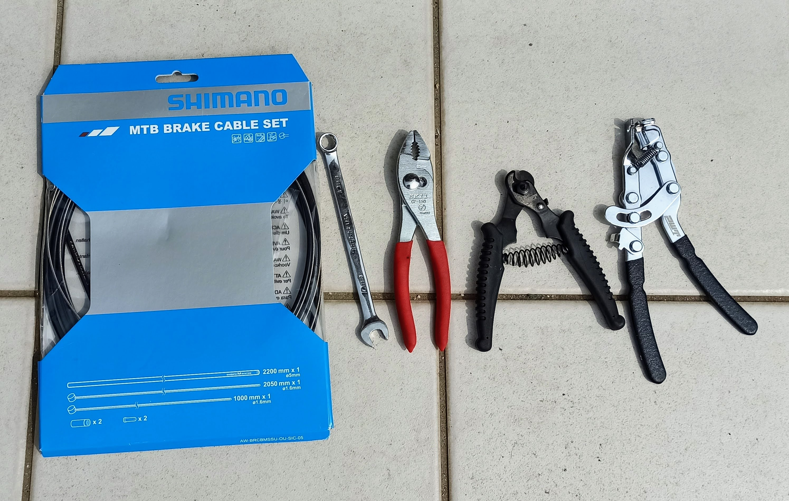
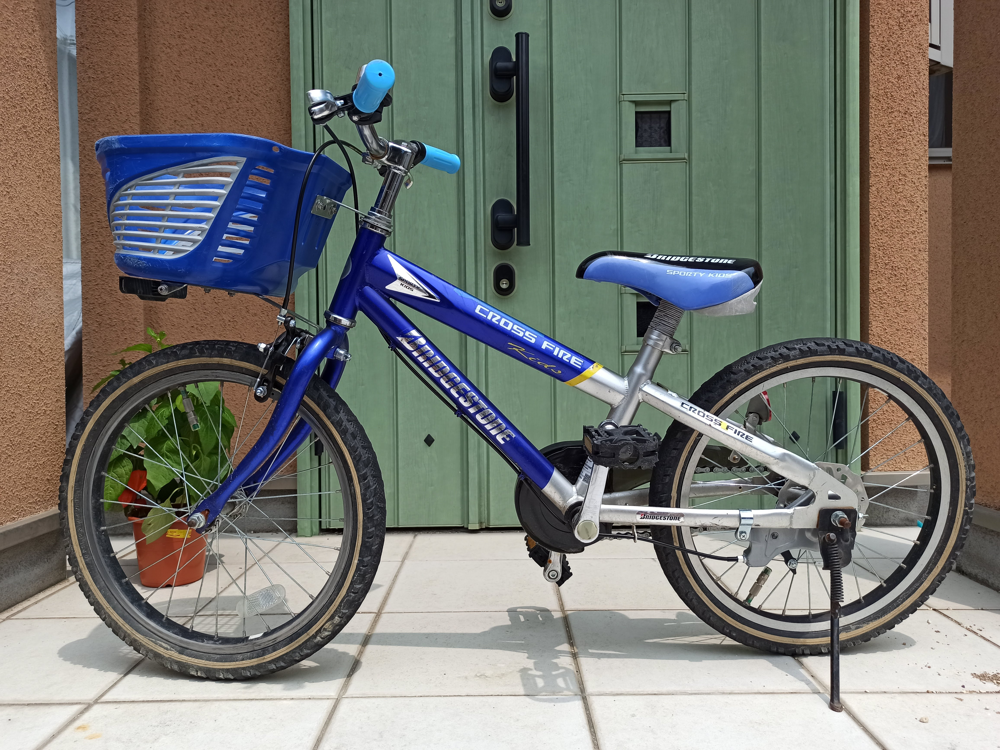

---
categories:
- 自転車
- bike
date: "2025-02-15T23:42:50+09:00"
draft: false
image: images/IMG_20200807_110248.jpg
summary: 子供用自転車クロスファイヤーキッズのブレーキケーブルを交換しました。ブレーキケーブル交換方法をまとめます。
tags:
- クロスファイヤーキッズ
- クロスファイヤーキッズ オーバーホール計画
- ブレーキ
- ワイヤー
title: クロスファイヤーキッズ ブレーキケーブル交換
---

子供用自転車クロスファイヤーキッズのブレーキケーブルを交換しました。

交換前の状態です。シルバーのアウターケーブルです。

## 用意するもの

-   MTBブレーキケーブルセット（シマノ）
-   コンビネーションレンチ 10mm
-   プライヤー
-   ケーブルカッター (PWT)
-   ケーブル引っ張るツール (PWT)
-   シリコンオイルスプレー

ケーブルセットはアウターケーブルとワイヤー、小物が前後分入っています。ロード用はタイコの形状が異なるのでMTB用を購入しました。ロード用でもワイヤー両側にロード用/MTB用とタイコが2つ付いているのもあります。アウターケーブルは様々なカラーを選べますが今回はブラックにしてみました。

## ブレーキケーブルを外す

まずは前輪側から。ワイヤーエンドキャップをプライヤーで引張り抜きます。

10mmのレンチでワイヤーを固定しているナットを弛めます。

テンション調整ボルトを弛めて抜きます。

これでワイヤーがブレーキ本体から抜けます。

テンションが無くなったのでブレーキレバーを引くと裏側にタイコが見えます。ワイヤーを溝に沿わせてタイコを外します。これでアウターケーブル、ワイヤー共に外れました。

後輪側も同じようにワイヤー固定ボルトを弛めてブレーキケーブルを抜きます。この自転車はメタルリンクブレーキに改造していますが、バンドブレーキ、サーボブレーキでも同じです。

抜いたアウターケーブルとワイヤーです。新しいケーブルの長さを合わせるために置いておきます。

ワイヤーは結構サビがありました。

## 新しいブレーキケーブルの準備

ブレーキケーブルセットの中身です。

アウターケーブルをカットし長さを外したケーブルと同じ長さに揃えます。

アウターケーブルを切るとこのように切り口が潰れてしまいます。

このケーブルカッターはPWTの自転車用で、切り口をグリグリ広げることができるよう側面にキリが付いていて便利です。

グリグリして穴が広がりました。切り口がギザギザなので棒ヤスリで平に仕上げるのが良いのですが、いつも面倒なのでこの程度で満足してしまいます。

キャップを付けてアウターは完成です。アウターケーブルは長いのが1本入っているので前後2本を作ります。

ワイヤーも同じようにカットして長さを揃えます。

始めからグリスが封入されているアウターケーブルもありますが、これはグリス無しのようなのでいちおうシリコンオイルスプレーを吹いて中を潤滑します。アウターケーブル内側は樹脂なので樹脂を侵さないシリコンオイルが良いと思います。

## ブレーキケーブルの取り付け

前輪ブレーキのレバー側タイコを入れて、ブレーキ本体側にワイヤーを通します。

後輪側もレバーのタイコを入れたらケーブルをフレームに通していき、、、

ブレーキ本体側にワイヤーを固定します。

ワイヤーを通したらテンション調整です。キャリパーをある程度閉じてプライヤーでワイヤーを引っ張りながらナットを固定すれば良いのですが、一人でやろうとすると手が3本欲しくなって大変です。このワイヤーテンショナーがあるとワイヤーを引っ張ったまま固定できるので何かと重宝します。

最後にワイヤーエンドキャップを取り付けて完成です。自転車専用のケーブルカッターにはハンドル側にエンドキャップ潰しまで付いています。1個でカット、キリ、エンドキャップ潰しと3つの機能が付いているのでやはり自転車専用工具はそれなりに工夫されていて使いやすいです。

後輪側もテンション調整、エンドキャップ取り付けて完成です。

## 完成!

ハンドルまわりです。もう少しケーブルを短くしても良かったかも。

全体です。黒だとグレーより引き締まった感じになるので交換後の方が好みです。

