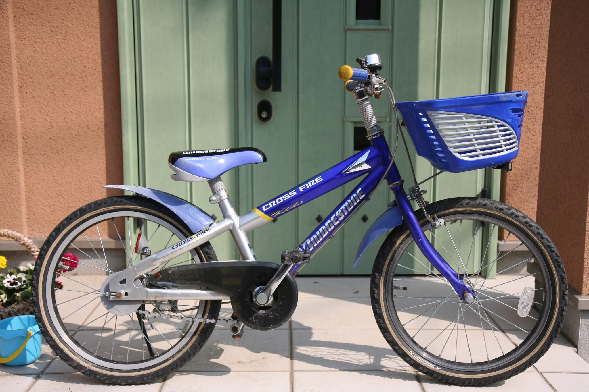
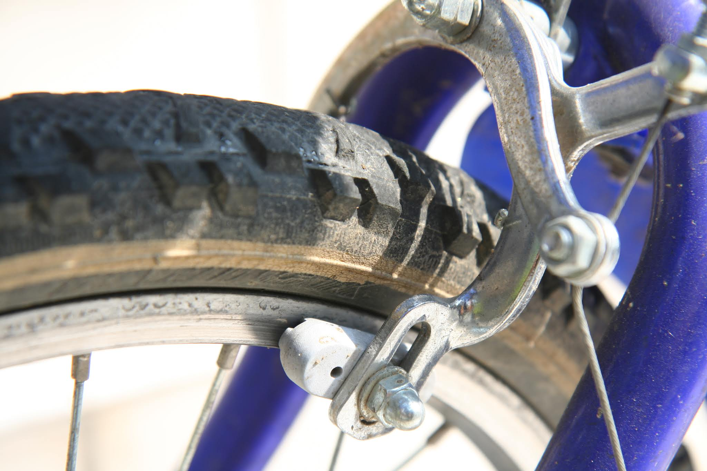
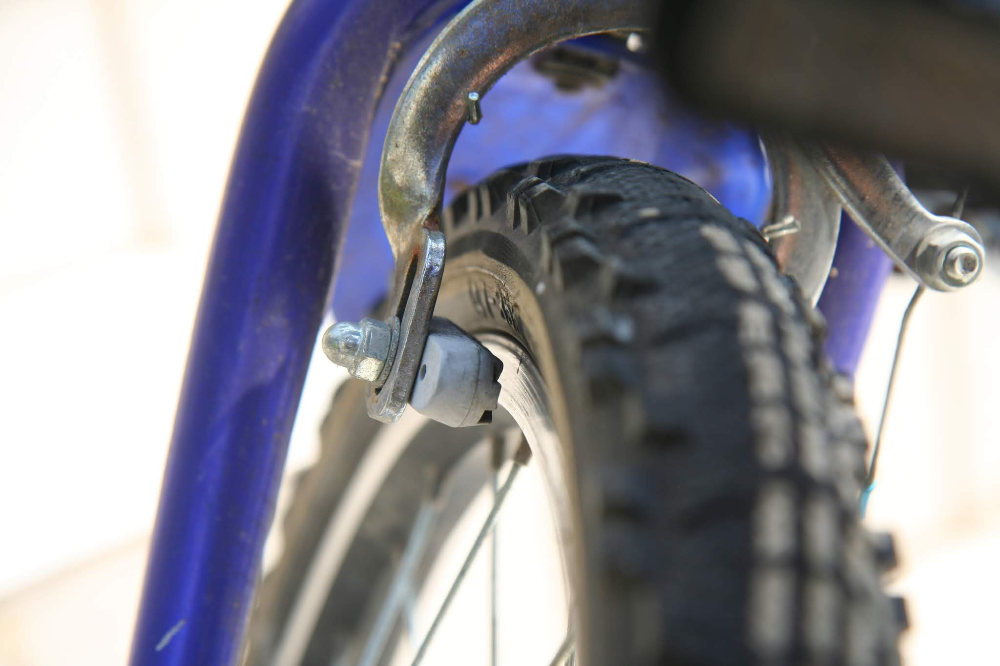
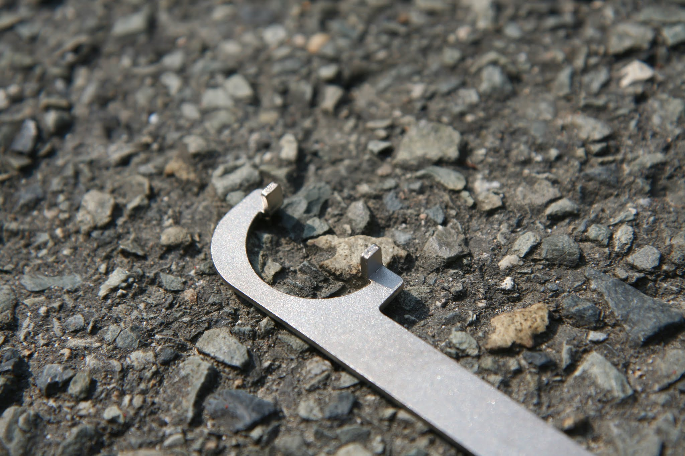
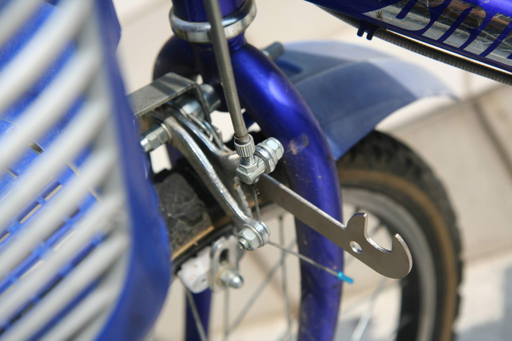
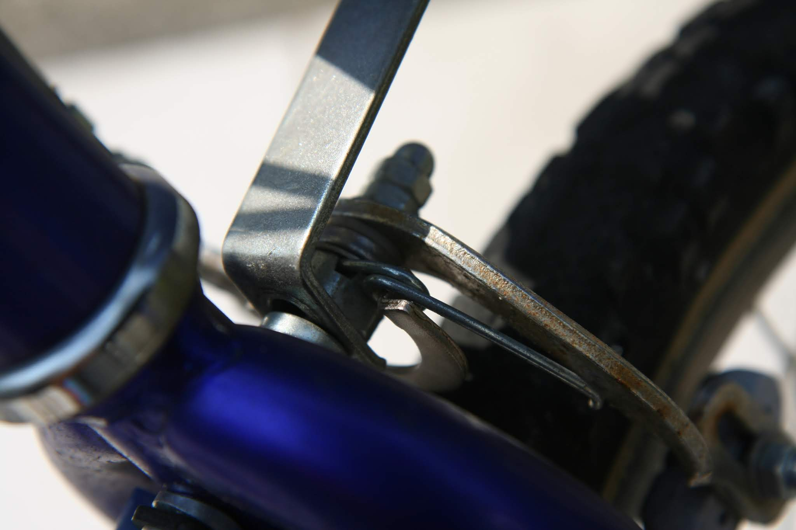
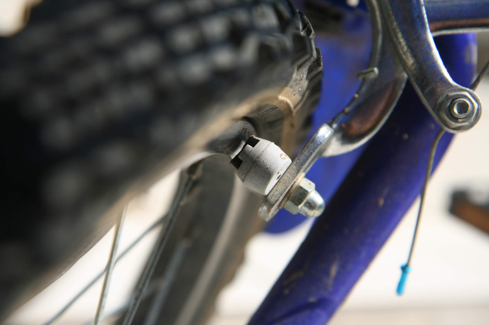
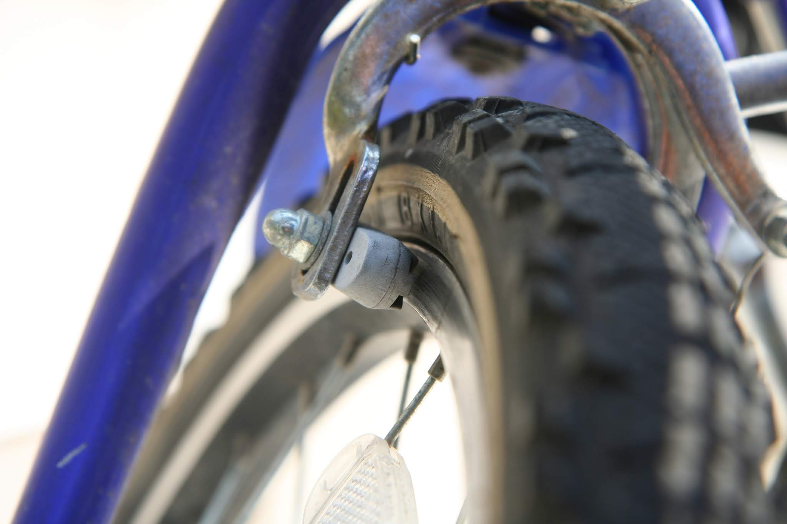

---
categories:
- 自転車
- bike
date: "2025-02-15T23:42:42+09:00"
draft: false
images: 
- images/IMG_4985.JPG
summary: 自転車のブレーキをセンター調整するための専用工具をご紹介します。
tags:
- 工具
- Parktool
- ブレーキ
- クロスファイヤーキッズ
- クロスファイヤーキッズ オーバーホール計画
title: PARKTOOL オフセットブレーキレンチ OBW-3
---

PARKTOOLのふしぎな形をしたレンチを紹介します。

長男、次男と引き継いできたブリヂストンのクロスファイヤーキッズを三男が引き継ぐ年齢になりました。18インチの子供用自転車です。12インチのルイガノLGS-J12もそうですが、最近の自転車は頑丈なのか、最近の子供はそこまで自転車乗りまくらないのか、新しい自転車を買うほどボロボロでは無いのでオーバーホールしながら3人目に受け継いでいきます。

1年以上乗らずに雨ざらしなのでいろいろ交換していきたいのですが、まずはフロントブレーキが片当たりしているのでとりあえずセンターに合わせて乗れるようにします。

 

LGS-J12はTEKTROのブレーキで、軸にスパナ掛けの二面幅が切ってあり軸を回してセンター調整しましたが、この自転車のフロントブレーキは安物で二面幅がありません。代わりにバネがくるんと輪になっている場所にツメを引っ掛けて回す特殊レンチがPARKTOOLから発売されています。

上の画像がツメ部分です。ちなみに反対側は幅14のスパナとなっていて、スパナ溝の近くに小さな丸穴が開いていますが何に使うのを想定しているのかわかりません

このツメ部分をこんな感じでバネの輪に引っ掛けます

裏からツメが入っている部分を見るとこんな感じです。この状態でブレーキがセンターになるようクッと軸を回します。ブレーキは1本のボルトで止まっているので軸が締まっていても回ります。1本止めだとそのうちまたズレるのですが、何でこんな止め方なのでしょうね。。。

センター調整後、左右の隙間が同じくらいになりました。ブレーキが片当たりしているとスリスリ音が鳴るしペダルも重くなるので調整するとタイヤがスッキリ回るようになり気持ち良いです。

 

安い工具でこれ1本持っていると簡単に調整できるのでこのタイプのブレーキが付いた自転車を持っている人は買って損はないと思います。まあ、自分で工具を買って自転車いじりをしようと思う人はこんなブレーキが付いた自転車は持っていないかもしれませんが。
