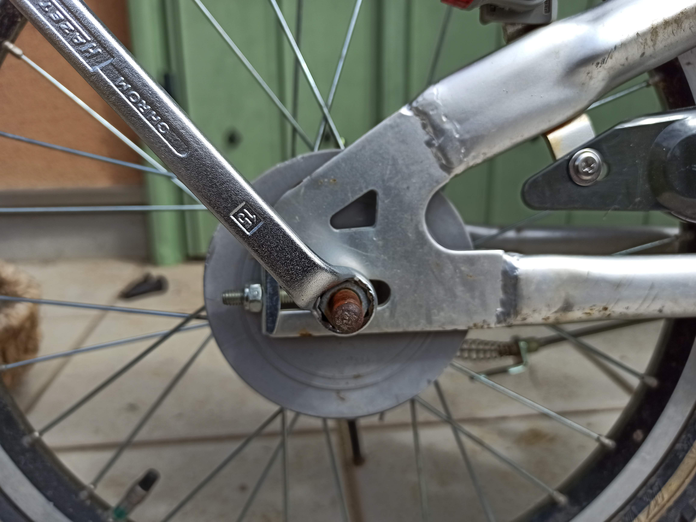

---
categories:
- 自転車
- bike
date: "2025-02-15T23:42:41+09:00"
draft: false
images: 
- images/IMG_20200419_100440o.jpg
summary: 子供用自転車のクロスファイヤーキッズ。ブレーキがキーキー音がするのでバンドブレーキからメタルリンクブレーキへ交換しました。音鳴りがなくなり、放熱板がかっこよく満足できる改造でした。
tags:
- クロスファイヤーキッズ
- クロスファイヤーキッズ オーバーホール計画
- ブレーキ
- メタルリンクブレーキ
title: クロスファイヤーキッズ メタルリンクブレーキ化
---

子供用自転車のクロスファイヤーキッズ。ブレーキがキーキー音がするのでバンドブレーキからメタルリンクブレーキへ交換しました。

## バンドブレーキ キーキー音の原因

キーキー音の原因はいくつかあり、バンドの摩耗、バンドとドラムの片当たり、バンドとドラム間に異物噛み込みなどが可能性として挙げられます。清掃や調整で治ることもあるようですがバンドが摩耗してくると再発しやすく、バンドだけ交換しても治らなかったりする場合もあるようです。

バンドブレーキ本体は安い価格で購入することができ、バンドブレーキより上位グレードのものも安価なのでブレーキ自体交換することにしました。

## ブレーキの種類

ママチャリや子供用自転車に使われるバンドブレーキ互換のブレーキは主に4種類あります。

バンドブレーキ
:   バンドを引いてドラムに当て、ドラムとバンドの摩擦抵抗でブレーキを行うものです。安物ママチャリにはたいていこれが付いています。

サーボブレーキ
:   ドラム内側にブレーキシューがあり、ワイヤーを引くとブレーキシューが拡大してドラムと接触しブレーキを行うものです。ブレーキの効きが良いようです。

ローラーブレーキ
:   ドラム内側に小さな円筒状のローラーがいくつも入っていて、ワイヤーを引くとローラーがドラム内側に押し当てられブレーキを行うものです。ローラーもドラムも鉄なので専用グリスが入っていてグリスの抵抗でブレーキがかかる感じです。高級ママチャリに付いていることが多いですが専用ハブが必要なためバンドブレーキ、サーボブレーキと互換性はありません。ブレーキ力は弱めですが音鳴りに強く静かです。

メタルリンクブレーキ
:   上記ローラーブレーキをバンドブレーキ、サーボブレーキ用のハブに取付けられるようにしたものです。放熱フィンが特徴です。

音鳴りを止める目的でメタルリンクブレーキを選択です。この前ルイガノ
LGS-J12
のメタルリンクブレーキ化を行い、その外観に惚れ惚れしてしまったのも理由です。

## 交換に必要な道具

-   スパナ又はコンビネーションレンチ 8mm, 10mm, 15mm, 17mm
-   プラスドライバー #2
-   プライヤー
-   チェーンプライヤー（普通のプライヤーでも代用可）
-   ブレーキドラム回し
-   大口モンキーレンチやモーターレンチ 40mm まで開くもの

クロスファイヤーキッズはチェーンがリンク金具で接続されていたのでチェーンプライヤーで簡単に外すことができました。コネクトピンで接続されている場合はチェーンカッターと再接続のためのピンが必要になります。

ブレーキドラム回しはこの用途以外には多分一生使わなそうですがこれが無いとバンドブレーキのドラムが外せないので仕方なく購入です。自作する強者もいるようですが。

メタルリンクブレーキのブレーキボスは二面幅が40mmもあるのでこれを締め付ける工具が必要です。大口のモンキーレンチかモーターレンチがあると良いのですが今回はたまたまヘッドパーツ用スパナ40mmを持っていたのでこれを使いました。

## 交換前のブレーキとメタルリンクブレーキ観察

ブレーキ交換前の自転車です。

音鳴りのするバンドブレーキ部分です。ワイヤーが変な方向に曲がっていますが、見た目は特に悪そうな感じはしません。

ダイアコンペのメタルリンクブレーキです。この前ルイガノ
LGS-12をメタルリンクブレーキ化し、今回Amazonで2回目の購入です。前回は説明書付きでしたが、今回は部品のみでした。短い期間でメタルリンクブレーキを2個も個人で購入する人は珍しいと思うので、2回目と分かって説明書省略でしょうか。。。

## バンドブレーキを外す

早速バンドブレーキを外していきます。まずワイヤー固定ボルトを緩めます。

ブレーキ本体回り止めのバンドも外します。

ワイヤーエンド金具もプライヤーで引っこ抜きます。

チェーンも外します。チェーンプライヤーでリンク金具を押して、、、

ジョイントを外します。

チェーンが外れました。

次に後輪の固定ナットを緩めます。ナットの二面幅は15mmです。

反対側はスタンドが供締めされているので外します。

後輪が外れました。

ブレーキ本体を固定しているナットを外してブレーキ本体を抜きます。このナットの二面幅は17mmです。

外したブレーキです。

ブレーキドラム内に蜘蛛の巣がありました。長いこと放置していたので蜘蛛の住処になっていたようです。

ドラム抜き用のレンチをドラムの穴に引っ掛け回してブレーキドラムを外します。

ブレーキドラムを外した後輪です。これからメタルリンクブレーキを取り付けていきます。

## メタルリンクブレーキの取付け

固定リングを軸に入れます。

放熱板を軸に入れます。何度見てもカッコいいです。

ブレーキボスをハブにねじ込みます。二面幅40mmと大きく、前回はノギスで締めたのですが、今回はヘッドパーツ用のレンチを使ってみました。少しかかりが少ないので、やはり広口モンキーレンチかモーターレンチを使用するのが良いようです。

ブレーキボス端面からオーバーロックナットまで3.5mm～4.5mmであることを確認します。調整しろも無いので最後までねじ込んだらこの寸法に収まるはずです。

ブレーキ本体を取付、付属のロックナットで軸に固定します。ナットを締める際はブレーキを効かせた状態で締め込みます。

後輪をフレームに入れて固定します。

廻り止めバンドで本体を固定し、ブレーキワイヤーを引きながら固定します。

最後にチェーンを繋ぎ完成です。

## 完成！

メタルリンクブレーキ化後の全体です。12インチのルイガノ
LGS-J12をメタルリンクブレーキ化した際は、ホイールが小さい分、ホイールの大部分が放熱板で覆われかなり自己主張が強い感じになりましたが、今回のクロスファイヤーキッズは18インチで、メタルリンクブレーキの自己主張も弱めです。

でもブレーキ周りを見るとやはりカッコいいですね。キーキー音が無くなりとても静かになりました。

