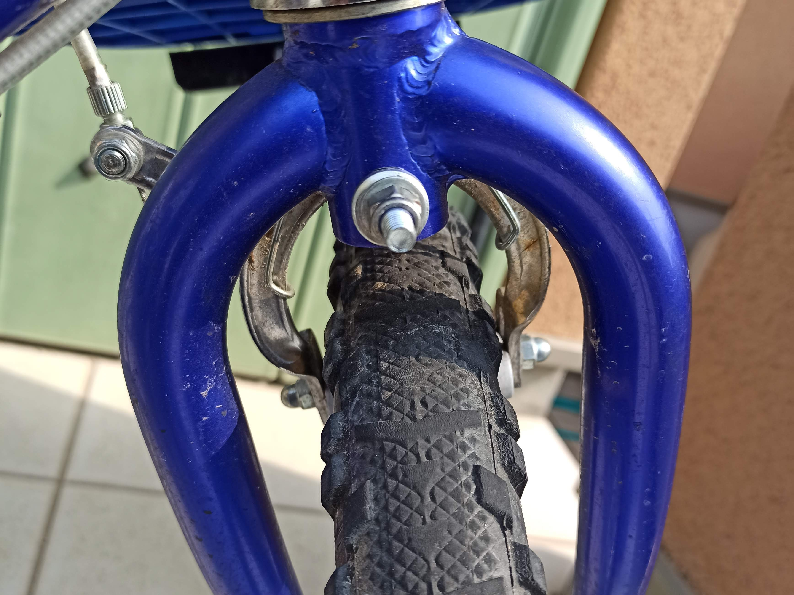

---
categories:
- 自転車
- bike
date: "2025-02-15T23:42:44+09:00"
draft: false
image: images/DSCF0049.JPG
summary: 長年子供が使ってきた自転車、クロスファイヤーキッズ。白化してボロボロになったドロヨケを外してスッキリしました。
tags:
- クロスファイヤーキッズ
- クロスファイヤーキッズ オーバーホール計画
- ドロヨケ
title: クロスファイヤーキッズ ドロヨケ取り外し
---

クロスファイヤーキッズを再生させるためいろいろ部品交換しています。錆びたボルト、ブレーキ、グリップなど交換して全体がこんな状態です。

ドロヨケは青いプラスチックですが、かなり白化してボロボロになっています。前輪はこんな感じです。

 []{#more}

後輪側はさらにひどく、シールもめくれかけています。

ここまでくると、もう再生できないし純正のドロヨケは入手困難だと思うので、取ってしまうことにしました。自分が子供の頃はよく親と一緒に自転車で買い物や、遊びに行くのも自転車を使うことが多かったのですが、最近の子供はそれほど自転車に乗る頻度が多くなく、特に買い物とかは近場でも車に乗せてしまいます。なので雨の日に使うことは無く、雨上がりの水たまりを通るようなこともほぼ無いので、ドロヨケいらないという判断です。

前輪側は、ブレーキ軸に共締めされています。二面幅10mmのナットを緩めて取ります。

スッキリしました。

ブレーキ軸を緩めるので、ブレーキのセンターがずれます。以前購入したParktoolのオフセットブレーキレンチOBW-3を使いセンター調整しながらナットを締めます。

後輪側は、ステーに二面幅8mmのボルト＋ナットで固定されていますが、レンチを回す角度が取れず苦労します。ちょうど短いギアレンチがあったので無事外すことができました。

外したボロボロのドロヨケです。

活躍したミジェットタイプのギアレンチです。台湾の KABO
製でギアレンチ界では有名（？）らしいですがなかなか日本で入手困難で何年も前にヤフオクかなにかで発見しポチったものです。\>

ドロヨケを外した全体です。スッキリしました。

