---
categories:
- 自転車
- bike
date: "2025-02-15T23:42:43+09:00"
draft: false
image: images/IMG_20200412_064112.jpg
summary: 屋外保管で雨ざらしになり各種ボルトが錆びてしまったクロスファイヤーキッズ。ステンレス製のボルトに交換し、新品同様に復活しました。
tags:
- クロスファイヤーキッズ
- クロスファイヤーキッズ オーバーホール計画
- 錆
title: クロスファイヤーキッズ 錆びたボルトを交換
---

クロスファイヤーキッズの錆びたボルトをステンレスに交換しました。

外で雨ざらしになっていたので各部錆が出てきています。ペダルは交換しましたがカゴ、チェーンカバー、ハンドルクランプ部のボルトがサビサビです。

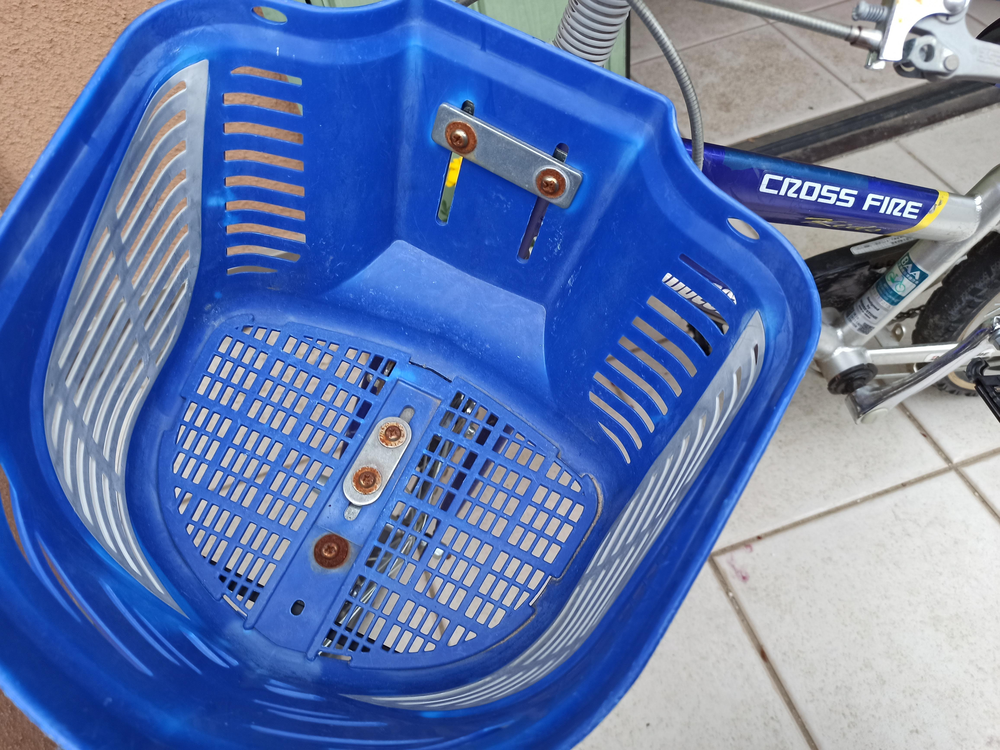
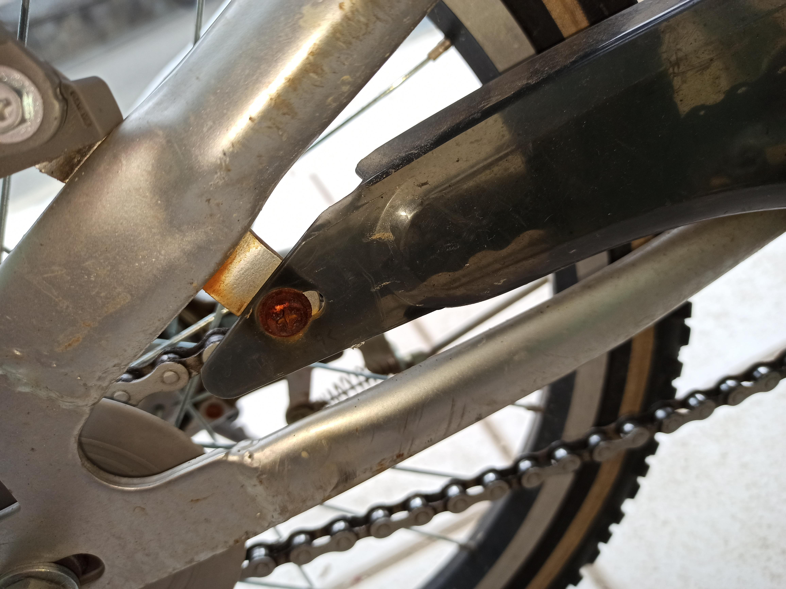
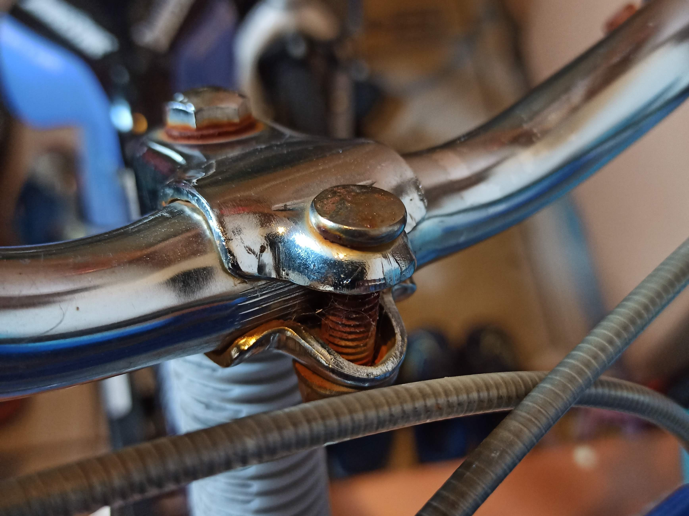

ホームセンターでステンレス製のボルトを買ってきました。

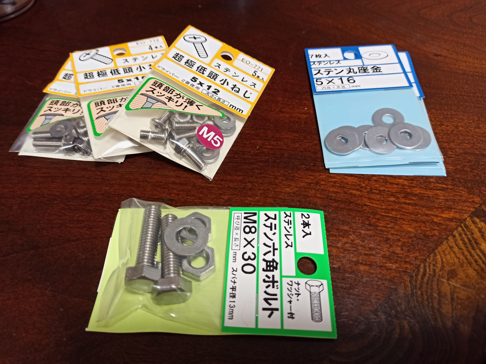

カゴとチェーンカバーはM5のトラス小ねじ、ナベ\
小ねじでしたが、ネジ頭の薄い超極低頭小ねじというものがあったのでこれにしてみます。

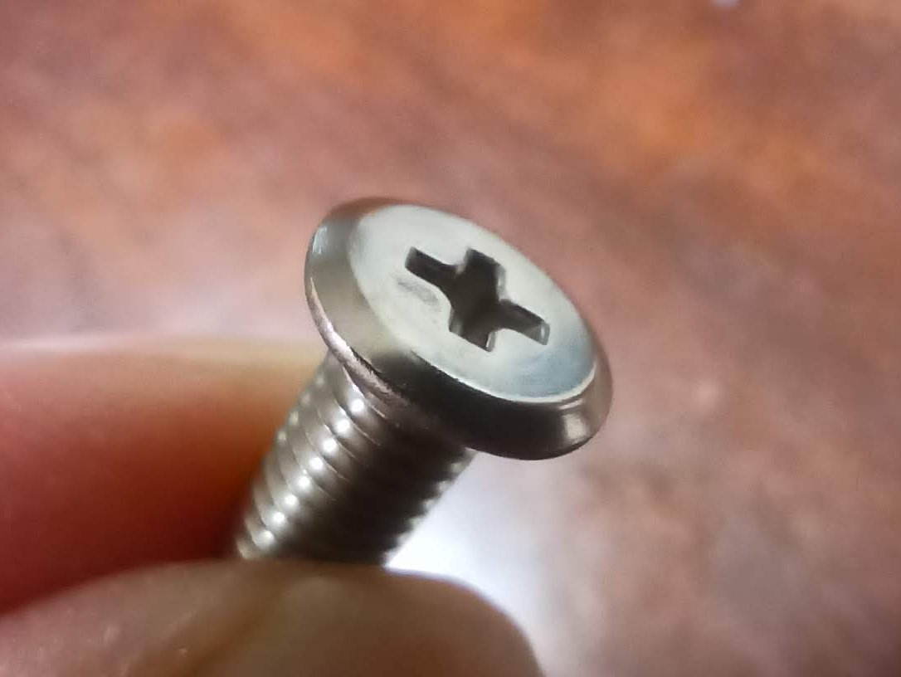

ハンドルクランプ部のM8のボルトは頭が円形でスパナ掛けのない特殊なもので、ホームセンターには似たようなものがなく、普通の六角頭ボルトを使います。

取り外した錆びたボルトです。

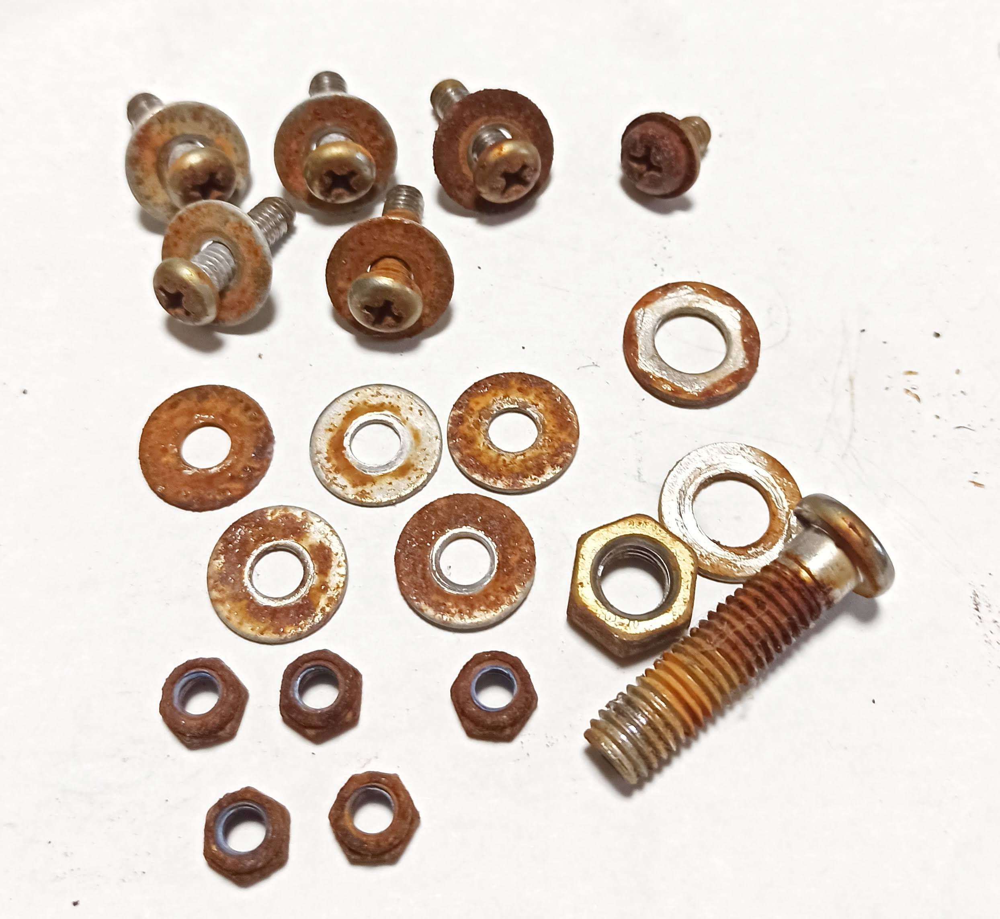

カゴは鉄の板で挟んで止められていて、これも錆びてきていたのでワイヤーブラシで浮いた錆を除去してから「メッキカバー」という亜鉛めっき補修用のスプレーを吹いてみました。

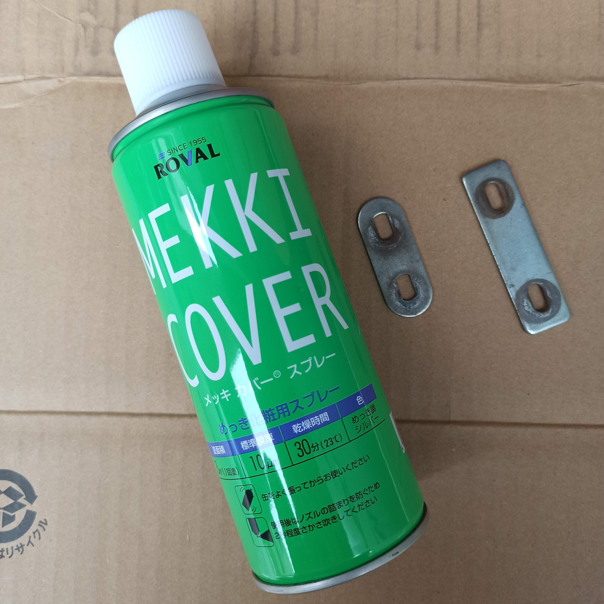

一様な面にならず塗りむらが出てますが、遠目にはそれなりにきれいな銀色になりました。

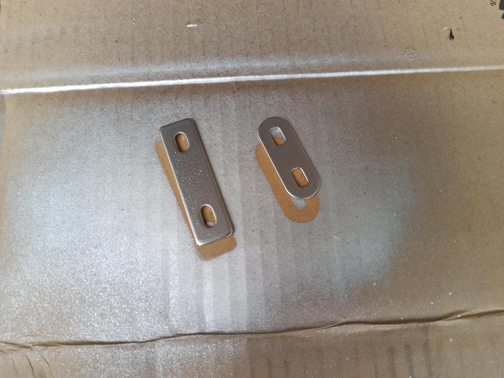

交換後のカゴとチェーンカバーです。

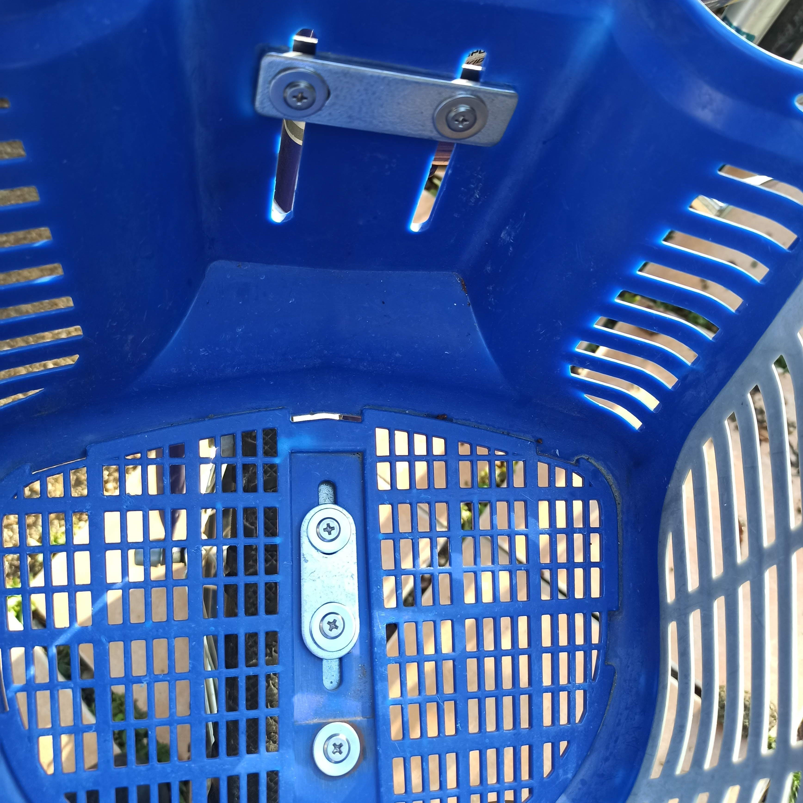
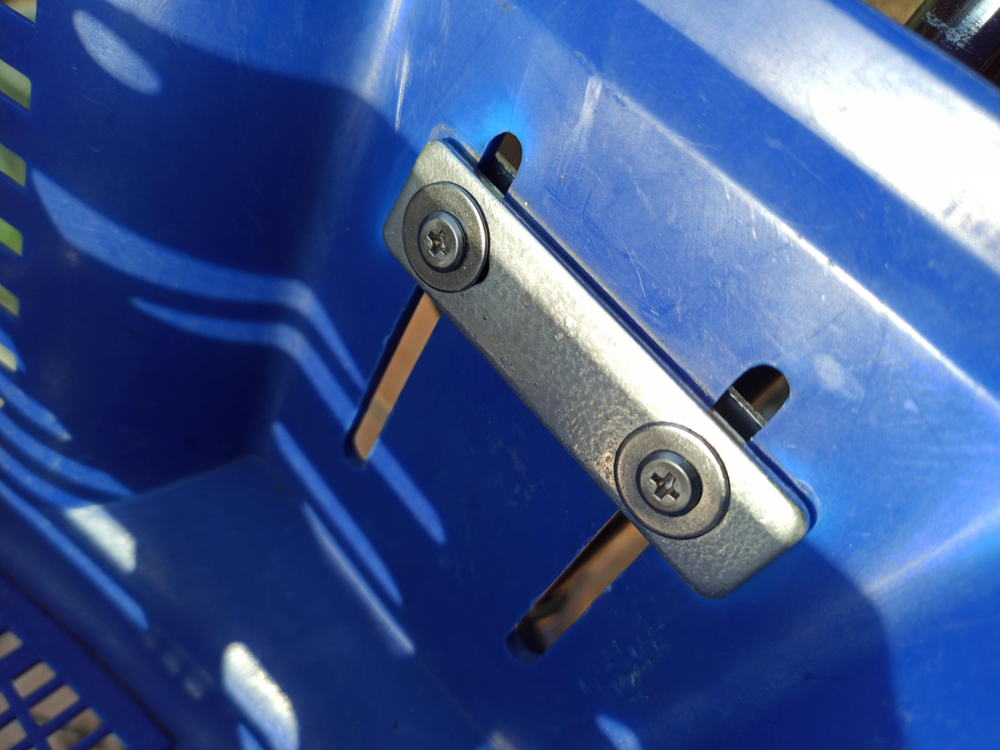
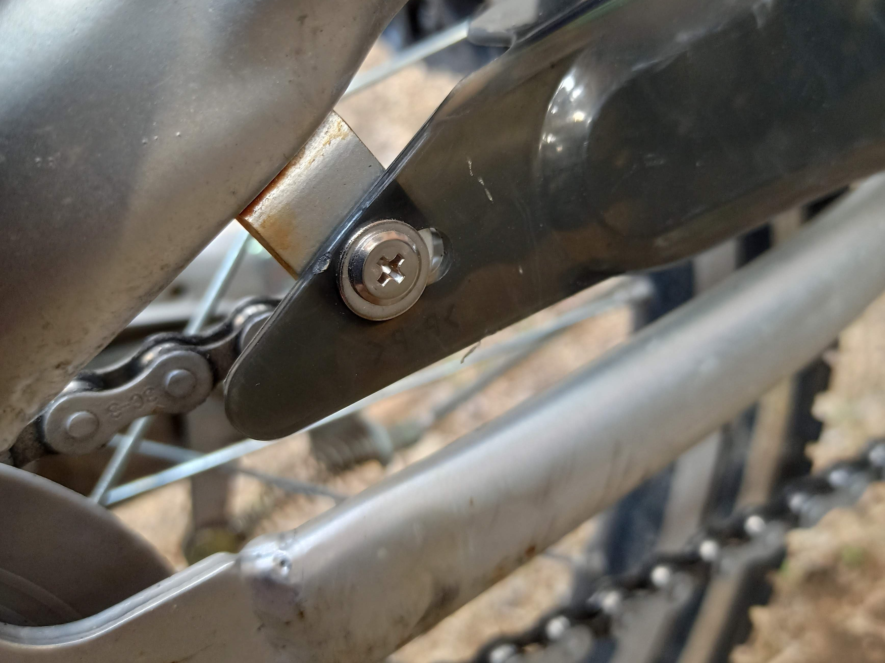

ハンドルクランプ部です。

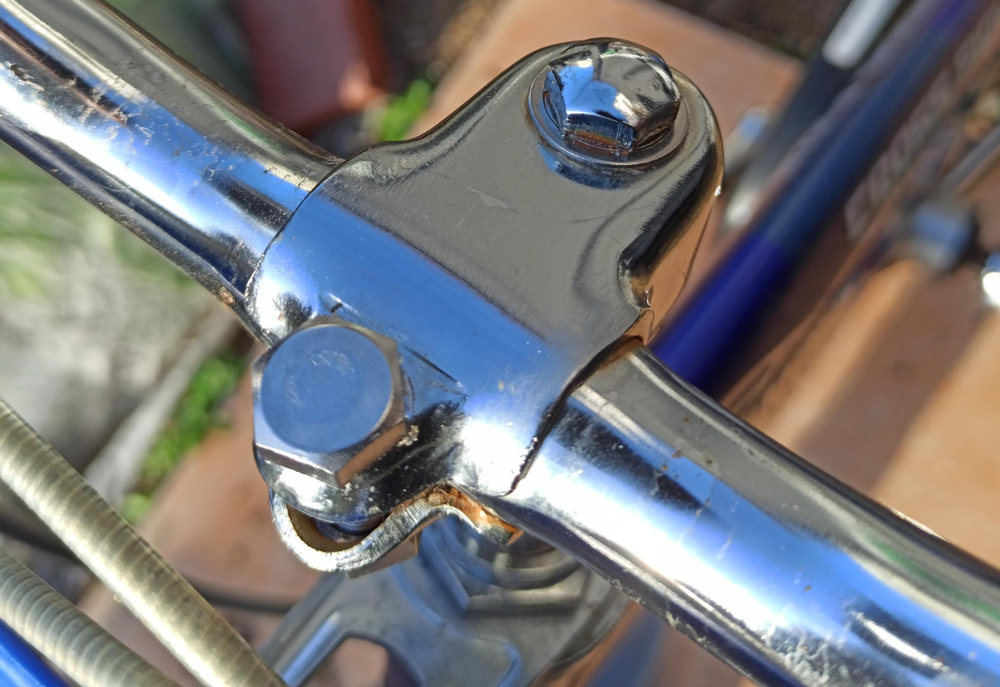

それなりにきれいになりました。ステンレスと鉄、ステンレスと亜鉛メッキで電蝕が起こるはずなので今後どうなっていくか見ていきたいと思います。
