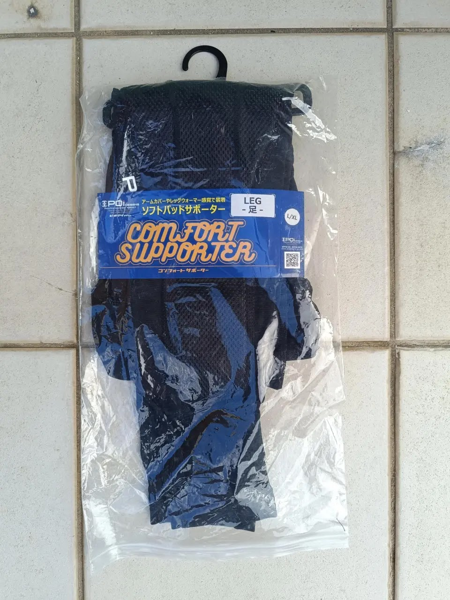
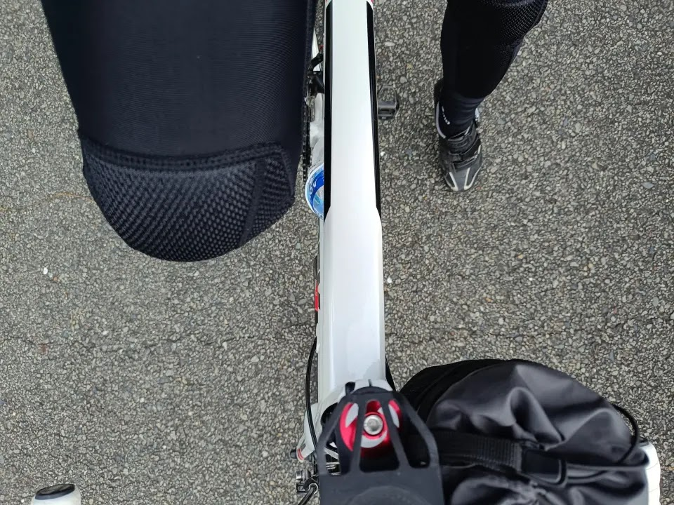
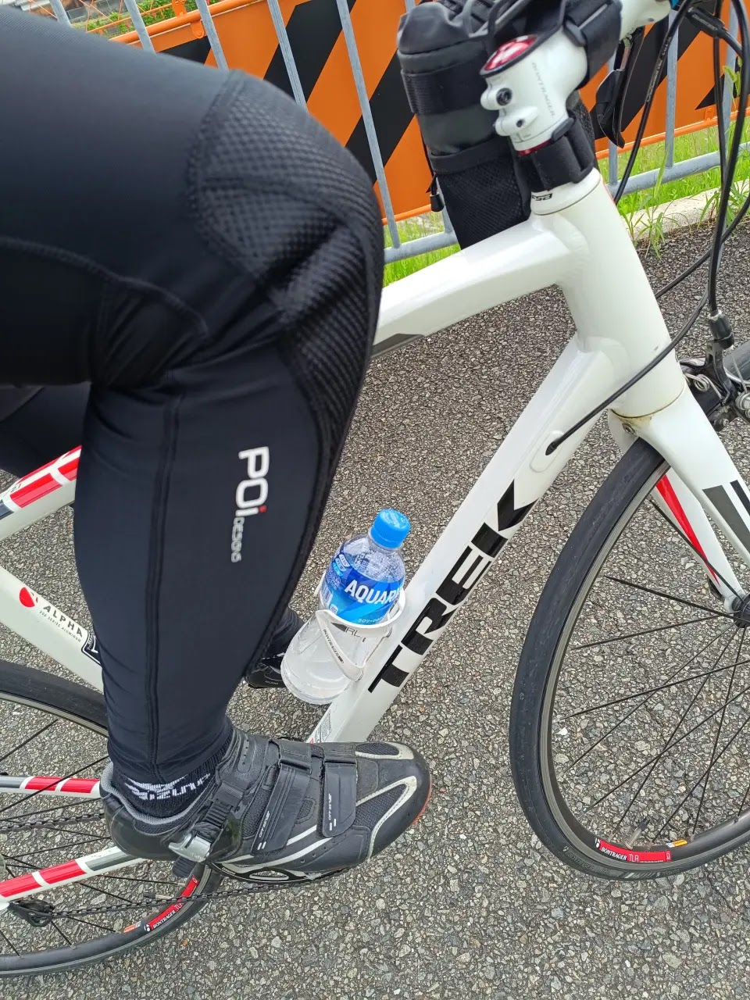
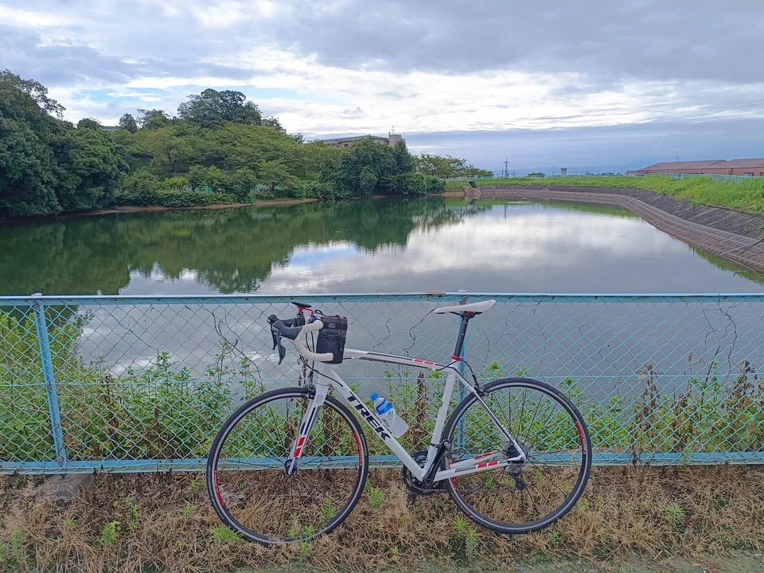

---
categories:
  - 自転車
  - bike
date: "2025-02-15T23:44:23+09:00"
description: ロードバイクは落車による怪我のリスクがつきものです。実体験で膝を打って出血した経験から、もしもの落車の際に膝を守るプロテクターを調べ、比較しました。購入した製品の使用感を実走してレビューします。
draft: false
images:
  - images/001.png
summary: ロードバイクで坂道を下る際に転んでしまいました。カーブでブレーキをかけた際に滑りながらガードレールにぶつかり、膝を打って血が出るという災難でした。もしもの落車の際に膝を守るプロテクターを調べ、比較し購入ましたので使用感をレビューします。
tags:
  - 落車
  - プロテクター
  - サポーター
  - サイクルウェア
title: ロードバイクで落車したのでレッグサポーターを買った
js: js/paad.ts
---

ロードバイクで坂道を下る際に転んでしまいました。雨上がりのウェットな下り坂で結構スピードを出してしまい、カーブでブレーキをかけた際に滑りながらガードレールにぶつかり、膝を打って血が出るという災難でした。こんなことがあると、なかなか怖くて乗れなくなってしまいます。膝を守るサポーターを付けたらどうかと思って調べてみました。

## ダイネーゼ TRAIL SKINS AIR KNEE GUARDS

MTB用のプロテクターです。バイク用プロテクターに近い形で、プラスチック製の厚いパッドで防御力が高そうです。



ロードバイクで着用すると少し大げさな感じがしそうですがイタリアのメーカーだけあってなかなか見た目は良いですね。価格が高いのが難点です。

## POI DESIGNS コンフォート レッグサポーター

見た目はロードバイクのタイツに近く、クッションは柔らかいパッドのようなので上のダイネーゼよりは少し心もとない感がありますが、それなりに動きやすそうです。



価格が安いのもGoodです。

## バイク用インナー

バイク用インナーを着用する、というブロブ記事も見ました。衝撃吸収という面ではプロテクターほど効果は高くないでしょうが、アラミド繊維が入っており摩擦、切れには強そうです。



バイクライダーではないので自転車を漕ぐ動きや汗をかいたときにどうなのかは想像できません。

## プロテクターを購入

無難ですが動きに影響が少なさそうで、見た目も違和感の無さそうなPOI
DESIGNS コンフォート レッグサポーターを買ってみました。

ハーフパンツの下に着用しました。

まっすぐ立つと膝上がダブついた感じになりサイズ間違えたか？と思いましたが、ロードバイクに乗って膝を曲げるとちょうどいい感じです。

横からです。

20kmほど走ってみましたがプロテクターを付けていることを忘れてしまうくらい違和感はありません。真夏で暑いかなとも心配でしたが曇りの早朝ということもあり問題なかったです。逆に冬はハーフパンツとこれだと寒いかもしれません。

落車した際にどうなるか、は怖くて試すことはできませんが保険のようなものだと思ってしばらく使ってみようかと思います。


