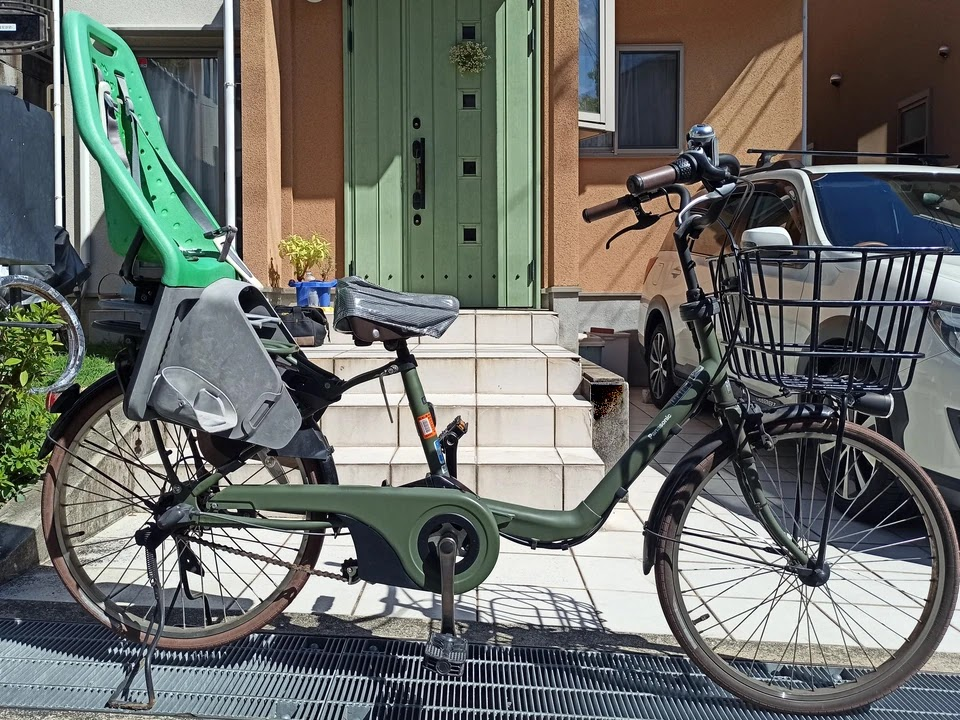
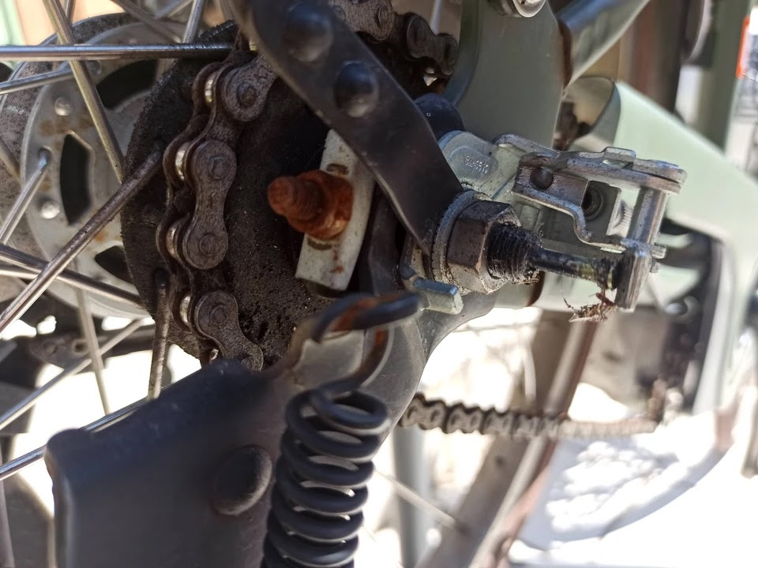
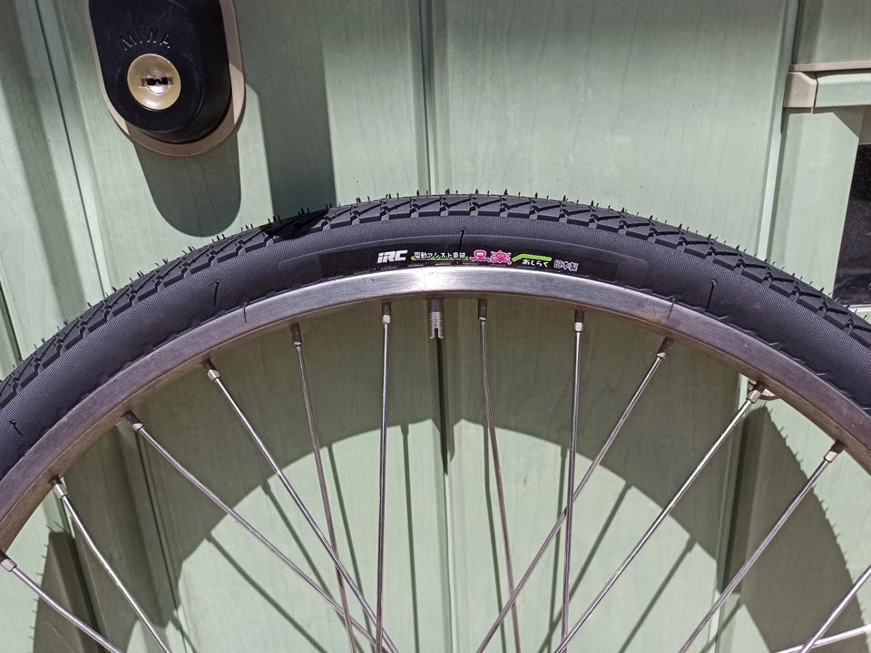

---
categories:
  - 自転車
  - bike
date: "2025-02-15T23:44:14+09:00"
description: 電動自転車のタイヤをDIYで交換する方法を解説します。電動自転車用タイヤの購入、写真付きで交換の注意点等を記載しました。
draft: false
images:
  - images/0034.jpg
summary: 電動自転車がパンクしたから見てほしい言われ、チューブ交換と思いきや、タイヤがすり減り糸が見えてしまっていました。電動自転車用の新品タイヤをアマゾンで購入しDIYでタイヤ交換しました。
tags:
  - タイヤ交換
  - パンク修理
  - ギュット・ステージ・22
title: パナソニック電動自転車 ギュット・ステージ・22 タイヤ交換
js: js/paad.ts
---

我が家の電動ママチャリギュット・ステージ・22、購入してから4年程度経ちます。子乗せ Yepp を付けて嫁さんが子供の幼稚園への送り迎えに使っています。自転車がパンクしたから見てほしいということで、久しぶりのパンク修理かと思い見てみます。

## 後輪タイヤに穴が！

あれ、タイヤがなんか変です。よく見ると後輪のタイヤが削れて中の繊維が露出、さらに穴まで空いています！

子供の重量がかかり続けて毎日のように使うとこんなことになるのですね。びっくりです。

## 新しいタイヤ IRC 足楽

ということで、チューブだけでなく、タイヤそのものも交換必要です。タイヤは22インチの、幅1
½インチです。アマゾンで探しましたが、パナソニック純正のものは見当たらなく、IRCの電動アシスト用の「足楽」というのを購入してみました。



届いたものです。タイヤとチューブが前後輪セットになっています。リムテープは入っていないので別途購入必要です。

「国産タイヤ」とこれでもかというくらい書かれています。

## 後輪のタイヤを外す

電動アシスト自転車は重いので、後輪を浮かして固定するのに苦労します。今回はミノウラのごつい自転車整備用スタンドを使います。鉄パイプでできており、重いのでロードバイク用にはほとんど使っていませんがこんなところで役に立ちそうです。

四苦八苦してこんな感じにクランプしました。

さて、ここから後輪をばらしていきます。

泥除け、スタンドやブレーキなど、様々なものがホイールの軸にとめられているため、これらを外していく必要がありますが、手順詳細は以前に後輪パンク修理をしたときの記事をご参考ください。

::: text-contents
### [パナソニック電動自転車ギュット・ステージ・22 後輪パンク修理](https://www.bchari.com/2021/09/vivi-tube-exchange.html) {#パナソニック電動自転車ギュットステージ22-後輪パンク修理 .title}

パナソニックの電動自転車ギュット・ステージ・22
の後輪がパンクしてしまいました。以前、ブリジストンのBi \...
:::

真夏の日差しにやられながらなんとか後輪を外しました。

外した後輪です。

タイヤレバーを使い、ビードをリムから外していきます。

片側のビードがリムから外れました。

バルブコア、ナット類を外します。

チューブを抜いていきます。

チューブを抜いたらもう片側のビードもリムから外します。

タイヤに穴が空いていた箇所の裏面です。このタイヤは、表が茶色で裏が黄色というカラフルなタイヤですね。

タイヤがホイールから外れました。

リムテープは柔らかいゴムでできたもので、バルブ穴のところで切れてしまっていたので再利用はできません。

スポークナットも1箇所折れてしまっていました。

## スポークナットの交換とリムテープ貼り

スポークナットは以前アマゾンで買ったものがあったのでこれに交換します。

スポークも曲がってしまっていましたが、手である程度曲げ直し、スポークナットでテンションかければとりあえず使えそうです。

スポークナットレンチで締めてテンションをかけます。

スポークを修理したら次はリムテープです。ビニールテープのような、自分でカットする安いやつです。

リムテープを貼っていきます。

リムテープを貼りました。少し短かったかな。。。

## タイヤを取り付ける

ここまできたらあとはタイヤを取り付けていきます。「足楽」のロゴが楽しそうですね。

このタイヤは回転方向がありました。矢印の方向に回転するように取り付ける必要があるので注意です。

タイヤのビードを片側リムに入れたらチューブを間から挿入していきます。

チューブを入れました。

もう一方のビードをリムに押し上げて入れていきます。

ここからが硬いです！！

なんとか入りました。

チューブがリムとビードの間に噛み込んでいないかを隙間から確認します。

最後にバルブコアとナットを付けます。バルブコアは昔ながらの虫ゴムですね。そのうちスーパーバルブに交換したいと思います。

最後に空気を入れてタイヤ取り付け完了です。

オリジナルのタイヤは茶色でしたが、今回は黒色です。タイヤはやはり黒色がタイヤらしくで好きです。

自転車にホイールを取り付け復旧します。

後輪のタイヤ交換が完了しました！

## 前輪もタイヤ交換

さて、前輪は後輪より負荷がかからないので摩耗は少ないですが、それでも結構ツルンツルンになっていましたので前輪もタイヤ交換していきます。

前輪は後輪より構造がシンプルなので外しやすいです。チェーンやブレーキは無いのでナットを外し、これらを抜けばすぐにホイールを外すことができます。

キャップを外します。

14mmのレンチでナットを緩めて外します。

ナットを外しました。

ハブの軸にとまっている泥除け、カゴ、そしてライト発電用のダイナモかスピードセンサーのような謎の配線を外します。

前輪を抜きました。ミノウラの整備スタンドでうまく掴めるところがなかったので、フォークをそのまま地面に置いてます。

よく見ると一部裏側の黄色い部分が露出していますね。こちらも危なかった。

タイヤ交換自体は後輪と同じなので省略します。注意点は、前輪はリムブレーキなのでホイールを外した状態で空気を入れるとタイヤが膨らんでブレーキを通らなくなるので、ホイールを付けてから空気をいれます。

前輪も交換しました。とおもったら1つ部品を付け忘れていますね。

前輪も交換し完了です！いやー疲れた、真夏の昼間にやるものでは無いですね。

これでまた3年程度は使えそうです。それにしてもここまでよく気付かなかったものです。たまにはタイヤの溝を見たほうがよいですね。


