---
categories:
  - 自転車
  - bike
date: "2025-02-15T23:44:26+09:00"
description: 購入してからすでに5年も経つ子乗せ電動自転車ギュット・ステージ・22のサドルが破れていたので新しいサドルを買って交換しました。
draft: false
images:
  - images/014.jpg
summary: 購入してからすでに5年も経つ子乗せ電動自転車ギュット・ステージ・22のサドルが破れていたので新しいサドルを買って交換しました。
tags:
  - ギュット・ステージ・22
  - サドル
title: 電動自転車 ギュット・ステージ・22 サドル交換
js: js/paad.ts
---

購入してからすでに5年も経つ子乗せ電動自転車ギュット・ステージ・22のサドルが破れていたので新しいサドルを買って交換しました。

## 準備するもの

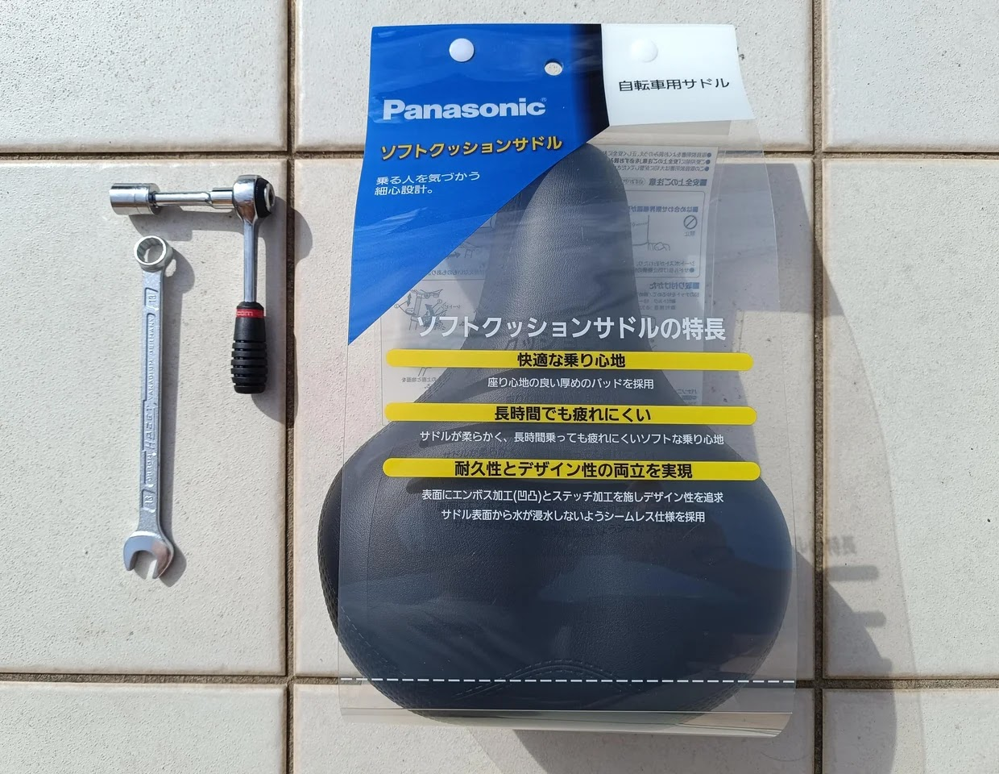

新品サドルとM8ナット用、二面幅13mmのレンチです。

サドルは一般的なママチャリ用のシートポストにスポッと差す取り付けのものです。もともと付いていたものと色、形状が異なりますがパナソニック製です。

左右にナットがあり2本のレンチが必要かと思いましたが、軸が角シャフトで回り止めになっているため、1本で十分でした。

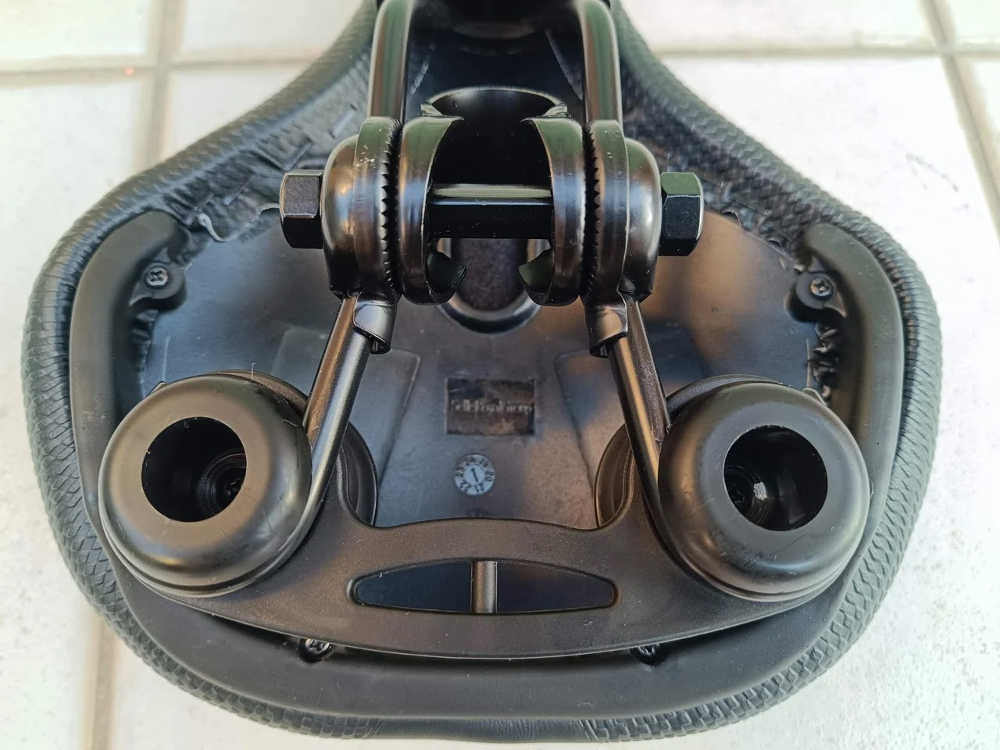



しっかりした作りの割には安いですね。

## 破れたサドルを外す

交換前のギュット・ステージ・22です。もう5年も使っています。

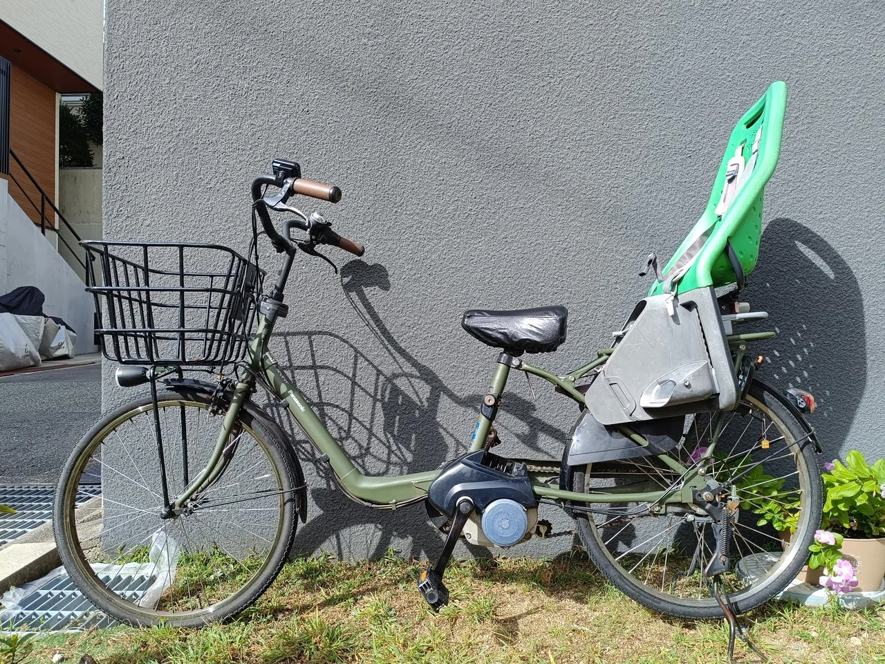

サドルカバーを被せて乗っているようです。

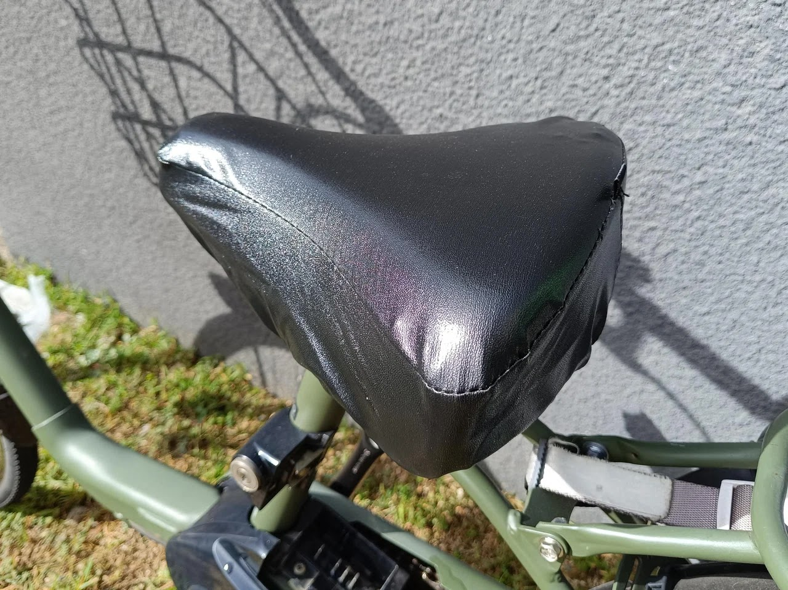

サドルカバーを外すと、結構大きく破れたサドルが現れました。このまま雨が降ると水を吸ってなかなか乾かなくなります。

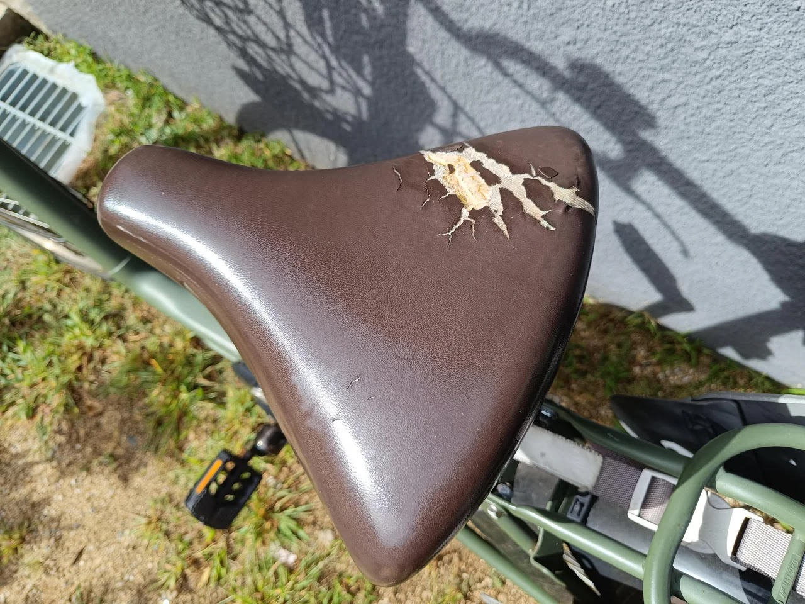

サドルは下の写真のように、M8ナットでシートポストにクランプされています。

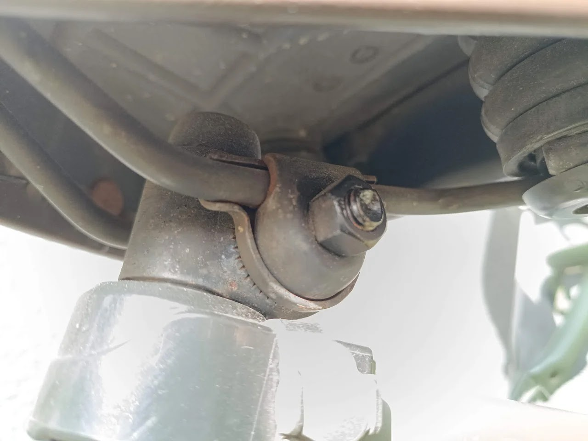

ナットを緩めます。裏側にももう一つナットがありますが、1本の軸でつながっているので片側を緩めるだけでOKです。

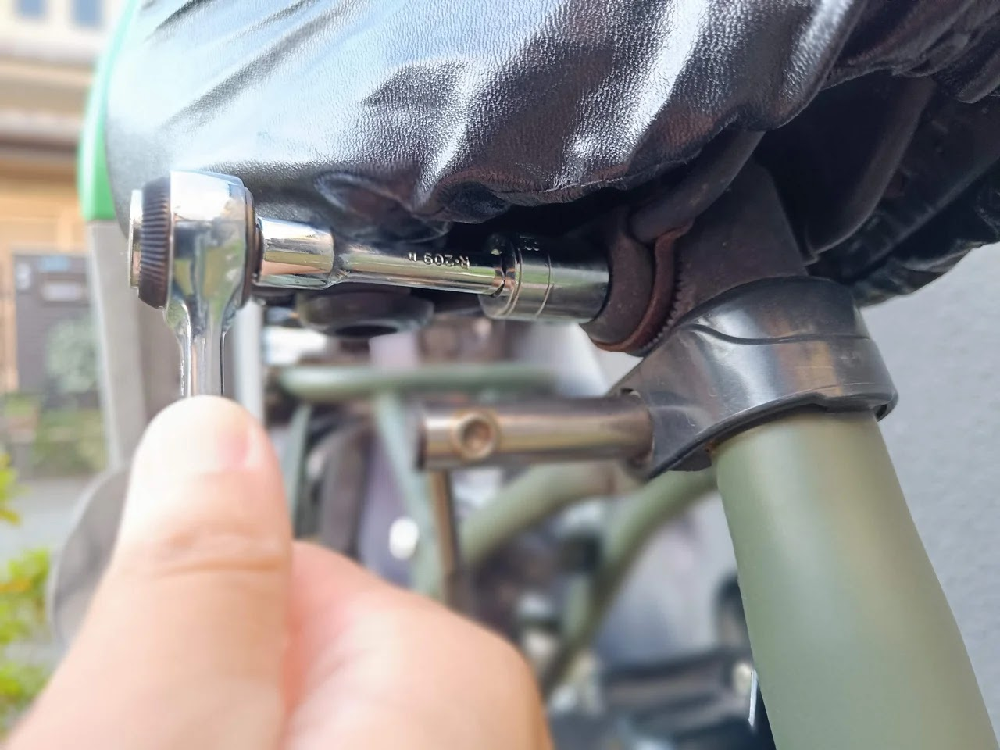

サドルを上にスポッと抜きます。

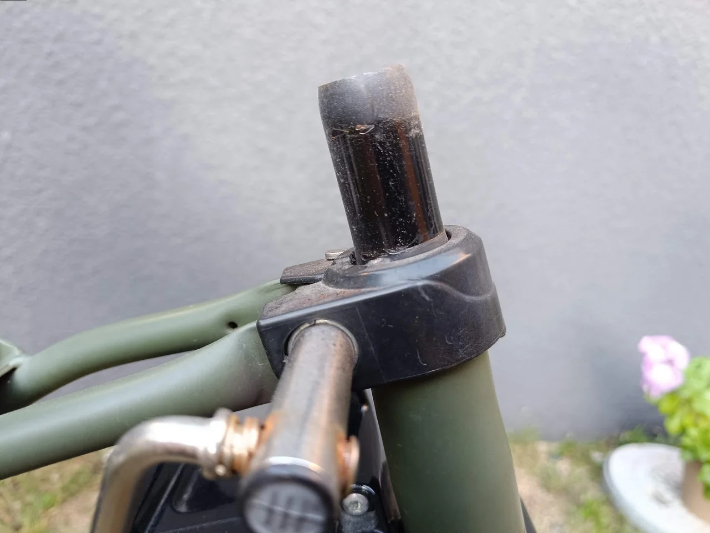

## 新しいサドルの取り付け

新しいサドルは丸みを帯びた形状で、ずんぐりむっくりしています。子乗せ自転車には少しスポーティーだったかもしれません。

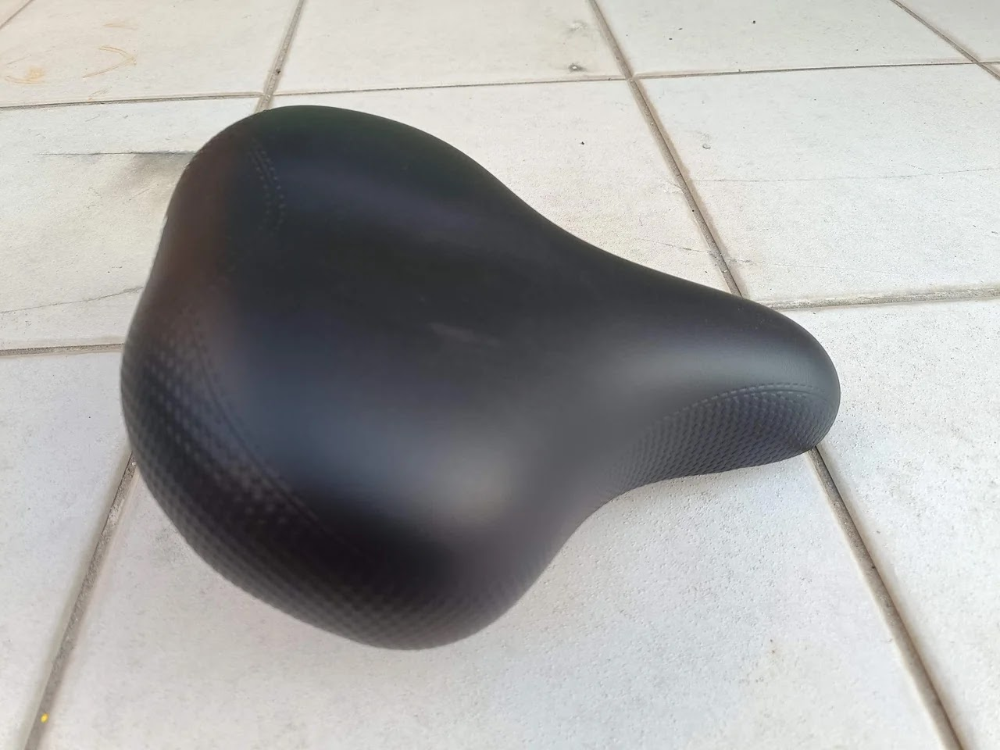

これをシートポストにスポッと差しておしまい、なのですがそのまま付けると前に傾いています。サドルが真っ黒だからか、カメラのフォーカスが合わずここから先ピンぼけしてしています🤐

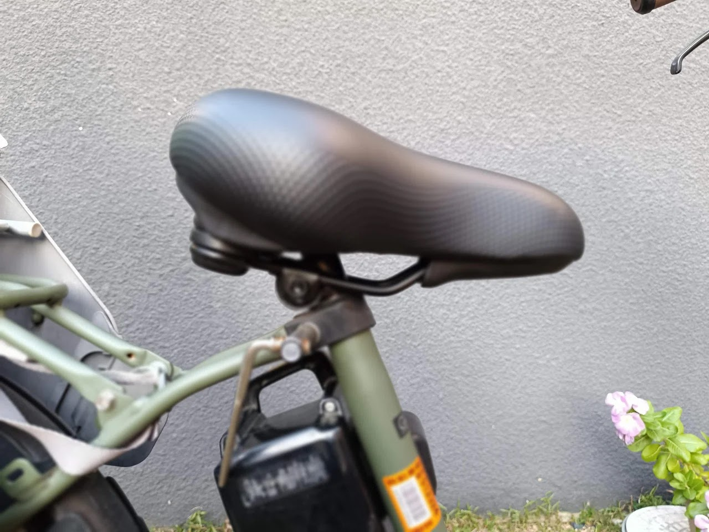

角度調整の回転軸は、サドル固定と一緒になっているため、ナットを緩めた状態でサドル先端を上下させばできます。

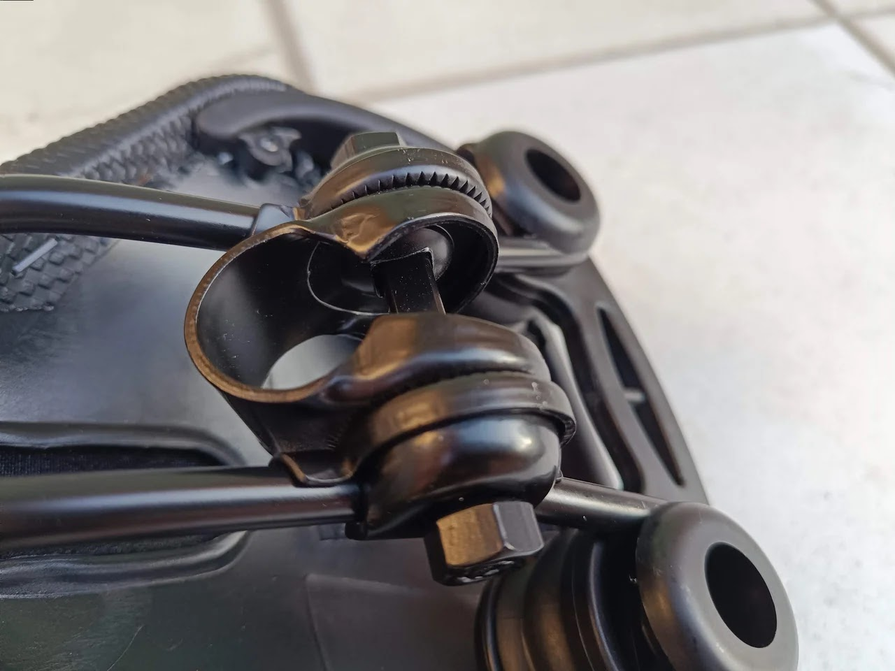

だいたい水平になりました。

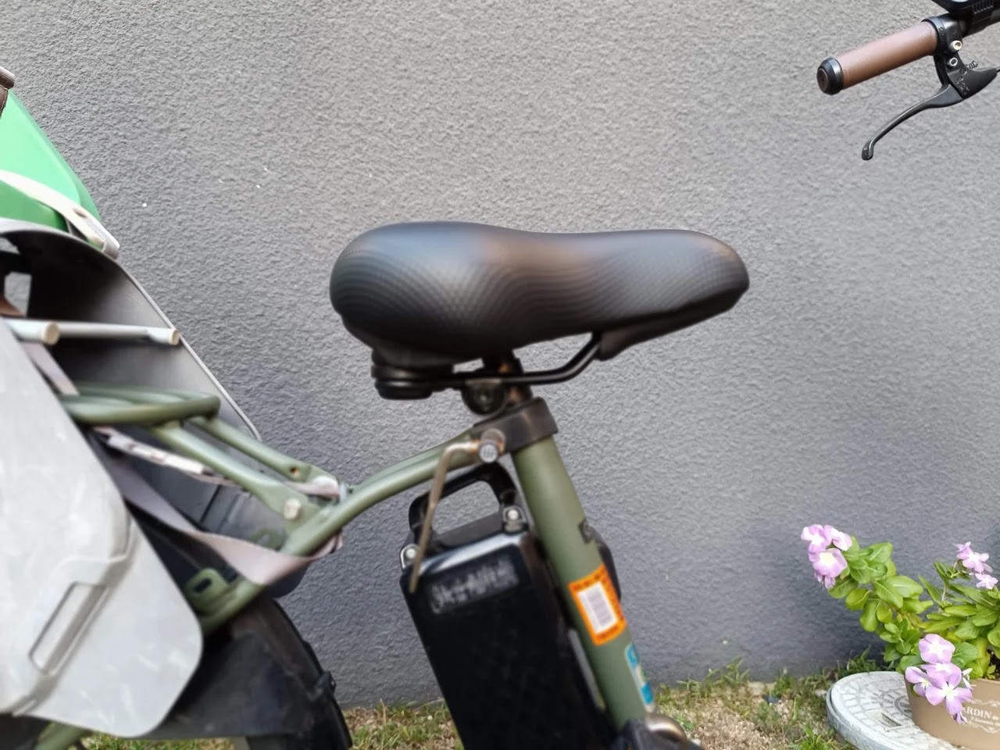

ナットを締めて固定完了です。

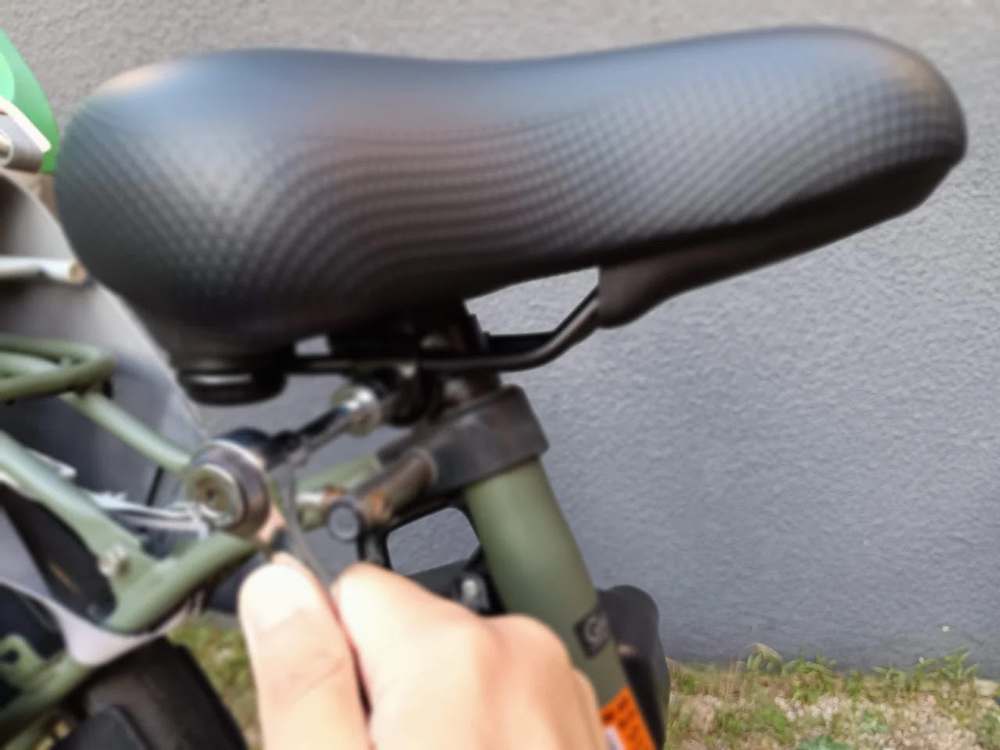

交換後です。やはりもともと付いていたサドルの方がエレガントな感じで、少しもっさり感が出てしまいましたが破れたサドルにカバーかけて乗るよりはいいですね。また破れたら今度は前と同じ形状のを選択したいと思います。サドル交換は簡単にでき、カバーかけるよりも新品感が出るので破れたら交換がおすすめです。

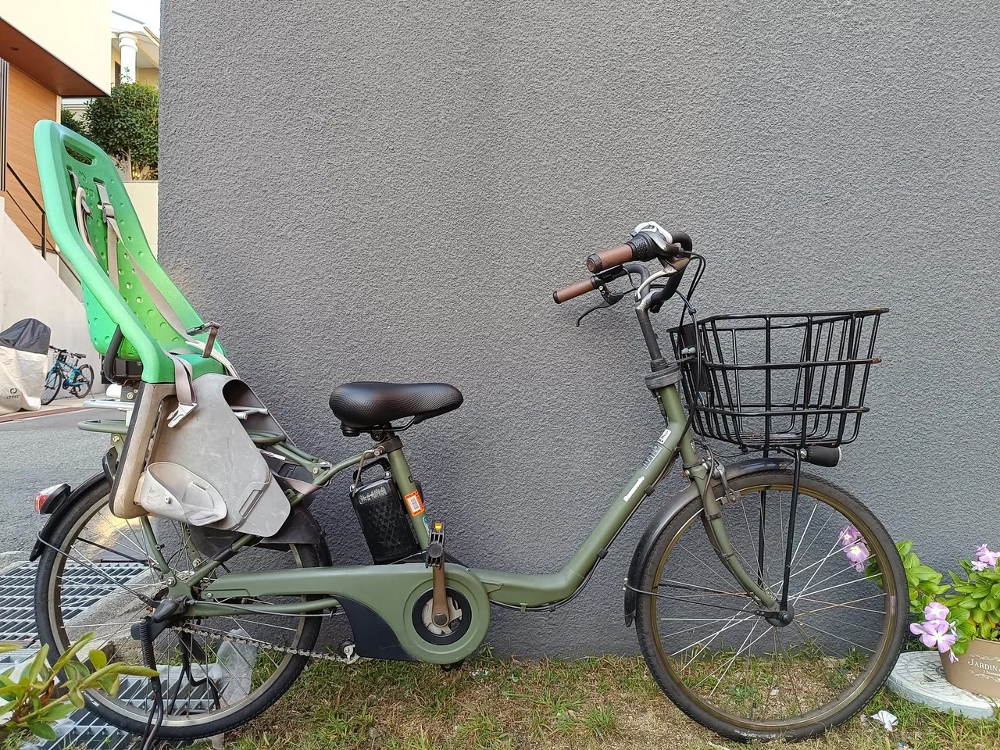


