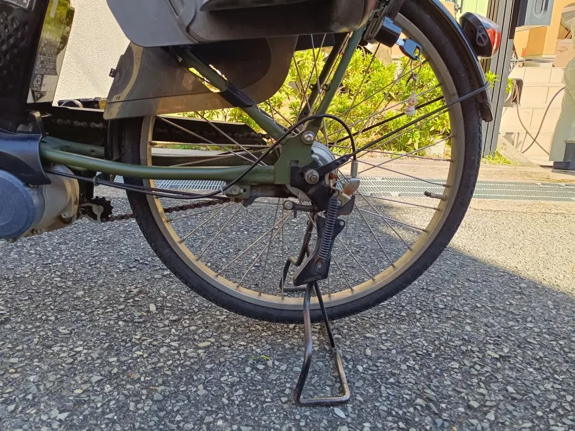
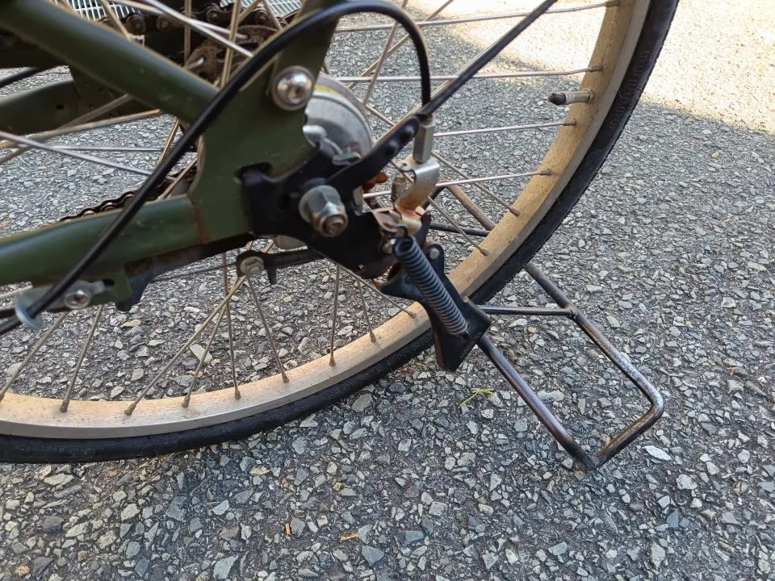
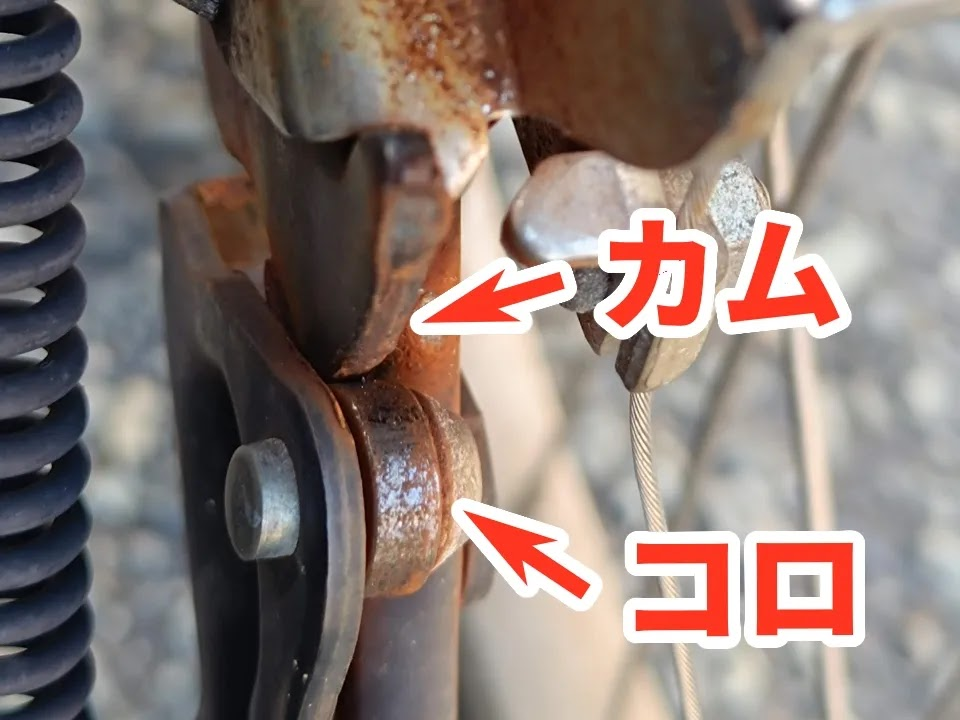
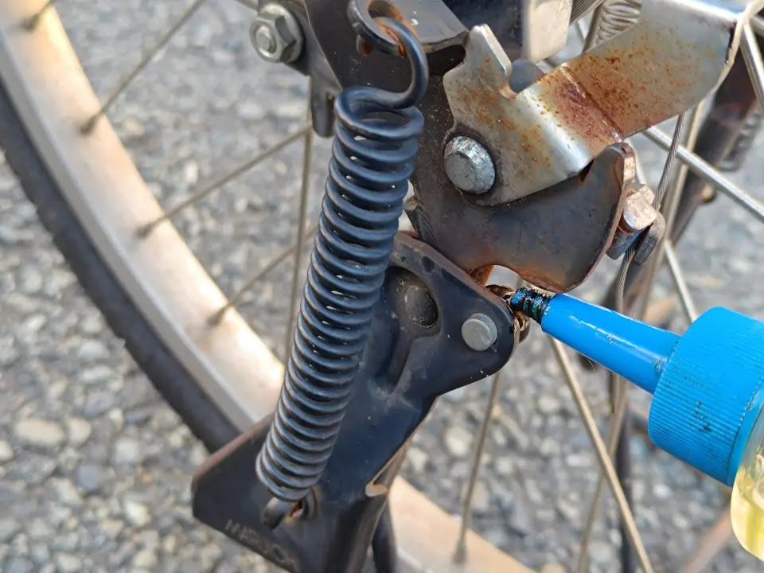
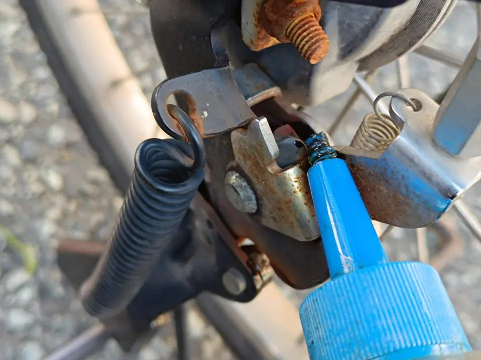
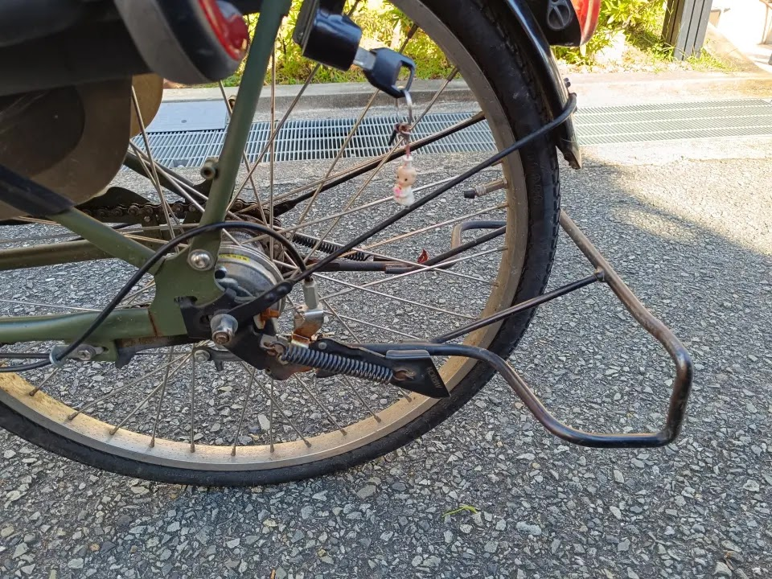

---
categories:
  - 自転車
  - bike
date: "2025-02-15T23:44:25+09:00"
description: 電動アシスト自転車に乗ろうとスタンドを上げようとしたところ、途中で引っかかり動きが悪くなっていました。原因とそんなときの対処法を解説します。
draft: false
images:
  - images/004.webp
summary: 電動アシスト自転車に乗ろうとスタンドを上げようとしたところ、途中で引っかかり動きが悪くなっていました。原因とそんなときの対処法を解説します。
tags:
  - スタンド
  - メンテ
  - ギュット・ステージ・22
title: 子乗せ自転車のスタンドの動きが悪い
---

先日、破れたサドルと壊れた電動アシストの手元スイッチを交換したギュット・ステージ・22ですが、さて走ろうと思ってスタンドを上げようとすると、途中で引っかかったようになりあがってくれません。

子乗せ自転車のスタンドは、このように後輪を浮かせるタイプでなおかつがっちりした作りになっっています。

スタンドを上げると、この状態で止まってしまいます。地面に擦ってしまいますね。ここからさらに蹴りあげればよいのですが、毎回面倒です。

この状態でよく見ると、スタンドの可動側に鉄のローラー、コロが付いており、これが鉄板のカムに当たりながら転がるような部分がありました。サビサビで油切れてカラカラになっているので、ここの動きが悪く抵抗になっていそうです。

コロにチェーンオイルを注油してやります。カム、コロの当たる面にも塗ってやりました。

スタンドの回転支点となる軸にもオイルを落としてやります。

スタンドがスルッと上がるようになりました。

スタンドの可動部あたりにCRC-556とか潤滑用のスプレーを吹きかけてもよいのですが、あまり広範囲にベタベタになると汚れが付きそうなので今回のように抵抗になる部分に絞って注油しました。カムの部分は、オイルより年度の高いグリスを塗ったほうが長持ちするかもしれません。

家族が日常で使う自転車は、ほぼノーメンテでよくこれで我慢して乗っていたな、と思うことが多々ありますが、自転車を趣味にしている人でないとメンテしようなんて思いもしないのでしょうね。
