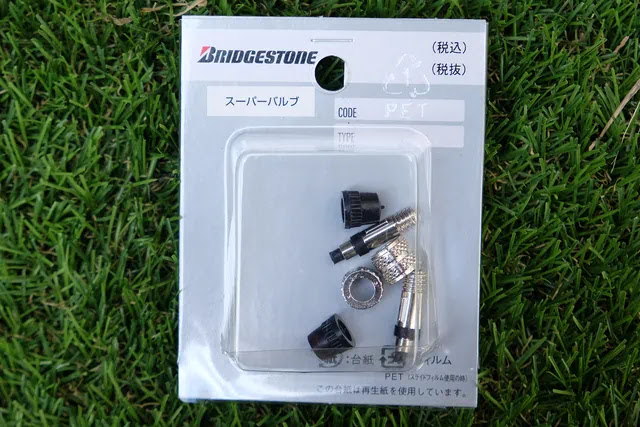

---
categories:
  - 自転車
  - bike
date: "2025-02-15T23:43:57+09:00"
description: 自転車の英式バルブには経年劣化で空気漏れを起こす虫ゴムが使用されています。虫ゴムが無く劣化の起こりにくいブリヂストンのスーパーバルブを取り付けました。
draft: false
images:
  - images/07.webp
summary: 電動アシスト自転車 ギュット・ステージ・22に英式→米式変換アダプタを使い米式バルブ化しましたが、家族は空気入れのやり方が分からず結局自分が毎回空気入れすることに。運用面での失敗から英式に戻しますが、虫ゴムを使わないブリヂストンのスーパーバルブを取り付けました。
tags:
  - パンク修理
  - 虫ゴム
  - ギュット・ステージ・22
title: 虫ゴムを使わない英式バルブ、スーパーバルブ
---

電動アシスト自転車 ギュット・ステージ・22
に英式→米式変換アダプタを使い米式バルブ化しました。空気圧が測定できるなどメリットが大きいのですが家族は空気入れのやり方が分からず結局自分が毎回空気入れすることに。運用面での失敗から英式に戻しますが、虫ゴムを使わないブリヂストンのスーパーバルブを取り付けました。

## 米式バルブの利点と欠点

以前、電動アシスト自転車 ギュット・ステージ・22
がパンクしてチューブ交換した際に、空気圧が測れるようにと Panaracer
の英式→米式変換アダプタを付けていました。

バルブ部はこのようにキノコのように太くなりましたが、空気入れの際に抵抗も少なく、虫ゴムが無いので劣化の心配も無い、かつ空気圧が測定できると良いこと三昧だと思っていました。

しかし、嫁さんは空気入れの使い方が分からず、結局毎回自分が空気入れ担当になってしまい、気づくとタイヤがヘナヘナということもよくあり運用面では失敗でした。

## 英式バルブの欠点とスーパーバルブ

英式バルブの利点は空気入れが簡単なこと。深く考えず洗濯バサミのような口金を付けてポンピングすれば空気が入ります。

欠点は主に2点あります。

1.  空気圧を測定できない
2.  虫ゴムが劣化すると空気漏れする

このうち、1.は英式バルブの構造上どうしようもないのですが、2.については虫ゴムを使わないスーパーバルブという商品がブリヂストンから出ています。今回このスーパーバルブに交換してみます。

ちなみに、自転車によっては初めからこのスーパーバルブが付いているものや、SCHWALBEのチューブは初めからスーパーバルブに似たような構造になっています。

## スーパーバルブの取り付け

さて、ギュット・ステージ・22
に付けていた英式→米式アダプターを外します。通常の英式バルブの場合もこのあたりに付いているナットを緩めて外します。空気が吹き出すので注意です。

外した英式→米式アダプターです。お世話になりました。

外したあとのバルブ部です。

ブリヂストンのスーパーバルブです。100円ショップを始め同じ構造の安物が売られていますが、これも数百円なのでしっかりしてそうなブランド物を購入しました。

バルブコアを穴に入れます。

ナットを締めておしまいです。簡単ですね。

洗濯バサミ式の空気入れで空気を入れます。

最後にキャップをして完了です！

## まとめ

自転車用のバルブは英式、米式、仏式と3種類それぞれ特徴がありますが、家族が使うにはやはり英式バルブがお手軽です。英式バルブは虫ゴム劣化によるパンクの心配がありますが、スーパーバルブに交換することで解決できます。数百円でお手軽に交換できるのでおすすめです。
