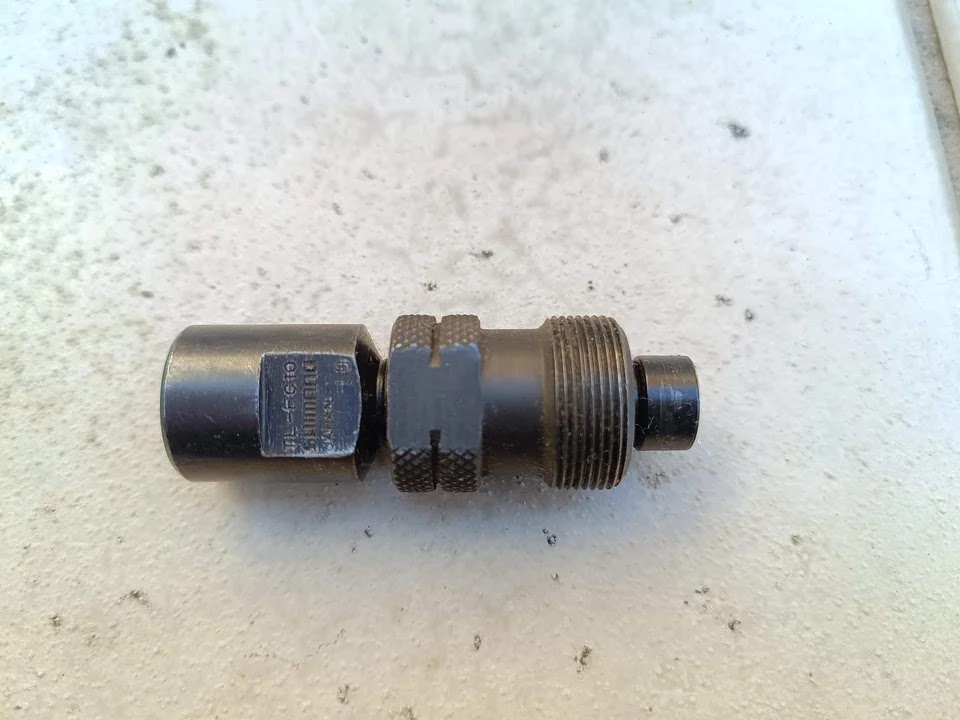
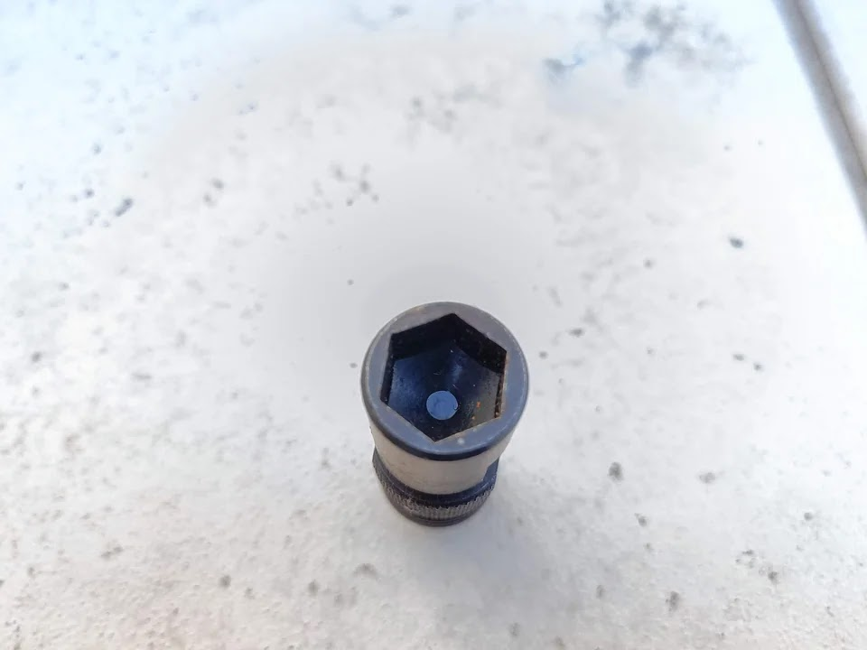
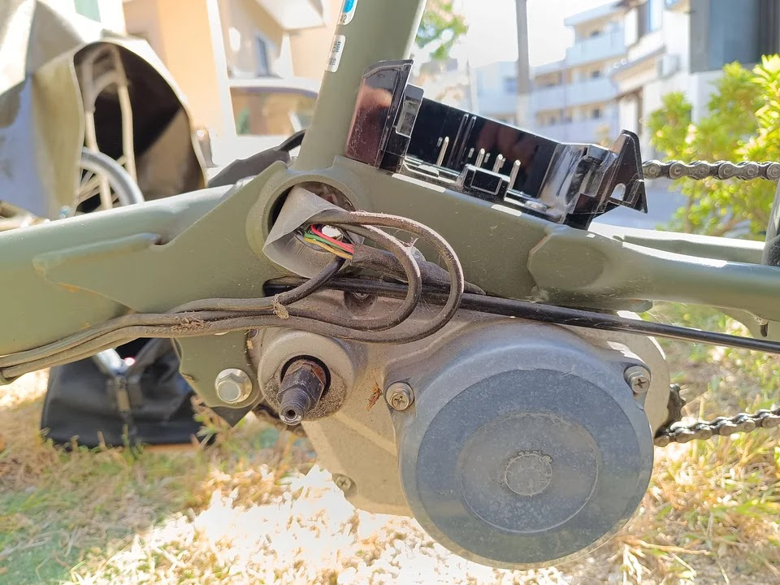

---
categories:
  - 自転車
  - bike
date: "2025-02-15T23:44:26+09:00"
description: パナソニックの電動自転車ギュット・ステージ・22の手元スイッチの液晶画面が壊れてしまいました。手元スイッチ新品をネットで購入してDIYで交換しました。
draft: false
images:
  - images/041.jpg
summary: パナソニックの電動自転車ギュット・ステージ・22の手元スイッチの液晶画面が壊れてしまいました。手元スイッチ新品をネットで購入してDIYで交換しました。
tags:
  - ギュット・ステージ・22
  - 電動アシスト手元スイッチ
  - オーバーホール
title: 電動自転車の手元スイッチ交換
js: js/paad.ts
---

パナソニックの電動自転車ギュット・ステージ・22の手元スイッチの液晶画面が壊れてしまいました。手元スイッチ新品をネットで購入してDIYで交換しました。

## 手元スイッチが壊れた

先日サドル交換をしたギュット・ステージ・22です。

普段は家族が使っていますが、久しぶりに乗ってみようと電動アシストのスイッチONすると液晶画面が変です。「全部映っている状態」になっています。

液晶が消える、エラー表示などの症状は出てきましたがこのような状態の情報はネットで少し検索してみた程度ではありませんでした。液晶画面がおかしいだけで、電動アシストは問題なく使えますが、バッテリー残量もわからないのは気持ち悪いので手元スイッチの交換にチャレンジしてみます。

## 交換用の新品を購入

アマゾンでさくっと購入できるものと思いスイッチ、手元スイッチ、コントローラー、など検索してみましたが出てきません。一般消費者が交換するようなものでは無いので自転車屋さん向けにしか売られていないのかも知れません。ヤフオクとかに中古品はあるのですが、せっかくなので新品にしたいです。

そんな中で、 [悠々サイクル](https://yuyucycle.stores.jp/)
という自転車屋さんがネット販売していたので買ってみました。自転車の型式を連絡するとそれに合った手元スイッチを送ってくれるので安心です。在庫なしで11月頃生産との連絡でしたが、注文してから2週間程度、10月上旬に届きました。

故障の原因として、雨水の浸水が多いというネット情報もあったので、手元スイッチカバーも合わせて注文しています。



また、メーカーはおそらくDIYで交換は想定していないでしょうし、上記ネット販売も自転車屋さんに持ち込んで交換前提のような記載もあるため、DIYでの交換は完全に自己責任だと思ったほうがよいでしょう。

## 交換に必要な工具

早速交換していく前に、使用した工具です。

1.  プラスドライバー
2.  マイナスドライバー
3.  コッタレスクランク抜き工具
4.  モンキーレンチ

2〜4は、クランクを外すために使用しましたが、交換してから分かりましたがクランクは外さなくてもできると思います。なので、最低限プラスドライバー1本でいけたかもしれません。

## コネクターを外す

手元スイッチから伸びているケーブルは、自転車のフレームに沿いクランク、バッテリーのあるモーターユニットあたりまで来たところでコネクターで接続されています。ここのアクセスするためには、黒いプラスチック製カバーを外す必要がありますが、チェーンカバーなんかもあり、一旦クランクも含め外してしまうことにします。

まずはバッテリーを外しておきます。

クランクを固定しているナットのカバーを外します。マイナスドライバーでこじれば外れます。

カバーを開けるとナットが見えます。

このクランクを外すには、コッタレス抜き工具という専用ツールが必要です。



ナットはクランクの中に入っているので普通のレンチでは回せませんが、この工具の頭の部分を使います。

工具の六角穴をナットに入れたら、工具の側面の二面幅をモンキーレンチなどで回すとナットを外すことができます。

ナットが外れました。

四角形のテーパ軸にクランクがはまっています。あとはクランクを引き抜くだけですが、通常、ギチギチに固着しており、ここも先程の専用工具を使わないと抜けません。

クランクにめねじが切ってあるので、専用工具をねじ込みます。そのあと、写真のように専用工具の先端を回していくとねじが軸を押してクランクを抜くことができます。

抜けました。

3本のプラスネジで固定されているチェーンカバーを外します。

チェーンカバーが外れました。チェーンカバーを外すと、コネクターが入っているであろう黒いカバーを固定するボルトなどが見えるかと思いましたが、それらしきものは見当たらず、、、

とりあえず、反対側もクランクを抜きました。しかし、カバーを開けるヒントはありません。クランク抜かなくても良かったのでは、、、

舐め回すように黒いカバーを見ますが、固定ねじらしきものはこの1本のみ。まさか、これ1本で固定されているの！？

ねじを外します。チェーンカバーを外さないとプラスドライバーが入らないので、いちおう努力が報われたか。でもL字のプラスドライバーとかラチェットとユニバーサルジョイントを使うなど、工夫すればチェーンカバー外さなくてもねじを外すことができそうです。

ねじを1本外したら、あっけなく黒いカバーを外すことができました。

コネクターはどこ？なんか配線が袋のようなものに覆われ、穴に突っ込まれていますが、もしかして！？

袋をズルっと引き出すとコネクターが入っていました。なんか想像と違う光景に驚きです。

袋からコネクターを出しました。3つあり、このうちのどれかが手元スイッチのものです。

手元スイッチから配線を辿ります。

配線はブレーキ、シフトケーブルと一緒にフレームに沿ってモーター部まで行きます。

特定できました。一番幅広のコネクターでした。新品のコネクターを見ればすぐに分かりましたね。

## 手元スイッチを外す

さて、ここまで来たらあとは交換です。手元スイッチを外します。

手元スイッチはハンドルにクランプされていますが、二つ割りになっていて、上下に分かれるのでブレーキはグリップを外さなくても取り付け・取り外しできるようになっています。ちなみに、二つ割りの下側は新品に含まれておらず、再利用しました。

配線は樹脂の固定具でブレーキケーブルとまとめられています。手で簡単に開閉できました。

フレームへの固定部品も樹脂製で、こんな感じで固定されています。

指で少し開いて簡単に配線を出すことができました。

順調に配線を外していきましたが最後に一箇所難所です。フレームに溶接された鉄のステーに通っています。ここは金具を外したりすることができません。

コネクターを外し、コネクターをステーから通して外す必要があります。

他2つの小さいコネクターも外して、先にステーを通した方がやりやすそうですが、再接続時に間違えたら嫌なので、ここは触らずにおきます。

かなりスペースギリギリでしたが、なんとか手元スイッチのコネクターを通して外すことができました。

外した手元スイッチです。

## 手元スイッチの取り付け

ここでやっと新しい手元スイッチの出番です。

まずはハンドルに固定します。

あとは固定具でケーブルを固定していき、さきほど苦戦したステーの中にコネクターをなんとか通し、接続までできました。

確認のため一旦この状態でバッテリーを付けて電源を入れています。ちゃんと液晶が表示されました！

あとはコネクターに防水の袋を被せて穴にいれるだけ、と思いきや袋が破れているではありませんか！

これでは浸水してしまうかもしれないので、家にあったゴリラテープで塞いでおきます。



コネクター達を袋に入れます。

このまま穴に突っ込み、、、

カバーとクランクを取り付け完了です。

## 防水カバー

今回の故障が浸水によるものかはわかりませんが、念の為防水カバーも付けてみました。ちょっと見た目はかっこ悪くなりますね。

柔らかいシリコンゴムのような素材でピタット付き防水効果が期待できます。が、下側の固定部分は少し隙間が空いてしまいます。ここに雨水が溜まってしまい逆効果なんてことがなければよいのですが。

## 完了！

無事に交換完了しました。

電池残量が表示されると安心ですね。

## まとめ

電動アシスト自転車の手元スイッチをDIYで交換することができました。まず、新品を入手できるかが心配でしたがネットショップを見つけることができ、少し面倒ではありましたが難しいところもなく交換できました。とはいえ、コネクター化されているとはいえ、一般の消費者が交換することを想定した作りでは無いため、交換作業自体や接続がどうなっているか興味がある人を除けば素直に自転車屋さんに行ったほうがよいかとは思います。
