---
categories:
  - 自転車
  - bike
  - DIY
date: "2025-02-15T23:44:30+09:00"
description: 外に保管している自転車の雨風を除けるためにサイクルガレージを購入しDIYで設置しました。おすすめの製品と設置方法を写真付きで解説します。
draft: false
images:
  - images/0013.jpg
summary: 外に保管している自転車の雨風を除けるためにサイクルガレージを購入しDIYで設置しました。
tags:
  - サイクルガレージ
  - 庭
title: 庭にサイクルガレージを設置
js: js/paad.ts
---

自転車を外に雨ざらしで保管しているとすぐに錆びてしまいます。対策としては濡らさないことが重要なのは言うまでもありませんが、概ね下記の方法が思いつきます。

1.  室内で保管する
2.  自転車カバーをかける
3.  テント型のサイクルガレージを設置
4.  屋根型のサイクルガレージを設置
5.  ガレージ付の家か屋根のある自転車小屋付のマンションに引っ越す

高級ロードバイクや折りたたみ自転車であれば1.がよいのですが普段使いの自転車は出し入れが大変だし、重い電動自転車はさすがに無理です。

5.はこれから引っ越しするのでなければ現実的ではないので2.〜4.が現実的になります。これまで折りたたみ自転車は自転車カバーをかけていたのですが、安物はすぐに紫外線でボロボロになってしまうのと、カバーをかけるのが面倒なので結局雨が降っていなければカバーをかけず、そのまま庭に置いてある状態で雨が降って塗れてしまう、という状態です。ということで、3.か4.の簡易的なサイクルガレージ設置を検討しました。

## テント型サイクルガレージ

雨風から自転車をしっかり守るという機能性を考えると、下のようなテント型が良さそうです。



しかし、入口を毎回開け閉めしたり、中が狭くて出し入れが面倒そうです。

## 屋根型サイクルガレージ

テント型に対し、屋根だけの簡易的なものもあります。側面はオープンなので横からの雨は防げないので、錆びに対しては中途半端な対策になりそうですが、屋根の下に自転車を置くだけのお手軽さと、テント型に比べ価格も安いのでこのタイプにしてみました。



## 山善 YAMAZEN ガーデンマスター を購入

屋根型のサイクルガレージは似たような製品がいろいろありますが、価格もあまり高くなく、家電のヒーターとかできいたことのある山善のガーデンマスターという製品を購入しました。

上のアマゾンのリンクのものですが、購入時は楽天の方が安かったので楽天のリンクも下に記載しておきます。


<table border="0" cellpadding="0" cellspacing="0" style="margin: 0.5rem 0 0.5rem 0"><tr><td style="padding:0">
<table><tr><td style="width:240px"></td><td style="vertical-align:top;width:248px;display: block;">
<a href="https://hb.afl.rakuten.co.jp/ichiba/4383c75d.321b15b4.4383c75e.acb690c0/?pc=https%3A%2F%2Fitem.rakuten.co.jp%2Fe-kurashi%2F1518447%2F&link_type=picttext&ut=eyJwYWdlIjoiaXRlbSIsInR5cGUiOiJwaWN0dGV4dCIsInNpemUiOiIyNDB4MjQwIiwibmFtIjoxLCJuYW1wIjoicmlnaHQiLCJjb20iOjEsImNvbXAiOiJkb3duIiwicHJpY2UiOjEsImJvciI6MSwiY29sIjoxLCJiYnRuIjoxLCJwcm9kIjowLCJhbXAiOmZhbHNlfQ%3D%3D" target="_blank" rel="nofollow sponsored noopener" style="word-wrap:break-word;">サイクルガレージ サイズ3種類(1台用/2台用/3台用) YEG-1E/2E/3E イージーガレージ サイクルハウス サイクルポート 自転車置き場 簡易ガレージ バイク 雨除け おしゃれ 山善 YAMAZEN ガーデンマスター 【送料無料】</a> 価格：9,499円～（税込、送料無料) (2025/5/3時点)

<a href="https://hb.afl.rakuten.co.jp/ichiba/4383c75d.321b15b4.4383c75e.acb690c0/?pc=https%3A%2F%2Fitem.rakuten.co.jp%2Fe-kurashi%2F1518447%2F%3Fscid%3Daf_pc_bbtn&link_type=picttext&ut=eyJwYWdlIjoiaXRlbSIsInR5cGUiOiJwaWN0dGV4dCIsInNpemUiOiIyNDB4MjQwIiwibmFtIjoxLCJuYW1wIjoicmlnaHQiLCJjb20iOjEsImNvbXAiOiJkb3duIiwicHJpY2UiOjEsImJvciI6MSwiY29sIjoxLCJiYnRuIjoxLCJwcm9kIjowLCJhbXAiOmZhbHNlfQ==" target="_blank" rel="nofollow sponsored noopener" style="word-wrap:break-word;">
 楽天で購入 
</a>
</td></tr></table>
</table>


## サイクルガレージの組立、設置

自転車が多いのでママチャリ用と、その他用で1台用、3台用の2個購入です。写真ではわかりませんが箱が長いです。

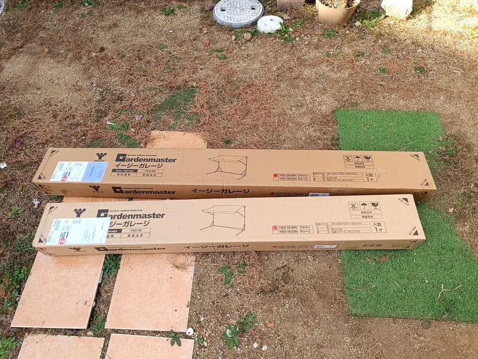

開梱にはこの前買ったダンボールカッターが活躍します。

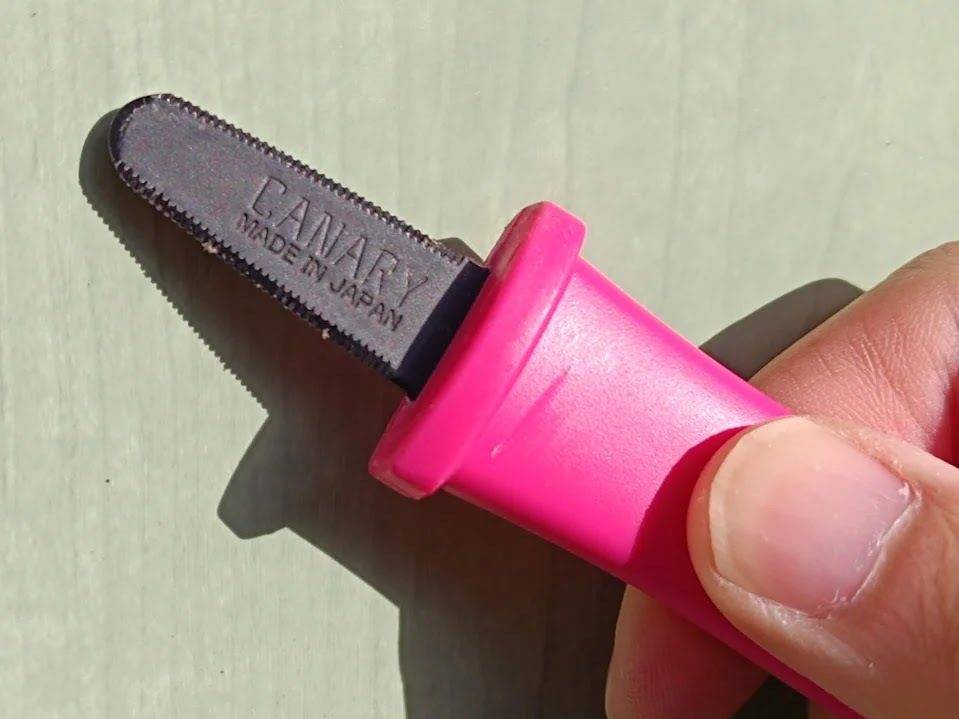



長手方向に貼られたテープをサクッとカット。

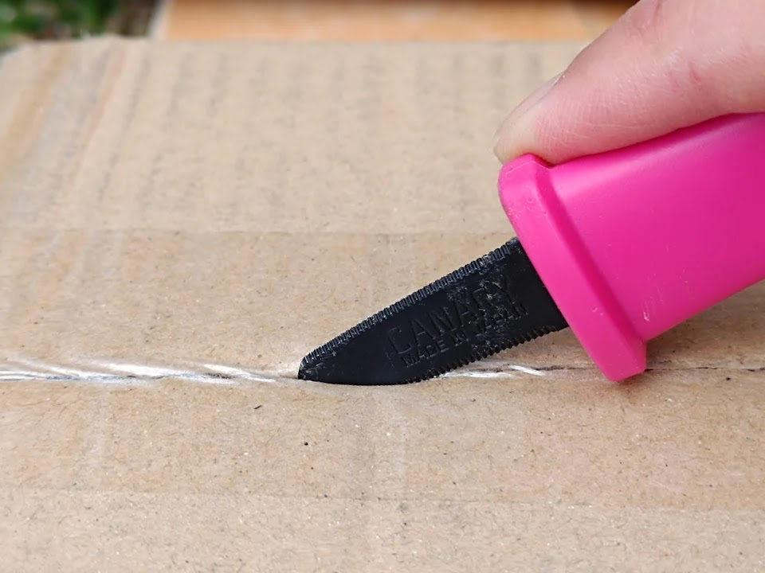

1台用の箱の中身です。パイプがたくさん入っています。

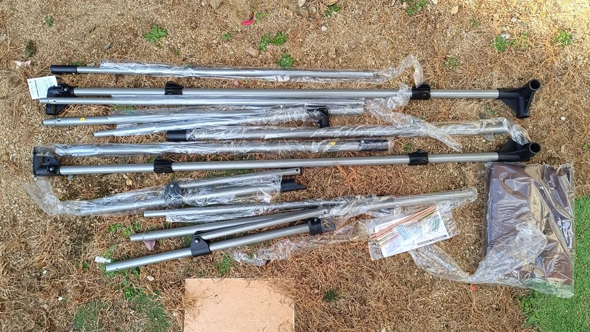

組立用のねじと、地面に固定用にアンカーが付属しています。ナットが入っていたのでボックスレンチを用意しましたが後述の通り不要で、工具はプラスドライバーのみでOKでした。

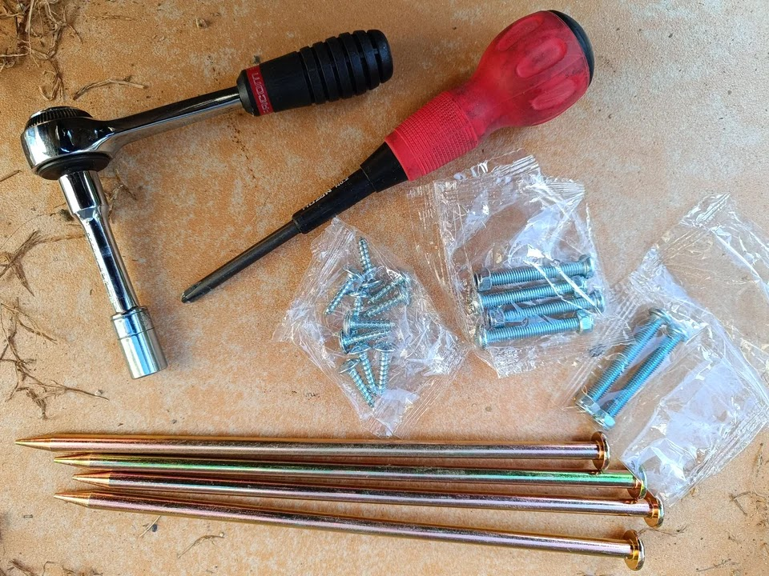

説明書どおりに特に迷うこと無く組み立てできましたが、簡単に手順も書いておきます。

パイプをねじで連結します。

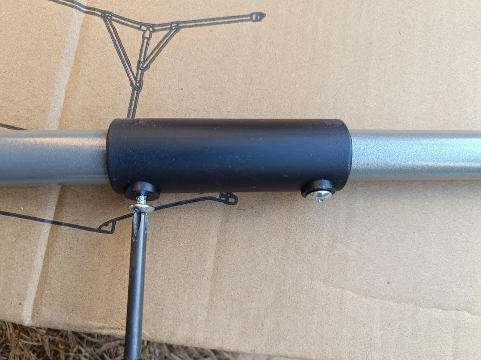

リンクの部分もねじで連結します。鉄パイプに穴があいており、そこにねじを入れて固定します。

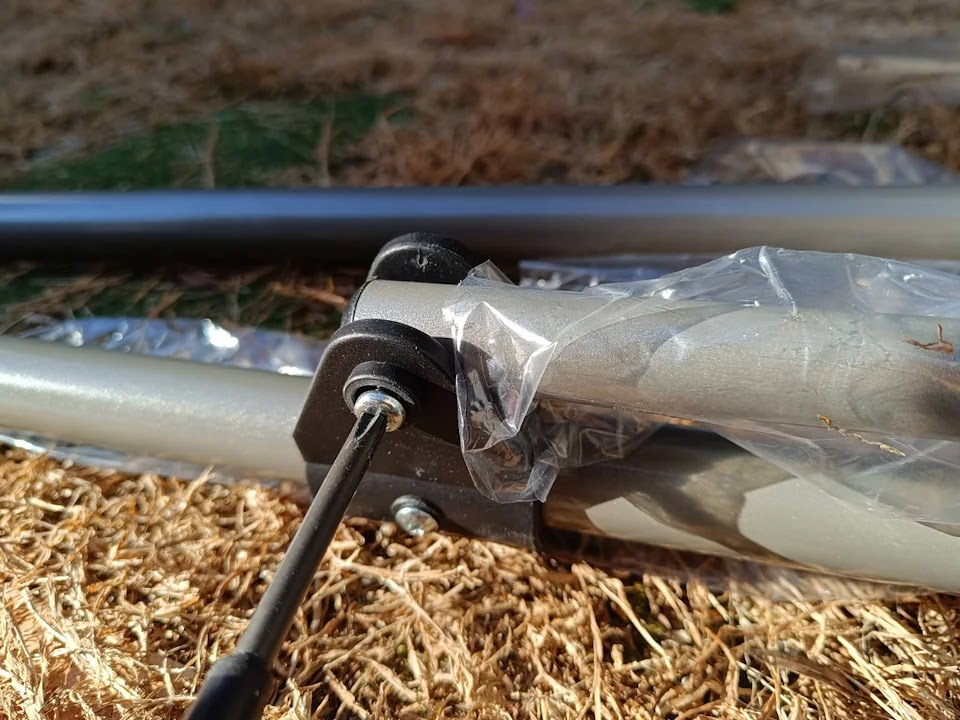

樹脂部品に六角形のナット用の溝があり、周り止めになっているのでナットを固定する工具は必要ありません。反対側からプラスドライバーで閉めていくだけです。

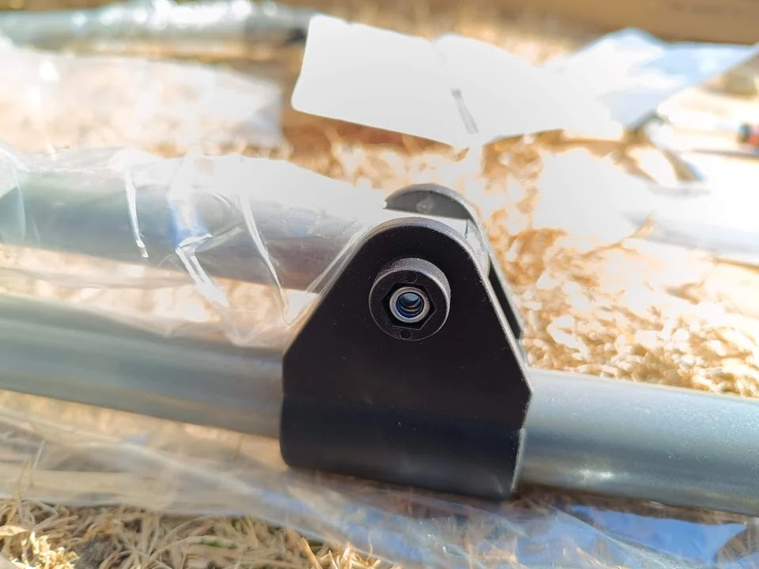

両サイドのパイプが組み立てできました。

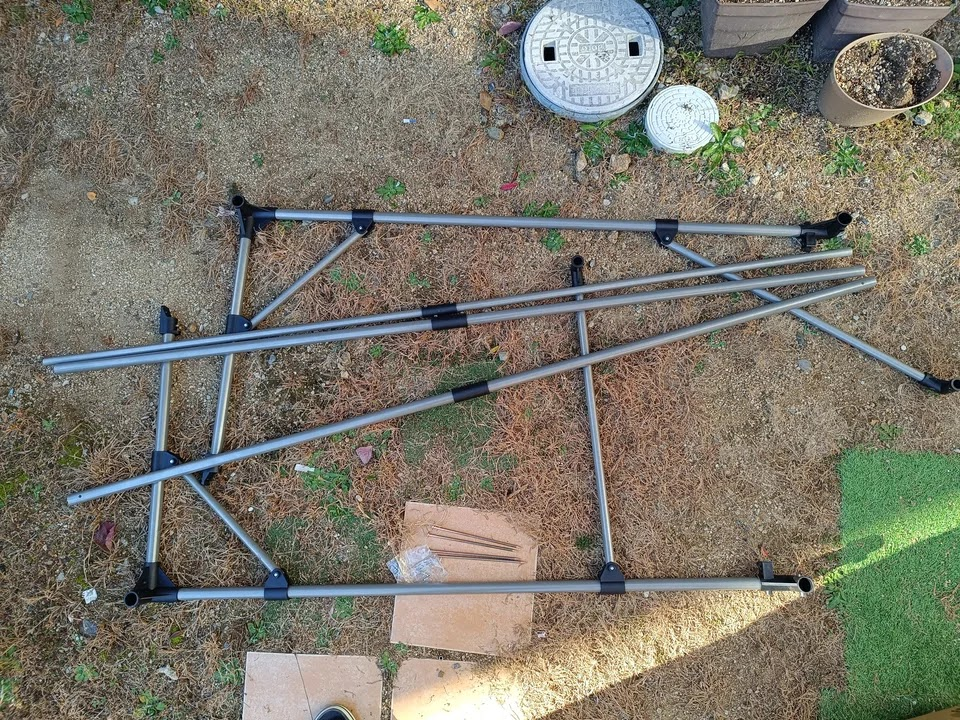

両サイドを1本のパイプで連結し、立てたところです。

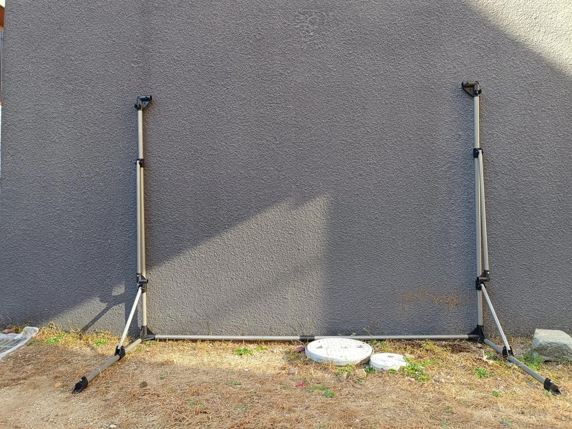

上側も両サイドをパイプで接続したら屋根の布をかけて完成です。

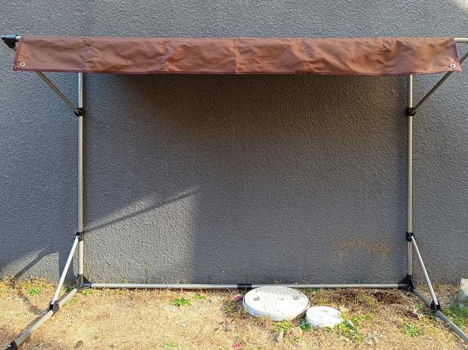

全体はこんな感じです。奥行きは自転車の幅に対してあまり余裕は無い感じです。

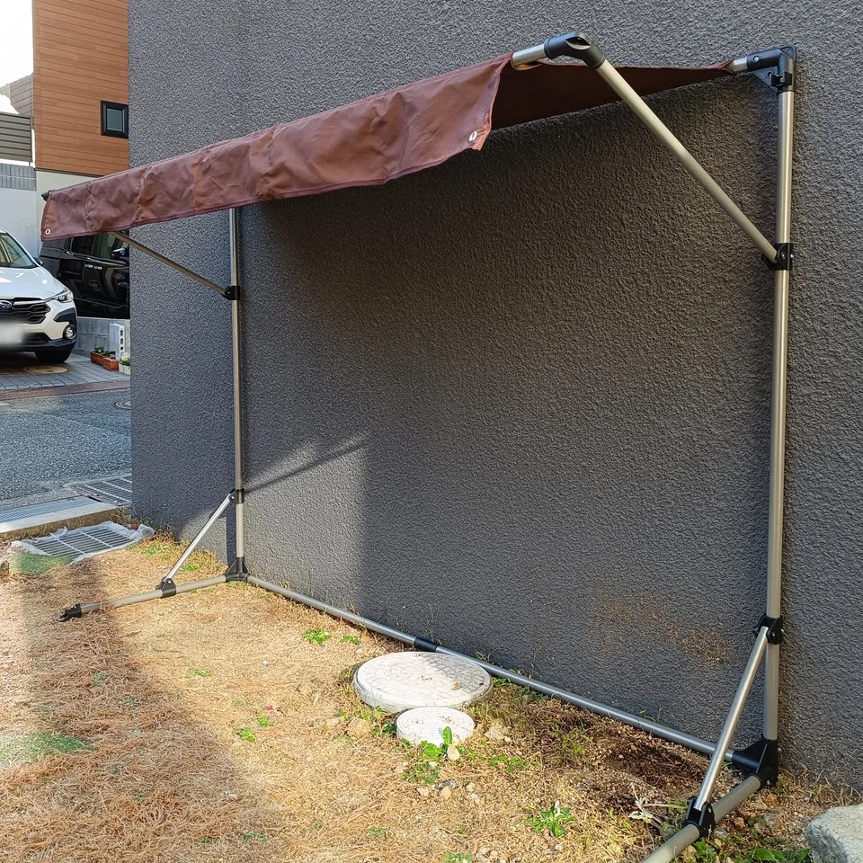

自転車を置いてみました。電動アシスト自転車にチャイルドシートが付いていると高さ干渉するかしないかというギリギリです。長手方向も奥行きももう少し大きかったほうがいいなと思いました。

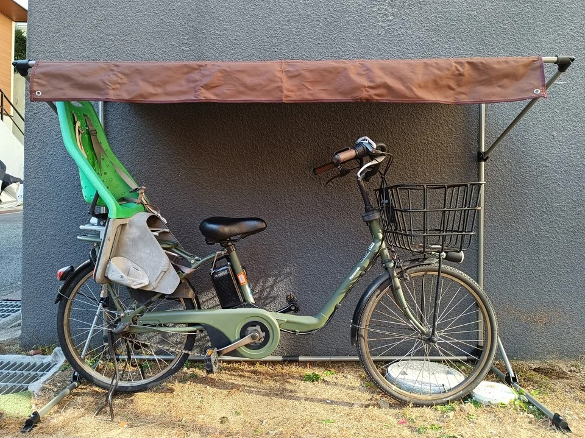

こちらは3台用です。奥行きだけでなく、高さも1台用に比べて高く、自転車も小さいので4台置いて余裕がある感じですね。

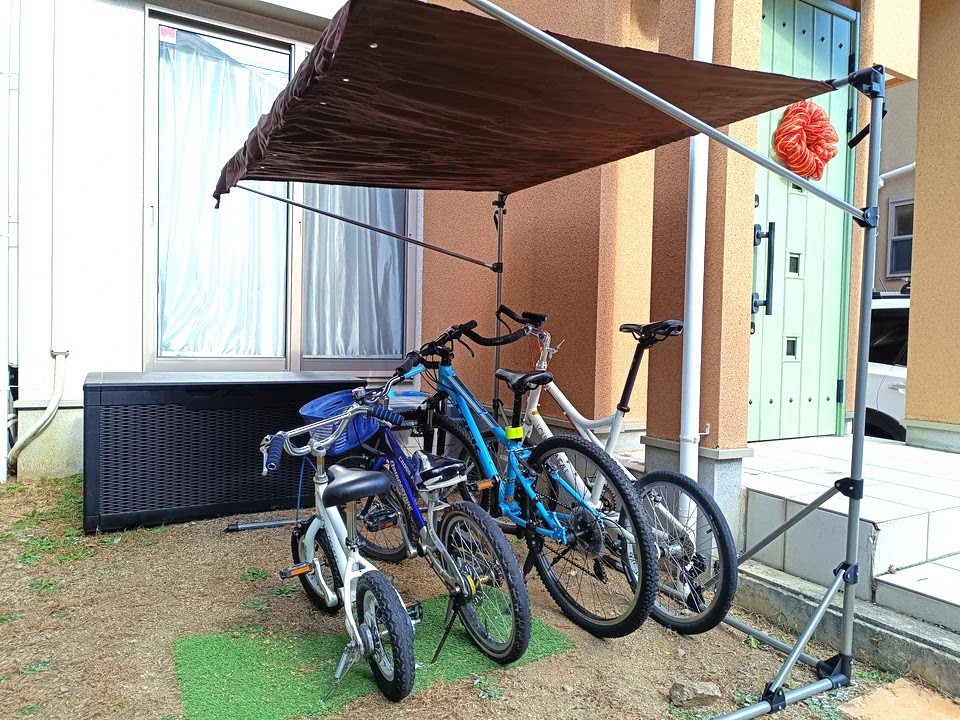

屋根型サイクルガレージを2個設置した庭です。自転車に占領されてしまった感がありますが、これで雨を凌げるようになりました。

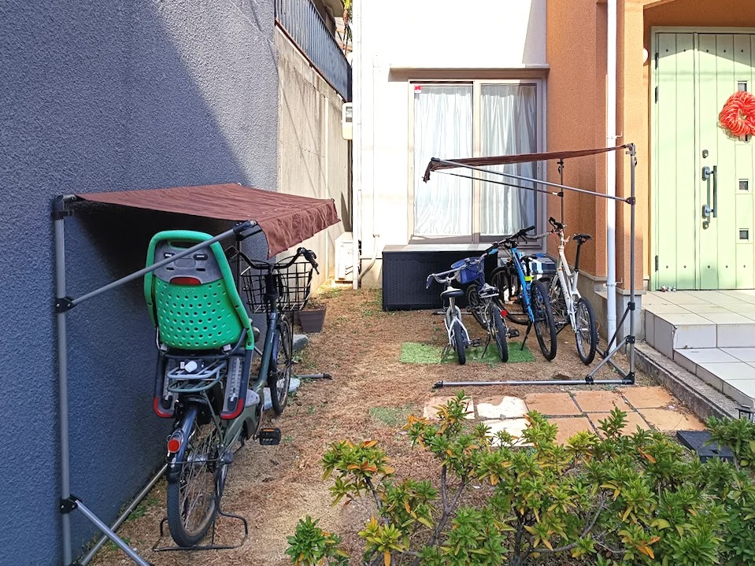

このあとアンカーを打ち込みで固定したのですが、強風にはちょっと心もとない気がします。屋根を支える斜めのアームを垂直に上げて屋根を畳めるようになっていますが、上げても横風をもろに受けてしまいそうなので台風接近時は素直にバラす必要がありそうです。

## まとめ

屋根型サイクルガレージを庭に設置しました。組み立ては簡単で、横からの雨は防げないのは想像通りですが、自転車を屋根の下に置くだけで出し入れが簡単なメリットは実感できます。錆止めスプレーなども併用して錆びの進行を抑えられたらと思いながら使っていきます。
