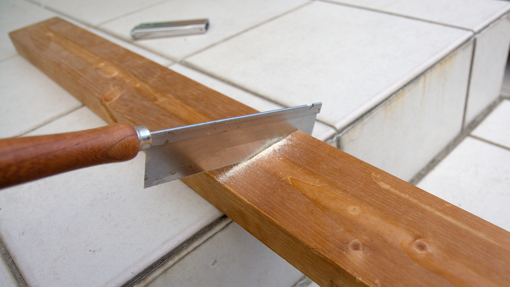

---
categories:
- 自転車
- bike
date: "2025-02-15T23:43:02+09:00"
draft: false
images: 
- images/DSCF4142_02.jpg
summary: ロードバイクを部屋置きする際、少しでもコンパクトにならないかとオーストリッチの輪行袋からヒントを得た方法を紹介します。
tags:
- 自転車室内保管
- オーストリッチ
- Madone2.1
title: ロードバイクを部屋でコンパクトに保管する方法
js: "js/paad.ts"
---

ロードバイクを部屋置きする際、少しでもコンパクトにならないかとオーストリッチの輪行袋からヒントを得た方法を紹介します。

## ロードバイク保管の悩み

ロードバイクはその高級さ（お値段の高さ）とママチャリに比べてデリケートなフレーム、部品を使用しているため屋内保管が基本となります。ロードバイクを趣味とするおそらくほとんどの人が「保管場所をどうするか？」と悩んでいる、悩んだことがあるかと思います。

ガレージやロードバイクが入るだけの密閉できる物置がある場合は良いのですが、そういった恵まれた環境の無い人は部屋に置くことにならざるをえません。そして巨大な自転車を部屋に置いて家族から冷たい目で見られることになります。

## ミノウラ チェーンステイ／シートステイフック式スタンド

今まで保管していた方法は、ミノウラのチェーンステイに引っ掛けるスタンドを使って倒れないように普通にロードバイクを置いていました。

これだと1,660×1,030mmでまあロードバイクそのままの大きさです。6畳間で異彩を放っています。

ロードバイクを立てるスタンドや、壁掛け、ポールで吊るものもありますが、壁に大きな穴をあけるのは嫌なのと、縦置きや吊るのは倒れた際にあぶないので普通に置くタイプのスタンドを使用しています。

## 後輪を外して保管

後輪側はスタンドでフレームを支えているので、まず後輪を外してみたらコンパクトになるのでは？と思いやってみました。

1,410×1,030mmと長手方向に250mm短くなりました。まだまだ大きいですね。

## 両輪を外して保管

前輪も外し、フォーク先端で支えてみます。やや不安定ですがこの状態でも置くことができました。

1,320×910mmと長手方向は結局ハンドルが前に伸びているのでそれほど変わらず、高さはやや低くなりました。高さはまあ少し変わったくらいではスペース活用もできないのであまり意味がありません。

## オーストリッチエンド金具を使用したDIYスタンド

さて、ここでコンパクトに保管、収納できるようなものが無いか調べていたところオーストリッチの輪行袋がロードバイクをコンパクトに収納、輪行でき評判が良さそうです。

これを買えば目的達成できそうですが輪行するわけでもないので袋は不要なのと、置くことが目的なのでバッグで常に持つことを想定した製品では倒れそうな心配があります。

この輪行袋の肝となるエンド金具を使い、エンド金具をベースに固定することで安定したスタンドにできないかと考え、DIYでスタンドを自作してみます。

オーストリッチの輪行袋用エンド金具を購入しました。¥1,500くらいなのでここは自作せず素直に買いました。クイックリリースも付いてます。

余っていた2×4の端材を400mmにカットします。

エンド金具に2つ穴があいているのでそれを利用してコーススレッドでエンド金具を2×4材に固定します。コーススレッドはシンプソン金具を固定するためのなべ頭のものを使いました。自転車を立てる際にハンドルを回すので少し重心がセンターからずれるため、エンド金具はオフセットさせた位置に取り付けています。

エンド金具の説明書通りにチェーンステーとだいたい一直線になるようにエンド金具をクイックリリースで固定します。

自転車をひっくり返してエンド金具とシートを接地面にしてハンドルを90°回して自立させるとこうなります。2×4材があるためすこし揺らした程度では倒れずそれなりに安定して置くことができました。1080×960mmとかなりコンパクトになりました！

空いたスペースに他の物を置いてこんな感じになりました。やっぱり自転車を置いた部屋は物置きになってしまますね（汗。

## まとめ

コンパクトな輪行袋で定評のあるオーストリッチのエンド金具を使うだけでかなりコンパクトにロードバイクを部屋置きできました。コストもエンド金具代¥1,500くらいでお手軽にできるので既製品のスタンドに不満がある方はぜひ試してみてください。


