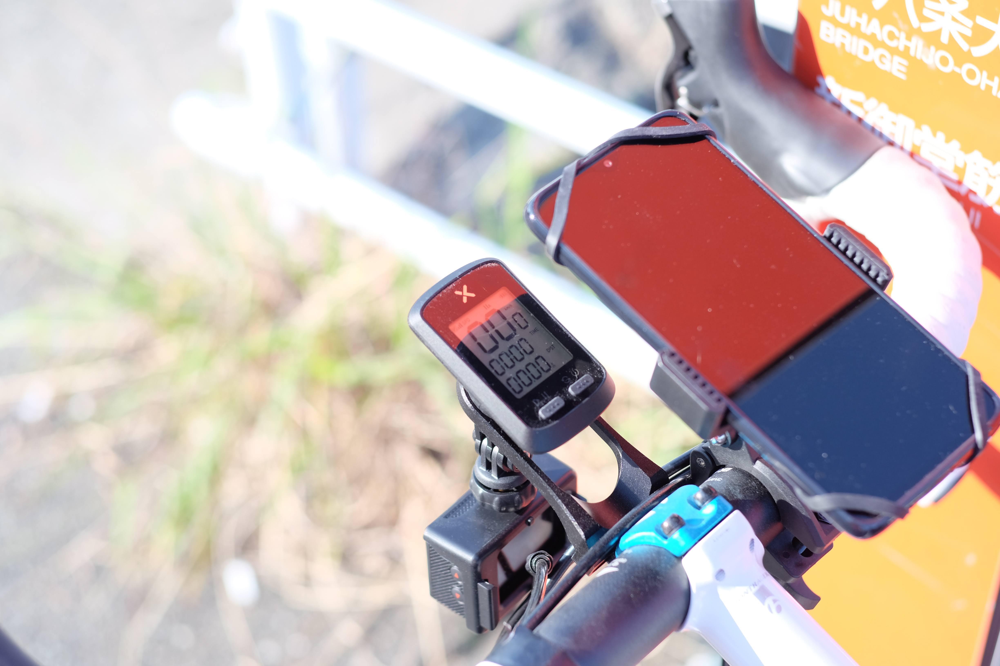
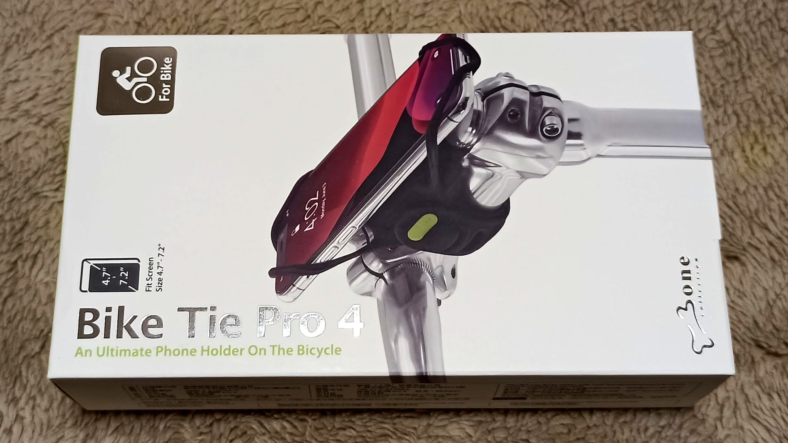
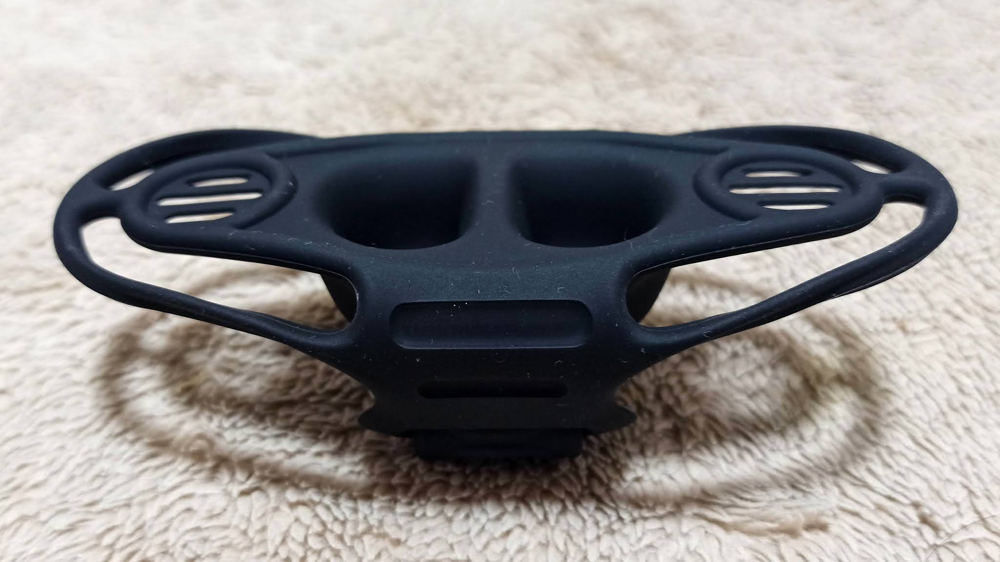
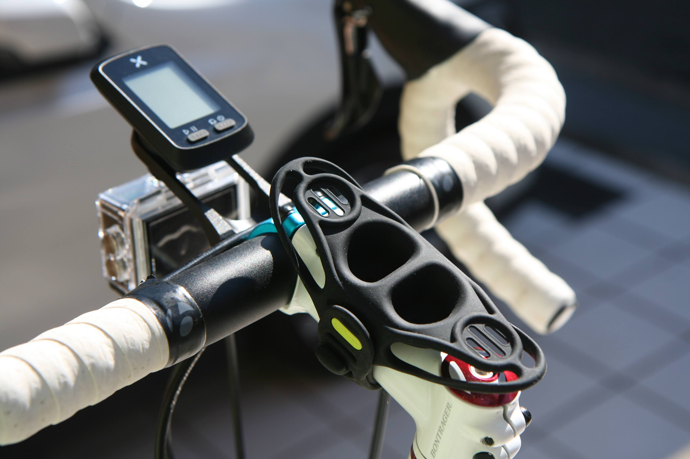
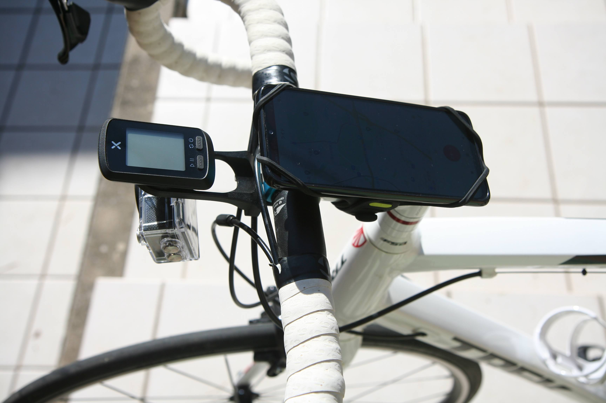
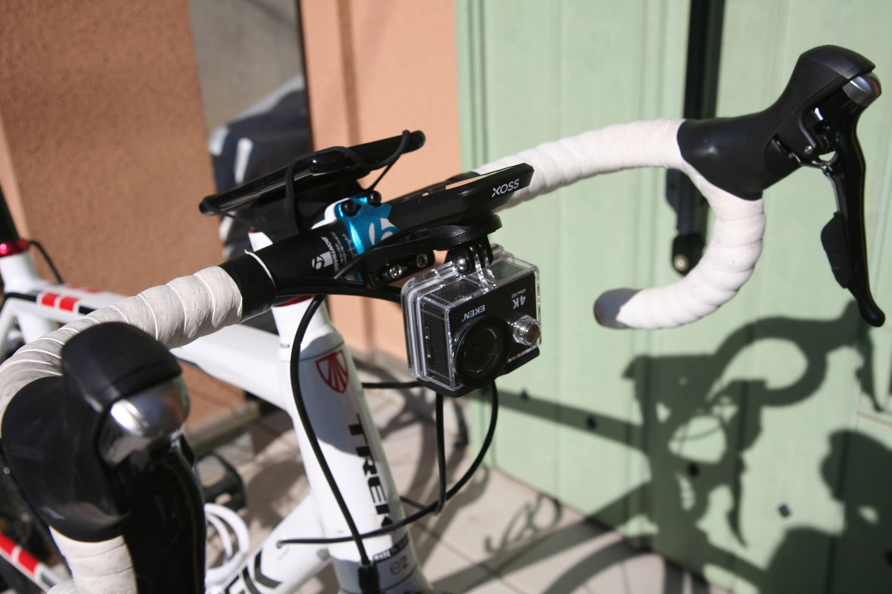
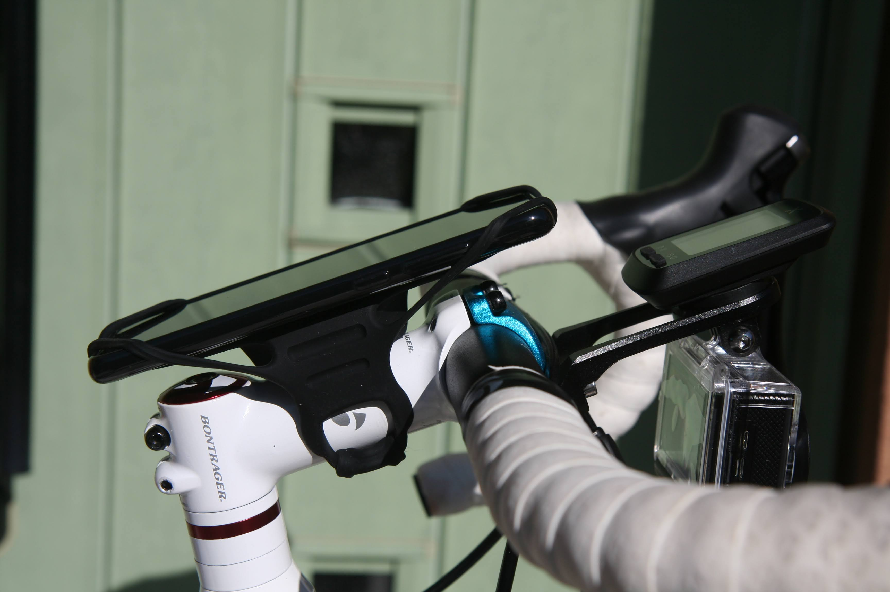
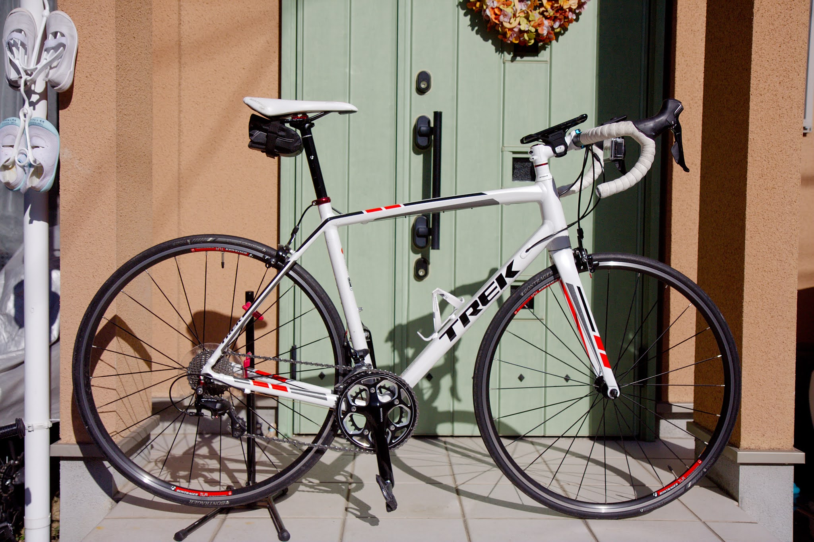

---
categories:
- 自転車
- bike
date: "2025-02-15T23:43:01+09:00"
draft: false
images: 
- images/IMG_5273.JPG
summary: 手触りの良いゴムで自転車のステムに固定できるスマホホルダー、BoneのBike Tie Pro 4を購入したのでレビューします。
tags:
- スマホホルダー
- Madone2.1
title: スマホマウント Bone Bike Tie Pro 4
js: "js/paad.ts"
---

ロードバイク TREK MADONE 2.1
に安いスマホホルダーを付けていましたが、しばらく使う中で不満が出てきました。

取り付けた際は下の写真のようにいい感じだと思ったのですが、実際に走ってみると大きく3点、微妙な点を感じました。

1.  球面ジョイントが走行中の振動で動いてしまい、スマホが傾いてしまう
2.  クランプがブレーキワイヤーと干渉し無理やり付けているがブレーキワイヤーに力がかかり気分的にあまりよろしくない
3.  センターに XOSS の GPS
    サイコンを付けたが、スマホがセンターまで来てしまうので微妙に位置がかぶる

ということで、これらを解消するために可動部無しで、ステムかトップチューブにマウント
(GPS サイコンはブラケットで前に出しているので干渉しない)
の製品を探してみました。

ステムマウントはあまり種類が無く、バンドでとめるもの、スマホ側に粘着テープでワンタッチマウントを取り付けるものなどがあり、トップチューブマウントはさらに種類が少なく、ほとんどがバッグと一体型でバッグの上面にスマホが入るものでした。その中で¥2,500程度と、今使っている千円未満のものと比べると少々高いですが、Bone
というメーカーの Bike Tie Pro 4 というものがなかなか良さそうです。



ちなみに、「pro」が付かないモデルは円筒状のハンドルバーに固定、「pro」モデルはステムに固定という違いがあるようです。

Bike Tie Pro 3 という旧型、5 と新製品も出ていますが、あまり大きな違いはなさそうですね。



早速ポチり、届きました。箱が妙に高級感を出しています。

全体がシリコンゴムで可動部が無く、ズレる心配がありません。お椀のような不思議な形です。

早速取り付けてみました。取り付け方はバンドをステムにぐるっと巻くだけです。

スマホを付けてみます。ハンドルバーにマウントしているものが無くなり、全てアクセサリがセンター一直線にあるのでだいぶスッキリしました。

前方からの写真です。センター前方のブラケット下にアクションカメラ、上に
GPS サイコンがあり、奥のステムにスマホの構成です。

真横から見るとこんな感じです。

自転車全体です。

安定して固定できているし、だいぶスッキリして見た目も良いです。1点だけ心配事は、スマホ裏面が覆われているため、裏面に指紋センサーがある場合は、指紋によるロック解除ができなさそうです。



スマホで写真を取るなど、頻繁に脱着したい場合は、下記モデルがよいかもしれません。


