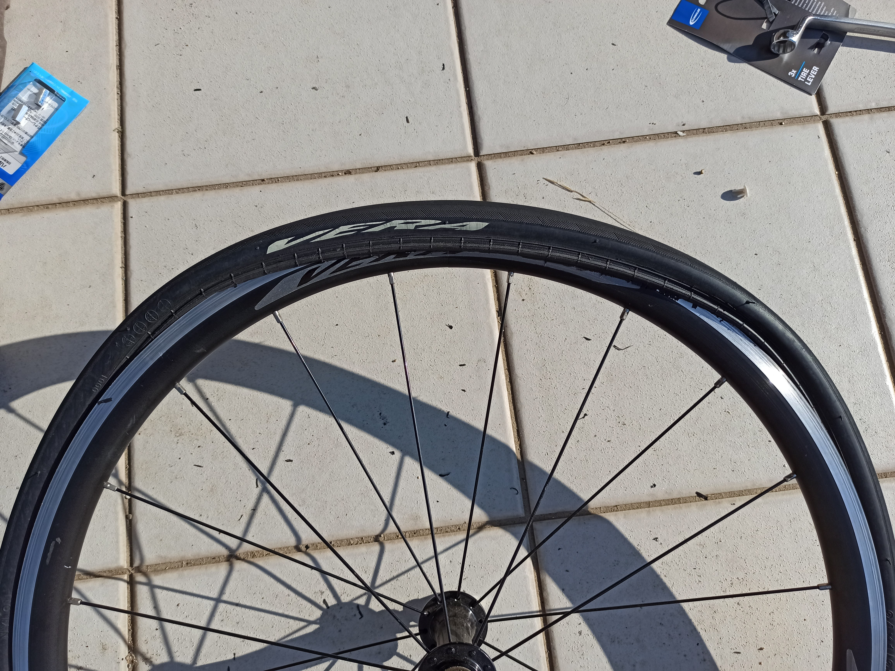
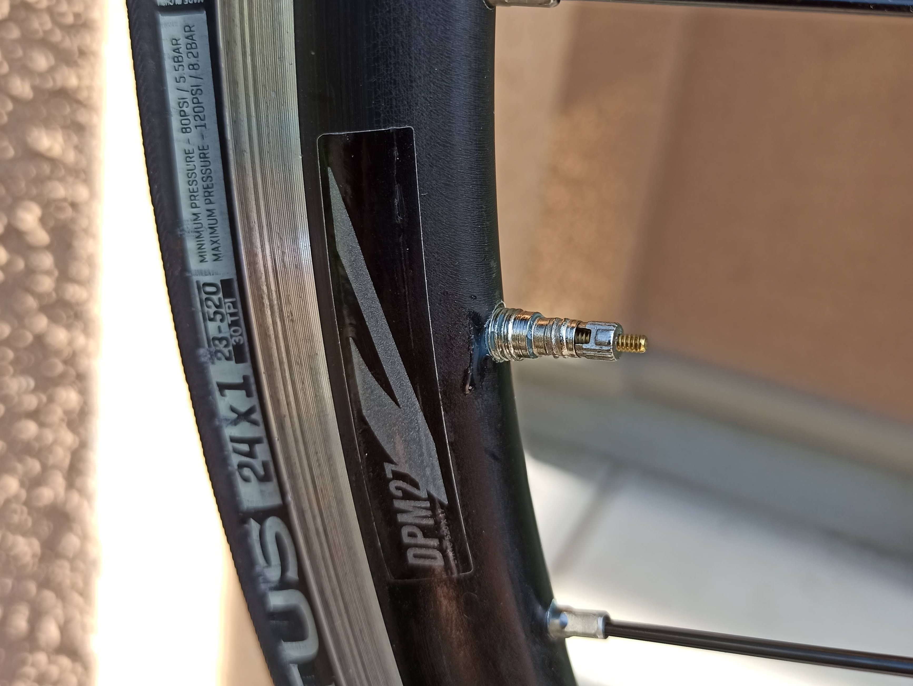
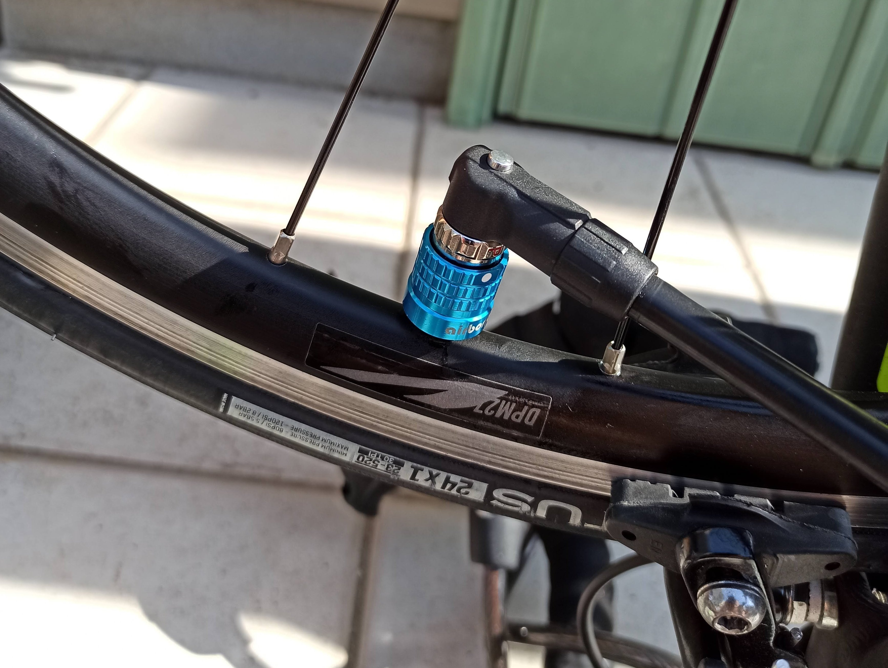

---
categories:
- 自転車
- bike
date: "2025-02-15T23:42:47+09:00"
draft: false
image: images/IMG_20200621_074453.jpg
summary: 子ども用ロードバイクが頻繁にパンクするため、パンク防止としてチューブに注入する液体のパンク防止剤、EVERSのスーパーシーラントを試しました。
tags:
- パンク
- パンク防止
title: パンク防止剤 EVERS スーパーシーラント
js: "js/paad.ts"
---

[Fuji ACE 24
の前輪パンク修理](http://www.bchari.com/2020/02/fuji-ace24.html)
をしましたが、またパンクしてしまいました。子供が遊びに行くときに使うような使い方なので、エア圧の管理もあまりできていなく、過酷な使い方をしているからと思いますが、幅1インチのロード用タイヤはやはりパンクしやすいため何とかならないかと思っていたところチューブに注入する液体のパンク防止剤があったので使ってみました

## 用意したもの

-   タイヤレバー SCHWALBE の3本セット
-   チューブ SCHWALBE 24X0.75-1.10
-   バルブコアツール Panaracer
-   EVERS スーパーシーラント
-   めがねレンチ 15mm
-   圧力ゲージ
-   フロアポンプ

タイヤレバーは Amazon で妙に評判の良い SCHWALBE
をチューブと一緒に買ってみました。このタイヤレバー、注文最低数量 2
セットという謎の条件が付いていて 6 本保有しています。チューブは前回
Panaracer
を使いましたが、このチューブはバルブコアが外れないのでパンク防止剤を入れることができないため、バルブコアの外れる
SCHWALBE を購入。バルブコアを外すためのツールも買いました。



## チューブ交換

ハブナットを弛めて前輪を外します。

タイヤレバーを使ってビードを外していきます。使い勝手は普通ですが、取り付けの際にこのタイヤレバーの真価が発揮されます。

チューブを抜きました。

上が SCHWALBE 、下が Panaracer
のバルブ部分です。写真ではよくわかりませんが、 SCHWALBE は 2
段になっているねじ部の先端側が D
カットしてありここに工具をかけて回すと外れるようになっています。

前回はホイールからタイヤを完全に外さず、隙間からチューブを入れましたが、今回は横着せずタイヤを外して少し空気を入れたチューブをタイヤの中に入れ込んでからホイールに取り付けます。

ビード片側をリムに入れた状態です。ここから手前側もビードをリムに入れていきます。

手でギュッギュッとビードを上げてリムに入れます

最後がぱっつんぱっつんになります。

ここで SCHWALBE
タイヤレバーの出番です。タイヤを外すのと反対側にクリップのようになった部分を使います。

ビードが入らなくなる境界あたり両側にこんな感じでクリップのようにタイヤレバーを留めます。

ここからセンターにタイヤレバー先端をリムにかけてビードを押し上げます。

ぐいっと。。。

パコンと気持ちの良い感じに嵌りました

正直、このタイヤレバーはあまり期待していませんでしたがかなり使いやすく買って良かったです。

## バルブコアを抜く

パンク防止剤を注入するため、バルブコアを抜きます。

Panaracer
のバルブコアツールです。これの良いところは、ツールとして使う部分の反対側がねじが切ってあり、バルブキャップの代わりに付けられることです。見た目も良いのでちょっとしたアクセサリーになります。

片側が長穴になっています。

こんな感じでバルブコアの二面幅に長穴部分をかぶせます。

手で回してみますが、、、固くて回りません。結局、このツールは六角形なので
7mm
のレンチをかけて大きなトルクで回します。しかしこんなに大きなトルクで回したらチューブがねじ切れてしまいそうなので、バルブ本体側はバイスクランプで掴み恐る恐るレンチを回します。

無事緩んでバルブコアが抜けました。

バルブコアツールを買わなくてもラジペン 2
本でつまんでひねるで十分だと思います。専用ツールと聞くと面白半分で買ってしまいました。バルブキャップとして見た目は良いので良しとします。

## パンク防止剤を入れる

EVERS スーパーシーラント です。タイヤ 1 本に 60ml 、これまるまる 1
本分入れます。結構量多いな。24
インチなので少なくて良いのでしょうが余らせても利用価値が無いので全部入れることにします。

容器の先端をはさみで切って先程バルブコアを外した部分から注入します。説明書によると斜め下向きで入れるとのことです。

全部入れました。少し漏れてエイリアンの血液のように垂れてしまい気持ち悪いです。

バルブコアを取り付けて締めます。

ホイールをくるくる回してシーラントを全体に行き渡らせます。

空気を入れます。

バルブコアツールはこのようにバルブキャップとして付けておきます。これでバルブコアを外したいと思ったときはいつでも、、、、ってロードバイクのバルブコア外すのなんて今回が初めてで滅多にこんなこと無いですよね。

最後にまたホイールをくるくる回して完成です。

## 効果は？？

これがパンクを防いでくれたかは、なかなか確かめような無いですね。ただ、通勤用の
LGS-MV1 には、SLIME
のパンク防止剤が入ったチューブ（アメリカで購入。多分以前は日本でも売っていたが今は売っていないと思う）を使っていて、一度スローパンクしたものが数日空気を足しながら乗っていたらパンクが直った経験があるので一応、効くこともあるのだと思います。

## 良いところといまいちなところ

その後、1年以上使った感想です。

### 良いところ

パンクは無くなりました。まあ、普通は1年位パンクしないと思うので効いているのか微妙ですが、目標としていたパンク無しはいちおう達成です。

### いまいちなところ

空気入れが大変です。仏式バルブの場合、空気を入れるためには先端のねじを回して弛め、バルブコアが動くようにしなければなりません。空気を入れる際にスーパーシーラントが少し漏れ、ねじを締めた後にねじ部にシーラントが塊るため次に空気入れる際にはラジオペンチでねじを弛める必要が出ました。

米式バルブや英式バルブであればねじは無いため問題ないのではと思います。ということでバルブ先端ねじが固着し大変だったので1年ちょっとでチューブ交換してしまいました。


