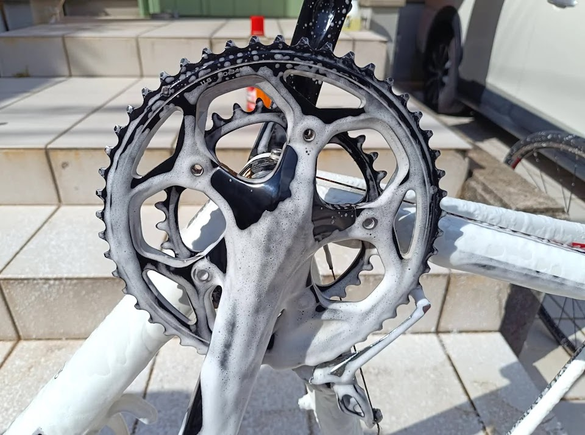
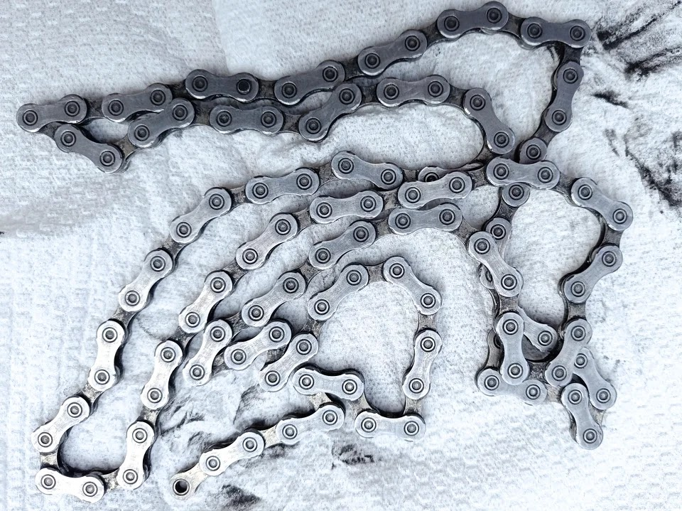

---
categories:
  - 車
  - 自転車
  - bike
date: "2025-02-15T23:44:24+09:00"
description: ロードバイクはきれいな状態で乗りたいものですが、洗車するのは億劫です。そんな洗車作業が楽に、楽しくなるフォームガンをご紹介します。
draft: false
images:
  - images/0012.jpg
summary: ロードバイクはきれいな状態で乗りたいものですが、洗車するのは億劫です。少しでも楽に、そして楽しく洗車できないかとフォームガンを買ってみました。
tags:
  - フォームガン
  - 洗車
title: フォームガンで自転車を洗車してみた
js: js/paad.ts
---

ロードバイクはきれいな状態で乗りたいものですが、洗車するのは億劫です。少しでも楽に、そして楽しく洗車できないかとフォームガンを買ってみました。

## 高圧洗浄機とフォームガン

洗車を楽に、と思うとまず思いつくがケルヒャー、高圧洗浄機です。値段が高いのと音が大きいようなので日中限定になりそうです。

そこで目にとまったのがフォームガン。高圧洗浄機のように水圧で汚れを落とすことはできませんが、モコモコの泡で汚れを包みきれいになりそうです。

自分でポンピングする蓄圧式と電動式があり、もちろん電動式がよいのですが中華製と思われるノーブランド品はその見栄えやバッテリー大丈夫かなとか思うと物欲が動かず。ながら洗車から出ているスノーメンというアイドルグループのような名前のフォームガンがいい感じですが、これは高い。。。



まずはお試しの気持ちで手動ポンピングの製品を見ていると泡がきめ細かいと評判の
iK
のフォームガンを買ってみました。将来的に電動空気入れを接続して蓄圧できる
iK Foam Pro 2+
を選択。手動ポンピングにしては値段が高く、もう少し出せばスノーメンが買えましたね。。。



## フォームガンで洗車

自転車のホイールを外した状態です。遠目では汚れているかわからないですね。

ミッシングリンクを外してチェーンを取ります。

チェーンを付けたまま一度パーツクリーナーを吹いて拭き上げてますが、まだまだ汚いですね。

フォームガンでフレーム洗浄の前に、Az
のチェーンディグリーザーとペットボトルを使いチェーンを洗います。

ペットボトルにチェーンとディグリーザーを入れ、

シャカシャカ振ると泡だらけ。

ディグリーザーが真っ黒になりました。

スプロケット、クランクなどドライブトレインにもディグリーザーを吹き付けます。

スプロケットをふきふき。

さて、やっとフォームガン登場です。

ノズル先端です。紫色のノズルが付いています。

ノズル先端は交換できます。ノズルの中にはフェルトのようなフィルターが入っていて消耗品のようです。

付属品で交換用フィルターとオレンジ、緑色のノズルが入っています。泡と水の混合比率が変わるようです。とりあえず今回は、もともと付いていた紫色のノズルでいきます。

車の洗車に使っているSONAXのグロスシャンプーと水をタンクに入れます。比率は適当に、水750mlとシャンプー20ml程度でしょうか。40倍希釈のシャンプーなので少し濃すぎかな。

ポンピングです！30回シャコシャコします。疲れるかと思いましたが意外とポンピングは軽いです。

スプレー発射！想像どおりのモコモコ泡がまとわりつきます。

泡だらけになりました。

泡が少しずつ弾けて流れていきます。これで汚れごと流れている、、、はず。

ホイールも泡だらけにしてみました。気持ちいいですね。

掃除のしにくいハブ中央部分も泡だらけになるのがいいです。

軽くタオルで擦ってから最後に水をかけてすすぎます。

きれいになりました！といっても遠目からはあまりわかりませんね。

フレームはピカピカです。TREKマークに傷が入っているのは古いので仕方なしです。

スプロケットもピカピカです。これは、ディグリーザーの効果が大きいですが。

チェーンは凹んだ部分に汚れが残ってますね。ブラシでゴシゴシしないとだめみたいです。

ちなみに、車の洗車に使うとこんな感じです。写真は1回分、圧が無くなるまででこのくらいの範囲を吹けました。全体を洗うには何回もポンピング必要でさすがに疲れそうです。

## まとめ

自転車の洗車にフォームガンを使うとモコモコの泡で汚れが落ちた、あるいは落ちた感があり気分爽快、洗車が楽しくなります。自転車は車と比べると面積も少ないので手動ポンピングはそれほど苦になりませんでした。フォームガンに洗剤と水を混ぜてポンピングして、終わったらフォームガンを洗ったりしていると「洗車が楽になったか」は微妙で結局手間がありますが、それを含めてもこのスッキリ感を得られることで洗車のモチベーションがあがるツールとしてだけでも価値があるかと思います。


