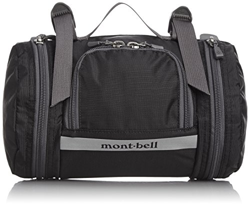
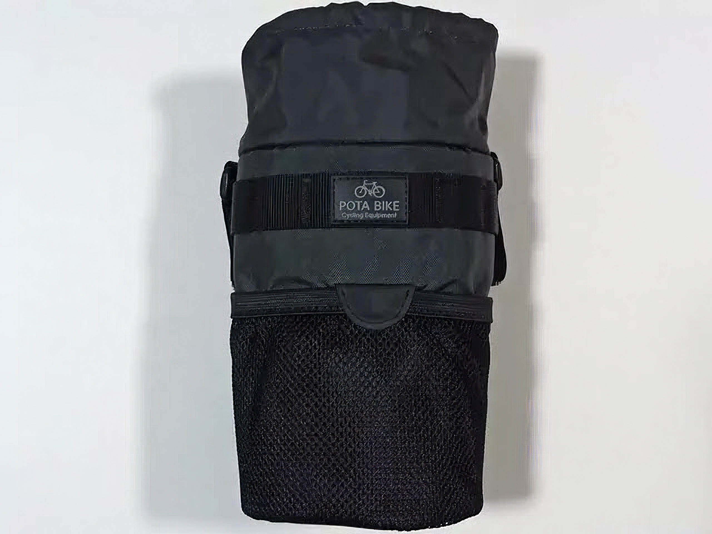
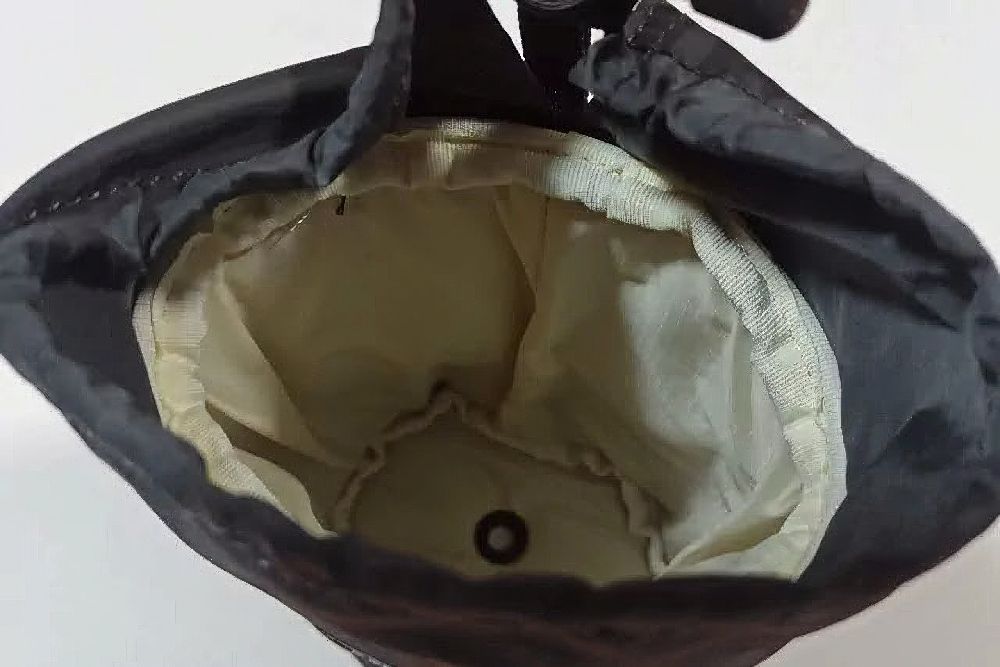
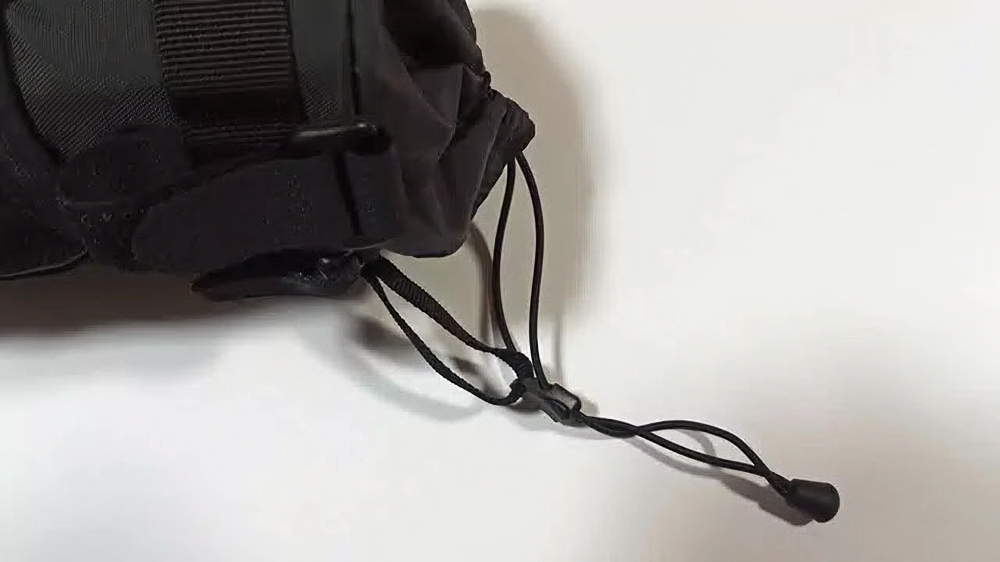
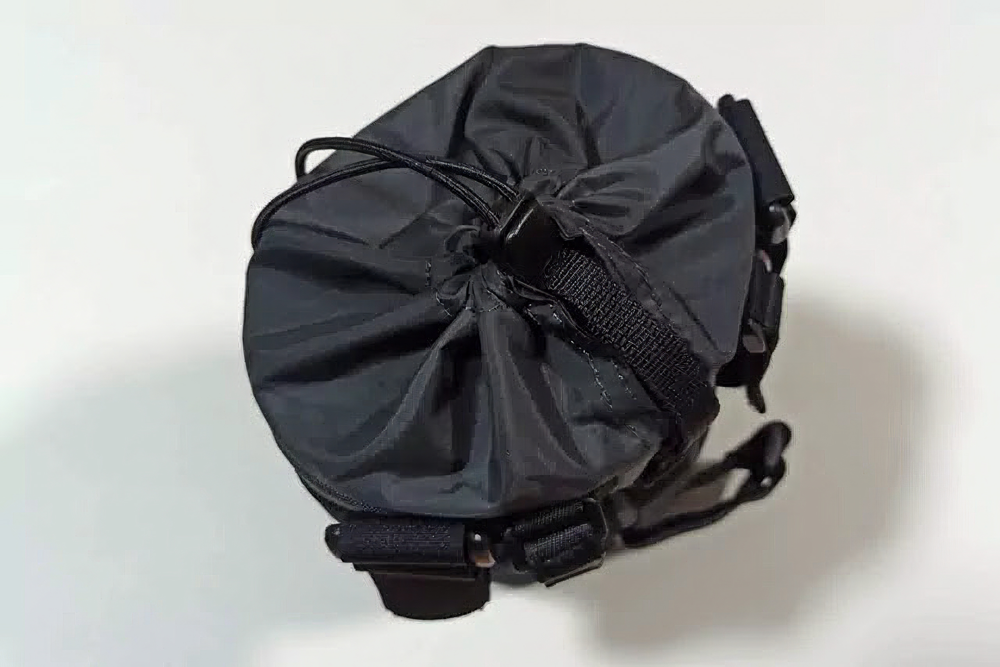
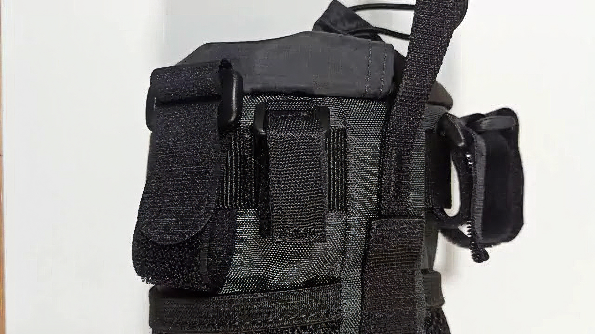
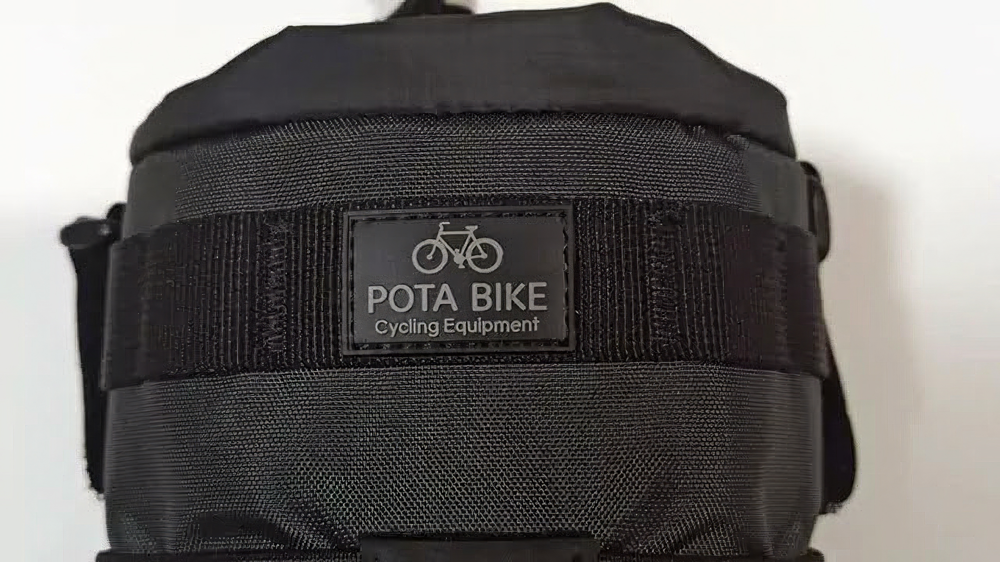
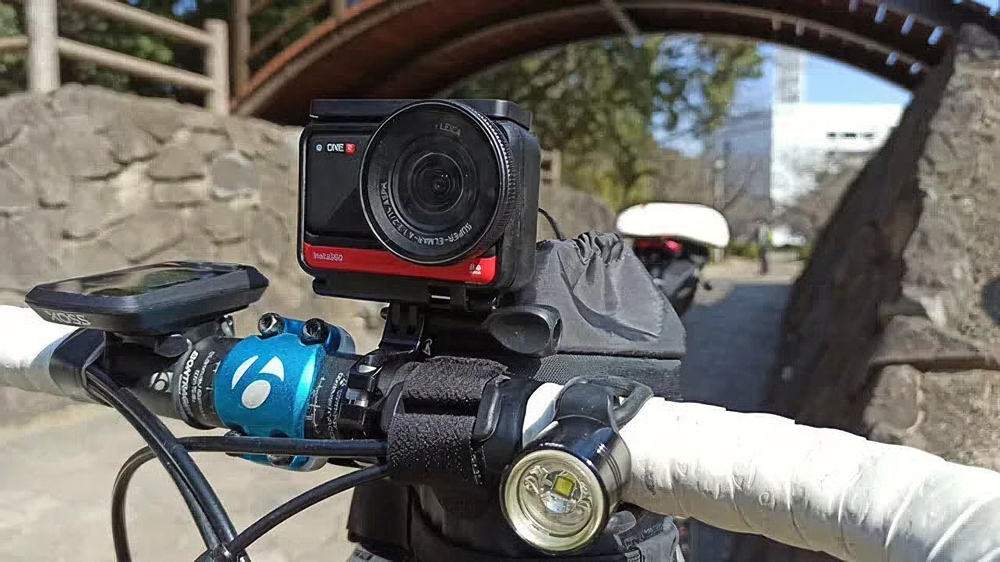
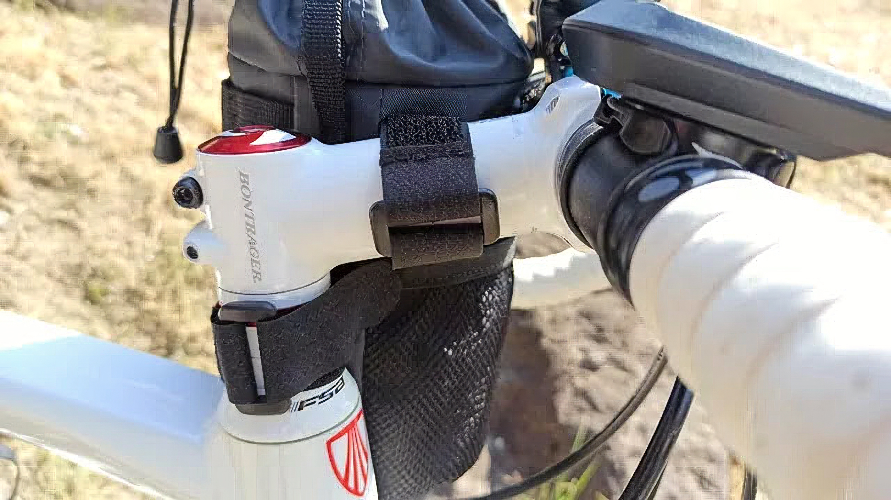
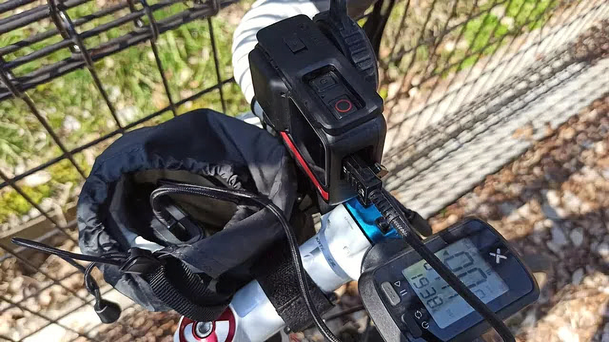

---
categories:
  - 自転車
  - bike
date: "2025-02-15T23:43:42+09:00"
description: ロードバイク用のバッグでハンドルとステムに固定することで中身が取り出しやすいと評判のPOTA BIKE(ポタバイク) ハンドルステムポーチ2をレビューします。
draft: false
images:
  - images/cpPSm.jpg
summary: 自転車に取り付けできるバッグを探してみたところ、POTA BIKE(ポタバイク) ハンドルステムポーチ2というのが評判が良いみたいです。アマゾンでポチって買ってみましたので使い勝手をレビューします。
tags:
  - バッグ
  - ポタリング
  - Madone2.1
title: POTA BIKE ポタバイク ハンドルステムポーチ2 レビュー
---

ロードバイクは軽くてスピードが出て何十キロ、時には百キロ越えと遠くまで出かけられるのが魅力ですが、荷物を収納することは考えられていません。はじめのうちはドリンクとスマホ、そして小銭くらいを持って出かけていましたが、だんだんと景色を撮ってブログに上げたくなったりしてミラーレスカメラを持って、アクションカメラをハンドルに取り付けたり、GPSサイコンを買ったりとしているうちに荷物が増えてきました。長時間ライドになるとモバイルバッテリーも欲しくなってきたりしました。

自転車に取り付けできるバッグを探してみたところ、POTA BIKE(ポタバイク)
ハンドルステムポーチ2というのが評判が良いみたいです。アマゾンでポチって買ってみましたので使い勝手をレビューします。

## ロードバイク用バッグの種類

ロードバイク用バッグには、ハンドルの前に付けるフロントバッグやフレームの三角形の部分に付けるもの、トップチューブの上や下、サドルバッグなどがあります。

フロントバッグだとモンベルのドラム型が評判良さそうですね。

アマゾンより画像引用

トップチューブバッグは容量が少なさそうだし、フレームの三角形の部分に付けるタイプやサドルバッグはすぐに開閉できないのが難点です。サドルバッグは既に付けていて、パンク修理用の道具を入れています。

調べているとPOTA BIKE(ポタバイク)
ハンドルステムポーチ2というステムの脇に円筒形で縦に取り付けるバッグが評判良さそうです。手元に近く、ドローコードで素早く開閉できそうなのでスマホとかモバイルバッテリーを入れておくのに良さそうです。

## POTA BIKE(ポタバイク) ハンドルステムポーチ2を買ってみた

早速買ってみました。まずは外観です。本当に筒といった感じです。POTA
BIKEのロゴはいい感じですが外観はなんというか、可もなく不可もなくといった感じです。

中です。撥水加工がしてありそうなナイロンっぽい生地で底に水抜きの穴が開いています。

このバッグの一番のポイント、ドローコードです。ゴムのように伸縮性のあるドローコードです。留め具が付いているのですが、これが別の紐でバッグと接続されているのがミソです。

表現が難しいですが、ドローコードを片手で引っ張るだけで、うまいこと留め具がスルスルと奥へ移動していき、このように袋を閉じることができます。留め具を引っ張れば開くので開閉を片手でできるので走りながらでも開閉可能なのがこのバッグ一番の利点です。

固定はマジックテープの輪が上下についており、上はハンドルとステム用に大2個＋小2個、下はカラム用に1個が付属しています。

POTA BIKEのロゴです。シンプルで好きです。

## ロードバイクへの取り付け

TREK Madone 2.1に付けてみました。ステム左側に固定した写真です。

ハンドルに1ヶ所固定しています。

残り2ヶ所のステム、カラムの固定はこんな感じです。

## 使い勝手は？

モバイルバッテリーとスマホを入れてポタリングに使ってみました。見た目よりかなり使いやすく、正直良い意味で驚きでした。

簡単に開閉でき、ちょっと信号待ちでスマホの地図をサッと確認したり、Insta360の充電が少なくなってきたらモバイルバッテリーを差して充電できたりと開閉が簡単で顔の真下にあるため中身もすぐに見えるのでとても使いやすいです。

## まとめ

POTA BIKE(ポタバイク) ハンドルステムポーチ2
はスマホやモバイルバッテリーなど、走行中に頻繁に取り出ししたいような物を入れておくのにおすすめです。

見た目よりずっと使い勝手が良く、久々に「とても良い買い物をした」と思えた商品でした。ポタリングの必需品になりそうです。
