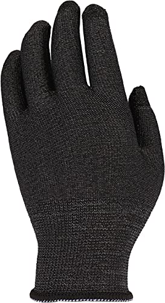
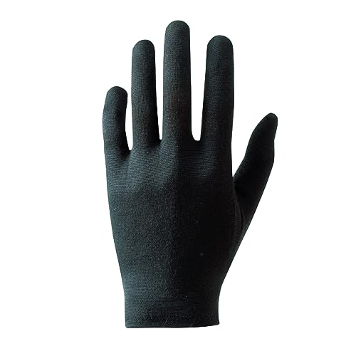
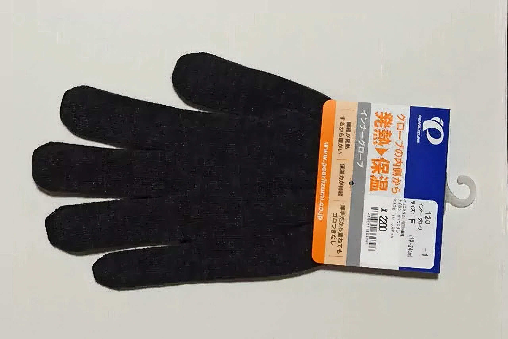

---
categories:
  - 自転車
  - bike
date: "2025-02-15T23:43:39+09:00"
description: 冬のサイクリングはとにかく指先が冷えます。そんなときに活躍するのがインナーグローブ。暖かく汗をかいてもドライで快適なパールイズミのインナーグローブ120をレビューします。
draft: false
images:
  - images/Xxjlv.jpg
summary: 冬のサイクリングはとにかく指先が冷えます。今年の冬はシマノの0℃対応のグローブを買ってかなり快適になりましたが、もう1ランク上の暖かさを求めて購入したパールイズミのインナーグローブ120をレビューします。
tags:
  - グローブ
  - 防寒
title: パールイズミ インナーグローブ レビュー
---

冬のサイクリングはとにかく指先が冷えます。今年の冬はシマノの0℃対応のグローブを買ってかなり快適になりましたが、もう1ランク上の暖かさを求めて購入したパールイズミのインナーグローブ120をレビューします。

## インナーグローブの種類

インナーグローブは上からアウターブローブをつけるので、薄手がよく、自転車用としては手に密着したほうが使いやすいので伸縮性のあるニットが候補になります。

薄手のニットというと100円ショップとかでも売っているような軍手の薄い版のような手袋ですが、速乾性のある化繊でヒートテックのような発熱性のあるものを探してみました。

### ユニクロ ヒートテック手袋

冬の定番ヒートテックの手袋です。タッチパネル操作対応で1,000円くらいという手頃なお値段です。これで全然良さそうですね。ユニクロのホームページにはインナー手袋として使えそうなニットタイプのヒートテック手袋はもう載ってなかったのでリンクは割愛します。

### おたふく手袋 BTタッチパネル対応 蓄熱インナーグローブJW-144

安くて品質の良いコンプレッションインナーで有名なおたふく手袋から、Body
Toughnessシリーズのインナーグローブです。蓄熱保温効果があるということですが、材質の「ポリエステル(蓄熱粉末練り込み)」という文言が気になりますね。Outlastのような個体化／液体化するカプセルで放熱／蓄熱するようなものでしょうか。お値段も1,100円程度と安いですね。

写真: Amazonより引用

### パールイズミ インナーグローブ120

最後は自転車アパレルメーカー、パールイズミのインナーグローブです。吸湿、発熱が持続する素材ヒートテックセンサー®を使用。ん？なんだかユニクロに似た名前ですが。タッチパネル操作も対応しています。お値段はユニクロ、おたふく手袋の約倍、2,000円超えと高級品です。見た目の違いはよくわかりませんが自転車用ということで期待です。ただし少し気になる点が。サイズラインナップがフリーサイズのみです。

写真: Amazonより引用

## パールイズミ インナーグローブ120を購入

3種類とも見た目、機能とも調べた限りでは違いがあまり無さそうですがここは自転車用として作られたパールイズミのインナーグローブ120を購入しました。

見た目はフツーです。

早速手にはめてみました。が、指が短い！ちょっと変な感じです。下の写真で青線が指の付け根のイメージです。ちなみに筆者の指は中指の付け根から先端まで85mmでした。指は長い方だと思います。

伸縮性があるのでアウターグローブをすると気にならないのでよしとしましょう。つけ心地はサラっとしていて速乾性がありそうでかつほんのり暖かく気に入りました。

気温1℃の早朝、自転車通勤で使用してみました。0℃対応を謳うシマノのWindstopper®
サーマル リフレクティブ
グローブを愛用していますが、インナーグローブ無しだとさすがにこの気温では指の第二関節から先が冷えて寒いです。

インナーグローブをすると、もちろん暖かくなります。ただ、ポカポカかというとそうでもなく、指先、爪あたりがやはり冷えますがインナーグローブをしていないよりは確実に暖かいです。

気温4℃〜10℃くらいでも使用してみましたが、汗で濡れることもなくサラッとしていて多少暑くても苦になりません。自転車用ということで速乾性能は高いのかもしれません（他を試していないので想像ですが）。

## まとめ

冬のサイクリングはインナーグローブがあると暖かさがアップします。指先の冷えを1関節分防寒してくれる、というイメージでした。パールイズミのインナーグローブ120は暖かく汗冷えもしなく性能は良いです。難点はフリーサイズで1サイズのみということ。総合的には満足ですがサイズ展開のあるおたふく手袋も試してみようかな。
