---
categories:
  - 自転車
  - bike
date: "2025-02-15T23:44:29+09:00"
description: 通勤用自転車ルイガノLGS-MV1は屋根のない外に置いていることもあり、錆が進行してきました。クランク軸の錆を錆の上から塗れる塗料、サビキラーで塗装し、錆びた鉄製ボルトをチタン製に交換しました。
draft: false
images:
  - images/002.jpg
summary: 通勤用自転車ルイガノLGS-MV1は屋根のない外に置いていることもあり、錆が進行してきました。クランク軸の錆を錆の上から塗れる塗料、サビキラーで塗装し、錆びた鉄製ボルトをチタン製に交換しました。
tags:
  - 錆
  - サビキラー
  - チタンボルト
  - LGS-MV1
title: 自転車の錆をサビキラーとチタンボルトで修復
js: js/paad.ts
---

通勤用自転車ルイガノLGS-MV1は屋根のない外に置いていることもあり、錆が進行してきました。クランク軸の錆を錆の上から塗れる塗料、サビキラーで塗装し、錆びた鉄製ボルトをチタン製に交換しました。

ルイガノLGS-MV1です。これまでいろいろ改造をしてきており、ハンドルはブルホーン、クランクはホローテック化し中国の安物クランクが付いています。

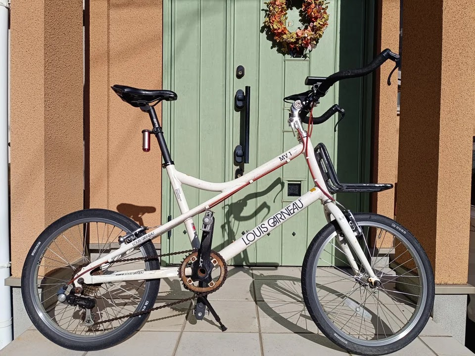

クランク軸とチェーンリング取付ボルトが盛大に錆びています。クランクはアルミ製なのですが、軸はメッキも塗装もされていない鉄むき出しだったので当然錆びてきますね。チェーンリング取付ボルトも鉄製で抹茶色でした。

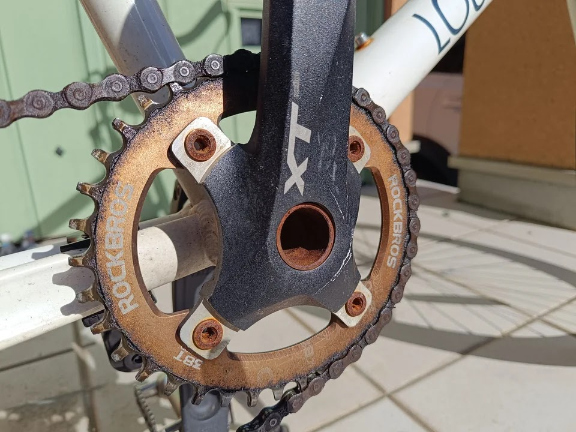

チェーンリングも茶色になっていますが、ここはアルミ製で塗装が変色して茶色になっているようです。

ハンドル取付ボルトも錆びてきました。以前ROVALメッキカバーというスプレーで塗装、常温亜鉛メッキと間違えて、亜鉛メッキ効果は無いものを塗装していたのでやはり錆びてきました。

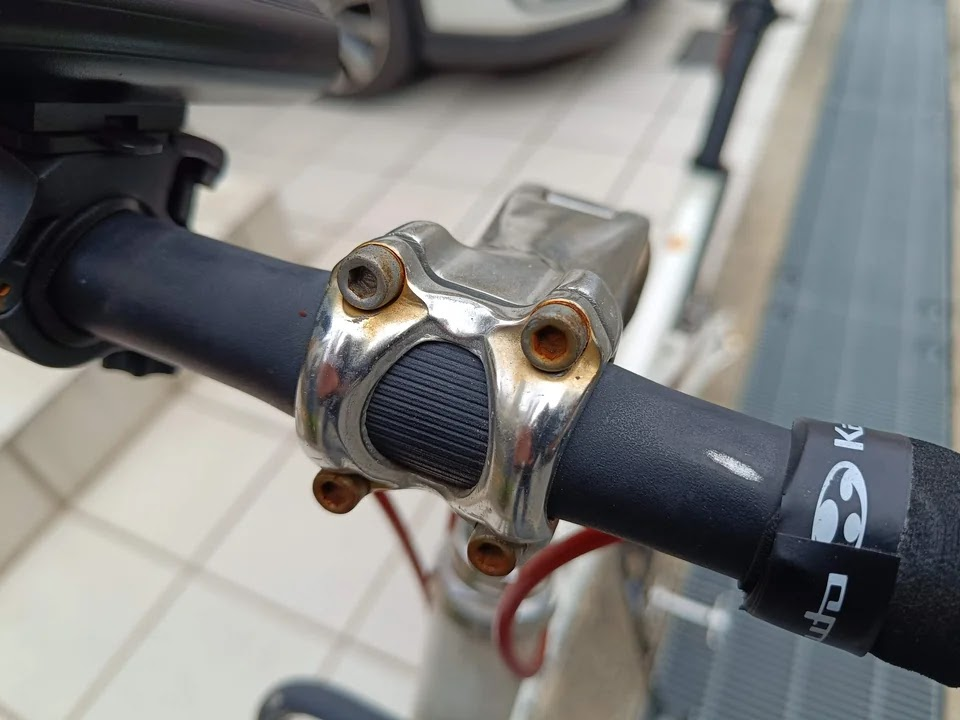

## サビキラーを塗装

まずはクランク軸の錆から。錆の上から塗装でき、赤錆から黒錆へ転換させる効果もあるサビキラーという製品を買ってみました。

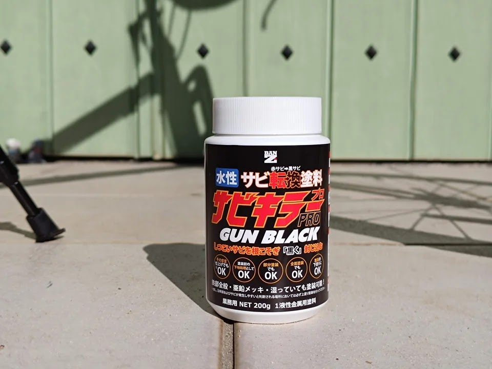



錆の上から塗装できる、といっても浮いた錆は除去必要なようです。真鍮ブラシで擦って浮き錆を除去します。

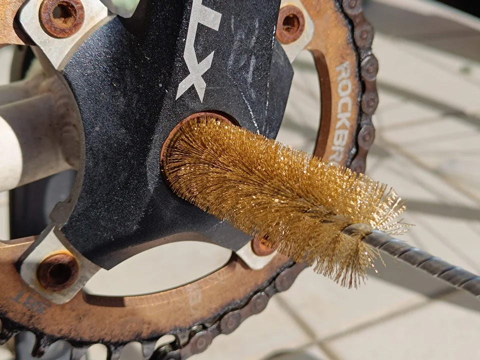

こんなものでしょうか。

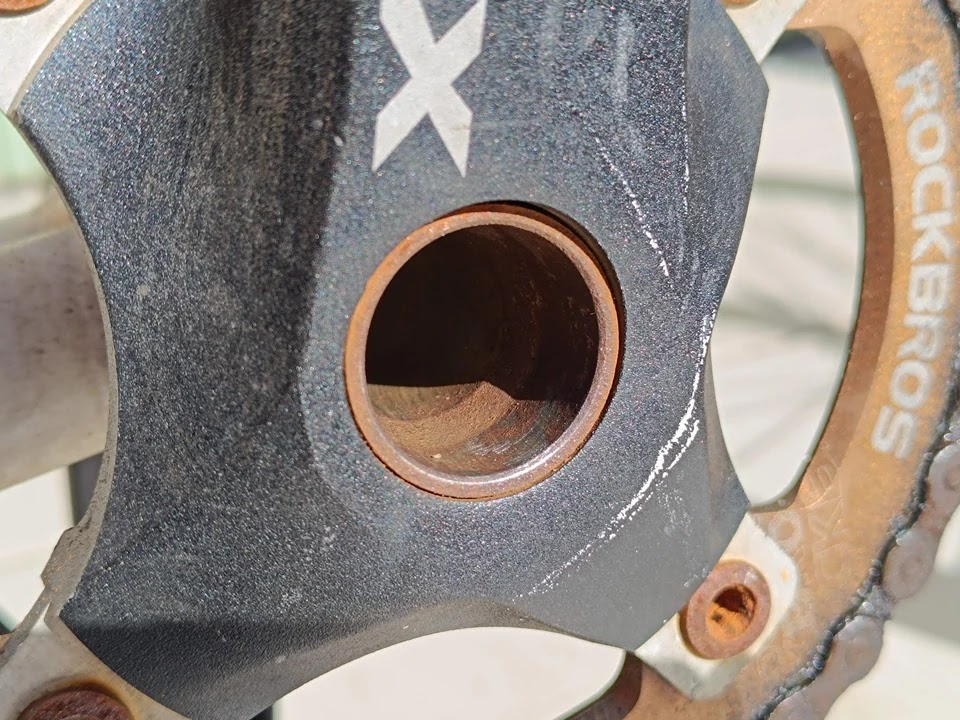

サビキラーのフタを開けてかき混ぜます。ガンメタリック色で普通の塗料のようです。

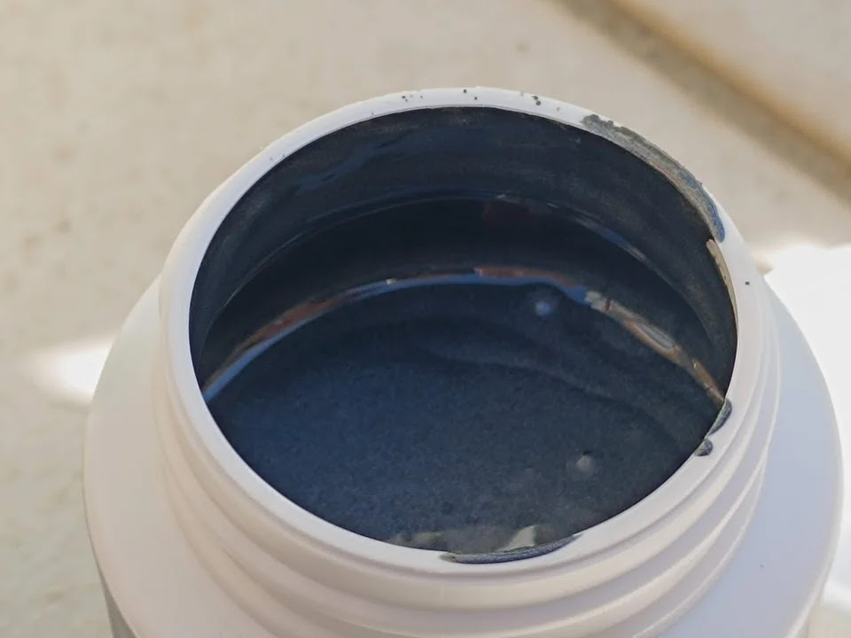

筆で塗装していきます。

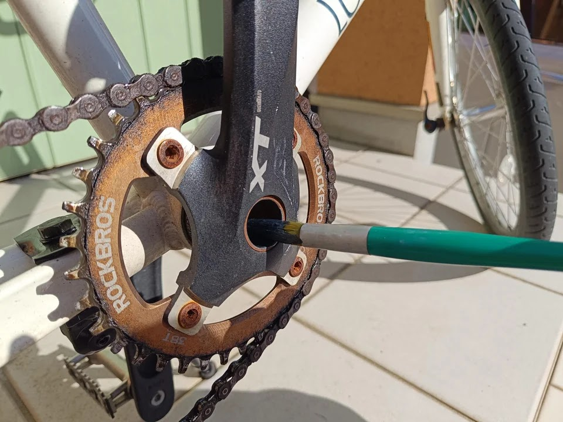

塗装しました。粘度が高くちょっとした凹凸に入っていかず、塗れてない部分が少しありますね。

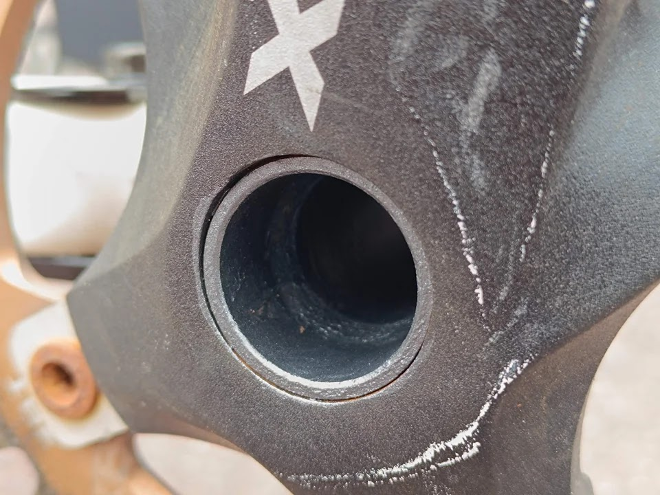

このあと3時間置いて2度塗りしました。サビキラーを下塗りとして水性塗料を上塗りすることもできるようです。

## チタンボルトに交換

ハンドル取付ボルトは少し値が張りましたがレインボー色のチタンボルトを購入しました。

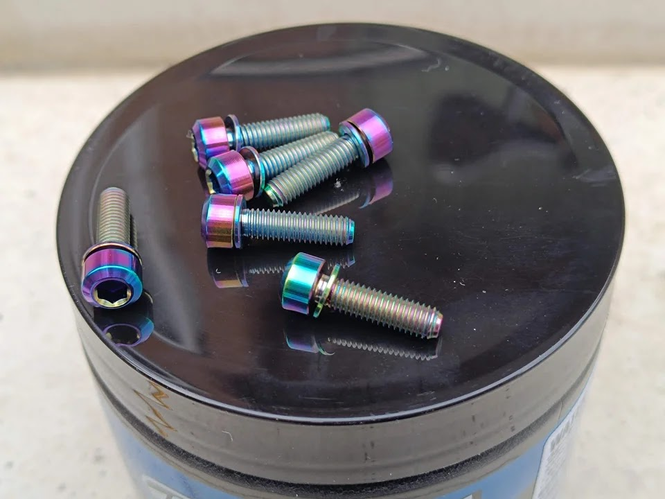

ボルト交換後です。きれいな色ですね。チタンボルトは初めて使いますが屋外雨ざらしでも錆びないことを期待です。

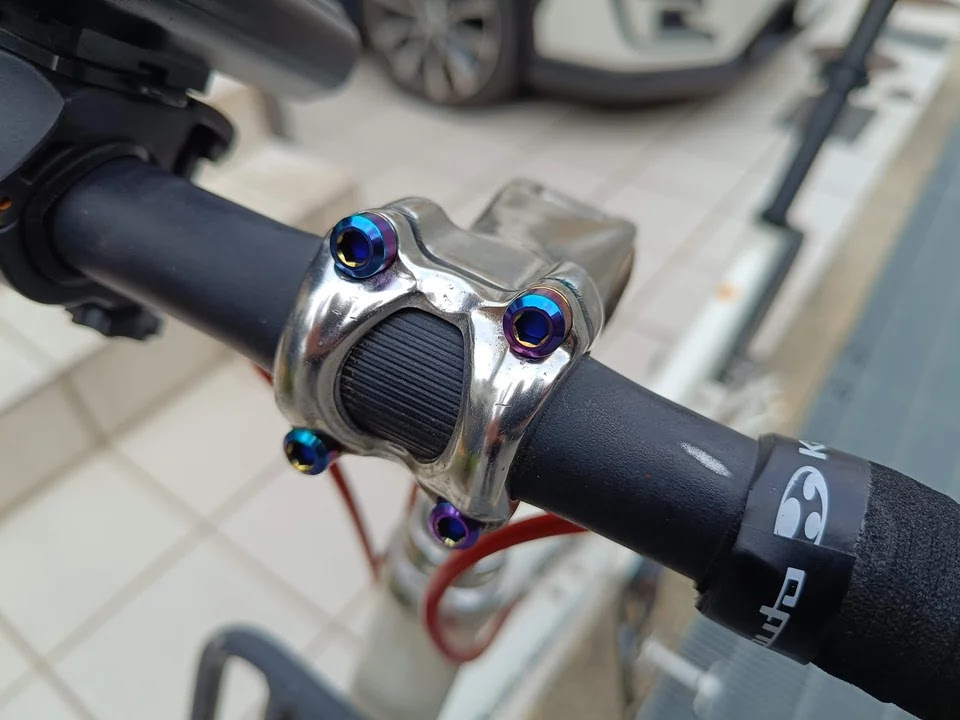



ついでにチェーンリングもチタンに、、、と思ってアマゾンで安いものを買ったらよく見ると鉄製でした。色に騙されました。。。またそのうち錆びてきそうです。

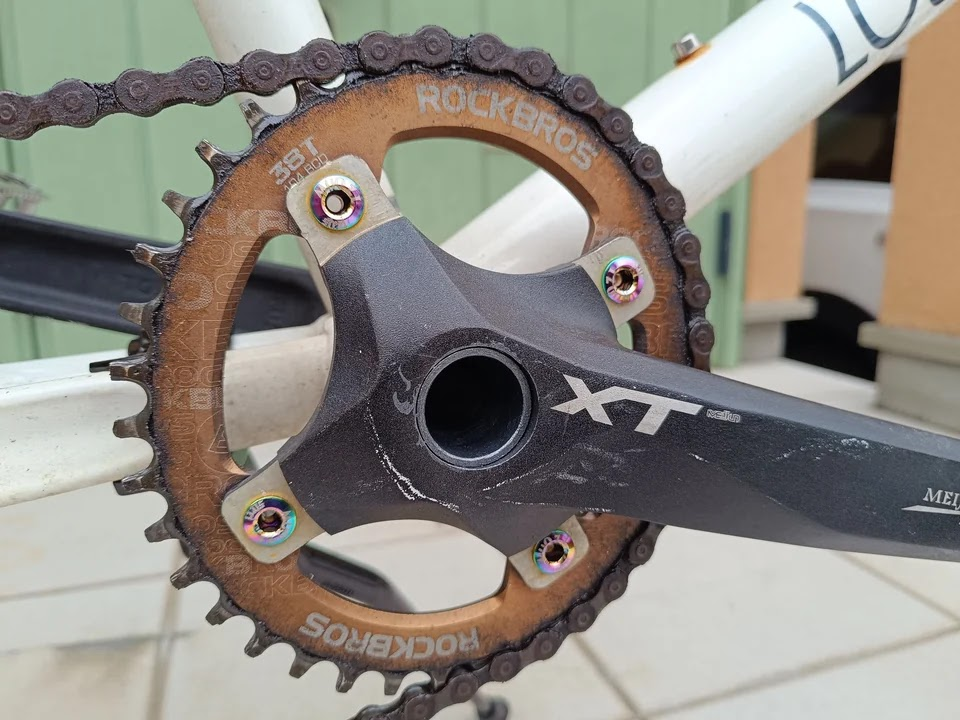



## ビフォーアフター

はじめの状態です。

↓がサビキラー塗装&ボルト交換後です。

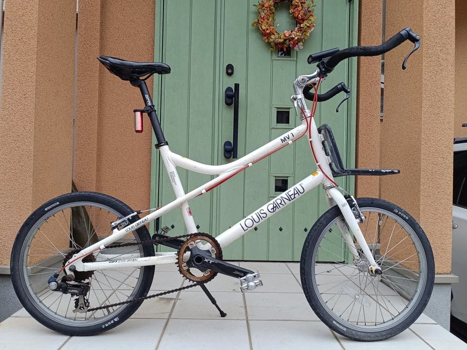

チェーンリングが茶色く錆びたような色をしているので全体的にはあまりわかりませんね。今後雨ざらしでどうなっていくか見ていきたいと思います。


