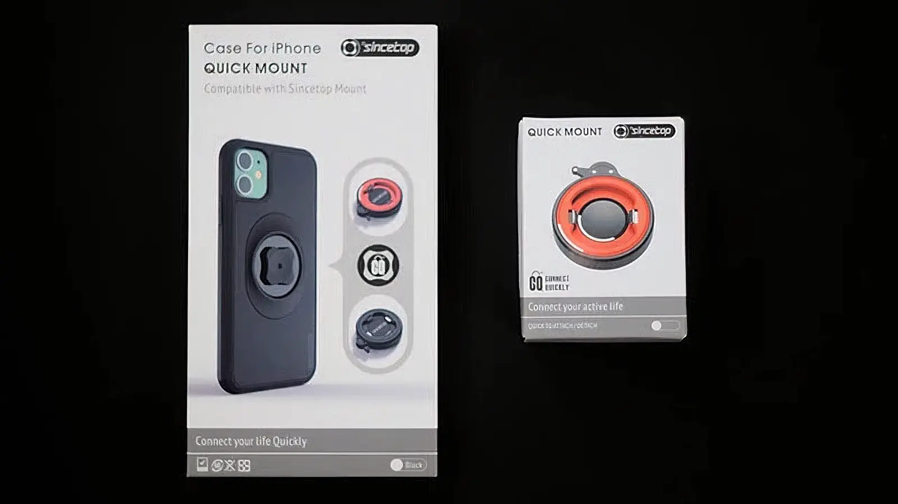
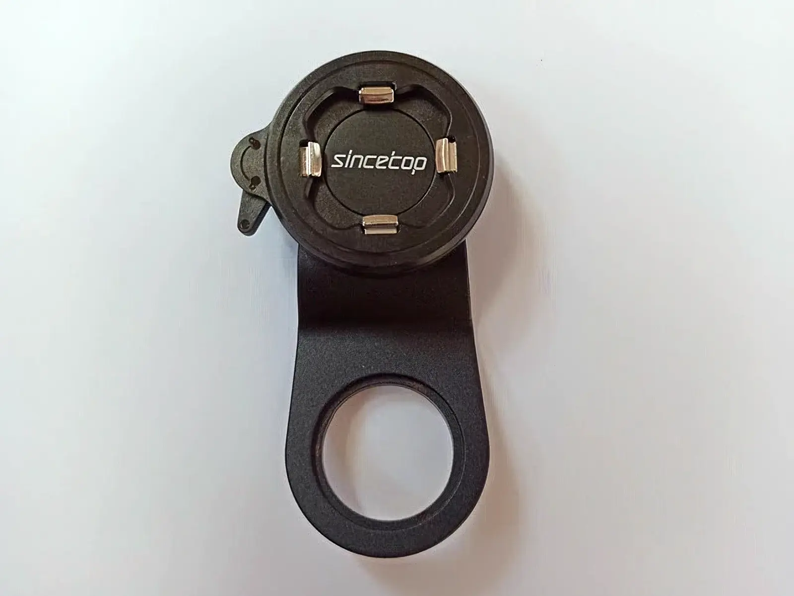
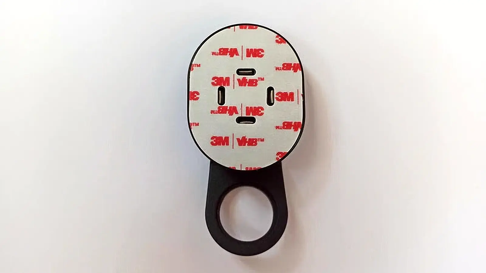
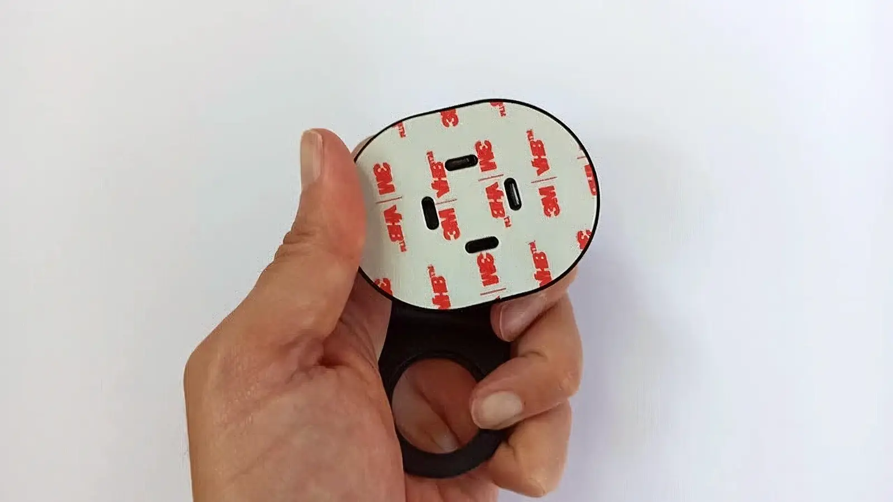
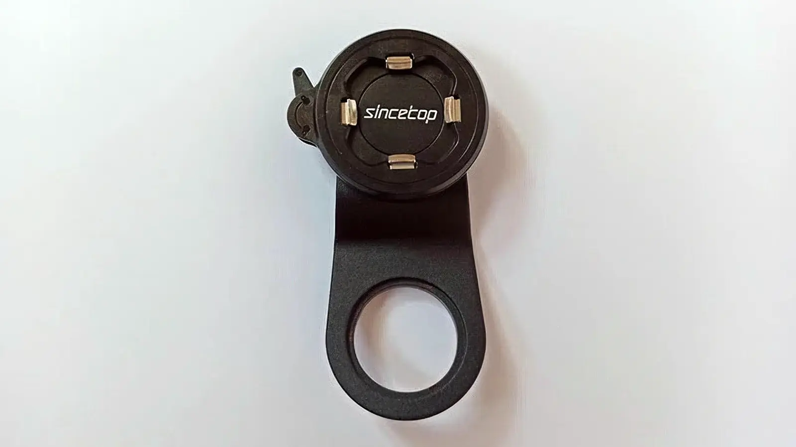
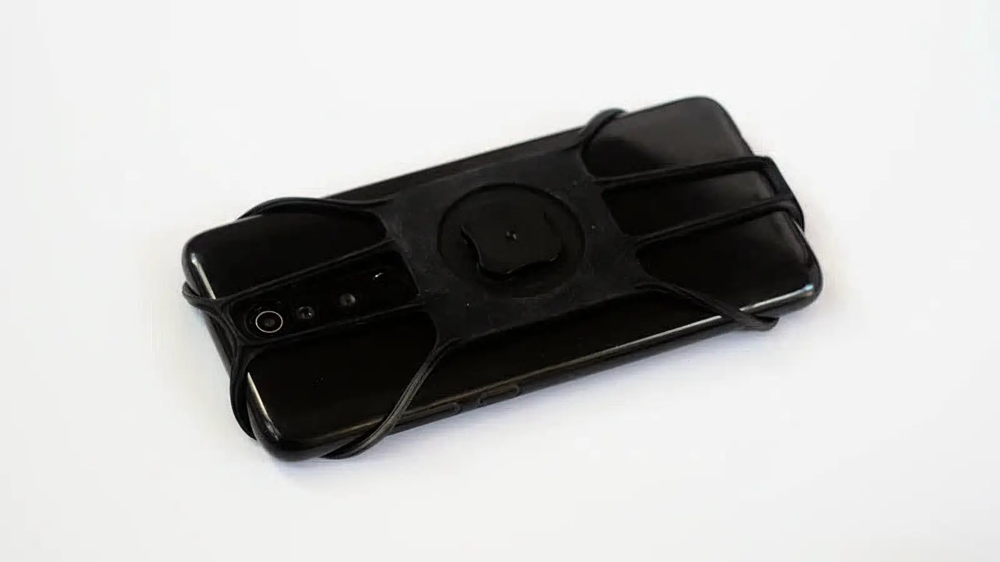
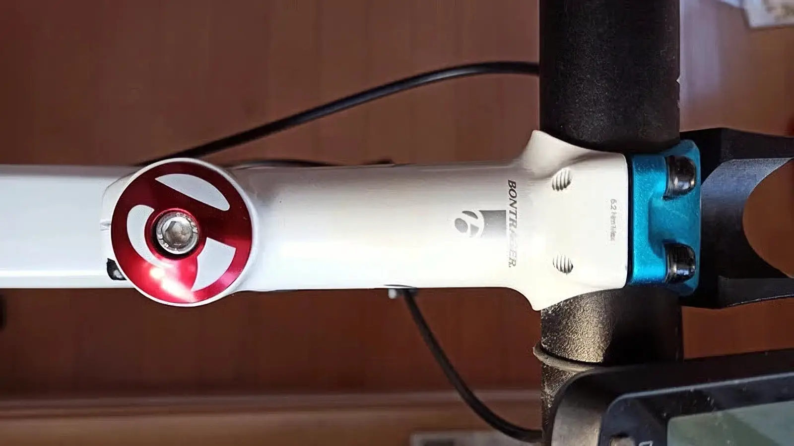
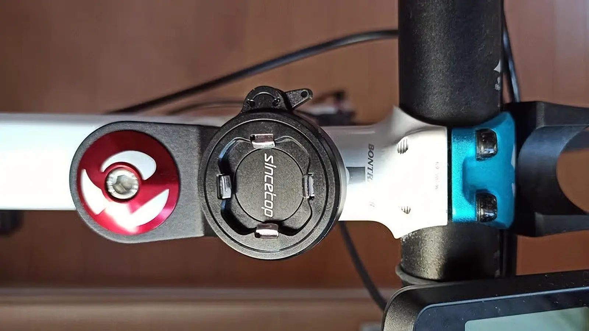
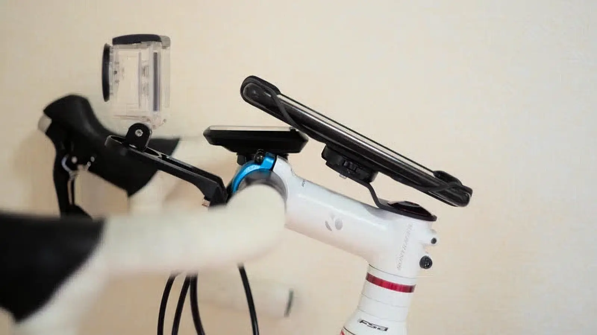
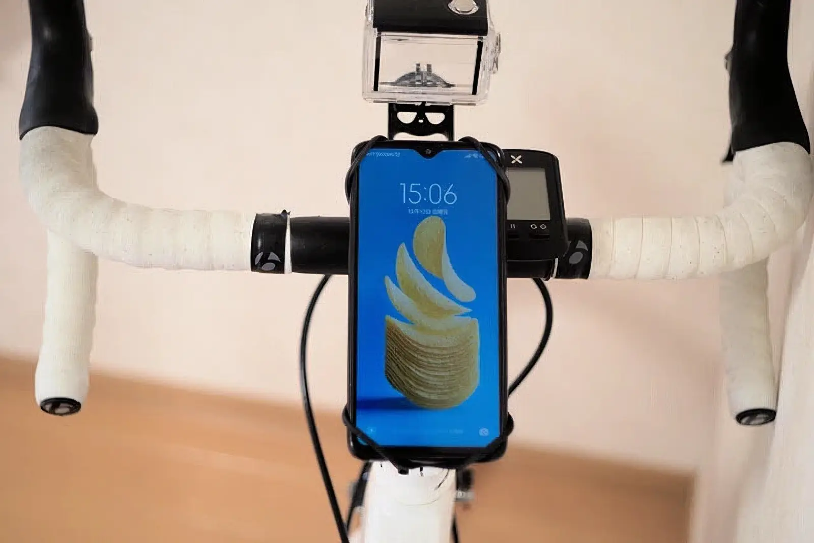

---
categories:
  - 自転車
  - bike
date: "2025-02-15T23:43:33+09:00"
description: 自転車のステムキャップのボルトで固定でき、ワンタッチでスマホを取り外すことのできるSincetopのスマホホルダーをレビューします！ロードバイクに乗りながら地図を確認するのに便利です。
draft: false
images:
  - images/Wj-Hb.webp
summary: 自転車のステムキャップのボルトで固定でき、かつワンタッチでスマホを取り外すことのできるSincetopのスマホホルダーを買いましたのでレビューします！ロードバイクに乗りながら地図を確認するのに便利です。
tags:
  - スマホホルダー
title: Sincetopスマホ ホルダーレビュー
---

ロードバイクで行ったことの無い場所を走るときにはちょくちょくスマホで地図を確認するので自転車にマウントできると便利です。ステムキャップのボルトで固定でき、ワンタッチでスマホを取り外すことのできるSincetopのスマホホルダーを買いましたのでレビューします！

## 使用中のBones Bike Tie Pro 4の不満なところ

今までBoneのBike Tie Pro
4を愛用しており、その形状やゴムの品質の良さには満足していますが、使い勝手の面で主に2点、不満が出てきました。

-   バンドを巻いて固定するため、振動が激しいとズレてスマホが斜めに傾いてしまう
-   スマホをゴムバンドで固定しているので写真を撮る際、スマホを外すのが面倒

このうち、2点目はBoneにもBike Tie
Connectというワンタッチで外せるセパレートタイプが出ていますが、やはり自転車側はゴムバンド固定なのでズレそうなのと、ステムにマウントするタイプはお値段高めなので別の製品を探してみました。

## Sincetopスマホホルダー

AliExpressで物色していたとろこ、Sincetopというなかなか良さげな製品を発見。

-   ブラケットをステムキャップのボルトで固定できるので振動に強そう
-   スマホ側、自転車側にそれぞれオス/メスのコネクタを取付けることでワンタッチで固定、取り外しができる
-   価格はまあまあリーズナブル

ということで、Sincetopのスマホホルダーを注文しました！注文後にアマゾンで調べると、しっかりアマゾンでもほぼ同額で販売されていました。。。

## Sincetopスマホホルダーが届いた

AliExpressは中国から発送されてくるので例によって待つこと約2週間、スマホホルダーが届きました！高級そうな箱に入っています。

写真右がステムマウント用ブラケット。左がゴムバンドでスマホ側に付けるものです。ステムマウント用ブラケットには、写真に無いですが六角レンチが付属します。箱の写真と中身が違いますね。スマホケースはiPhone用のハードケースの絵ですが、実際にはゴムバンドです。ステムマウント用ブラケットはオレンジ色ですが中身は真っ黒でした。いい加減ですね🤪

中身です。左のステムマウント用ブラケットには、中央の両面テープで貼るタイプのコネクタが付属しています。これをスマホに貼っても良いのですが、筆者のスマホカバーはシリコン製なので両面テープがくっつかないため、右のゴムバンドのコネクタを追加で買いました。

ステムマウント用ブラケットはアルミ製（コネクタ部は樹脂）で高級＆頑丈そうです。

オスのコネクタを上から軽く押すとパチンと固定されます。両面テープタイプのコネクタをはめたところです。

外す際は右向きにひねると外れます。

コネクタをはめた後に、受け側左側面のレバーを操作することでロックされ外せないようにできます。

ゴムバンドをスマホに付けてみました。カメラの邪魔にならず、このまま写真撮影できるので便利です。ただ、スマホを付けると結構ゴムが伸びて白くなり、固定もややビヨンビヨンしてこのゴムバンドコネクタの品質はちょっと微妙です。

## Sincetop スマホホルダーの取付け

自転車のステムキャップを止めているボルトを抜いて、ステムキャップの下にブラケットを入れて取り付けるだけです。

あまりに簡単なのでいきなり取付け後です。ハンドルにクランプするものもありますが、クランプがケーブル類に干渉したり、固定が甘いと回ってしまうのでステムにボルト固定できるこのタイプは安心感がありますね。

## スマホを固定してみた

さて、ブラケットが取付けできたので早速スマホをパチンとはめてみます。横から見るとこんな感じです。

上からです。GPSサイコンのXOSS
Gの上に少しかぶってしまったのでサイコンの位置を見直そうかな。

## インプレッション

ブラケットはすごく良く出いていて、ガッチリ固定でき安っぽさも無くGoodです。ワンタッチで取付け、取り外しができるのも嬉しいです。自転車に載っているとふと写真を撮りたくなる場面が多々ありますが、今まではスマホをゴムバンドから外して、写真撮影後またゴムバンドを引っ張って取付けるのが大変でしたがこれなら躊躇せず写真が撮れて便利そうです。

難点はゴムバンドコネクタでしょうか。ブラケットがこれだけしっかりしているのに、ゴムとスマホの間がぷるぷるしてせっかくの強固な固定が台無し感があります。シリコン製でないスマホカバーを探して両面テープ接着の方が良さそうですね。

iPhone用の専用ケースがあるので、iPhoneを使っている場合は解決ですが、貧乏人の筆者は小米の格安スマホなので使えず。スマホカバーを探すのも一苦労です。

ともあれ、なかなか良さげな製品ですのでこれで実走してみたいと思います！

## （おまけ）これまでのスマホマウント遍歴

初めて買ったものは¥898の激安品でした。まあ機能していましたがプラ全開の安っぽさと、ボールジョイントなので大きな振動があるとコックリとズレてしまいます。

次に選んだのはBone Bike Tie Pro
4というステムに固定するものです。ゴムの材質がなんとも言えない上品なもので、上述の激安品とは質感は雲泥の差です。ボールジョイントも無いのでズレにくいですが、ステムへの固定がゴムバンドなので相当な振動が加わると回ってしまうことがありました。でも、総合的に良くできた商品だと思います。


