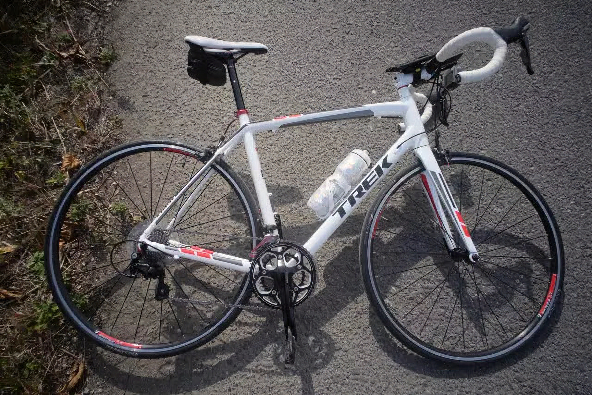
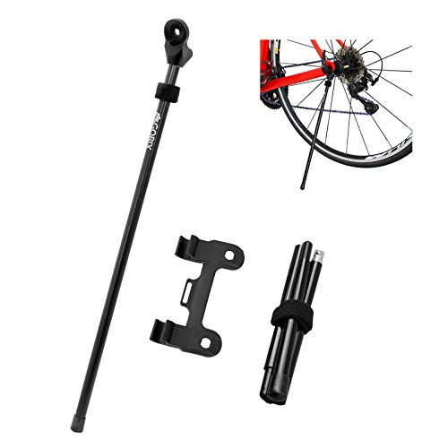

---
categories:
  - 自転車
  - bike
date: "2025-02-15T23:43:37+09:00"
description: description
draft: コンパクトに携行でき、見映えよくロードバイクを立てられる携帯スタンド、TOPEAKフラッシュスタンド スリムXをレビューします。
images:
  - images/9h9Qw.jpg
summary: ロードバイクでポタリングをしたり長距離ライドをすると、絶景をロードバイクと一緒に写真に収めたくなります。見映えよくロードバイクを立てられる携帯スタンド、TOPEAKフラッシュスタンド スリムXを買ってみました。
tags:
  - Madone2.1
  - スタンド
title: ポタリングに便利 ロードバイク用携帯スタンド
---

ロードバイクでポタリングをしたり長距離ライドをすると、訪れた先で写真映えする場所や歴史の名所などを訪れるのが楽しみです。そして絶景をロードバイクと一緒に写真に収めたくなります。見映えよくロードバイクを立てられる携帯スタンド、TOPEAK
フラッシュスタンド スリムXを買ってみました。

## ロードバイクにスタンドが無い問題

ロードバイクと風景を一緒に写真に収めようとしたときに問題なのが、「ロードバイクにスタンドが無いこと」です。せっかくの晴れた日の気持ちの良い淀川沿いで写真を撮ろうと思っても下のような残念な写真になってしまいます。

壁にかけたり段差などを利用してなんとかバランスを取ってロードバイクを立たせて写真を撮ったりしていましたが、良い場所があるとは限りません。

## 見映え重視なら携帯スタンド

ロードバイクに取付けできるスタンドは様々な種類がありますが、見映えを重視するとなかなか自転車に常時固定するスタンドを取り付ける気になりません。

そこで、取り外しのできる携帯スタンドなら見映えを損なわずにロードバイクを立てられ、素晴らしい風景写真をロードバイクと一緒に写真に収めることができるのでは、と思い携帯スタンドをいくつか比較してみました。

## TOPEAK フラッシュスタンド スリム X

Amazonを検索してまず目についたのがTOPEAK フラッシュスタンド スリム
Xです。

クランクにカポッとはめるだけのお手軽さと、シュッとした見た目です。写真が目的なので見た目重要です。ただし、機能がすごく単純なのに反してお値段が約5,800円とTOPEAKさんらしい高級品です。

## ミノウラ HPS-9 Get'A ペダルスタンド付き携帯工具

上でご紹介したTOPEAKに似た製品として、ミノウラからHPS-9 Get'A
ペダルスタンド付き携帯工具という製品が出されています。

これは工具セットを組み替えるとスタンドになり、ペダルのクランク取付け軸に引っ掛けるものです。携帯工具を別で持つ必要が無いので荷物の軽量化になるのと、トランスフォーマーみたいで面白いギミックです。お値段も約2,000円とTOPEAKの1/3程度なのが嬉しいです。ただ、華奢に見えて足の部分がポキっといかないか少し不安に見えます。

## GORIX 軽量携帯 スタンド GX-Q4M

最後にGORIXの携帯スタンドです。後輪を支える見た目は一般的なスタンドですね。

普通のスタンドと違うのは、棒の部分が取り外しできることです。棒の取付け部は、クイックリリースのシャフトに共締めする構造です。取付部が残りますが、小さい部品なので目立たないと思います。棒はちょっと華奢な感じがしますね。お値段も約2,500円とリーズナブル。

## TOPEAK フラッシュスタンド スリム X を購入

上述した3製品を比較して、TOPEAK フラッシュスタンド スリム X
を買いました。頑丈そうなのと、見た目に惹かれ、大枚をはたいて買ってしまいました。

箱です。

中身を出してみます。プラスチックにメッキかなと思っていましたが、足の部分はアルミの鋳造品で、ケースも厚み1mm程度のアルミ板曲げて内側にプラスチックという凝った作りでした。黒い部分はもちろんプラスチックです。こりゃ値段が高いわけだ。

足を引き出します。

足を開くと自立します。

ケースのU字に切り欠いた部分をクランクにかぶせます。クランクとは固定されるわけではなくガバガバです。

上の写真の状態からスタンドを持ちながらクランクを回してスタンドを地面に接触させました。

自転車が立った状態です。いい感じに安定します。写真ではわかりにくいですが、自転車は手前に少し倒れています。

自転車前方から見るとこのくらい角度が付いています。

今度は裏側にスタンドを付けてみましょう。自転車は少し奥に倒れた状態になります。写真映え的には手前が良いかなぁ。

下にある六角穴付きボルトで高さを調整することができます。クランクアーム165mm〜175mmに対応し、自転車の角度は83°〜86°になるのが正解のようです。付属の取説に詳しい調整方法等が記載されています。

持ち運び用の袋も付属しているのが良いですね。

## まとめ

ロードバイクと一緒に風景写真を撮る際は携帯スタンドを持っていくのが便利です。TOPEAK
フラッシュスタンド スリム X
は少々値段が高いですが外観、作りも良く満足できる一品だと思います。

