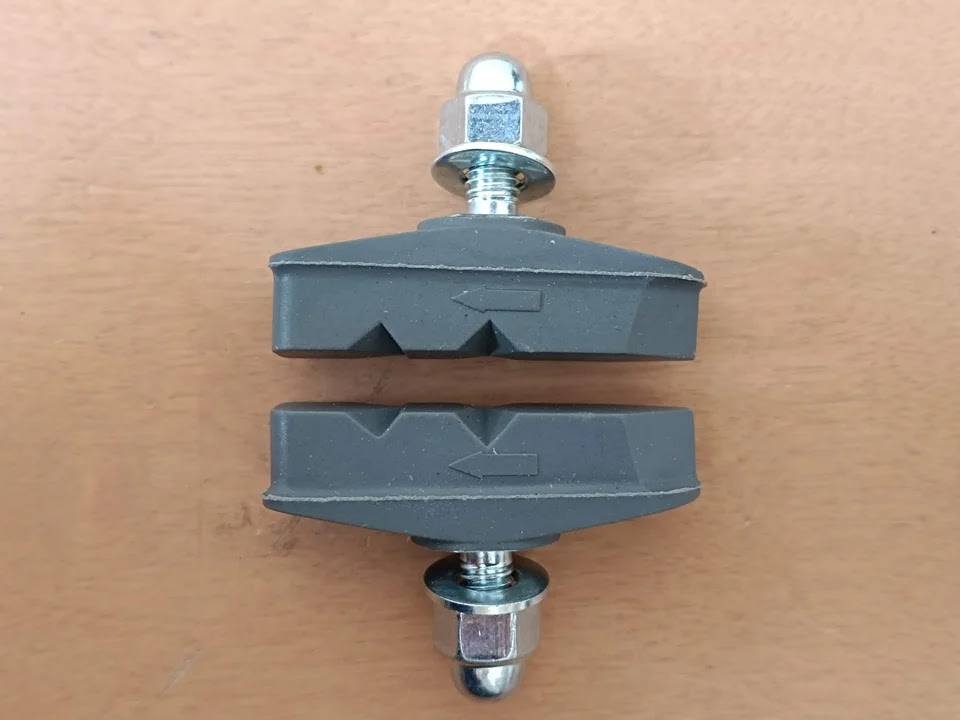

---
categories:
  - 自転車
  - bike
date: "2025-02-15T23:44:32+09:00"
description: 子供用自転車ルイガノLGS-J12、買ってから15年ほど経ち、ついに末っ子が補助輪なしで乗れるようになりました。最後のお役目を果たす前にキーキー鳴くようになった前輪ブレーキパッドを交換します。
draft: false
images:
  - images/0003.jpg
summary: 子供用自転車ルイガノLGS-J12、買ってから15年ほど経ち、ついに末っ子が補助輪なしで乗れるようになりました。最後のお役目を果たす前にキーキー鳴くようになった前輪ブレーキパッドを交換します。
tags:
  - LGS-J12
  - ブレーキ
title: ルイガノLGS-J12 ブレーキパッド交換
js: js/paad.ts
---

子供用自転車ルイガノLGS-J12、買ってから15年ほど経ち、ついに末っ子が補助輪なしで乗れるようになりました。最後のお役目を果たす前にキーキー鳴くようになった前輪ブレーキパッドを交換します。

## ブレーキパッド交換

TEKTROのブレーキパッドです。

なんの変哲もない普通のブレーキパッドです。

もともと付いていたブレーキと色形が似ているのと、袋ナットが付属し固定したときの見栄えが良さそうなのでこれにしました。



もとから付いていたブレーキパッドを外します。

だいぶ摩耗していますが、音鳴りを気にしなければまだ使えそうですね。

新しいブレーキパッドを固定して完了です。タイヤがたいぶひび割れているので本当は交換したほうがよいのでしょうがおさかなのトレッドパターンが気に入っているため、あと少しなので頑張ってもらうことにします。

交換後です。見た目は変わりませんね。

## ルイガノLGS-J12の思い出

長男用に購入したのがもう15年ほど前、ちょうど自転車に興味を持ち始めたころで、おしゃれな自転車＝ルイガノみたいなイメージでした。

その後次男が成長し、ブレーキケーブルやチェーンを変えてみたり、

サドルを革張りしてみたり、

後輪ブレーキをメタルリンクブレーキ化してみたりといろいろいじって今に至ります。

3万円程度と当時の子供用自転車としてはそこそこ高級なお値段だったのと、12インチ自転車なんて遠くに行けるわけもなく家の近くで自転車を乗ることを楽しむ、くらいの使い方になるので使用頻度も低かったので代々兄弟間で受け継がれてきました。

これで最後と思うと感慨深いものがあります。このモデルは既にディスコンのようですが、長い間お世話になりました。
