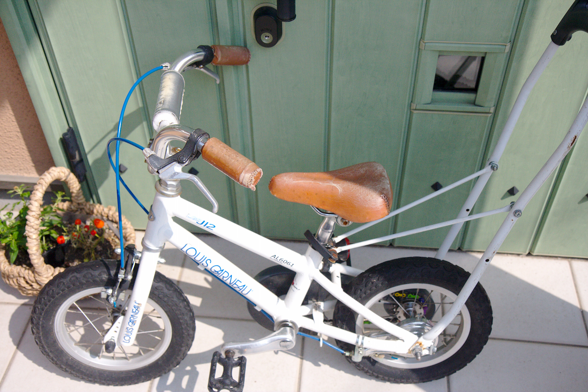
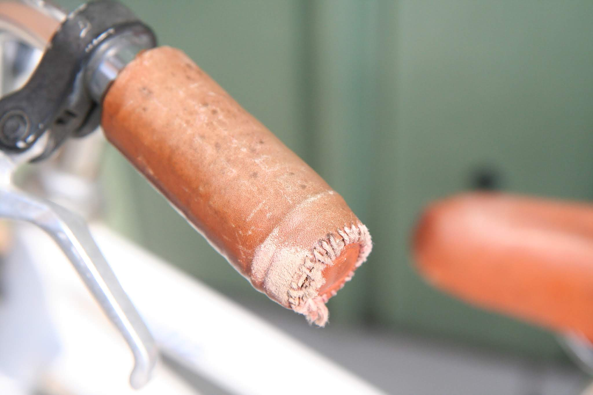
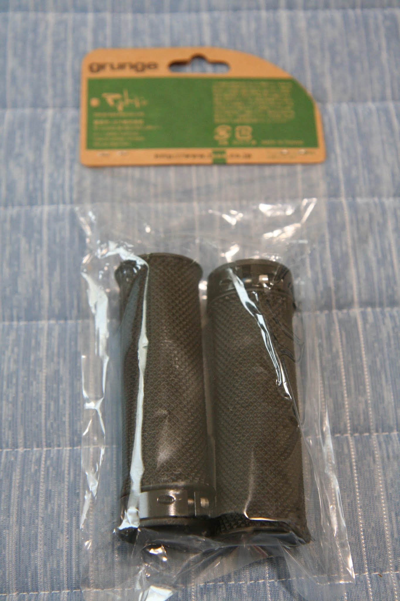
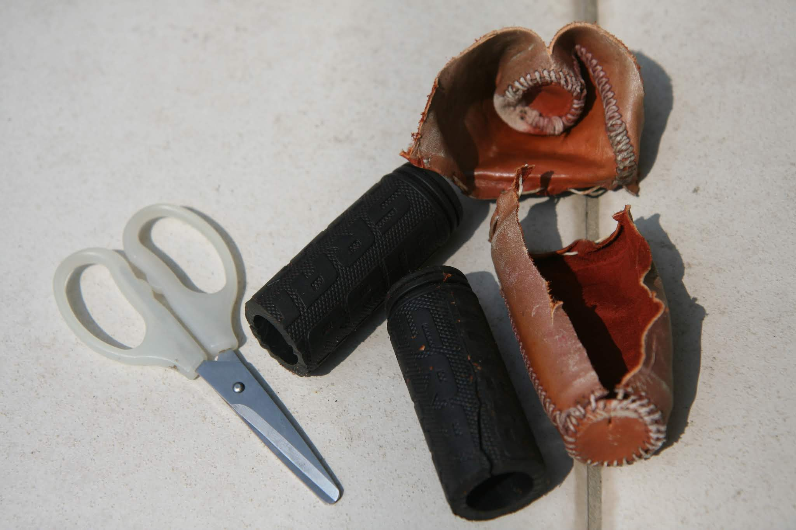
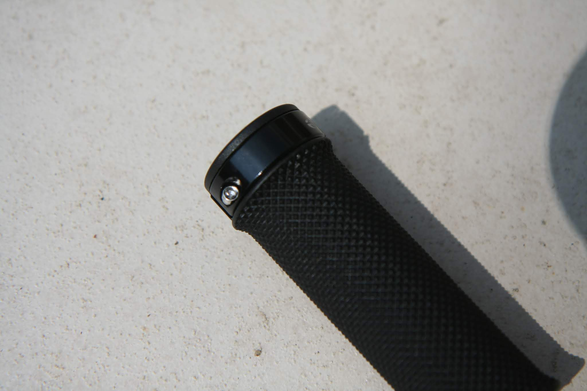
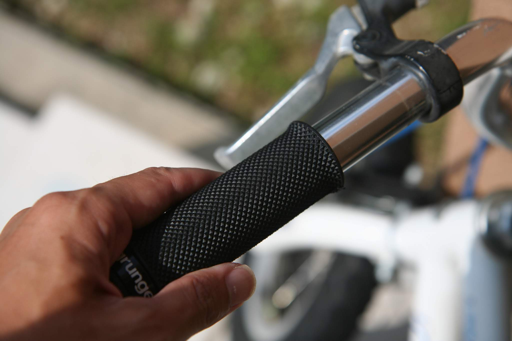
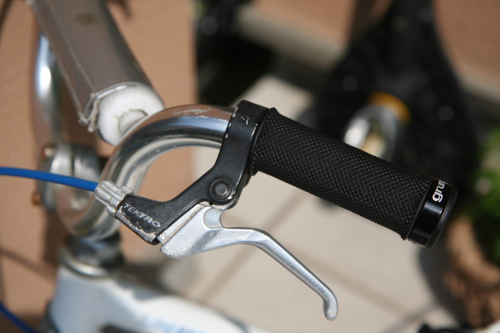

---
categories:
- 自転車
- bike
date: "2025-02-15T23:42:29+09:00"
draft: false
image: images/IMG_4621.JPG
summary: サドル、グリップに革張りをしていましたが外に保管していると劣化が激しくボロボロになってきたのでグリップを交換しました。
tags:
- グリップ交換
title: ルイガノ LGS-J12 ハンドルグリップ交換
---

## 自作革製グリップがぼろぼろになってきた

サドル、グリップに革張りをしていましたが外に保管していると劣化が激しくボロボロになってきたのでまずはグリップを交換しました。

 

## Grunge(グランジ) Sロック ショートスリムグリップ V23P040 ブラック

クランプリングの六角穴付きボルトを締めてハンドルに固定するタイプのグリップを選びました。普通のグリップは挿入するのが非常にかたいのでこちらの方が楽そうなのとなんとなくクランプのアルミリングがかっこいいです。

## 古いグリップを外す

もともと付いていたグリップは一思いにハサミで切ってしまいます。

## 新しいグリップをつける

新しいグリップは突っ込んだあと上の写真のクランプ部ボルトを締めて固定します。

クランプで締めて固定なので予想通りゴム部分はそれほどきつくないので楽に挿入できます。

最後まで挿入したらボルトを締めて完了です。子供用自転車はハンドルが短いのでブレーキを内側に寄せましたがそれでも少しグリップが長すぎ、ブレーキとの付け根がぐにょっとしていますがまあ、良しとしましょう。

Grungeのこのグリップ、千円くらいと安く見栄えもそこそこ良いので満足です。
