---
categories:
- 自転車
- bike
date: "2025-02-15T23:14:52+09:00"
draft: false
image: images/IMG_3560_01.jpg
summary: 子供用自転車のルイガノLGS-J12のサドルをレザーシートで張り替えてみました。
tags:
- サドル
- LGS-J12
title: ルイガノ LGS-J12 サドル張替え
---

子供用自転車のルイガノLGS-J12のサドルを張り替えてみました。

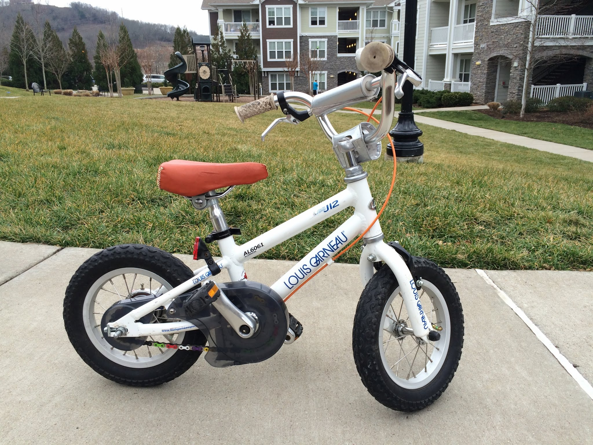

張替え前のLGS-J12です。ブレーキアウターケーブルをオレンジに、チェーンをレインボーチェーンに換えています。シートもなんとなくカラフルにできたらと思い、張替えに挑戦です。

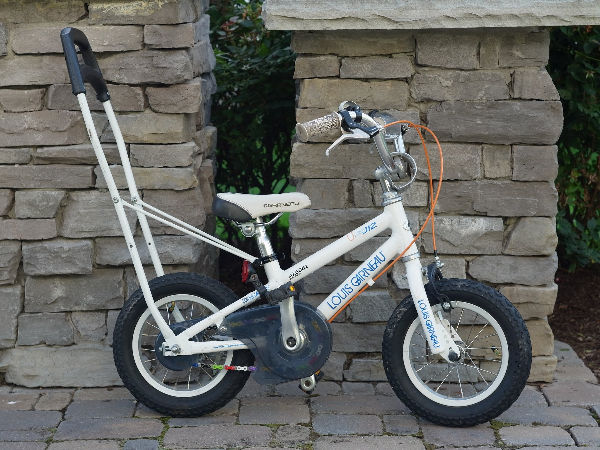

購入時に付いていたサドルです。ルイガノのロゴが入っています。裏面はホチキスで止まっています。

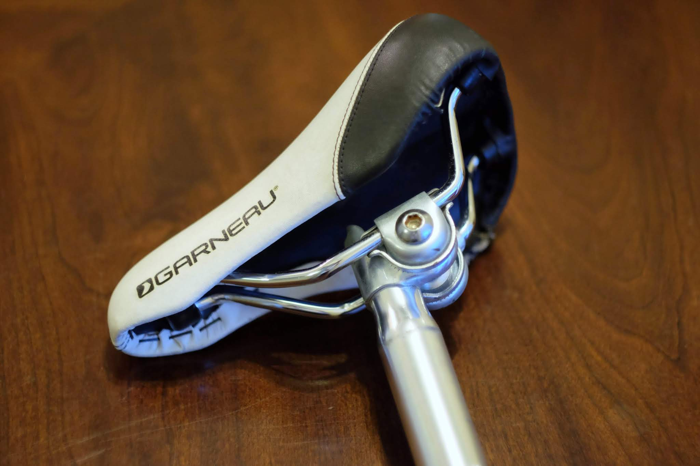

アマゾンで適当に買った革シートです。いちおう本革のようです。

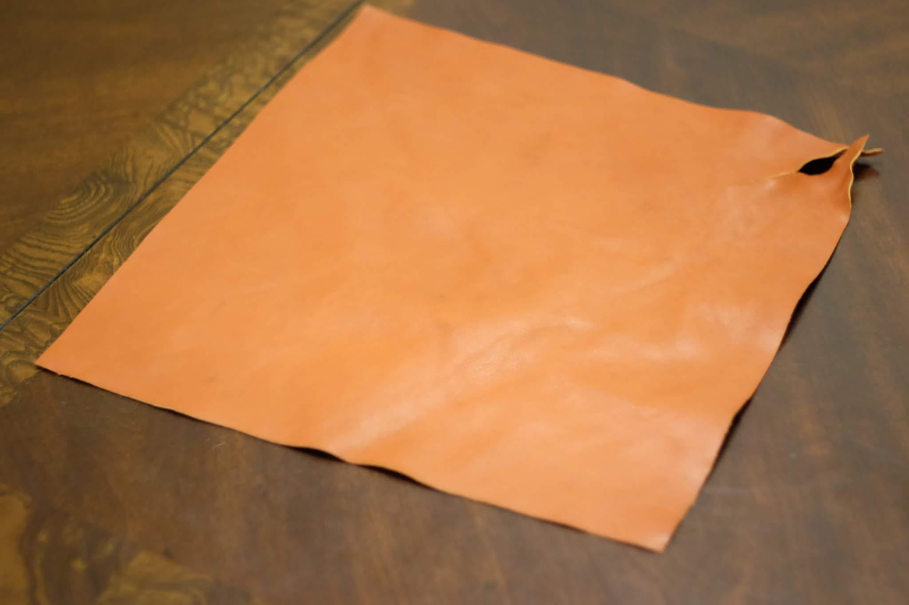

とりあえず、ホチキスを外してシートを取りました。中身はスポンジのウレタンフォームみたいなものでできています。一部接着剤で貼られていました。

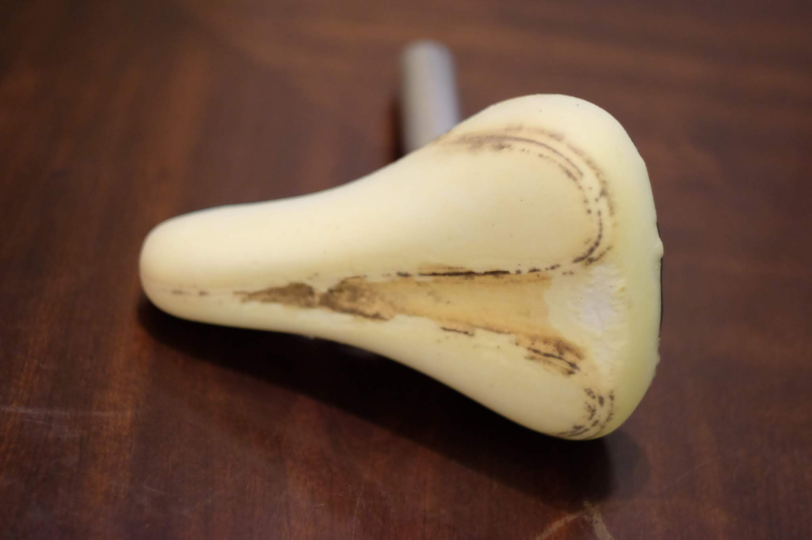

革のシートを適当に切りながらサドルの形に合わせていきます。

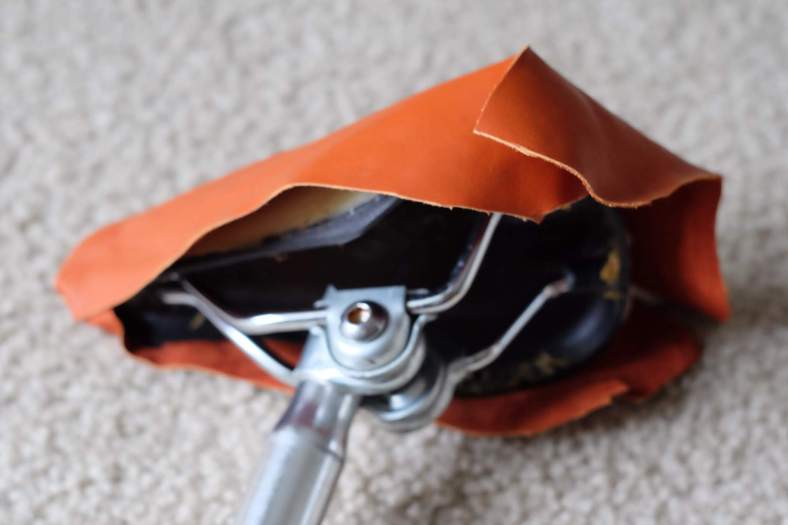

革を引っ張りながらサドルの形に合わせていき、つなぎ目を裁縫します。革の縫い方や必要な糸、針はYouTubeで検索して見よう見まねでやってみます。

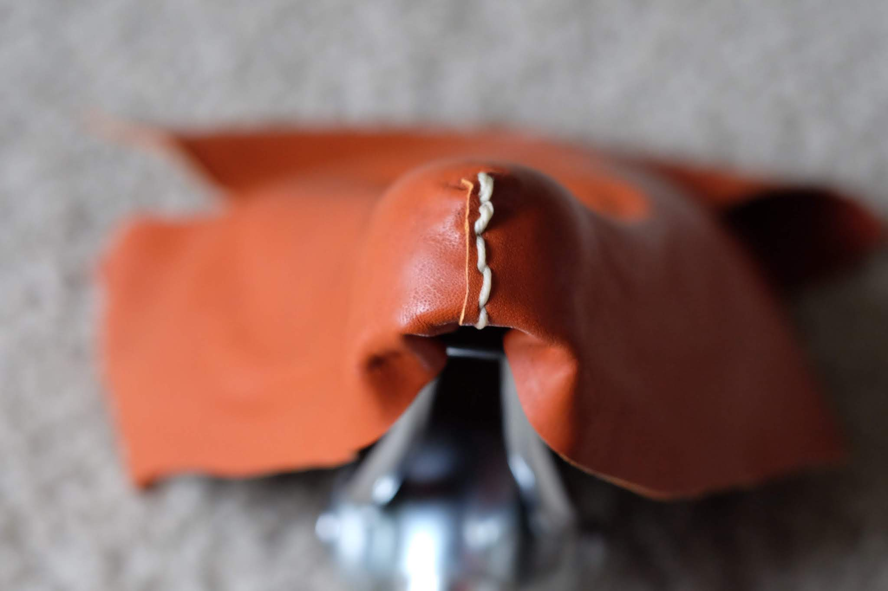

先端を縫い合わせたら端を折り返して接着剤で貼り付けます。端部だけでなく、シートの座面にも接着剤を塗りました。接着剤が固まるまでせんたくばさみで固定します。

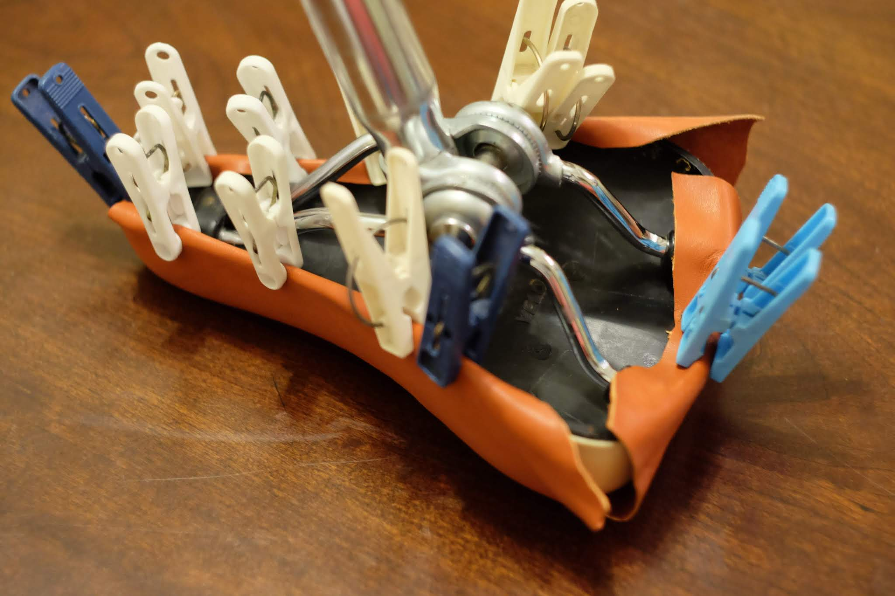

固定できたらこんどは後ろ側のつなぎ目を縫い合わせます。

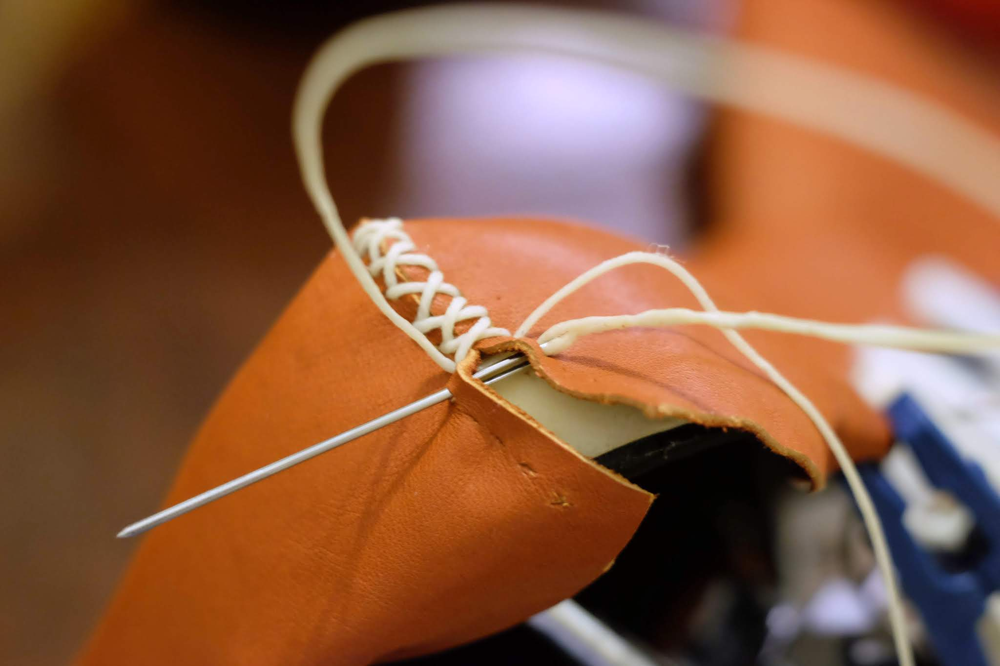

さらに接着し固定します。

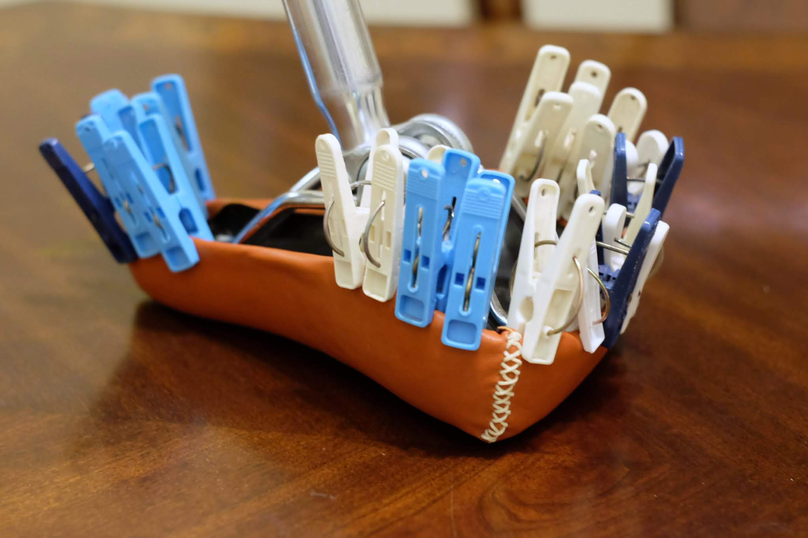

ちなみに使用した接着剤はGorilla
Glueというもの。硬化までの時間が長く、動かないよう固定が必要ですが、発泡して隙間を埋めてくれ、接着力はかなり強力です。

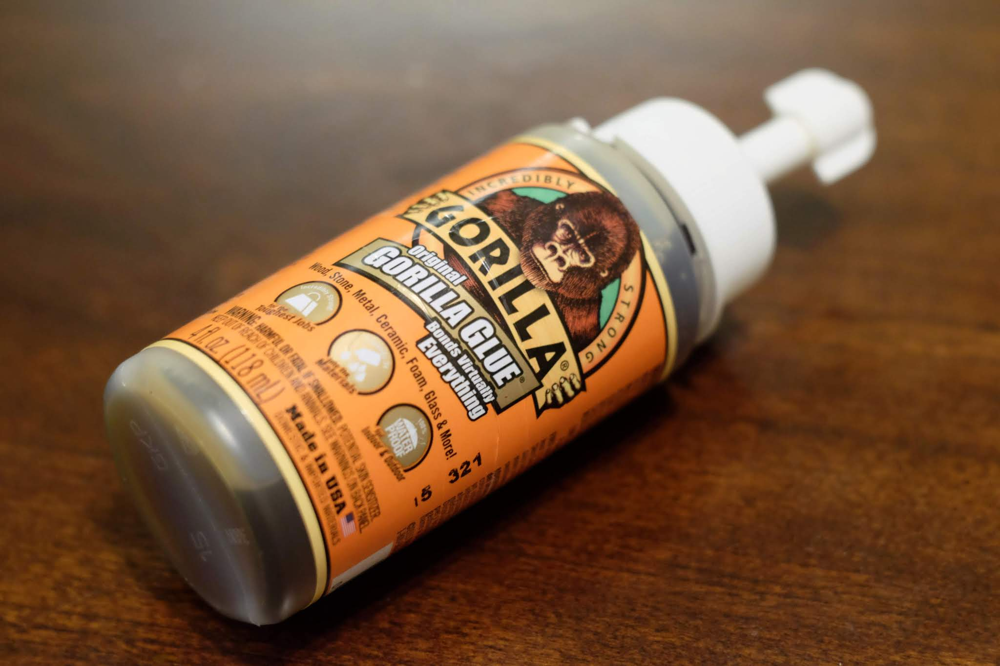

硬化したらせんたくばさみを外して完成です。ちょっとシワになってしまいましたが、初めてにしては上出来です。

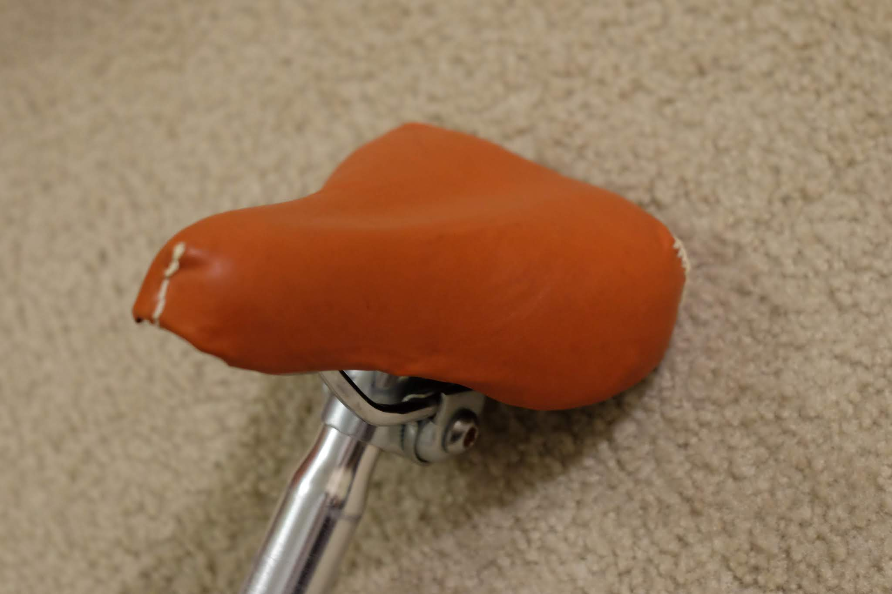 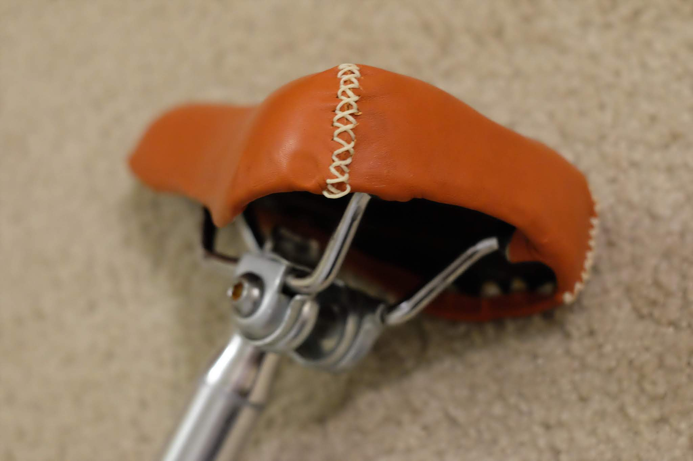

シートを張り替えるとかなり印象が変わりました。

