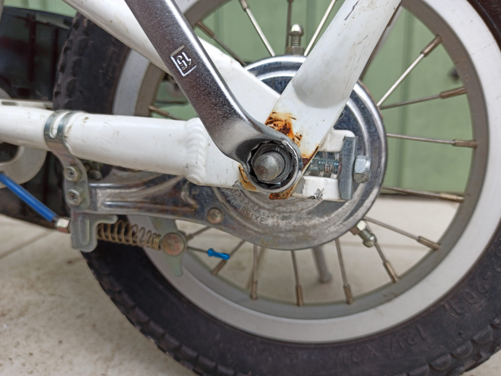

---
categories:
- 自転車
- bike
date: "2025-02-15T23:42:38+09:00"
draft: false
images: 
- images/IMG_20200315_103510.jpg
summary: 子ども用自転車のバンドブレーキがキーキー音鳴りがするため、メタルリンクブレーキに交換しました。音鳴りはなくなり見栄えもよく満足です。
tags:
- LGS-J12
- メタルリンクブレーキ
- ブレーキ
title: ルイガノ LGS-J12 メタルリンクブレーキ化
---

## バンドブレーキの音鳴りが

子供用に使っているルイガノLGS-J12。長男、次男から三男へと引き継がれくたくたになりながらも現役です。ついに後輪ブレーキから音鳴りがするようになり、キーキー言うようになってしまいました。

音鳴り解決のためにいろいろと調べてみました。

## ブレーキの種類とメタルリンクブレーキ

バンドブレーキの音鳴りは、クリーニングしたりコンパウンドを少量垂らしたりすると一時的に音が鳴らなくなるようですが、根本解決は難しそうです。ブレーキ交換を検討しました。

バンドブレーキ交換の候補は下の4種類。

1.  新品バンドブレーキに交換
2.  サーボブレーキ　音鳴りは無いようです
3.  ローラーブレーキ　ハブに互換性が無い
4.  メタルリンクブレーキ　ローラーブレーキに似た構造で既存ハブに取り付け可

ハブ交換必要なローラーブレーキは除外して、音鳴りがしないサーボブレーキかメタルリンクブレーキが良さそうですが、メタルリンクブレーキの放熱板の形状が面白く、メタルリンクブレーキに交換してみることに。

## メタルリンクブレーキを買ってみた

アマゾンで買ってみました。値段は2千円台でバンドブレーキ、サーボブレーキに比べると高価ですが、それでも良心的な価格です。

中身の部品は、下の8点に取り扱い説明書が入っています。

1.  ブレーキ本体
2.  放熱板
3.  固定リング
4.  ブレーキボス
5.  固定バンド
6.  固定ナット
7.  ナイロンナット
8.  六角ボルト

取り扱い説明書に取り付け方が詳しく記載されています。

## ブレーキ交換

### バンドブレーキ取り外し

バンドブレーキは後輪に付いているので、後輪を外す必要があります。まずシャフトを止めているロックナットを緩めます。ロックナット二面幅は15mmでした。

自転車の後ろを親が支えられる持ち手のようなものを付けているので、これも外します。後輪のロックナットとシートポストクランプにとも締めされています。

 

スプロケットカバーがありますが、シャフトに挟まっているだけなので、ロックナットを緩めた後、後ろに引っ張ると抜けます。

チェーンも外します。ママチャリ用のチェーンはクリップで繋いでいるのでかんたんに外すことができます。HOZANのチェーンプライヤーを使うと楽ですが、普通のペンチも使用できます。

チェーンが外れました。カラフルなチェーンはKMCのレインボーチェーンを使っています。

ブレーキワイヤーの取り付けボルトを緩めてワイヤーを抜きます。ワイヤー端のエンド金具はペンチ等で引っ張ると抜けます。

ブレーキをフレームに固定しているバンド金具も外します。

後輪を外したところです。

ブレーキのロックナットを弛めます。二面幅17mmでした。

ブレーキ本体を軸から抜いたところです。バンドには擦れた痕と粉が見られます。それほど酷使していないためか思ったよりきれいです。

ブレーキ本体を抜くとブレーキドラムが見えます。ブレーキドラムには穴が空いていて、ここにピンを引っ掛けて回す専用工具が売られています。HOZANのレンチが使いやすそうですが、お値段高く使用頻度もかなり少なそうなので安いものを購入しました。普通の右ねじなので左方向で緩みます。

ブレーキドラムが外れました。ブレーキドラムはブレーキをかけると締まる方向に力が働くため、ガチガチで外すのに苦労することが多いみたいですが、子供用自転車なのでそれほどガチガチに締まってはいなく、比較的簡単に回すことができました。

### メタルリンクブレーキ取付

ここからメタルリンクブレーキを付属の説明書通りに組み付けていきます。

まず固定リングを後輪の軸に挿入します。

次に放熱板を挿入します。

ブレーキボスをねじ込み放熱板、ロックリングと共に締めて固定します。

ブレーキボスの二面幅は40mmで締め付けには開口の広いモンキーレンチ等が必要です。が、持っていなかったので禁断のノギスをレンチ代わりに軽く締めました。ブレーキボスがブレーキドラムの代わりをして、ブレーキをかけると締まっていくはずなのであまり強くトルクをかけて閉めなくても良いかと判断しました。

ブレーキボスを固定した後、説明書ではナットとボス端面の距離が3.5～4.5mmであることを確認する指示があります。範囲内でOKでした。

ブレーキ本体をはめ込みます。

最後にナットでブレーキ本体を軸に固定しますが、締め付ける際にブレーキレバーを引いてブレーキをかけながら締めるようです。

後輪をフレームに入れてワイヤーを取付ます。バンドブレーキのワイヤー固定金具は外します。

ワイヤーを取り付けて完成しました。

全体はこんな感じになりました。放熱板がかっこいいです。

ブレーキ回りです。見た目に惚れてしまいます。ただの放熱板ですが何か特殊な機構を担っているかのような佇まいです。

## 肝心のブレーキの効きは？ {#肝心のブレーキの効きは？}

バンドブレーキより制動力が落ちるとのレビューが多くありましたが、12インチの子供用自転車なのでそもそも大きな制動力は必要無く、ブレーキをかけるとすぐホイールがロックするくらいで全く問題ありません。

キーキー音も全く無しで見た目も良く大満足です。

ただ、子供用自転車にここまでする必要は無いですが。。。
