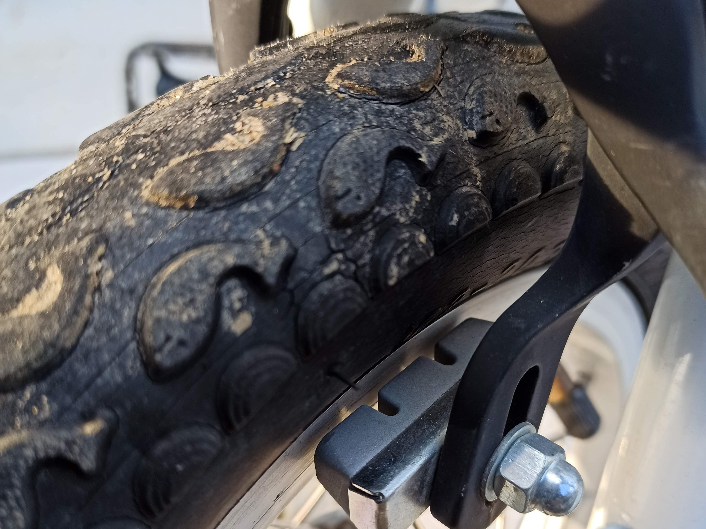

---
categories:
- 自転車
- bike
date: "2025-02-15T23:42:39+09:00"
draft: false
images: 
- images/IMG_20200315_163844.jpg
summary: ブレーキの片当りを修正する工、具PARKTOOL オフセットブレーキレンチ OBW-4をご紹介します。
tags:
- LGS-J12
- ブレーキ
- 工具
title: PARKTOOL オフセットブレーキレンチ OBW-4
---

子供の自転車、ルイガノLGS-J12の前輪ブレーキはTEKTROのキャリパーブレーキが付いています。ふと見てみると片当たりしていました。

センター調整しようと思うものの、ロードのキャリパーブレーキやマウンテンバイクのVブレーキのように調整ボルトが見当たりません。どうやらブレーキ固定用の軸を回して調整するしか無いようです。

よく見ると二面幅が切ってあり、ここでいい感じに角度調整するみたいで、このブレーキセンター調整用にPARKTOOLからオフセットブレーキレンチ
OBW-4なる専用レンチが販売されているのでAmazonでポチってみました。

まあ、ただの薄口スパナなのですが、一般的なスパナが軸方向にオープンエンドとなっているのに対してこれは直角方向にオープンエンドになっています。なのでこんな感じで調整しやすくなっています。また、二面幅が10,
11, 12,
13mmと4つあります。今回のブレーキは13mmでしたがいろいろ種類があるのでしょう。

調整方法はかんたん。ぐっとセンターになるように回すだけです。無事センターになりいい感じです。

ブレーキ軸は1本止めなのでいくら強く固定しても回ってしまう構造なので、チョイチョイ調整必要なのですね。ぶっちゃけ、普通の薄口スパナで十分ですが、PARKTOOLの工具の中では安いし（板金打ち抜きなので安いのあたりまえですが）PARKTOOLのロゴがかっこいいのでまあ、持っていて損は無いでしょう。
