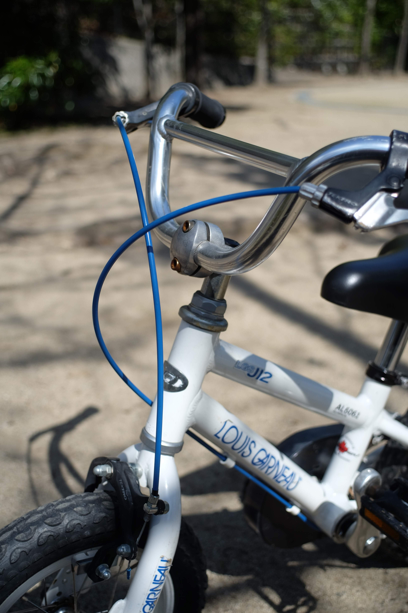
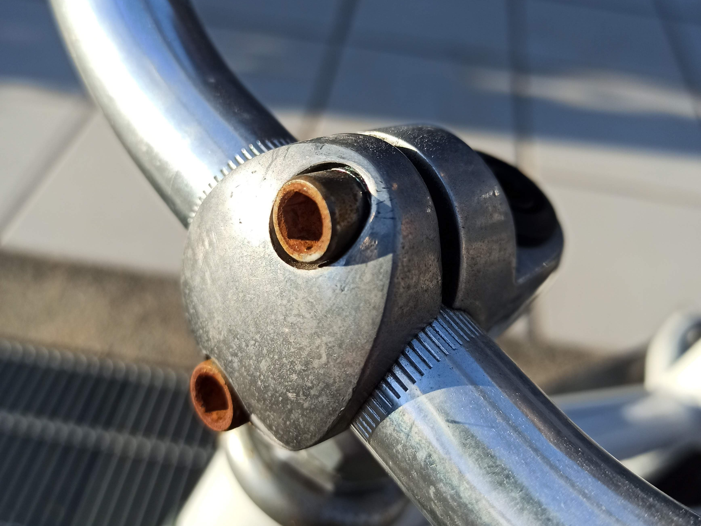
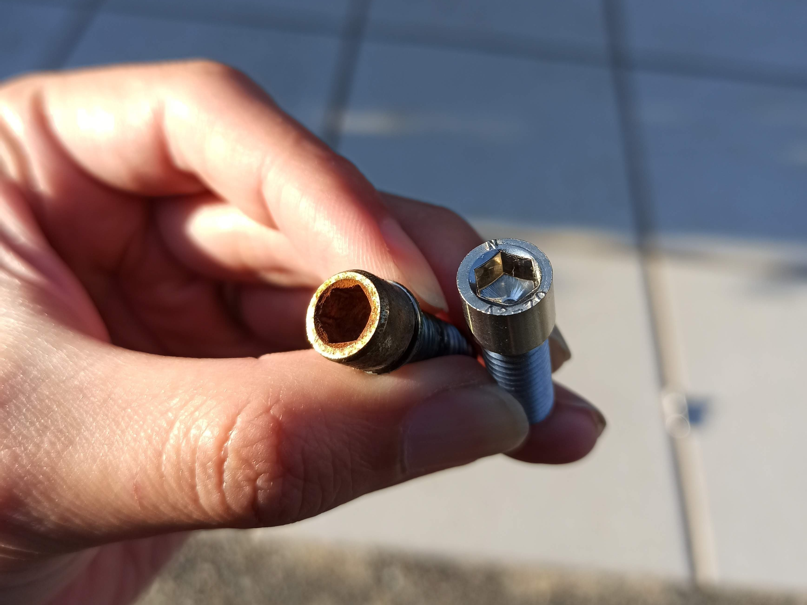
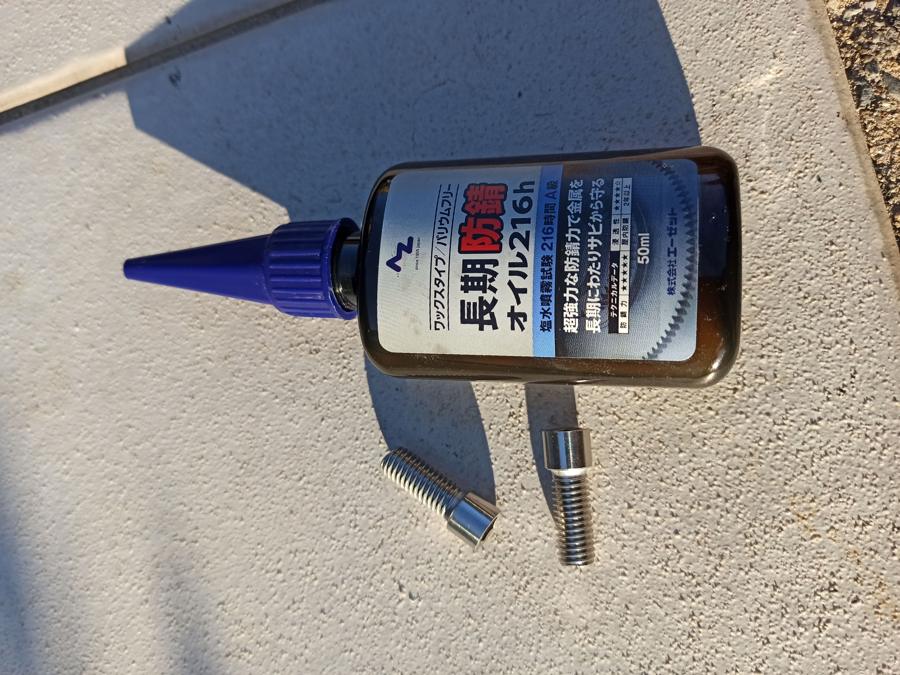
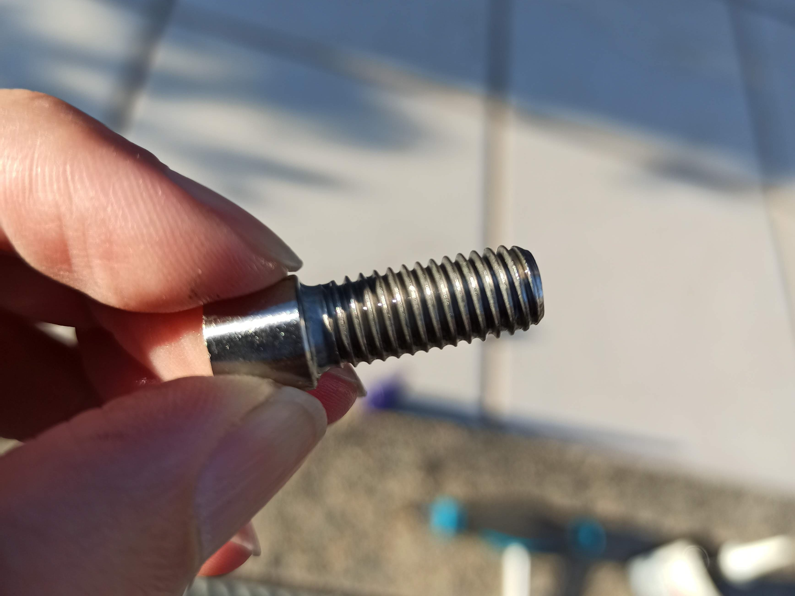
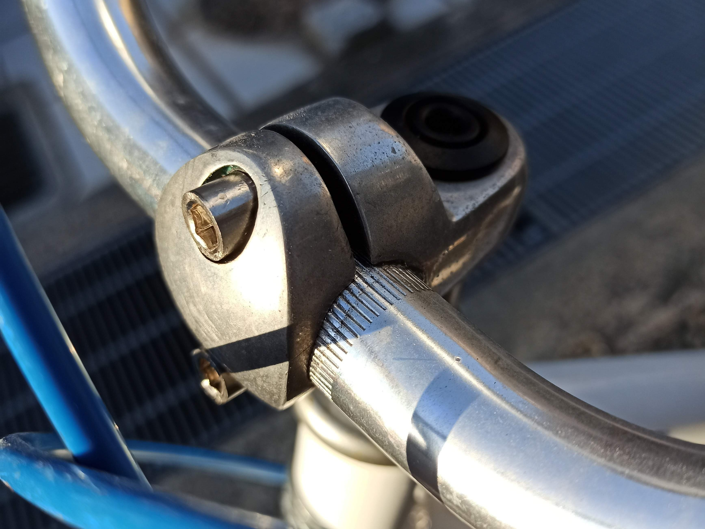
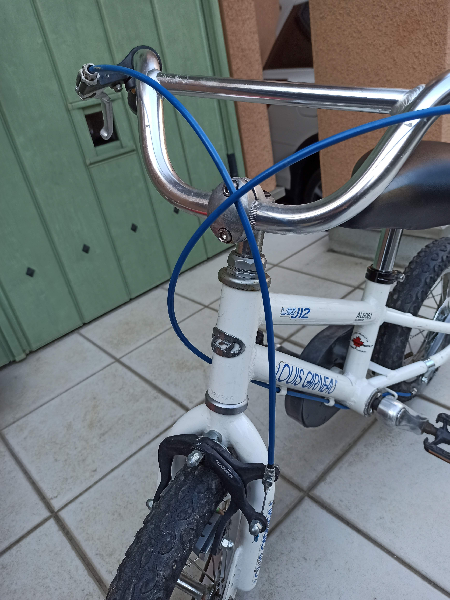

---
categories:
- 自転車
- bike
date: "2025-02-15T23:42:39+09:00"
draft: false
image: images/IMG_20200320_164217.jpg
summary: ルイガノ LGS-J12 ハンドル固定ボルトが錆びたので新品に交換しました。錆びにくいステンレスボルトにエーゼットの長期防錆オイルを塗って錆止めします。
tags:
- LGS-J12
- 錆
title: ルイガノ LGS-J12 ハンドル固定ボルトが錆びたので新品に交換
---

子供用自転車の LGS-J12 のハンドル固定ボルトの頭が錆びてきました。

前に Bikke
の同じ箇所のボルトが錆びて、黒色のボルトだったので塗装しましたが、この自転車はハンドル回りがシルバーで、塗装は見栄えがイマイチになりそうです。

そこでステンレス製のボルトに交換することにしました。

もともと付いているボルトは鉄にニッケルメッキ（多分）で、相手も鉄なので、ボルトをステンレスにすると電蝕でめねじ側がやられる心配があります。だだ、腐食する側の体積が大きいとそれほど気にしなくても良いという情報もあり、あまり気にしすぎる必要は無いのかもしれません。

ボルト頭にかなり赤錆が付いています。

ボルトを外し、サイズを見てみるとM8×18の小頭六角穴付きボルトで小径スプリングワッシャーが一体になったものでした。普通の六角穴付きボルトだとザグリ穴に入らないので、仕方なくアマゾンでステンレス製の小頭ボルトを購入。2本で800円以上もしました。

外したボルトと購入したボルトの写真です。さすがに小径スプリングワッシャー付きは無かったので、スプリングワッシャーは無しで直接止めます。

一応、気休めにエーゼットの長期防錆オイルを塗り水分を遮断することで電蝕防止効果を期待します。

ねじ部にオイルを塗布しましたがサラサラでよくわかりません。乾くとベタベタの皮膜が形成されるのですが、待たずにすぐにねじ込んでしまいました。

頭は新しいボルトの方が少し高く、取り付けるとザグリ穴からはみ出します。新品のボルトはきれいで気持ち良いですね。写真は六角穴が少し赤みがかっていますが錆では無く夕日のせいです。

交換後、全体を見るとこんな感じです。新品のようになりました。

