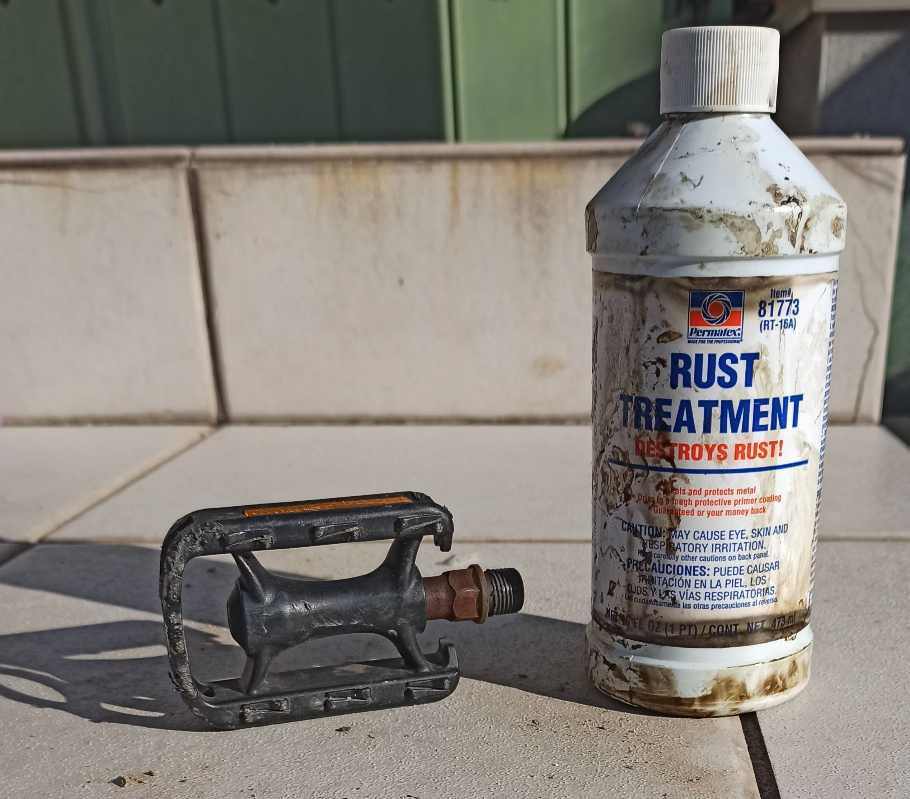
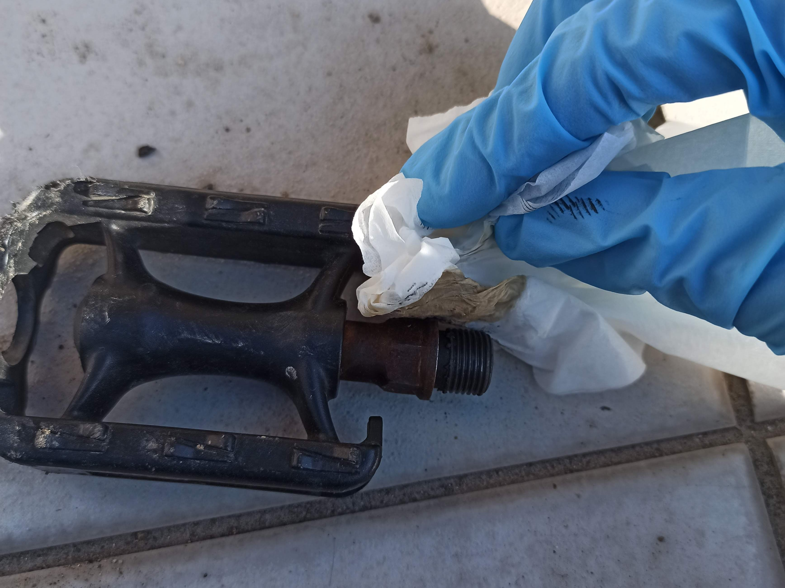
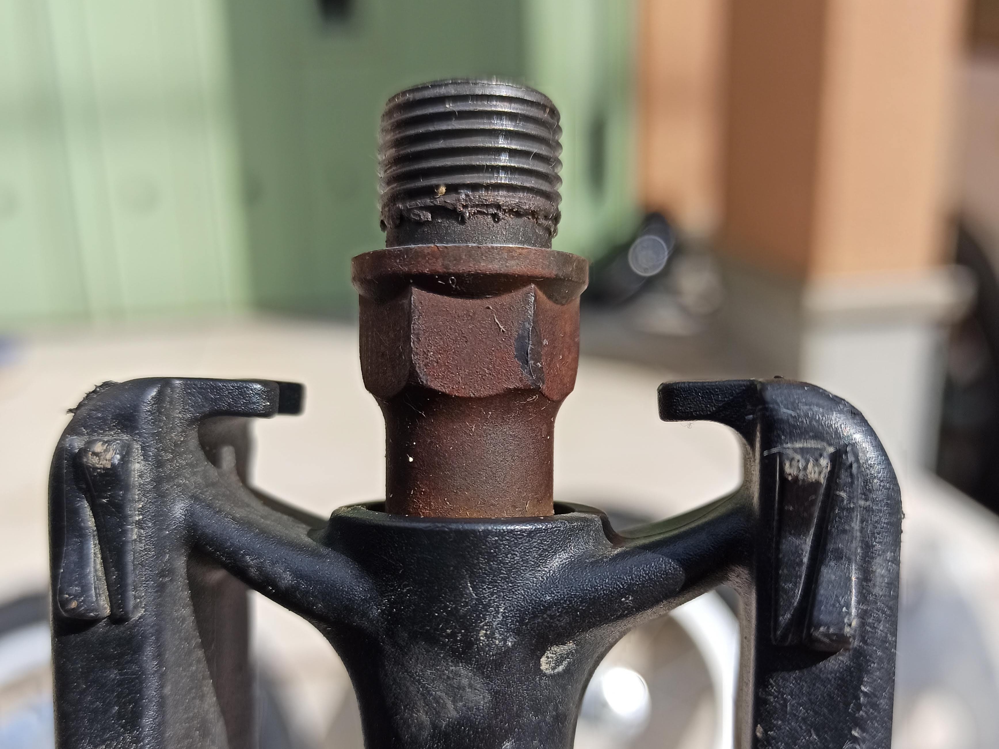
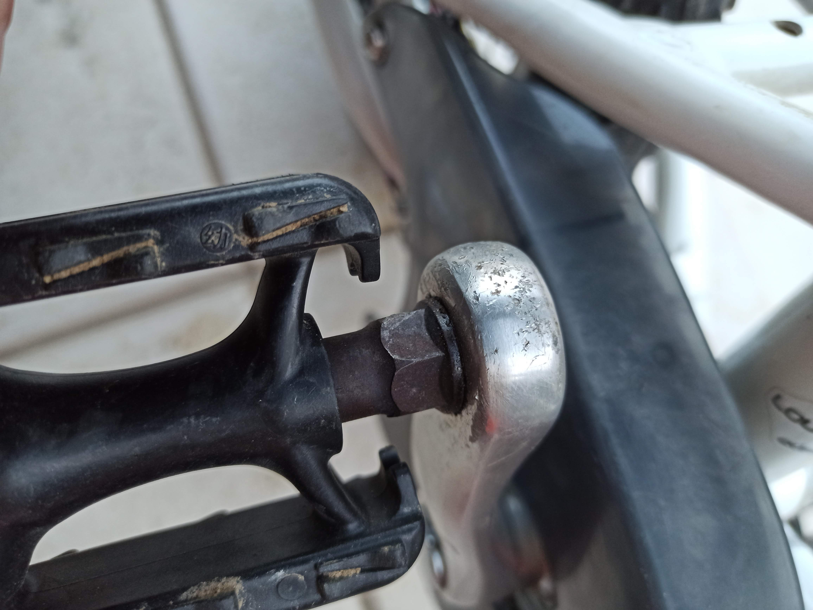

---
categories:
- 自転車
- bike
date: "2025-02-15T23:42:40+09:00"
draft: false
images: 
- images/IMG_20200315_081226.jpg
summary: 錆びてしまった子ども用自転車のペダル軸部分に黒錆転換剤を塗って黒錆にしました。錆はすぐに反応せず、失敗したかと思いましたが5日後に黒に近い焦げ茶色までゆっくりと変色していきました。
tags:
- LGS-J12
- ペダル
- 錆
title: Permatex RT-8-A Rust Treatment ペダルの赤錆を黒錆化
---

子供用自転車ルイガノ LGS-J12
のペダルのシャフトが赤錆だらけになっていました。

もともと黒染め仕上げの鉄のシャフトなので、錆転換剤で赤錆を黒錆化してみます。以前
Bikke のハンドル回りに使った Permatex Rust Treatment
のボトルがまだまだ残っているので使用してみます。量は一生分ありそうです。ジップロックに入れていたらなんか変な茶色が付いていました。

ボトルの説明には油分を落としてワイヤーブラシで錆を落としてから塗布、15分後に2回目を塗布と書いてありますが、面倒なのでいきなり塗布します。ティッシュに染み込ませて塗っていきます。体に悪そうな色をした液体なのでゴム手袋をしています。

15分経ったら2度塗りし、見てみると、、、

ん！？変化無し？？赤錆が濡れて多少黒っぽく見える程度です。開封してから時間が経っているので賞味期限切れか？

ということで、失敗したかと思いペダルを取り付けました。5日後にふと見てみると、、、あれ、結構黒くなってきている！

ペダル取付から5日後まで見ていないのでどれくらいの期間で黒くなるかわかりませんが、時間が経てばこれほどの錆にも結構効果があるようです。

若干茶色さは残っているので新品とまではいきませんが、だいぶ見た目は良くなりました。
