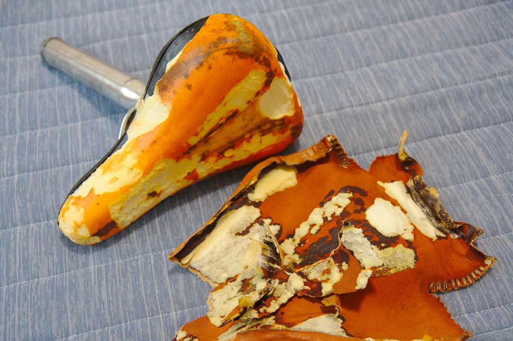
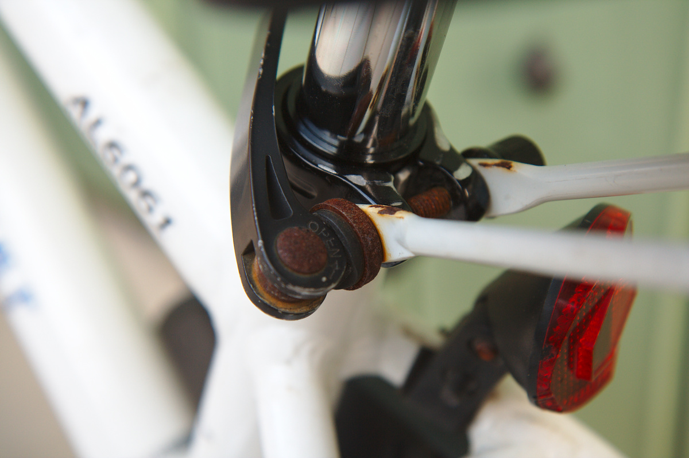

---
categories:
- 自転車
- bike
date: "2025-02-15T23:42:33+09:00"
draft: false
image: images/IMG_4879.jpg
summary: DIYで革シート張りしたサドルが経年劣化でボロボロになってきました。普通にアサヒ自転車の子ども用サドルを購入し取付。シートポストの径が合わずアダプターが必要でした。
tags:
- LGS-J12
- サドル
title: ルイガノ LGS-J12 シートポスト交換
---

## 革張りしたサドルがボロボロに

以前に下の記事で革シート張りしたサドルですが、経年劣化でボロボロになってきました。
外観は素敵だったのですが、外保管だと雨風で本皮はすぐにダメになってしまいますね。

革靴用クリームを塗ったりしてみましたがすぐに元に戻ってしまいました。

## 合皮に張替えに挑戦してみる

合皮であれば多分市販のサドル同様にボロボロになりにくいと思い、いったん本皮を
剥がして合皮を接着剤で貼っていきます。

しかし、シワが寄ってしまいシワシワで汚い感じになってしまいました。
なんとなく合皮は本皮より伸びやすく簡単そうに思ってたのですが逆で伸ばしにくいみたいです。
さらに今回は（伸びやすいとおもっていたので）1枚もので切れ目、縫い目も入れず接着だけで
仕上げようと思っていたのが敗因でした。

## おとなしくサドルを買う

ということでサドルを新品に交換すべくアマゾンを検索してみましたが、子供用のサドルは
あまり種類が無いのですね。考えてみると子供用自転車なんてすぐに子供は大きくなってしまう
のでニーズがあまり無いのでしょう。

我が家はこの自転車が兄弟全員に受け継がれていってます。唯一と言っていい選択肢は
シートポスト一体型のアサヒの子供用サドルを購入。

シートポストの径が異なるためシムも購入しました。ついでにシートポストクランプも青いもの
に交換したいと思って一緒に購入。
本当はシートポストは不要でサドルだけ交換したかったのですが、サドルとシートポスト取付の
規格が合わずシートポストとサドル一体で交換です。

## シートポスト、サドル交換 {#シートポスト、サドル交換}

交換は至って簡単でクランプねじを緩めシートポストを引っこ抜き新しいものを差し込むだけです。シムを入れて一緒に差し込みクランプしておしまいです。

## 新しいシートポストクランプは取付できなかった

ここで思わぬ失敗が。新しいシートポストクランプを付けると、クランプ部に角度が
ついているので共締めしていた「親が自転車の後ろを持つ取っ手」が付けられません。
仕方なくシートポストクランプ交換は諦めます。

## サビたボルトだけ交換

クランプボルトがサビサビなのでステンレスの六角穴付きボルトM6X40に交換しました。

交換後です。ナットはもともと着いていたものをそのまま流用です。
六角レンチで締め付け必要ですがサドルの高さなんて頻繁に調整するものでもないし
見た目もすっきりしました。

## 交換完了!

元のサドルより大きめでかなり自己主張している気がしますが、新品になったので良しとしましょう。
