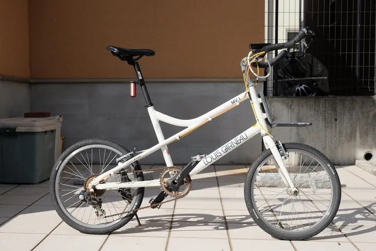
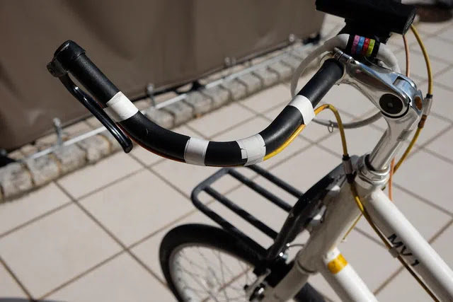
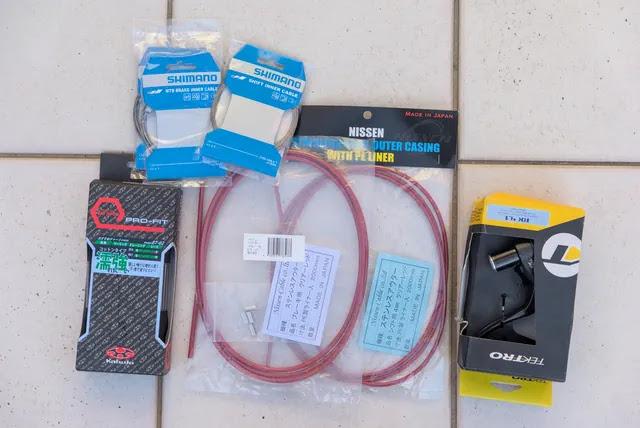

---
categories:
  - 自転車
  - bike
date: "2025-02-15T23:43:58+09:00"
description: ブルホーン化したルイガノLGS-MV1のブレーキワイヤーが錆びて切れてしまいました。アウターケーブル／インナーケーブル一式、新品への交換方法を解説します。
draft: false
images:
  - images/42.webp
summary: ブルホーン化したルイガノLGS-MV1のブレーキワイヤーが錆びて切れてしまいました。アウターケーブルともに一式新品に交換しました。
tags:
  - ブレーキ
  - ワイヤー
  - LGS-MV1
title: ルイガノLGS-MV1 ブレーキワイヤー交換
---

ブルホーン化したルイガノLGS-MV1のブレーキワイヤーが錆びて切れてしまいました。アウターケーブルともに一式新品に交換しました。

## ブレーキワイヤーが錆びて切れた

ルイガノLGS-MV1を
[ブルホーン化](https://www.bchari.com/2019/01/louis-garneau-lgs-mv1-1.html)
してから約4年経ちました。

ブレーキの引きがだんだん抵抗を感じるようになり、先日リヤブレーキがレバーを引いても全く動かなくなってしまいました。レバーを握ってもスカスカで全く力がかからない感じです。

ブレーキは全く動いていません。どういうこと？？

とりあえず、ワイヤーがおかしいはずなので外していきます。まずはワイヤーエンドキャップを引っこ抜きます。

ワイヤーもサビサビです。

ボルトを弛めてブレーキからワイヤーを外します。

ワイヤーが外れました。

バナナ形状の金具を抜くと、アウターケーブルとワイヤが錆びて固まったようになっています。押しても引いても全く滑らず。。。

ワイヤーが抜けないので仕方ないのでアウターケーブルも外すためにバーテープを外していきます。

バーテープを外しました。

ブレーキレバー側のアウターケーブルを引っ張ってみると、、、

あれ！？ワイヤーが切れてます！！

ワイヤーが錆びて切れたのは初めての経験です。屋根の無い庭に置いていることに加え、ブルホーンはワイヤーエンドが上を向いているので水が入りやすいためこんなに錆びてしまったのだと思います。

リヤのみワイヤー交換するつもりでしたが、これを見てしまってはフロントブレーキ、シフトも同じことになっていそうなので全部アウターケーブル含めて交換することにしました。

フロントブレーキのワイヤーを外していきます。

やはりフロントブレーキもワイヤーがだいぶ錆びています。

シフト用のワイヤーも外します。

一通り外しました。

## ケーブル一式を新品に

錆びにくいようにステンレスのアウターケーブル、インナーワイヤーを購入しました。バーテープも交換です。ブレーキレバーは4年前に1箱1個入りだと思って2箱購入しましたが、実は1箱2個入りで余ってしまったものを持っていたのでついでに交換します。

アウターケーブルの長さを測ります。

ケーブルカッターでカットします。

PWTのこのケーブルカッターは側面にキリが付いていて、アウターケーブルの内径をグリグリして整形できるスグレモノです。

アウターケーブルをビニールテープで固定していきます。

反対側のブレーキとシフターのアウターケーブルも取付けました。シフターはサムシフターを元々ブルホーンの先端に付けていたのですが、ブレーキワイヤーと干渉して微妙な取付位置になっていたので、今回はステムにこのように付けました。

操作性は劣りますがケーブルがすっきりいして見た目が良いです。

ワイヤーを通していきます。ブレーキレバー側からワイヤーを入れます。

バナナは再利用です。

タイコを入れます。

ブレーキにボルトでワイヤーを固定します。ブレーキレバーにもブレーキ側にもテンション調整用のナットが無いため、前回はケーブルの間に挟むインラインアジャスターを入れましたが今回は面倒なので入れてません。ここの引張り具合のみで調整することになりますが、写真に写っているテンション調整工具が便利です。

余分なワイヤーを切断します。

エンドキャップをカシメてフロントブレーキは完成です。

リヤ側も同様にワイヤーを取付けます。

シフターのワイヤーはレバーの穴から通していきます。

レバーの穴からアウターケーブルに入れます。

ディレーラーに通していきます。

ワイヤーをカットしてエンドキャップを付けてシフトも完成です。サムシフターはインデックス式でなく、手で操作しながらシフトが変わったところで止めるという使い方なので、テンション調整はいい加減でもいけるのがいいところです。

最後にバーテープです。屋外放置なのでOGKカブトの「濡れに強い」というものを選びました。

ハンドル端は、普通はエンドキャップにはみ出したバーテープを入れるのですが、この場合はエアロブレーキが付いています。ブレーキとハンドルバー内径のクリアランスが無くてバーテープを巻き込むことができないので、外側を少し余らせて巻いていきます。

一通り巻きました。

バーエンドテープを一周して固定します。

飛び出したバーテープをカッターで切ってこんな感じに仕上げてみました。

ハンドル全体です。

## 完成！

完成です！赤いケーブルがいいアクセントになりました。ワイヤーが新品だとブレーキの引きも軽く、シフトもしっかり変わってくれるので快適になりました。

ハンドルまわりもすっきりです。

サムシフターをステムに付けるのは使い勝手がどうかと思いましたが、通勤で使うくらいでは気になりませんでした。

雨ざらしは変わらないので、ステンレスがどれだけ効果があるか見ていきたいと思います。結果は4年後お楽しみに！
