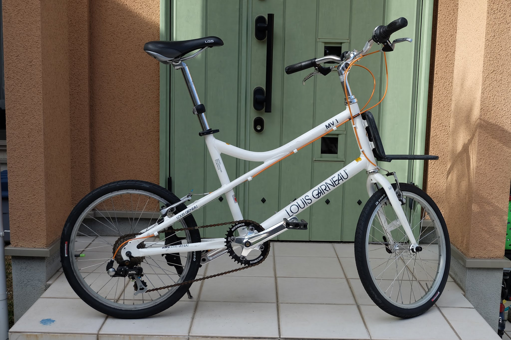
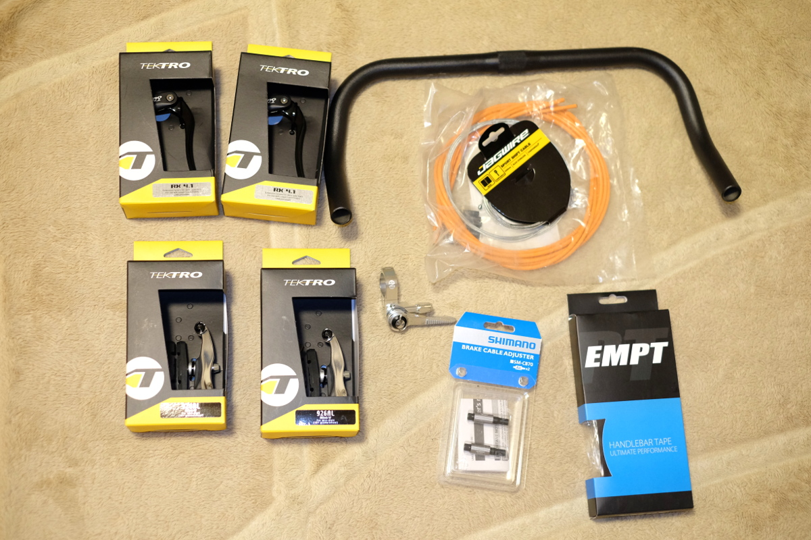

ミニベロのハンドルは、普通はフラットハンドルが一般的ですが見た目かっこよく長時間のライドも楽になるブルホーン。Louis
Garneau LGS-MV1
ミニベロブルホーン化してみました。全3編、今回は調査と前準備です！

## 何故ブルホーン？ {#何故ブルホーン？}

通勤自転車のルイガノLGS-MV1ですが、これまで狭幅タイヤへ交換（20\"-1.5→20\"-1.35）、チェーンリング交換（48T→38T）とやってきて貧脚でもスイスイ坂道を走れるようになってきました。

次はさらに走りやすく＋見た目カッコよくしたいと思いネット徘徊しているとブルホーン化という改造を知りこの男気溢れる姿に惚れたのでやってみようと思います。

## ブルホーン化事例調査！ {#ブルホーン化事例調査！}

大きく分けて4つの方法があるようです。

1.  ブレーキ、シフター流用
2.  エビホーン
3.  STIレバー
4.  エアロブレーキ＋サムシフター

参考\
[クロスバイクをブルホーン化する場合の基本4形態](https://escape.poo.tokyo/4-types-of-bull-horn-basic-style/)\
[クロスバイクを憧れのブルホーン化に！やり方とそのメリットを大公開！](https://kurashi-no.jp/I0015688)

この中で見た目カッコよいのは3と4ですがSTIレバー化は７速対応していないと思うので、
エアロブレーキ＋サムシフターでのブルホーン化に挑戦することにしました。

## エアロブレーキ＋サムシフターに決定！ {#エアロブレーキ＋サムシフターに決定！}

さて、アマゾンでパーツ集めです。方針としては安いものをチョイス。\

ハンドルはなんと￥538の激安中華もの。ブレーキレバーはTEKTRO
￥3,100×2個で引き代が少なくなるのでVブレーキもショートアームに交換。これもTEKTRO￥1,480×2個。シフターはダイアコンペのENEサムシフターの形に惚れて豪華1点主義で￥6,370。ハンドル先端にブレーキ、シフターが付くのでワイヤーも伸ばす必要あるのでこれはJAGWIREのオレンジとシマノのブレーキケーブルアジャスター、そしてバーテープはEMPTの黒にしました。

次回はこれらを組み付けていきます！外が寒いからなかなかやる気が起きない。。。
