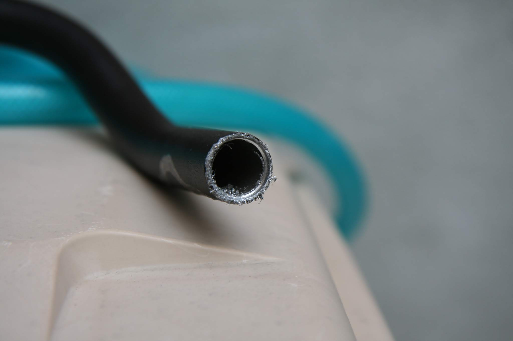

ミニベロのハンドルは、普通はフラットハンドルが一般的ですが見た目かっこよく長時間のライドも楽になるブルホーン。Louis
Garneau LGS-MV1
ミニベロブルホーン化してみました。全3編、第2回の今回から本格的に改造です！

## エアロブレーキが入らない！

これがAmazonで500円で購入したブルホーンハンドルバーです。ここまで安くていいの！？という値段でアルミに黒アルマイトの表面処理もきれいです。

早速ハンドルにブレーキを付けようとしたところ、まさかのハンドル内径が小さすぎてブレーキが入りません。

Amazonでこのハンドルのユーサーレビューを見るとφ19の面取り用ドリルで穴を広げるコメントを見て真似して注文。これが200円くらいで激安で中国から3週間くらいかけて到着しました。

すぐにこれで穴を広げようと頑張るものの、切れが悪くなかなか進みません。インパクトレンチ4回充電使い切りやっと5mm程度。疲れて諦めます。

仕方なくお高い2,000円近くの超高チップのホールソーをオーダー。500円のハンドルにこれだけお金をかけるのはバカバカしいのですがこうなった以上頑張って穴掘りです。

サクッと25mm程度掘り進めました。
加工面はかなりガタガタですがまあいいでしょう。

エアロブレーキ装着！
あれ、おかしいな、入らないと思いきや黒いスリーブを抜いたら入りました。Amazonのレビューではぶっ叩いて入れた！なんて記述もあったのでもしかしたらなんとかなるのかもしれません。

入った！ここまで来るのに数週間（主にドリルの中国からの送付待ち）

## サムシフター取付！

ダイアコンペのサムシフター、これだけ一点豪華主義です。だけど、こんどは外形が小さくてスカスカです。Amazonや楽天で見ると小さい内径用にスリーブが付いているとのコメントも見かけるのですがbchariが買ったものは付いてなかったのかな。到着後喜んで即パッケージ開けたので捨ててしまったのかも。。。

とりあえず、ゴムシート巻いてクランプすることで付きました。

とりあえず、付いた写真です。

## まだまだ課題が、、、

エアロブレーキを安物でけちったのでワイヤーはハンドルの外を這わすタイプなのですが、これではサムシフターのクランプとアウターワイヤーが干渉します。

うーん、どうしよう。無理やり付くか最悪ステムの近くに取付になるかな。ワイヤーがハンドル内側通すタイプにすべきだったかorz。そんなこんなで四苦八苦しています。
