---
categories:
- 自転車
- bike
date: "2025-02-15T20:03:54+09:00"
draft: false
image: images/bullhorn.jpg
summary: Louis Garneau LGS-MV1 ミニベロブルホーン化。四苦八苦しながらなんとか改造完了しました！
tags:
- 自転車
title: Louis Garneau LGS-MV1 ミニベロブルホーン化 3
---

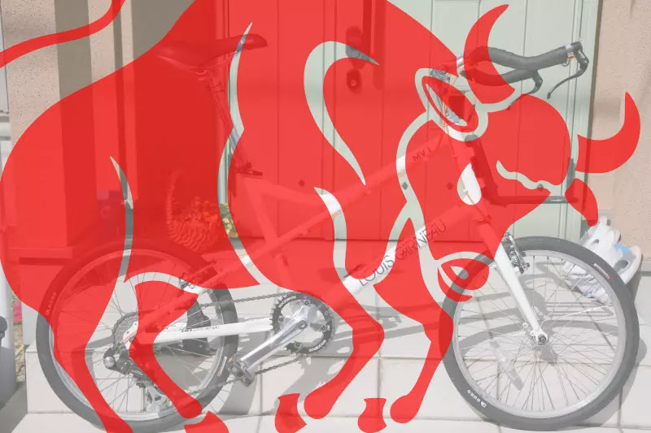

ミニベロのハンドルは、普通はフラットハンドルが一般的ですが見た目かっこよく長時間のライドも楽になるブルホーン。Louis
Garneau LGS-MV1
ミニベロブルホーン化してみました。全3編、ついに改造完了です！

## ブルホーンハンドルを取付

現状のフラットハンドルです。

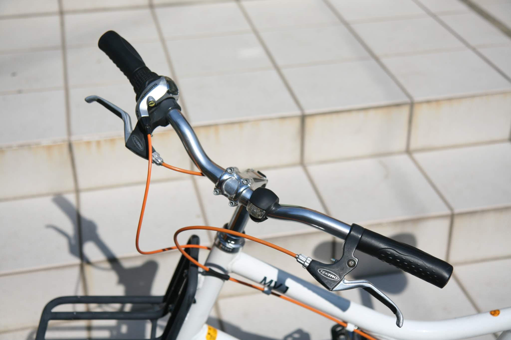

ステムからハンドルを取り外します。

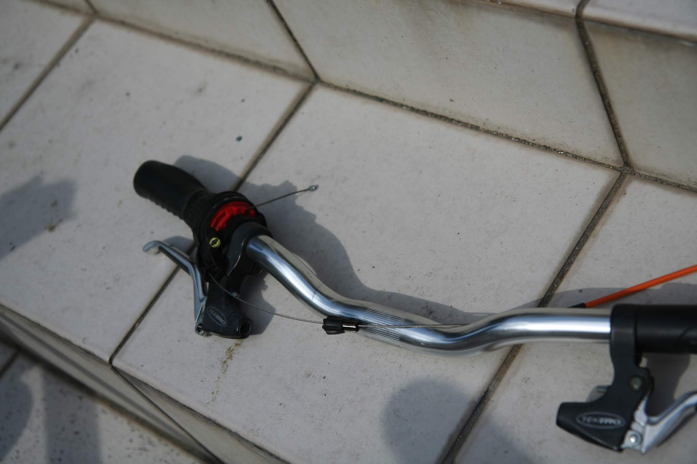
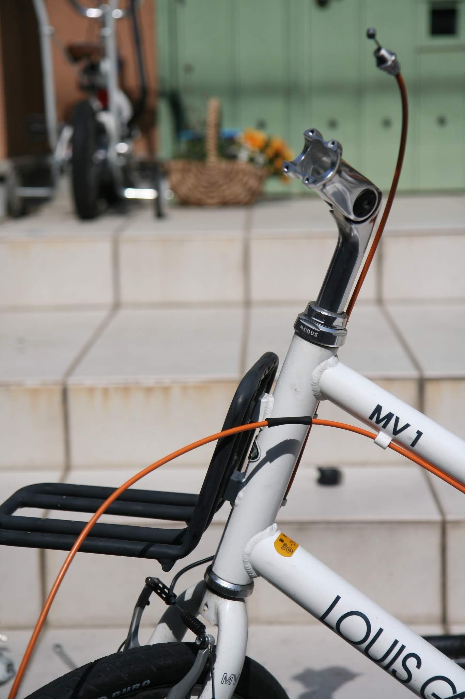

ブルホーンをマウント！角度がちょっと変？

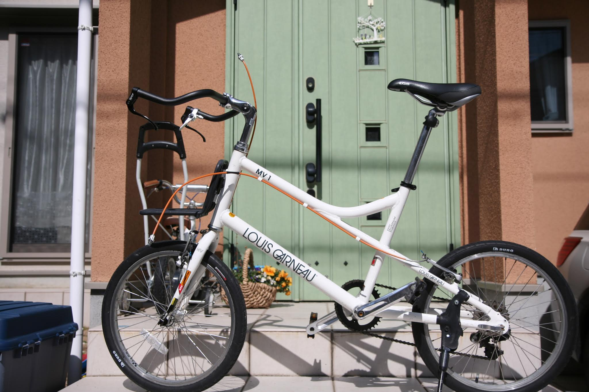

角度調整できるステムだったので見た目重視、0°に調整します。

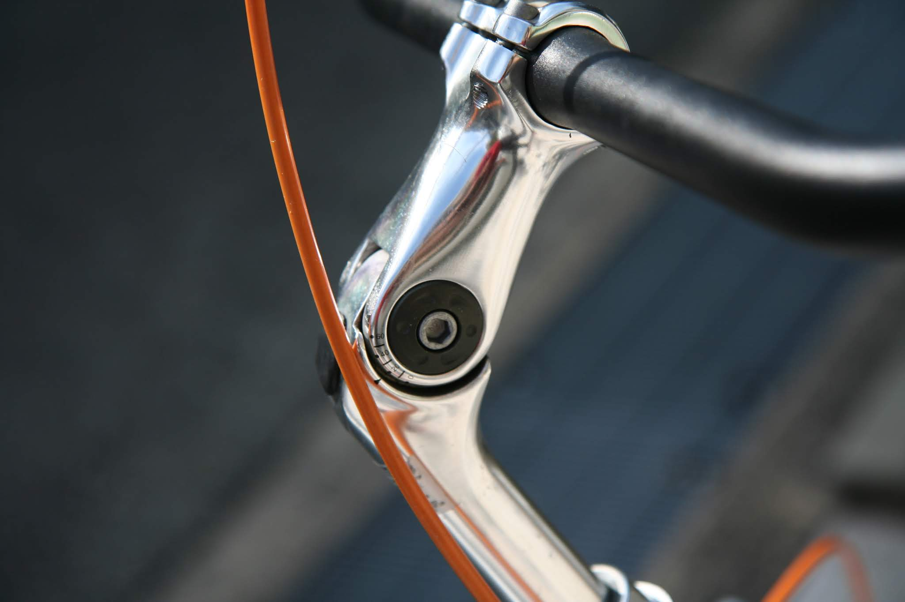

こんな感じかな。。。

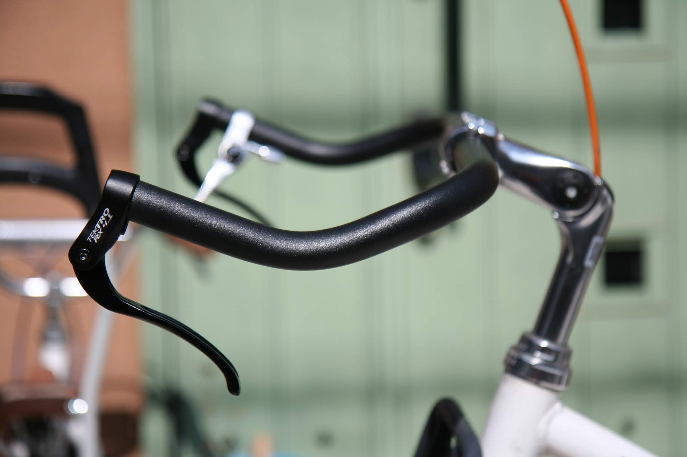

## ミニVブレーキ取付

次にVブレーキを外してTektroのミニVブレーキを取付ます。エアブレーキは元々ロード用なので引き代が少なく、引き代の大きいマウンテンバイク用のVブレーキは引けないようです。しかし、キャリパーブレーキはマウントが異なるため付かない。そこでこのニッチな用途に引き代の少ないミニVブレーキというものがあるようです。

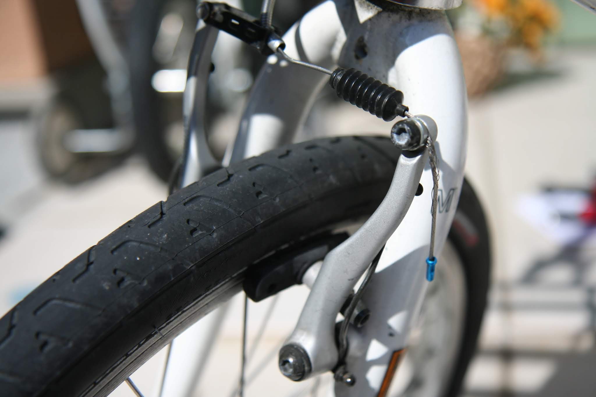
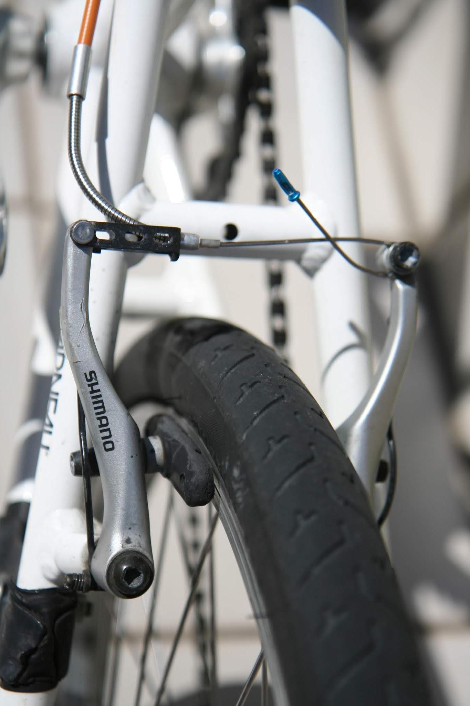
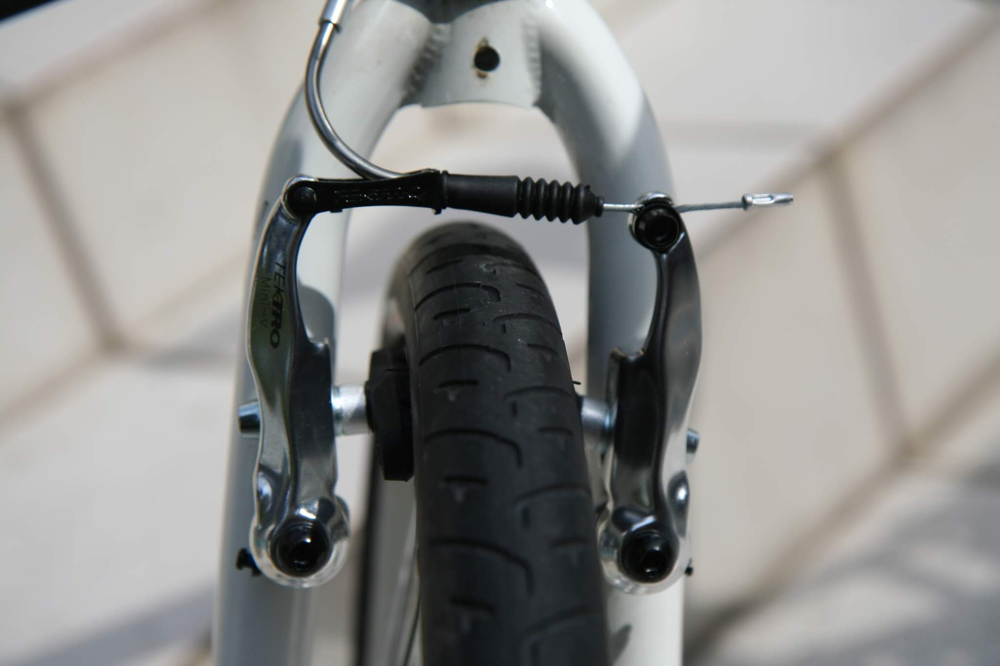
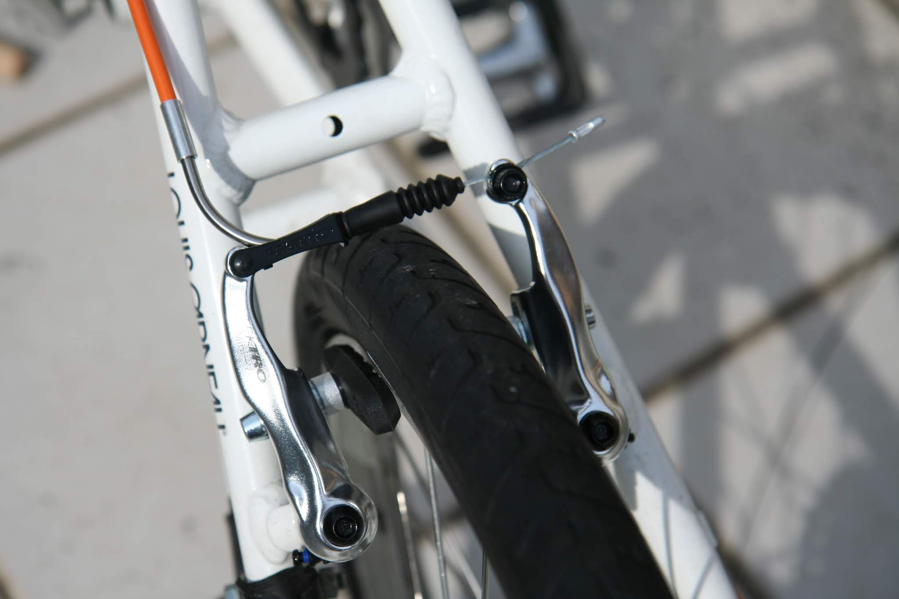

ブレーキの形、質感はTektroのミニVブレーキのほうが好きです。リンクからアーム先端までの距離が短くなるため制動力が落ちます。

## ブレーキ＆シフトケーブル取り回し

ブレーキケーブルとシフトケーブルをテープで仮固定しながらハンドルに這わせていきます。ケーブルは好みのオレンジ色で、シマノより安かったJagwireです。

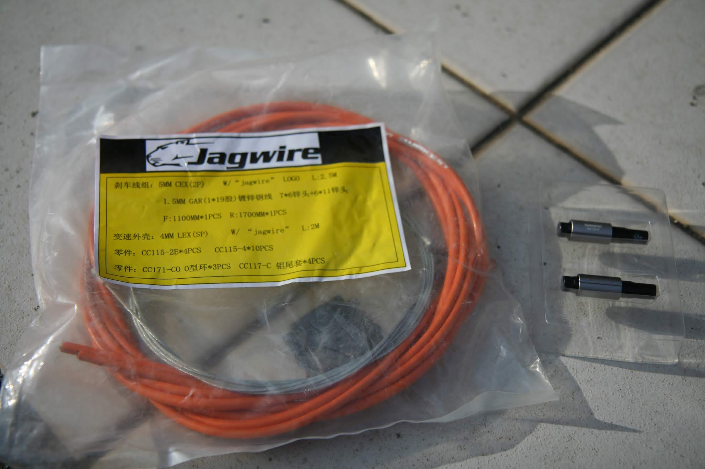

問題のサムシフターとブレーキケーブルの干渉は、下の写真のように無理やり感満載ですが、とりあえずこんな感じになりました。

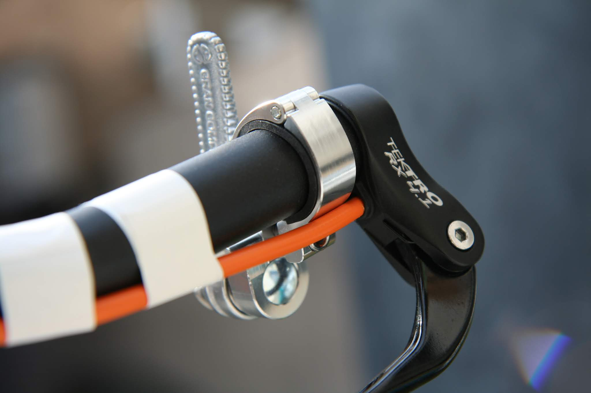

エアブレーキはワイヤーテンションの調整ができないのでシマノのアジャスターをケーブルの間に入れます。仮固定が終わった写真です。ハンドルからフレームへの取り回しがあまり美しくないですがアウターケーブルが長すぎたり切りすぎたりで、もういいや、となってます。

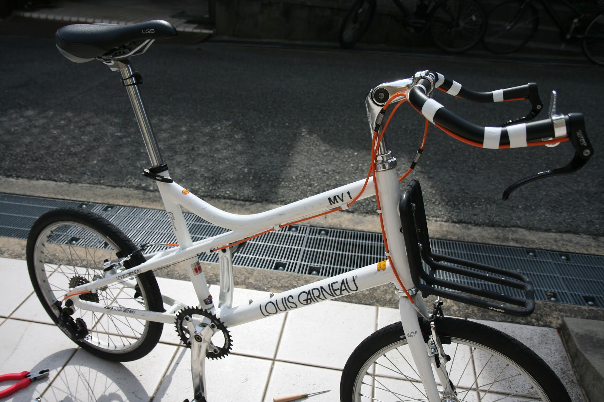

## バーテープまきまき

あとはバーテープを巻いていきます。

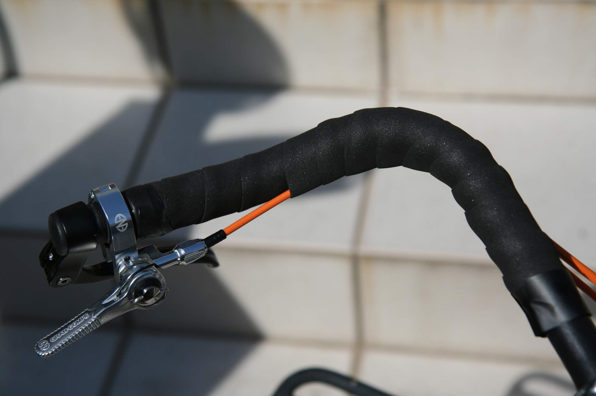

ドロップハンドルには何度か巻いたことあるのですが今回はバーエンドにブレーキが付いているので末端処理をどうしたら良いかわからず、これも妥協でNITTOの自己融着テープで適当に固定しました。見栄え悪いですね。ステム側のバーエンドテープもしわだらけです。厚めのスポンジ状のバーテープだったのですが、テープで半分ハンドルにくっつけようとしたのが間違いでした。

あと、シフトケーブルは途中からバーテープの中に入れるというもう、なんでもいいやになってきてます。

## 完成！

あいかわらずハンドルの角度がよくわかりませんが、なんかカコイイ気がしたので満足です。まあ、通勤でふらふら漕ぐだけなので見た目満足なら良いでしょう。

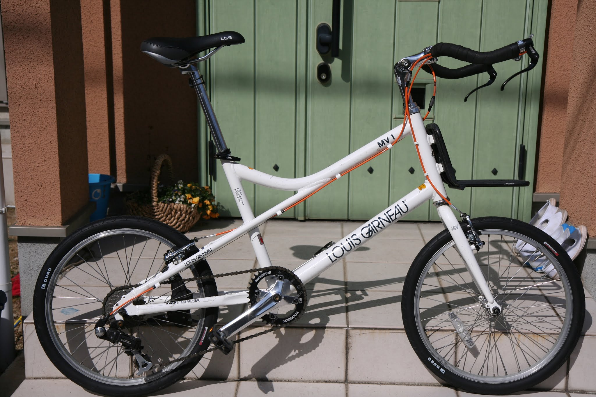

## 乗ってみての感想

気持ち的には前傾姿勢でグッとハンドルを握りシャーっと風を切るように走れるようになるイメージでしたが、実際には前傾姿勢が辛いくらいで走りやすくなったとか、スピードが出るようになったとかいう実感はゼロです。まあ、ミニベロだし早く走ろうというわけでも無いのでこんなものでしょう。ブレーキはピタッと止まらなくなりましたね。。。しばらく通勤で使ってみて慣れると走りやすく感じられるかな？？
