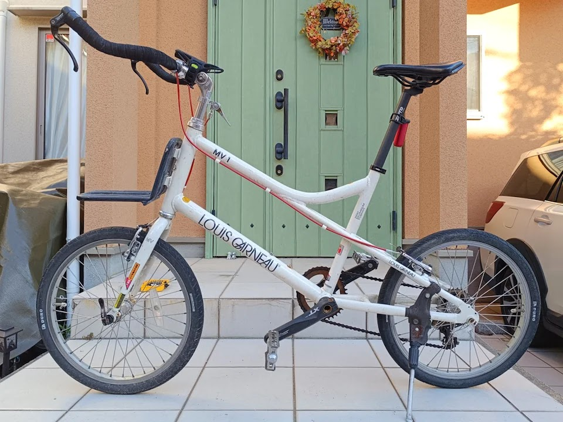

---
categories:
  - 自転車
  - bike
date: "2025-02-15T23:44:27+09:00"
description: 自転車用のセンタースタント取付け方法を解説します。取付できない車種もあり、見事に失敗し、当初予定と別の自転車に取付たので注意点も含め実体験をまとめました。
draft: false
images:
  - images/014.jpg
summary: 自転車用のセンタースタント取付け方法を解説します。取付できない車種もあり、見事に失敗し、当初予定と別の自転車に取付たので注意点も含め実体験をまとめました。
tags:
  - スタンド
  - LGS-MV1
  - Agressor
title: MTBにGorixセンタースタンド取付...できずミニベロに取付
js: js/paad.ts
---

昔アメリカ出張中に購入したMTB、GTのアグレッサーが眠っていたままになっていました。子供が大きくなり、これまで使っていた自転車が小さくなってきたのでこれを使ってもらおうと引っ張り出してきました。スタンドが無かったのでセンタースタンドを購入、取付しようとしましたが取付できず、結局通勤用のミニベロLGS-MV1に付けました。

## Gorix センタースタンド

自転車のスタンドといえば、後輪付近に付けるものが普通だと思いますが、前輪と後輪の中間、クランク付近に付けるセンタースタンドが安定するとの情報があり、取付もボルト1本ですっきりしそうなのでGorixのセンタースタンドを買ってみました。



## GT Agressorへ取付できず

スタンドの無いGTアグレッサーです。数年前に購入しましたがほとんど使っていないので新品に近い状態です。一番安いグレードで、ワイヤー引きのディスクブレーキのモデルです。

Gorixのセンタースタンドに、取付工具はラチェットに13mm(M8)のソケット、ボルト1本止めでは緩みが心配なのでロックタイト、そしてスタンドの長さ調整用にプラスドライバーです。

クランクから後輪へ伸びている2本のフレーム、チェーンステーに金具を挟んで取り付けます。

楽勝！と思ったらまさかのシフトワイヤーと金具が干渉してしまいました😵‍💫

アマゾンの商品説明にも写真付きでこういったフレームには取付できないとわかりやすく書いてあり、読んでいたのですがなぜか自転車を見もせず「大丈夫だぜ！」と根拠ない自信で購入し、失敗してしまいました（反省）

## ルイガノLGS-MV1に取付

買ってしまったものはどうしようか、ということで通勤用自転車のルイガノLGS-MV1のスタンドを交換することにしました。

今付いているスタンドは、後輪付近に付けるもので特に不満は無いのですが塗装も剥げサビも出てきたのでこの際交換して新しくします。チェーンステーの三角形部分にはワイヤーは無いのでこれなら干渉無く取付できるでしょう．

ネジ穴にロックタイトを塗ります。

ボルトにも。

プレートでチェーンステーを挟んでボルトを締めるだけで取付完了です。

こんな感じです。

スタンドの長さを調整します。

取付完了です！取付金具が小さいので見た目はすっきりしました。

安定性は、何か変化を感じるほどでは無いですね。

スタンドを上げた際に後輪側に飛び出ないため、走っている状態での見た目もいい感じですね。ただ1点不満が。スタンドを立てた状態でペダルを回すとスタンドとペダルが干渉するんですよ。スタンドを上げ下げする際に少し気になります。

## まとめ

Gorixセンタースタンドを取付ました。ボルト1本締めるだけで簡単に取付できますが、緩みどめはしておいたほうがいいでしょうｋ．チェーンステーの三角形部分が小さかったり、シフトワイヤーが通っていたりすると今回みたいに干渉して取付できないため注意です。ペダルと干渉するのが少し気になりますが、見た目はすっきりして満足です。


