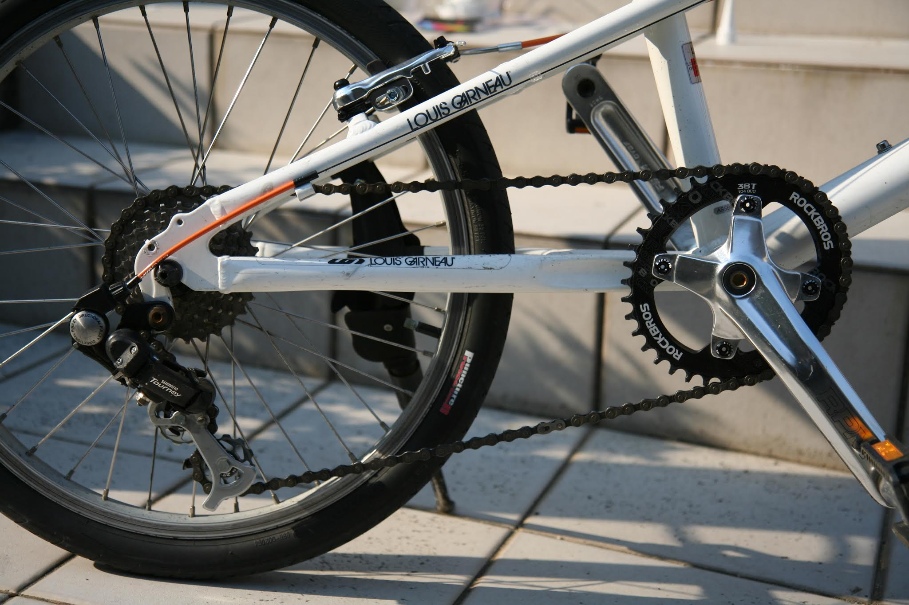

---
categories:
- 自転車
- bike
date: "2025-02-15T21:07:40+09:00"
draft: false
image: images/IMG_4383.JPG
summary: ディレーラーのプーリーは、エントリーモデルだとブッシュが入っているだけの滑り軸受になっており、摩擦抵抗が大きいです。抵抗を少なくするためにアマゾンで安物のセラミックベアリング仕様のプーリーに交換してみました。
tags:
- ディレーラー
- セラミックベアリング
title: ルイガノ LGS-MV1 ディレーラープーリー交換 セラミックベアリング化
---

リアディレーラーに付いている２個のプーリーですが、エントリーモデルのものはブッシュが入っているだけで滑り軸受になっており摩擦抵抗が結構あります。交換用にベアリング入りのプーリーが売っていますがセラミックベアリングとかになると１個4-5千円と高いのですが、例によってアマゾンの中華プーリーがセラミックベアリング、2個セットで\\760、送料無料と破格だったので交換してみました。

交換前のプーリーです。黒い樹脂でできています。歯数は11Tでした。いくつか種類があるので買う前に数えておきましょう。

チェーンを切ってボルト2本を外すとプーリーとプレートが外れます。写真右側のプーリーは軸部分のブッシュを抜いています。プーリーの左にある筒がブッシュです。この筒が固定側で、プーリー内面と擦りながら回ります。薄くグリスを塗っておくと良いのですがノーメンテで数年間使っていたのでガサガサで回転抵抗がありました。片方は歯の周りが削れとるし。

側面プレートは汚れているのでパーツクリーナーで汚れを落としておきます。

これが、Amazonで買ったプーリーです。アルミ製でカラーは派手な色が何種類もありますが、ここは落ち着いたシルバーを選択。セラミックベアリングが見えます。。。本当にセラミック？？プラスチックに見えるのは気のせいでしょうか、、、

両側面にプレートが付きますが、このプレートは隙間ありシールしているわけではありません。プレートを取ると写真の通り開放です。砂とかすぐに入りそうですね。裏側だけ何故かシールのようなものが付いています。セラミックベアリングは給油する必要あるかわかりませんが、念の為エーゼットのオイルを少しさしておきました。

ボルト径に合った付属のカラーを入れ、両側面のプレートを付けた状態でディレーラーに組み付けます。ん、回転がギュウギュウで回らないぞ！？どうやらカラーが少し短いのかボルトを締めるとベアリングに変な力がかかり回らなくなるようです。これでは前よりずっと抵抗が大きいです。うーん、さすが、安物。少し締め付けを弱くするとスルスル回るのでボルト外れが怖いけどしばらくこれで様子見ることに。

チェーンを通して交換完了！見た目は前の黒プラスチックよりだいぶカッコイイですね。

ドライブトレイン全体です。ROCKBROSのチェーンリングとこのプーリーでなかなかいい感じです。

さて、乗ってみて、なんか漕ぐ力が軽くなったような！？気のせいかもしれませんが、\\760にしては満足です。
