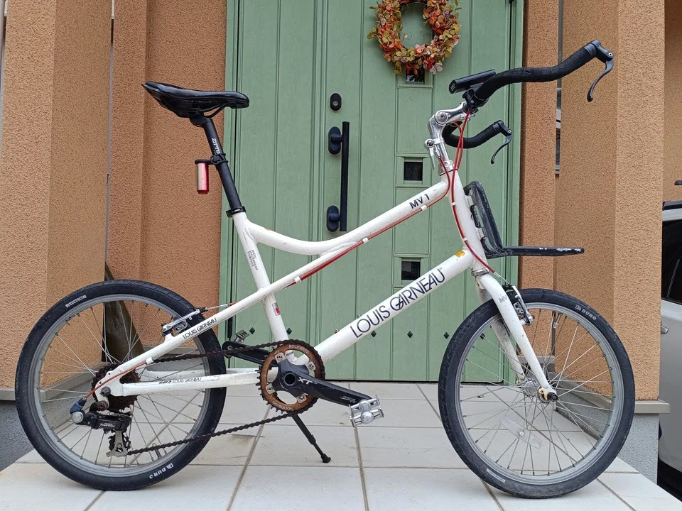

---
categories:
  - 自転車
  - bike
date: "2025-02-15T23:44:30+09:00"
description: 通勤用自転車のルイガノLGS-MV1のチェーンが伸びてスプロケットも摩耗していました。チェーン、スプロケット他、ドライブトレイン一式を更新しました。
draft: false
images:
  - images/0012.jpg
summary: 通勤用自転車のルイガノLGS-MV1のチェーンが伸びてスプロケットも摩耗していました。チェーン、スプロケット他、ドライブトレイン一式を更新しました。
tags:
  - チェーンリング
  - ドライブトレイン
  - スプロケット
  - ディレーラー
  - チェーン
  - LGS-MV1
  - セラミックベアリング
title: ルイガノ LGS-MV1 ドライブトレイン更新
js: js/paad.ts
---

通勤用自転車のルイガノLGS-MV1のチェーンが伸びてスプロケットも摩耗していました。チェーン、スプロケット他、ドライブトレイン一式を更新しました。

ルイガノ LGS-MV1
です。これまでブルホーン化やホローテック化など、いじくり回してきました。ふとチェーンチェッカーでチェーンの伸びを測ってみると1%を超えており、スプロケットも摩耗しています。

## 購入したもの

購入したものは下記です。

1.  チェーンリング 謎メーカーの32T赤
2.  カセットスプロケット シマノ CS-HG200-7 (7S)
3.  リアディレーラー シマノ Tourney RD-TY500 7/6S
4.  プーリー MicrOHERO 13Tセラミックベアリング × 2個
5.  チェーン 謎メーカー (FSC?) F80

ディレーラーはまるごと交換する必要はなかったのですが、メカが錆びて動きが悪かったので本体ごと交換しました。さらにせっかくなのでと安いセラミックベアリングのプーリーも購入。チェーンはやたら安いFSCというらしい謎のメーカー製でレインボーチェーンを少し冒険のつもりで選定しました。



## チェーンリングとカセットスプロケットの交換

早速交換していきます。無心で作業していたので before
の古い部品や交換作業の写真をほとんど撮っていませんでした。

チェーンリングとスプロケットです。今回、イメージカラーを赤ということで、真っ赤なチェーンリングを購入。以前は38Tのオーバル形を付けていましたが、今回はノーマルな円形で、歯数はさらに貧脚向けに36Tに小さくしています。

カセットスプロケットはさすがに赤は無いのでシマノの黒色のものを購入です。

さて、取付後です。

チェーンリング固定ボルトも赤にしたかったところですが、交換したばかりのレインボーを流用しました。

カセットスプロケットは歯数は変わらず、色がシルバーから黒になりました。

## リアディレーラーにセラミックベアリングプーリーを取付

次はディレーラーです。どれを選べばよいか素人には難しかったですが、前付いていたものに書かれていた
"Tourney" と、6/7
Speed、直付タイプということで見た目は結構違うのですがこれでいいだろうと購入。「直付」とは何ぞや？おそらくディレーラーハンガーが無いフレーム用、ということでしょうか。改めてLGS-MV1を見るとたしかにディレーラーハンガーありません！ロードバイクに乗っていると、ディレーラーにはディレーラーハンガーがあるものだ、と先入観がありました。

プーリーは今回のイメージカラー、赤、を2個買ったつもりが、、、1個赤で1個はレインボー色が来ました。オーダー間違えたかな。まあいいや。

新品なのにもったいないと思いつつ、ディレーラープーリーを外します。

赤とレインボーのプーリーを付けました。

さすがセラミックベアリング、まわるまわる！でも、グリスの抵抗は全くないのでおそらくグリス入ってないからこんなにカラカラ回るのでしょう。セラミックは焼付きが無いから潤滑せずにブンブン回しても良い、ということなのでしょうか、理屈がよくわかりませんがセラミック＝よく回る、でよしとします。

ディレーラーを付けてみると、見た目傾いていたのでディレーラー直付ゲージで修正を試みます。この工具、むちゃくちゃ高かった、、、年末に散財しすぎました😑



ディレーラーハンガーではなく、フレームを曲げていることになるので大丈夫かな、、、と思いつつ、それっぽく修正できました。

## チェーン取付

最後に安物レインボーチェーンです。昔はカラフルに塗装されたチェーンがあった気がするのですが、今はアマゾンで検索する限り、金、銀、レインボー、黒(メッキなし)くらいしか見つからず、レインボー色にしました。

ミッシングリンクもどきも付属しておりお得です。

チェーンを適当な長さに切ってかけたら、、、

いい感じです！

## 改造完了！

チェーンオイルを塗布して完成です！

赤で統一、とおもいきやプーリー1個とチェーンがレインボー色でなんか統一性に欠けますが真っ赤なチェーンリングが目立ちいい感じに仕上がりました。

## インプレッション

これで快適に走れる！かと思いきや、トップとローでフロントチェーンリングからチェーンが脱落してしまいます。オイルが馴染んできたらとりあえずなんとか落ちずに頑張っているようですがちょっと微妙ですね。

スプロケットは同じ歯数で新品にしただけなので、チェーンリングが38Tオーバルから36Tになった、ディレーラープーリーの歯数も11Tから13Tになり、チェーンのパスラインやテンションが微妙に変わったからでしょうか。

見た目は大満足なのですが、もう少し使い込んでチェーン落ちが再発するようでしたらチェーンガイドの取付も検討したいと思います。


