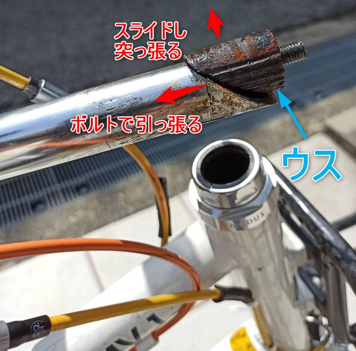
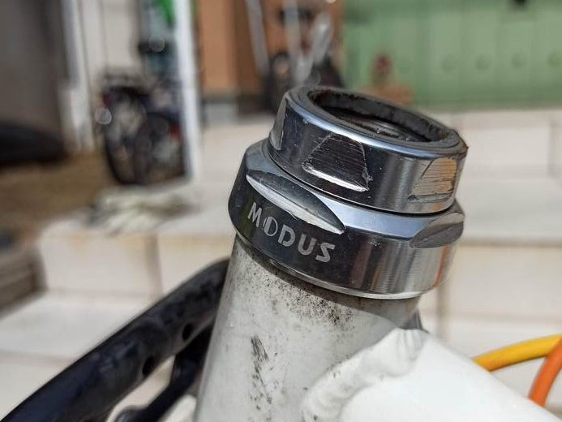
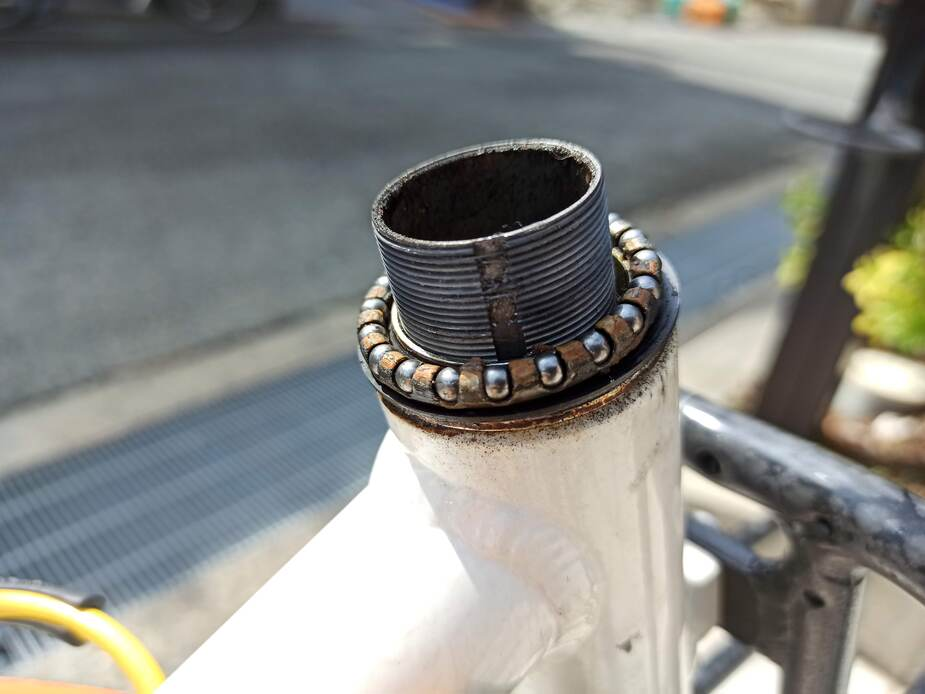

---
categories:
- 自転車
- bike
date: "2025-02-15T23:42:39+09:00"
draft: false
image: images/IMG_20200301_130252s.jpg
summary: ルイガノLGS-MV1のヘッドパーツ部を分解し、ベアリングにグリスアップを行いました。
tags:
- LGS-MV1
- グリス
title: ルイガノ LGS-MV1 ヘッドパーツのグリスアップ
---

前回ハブのグリスアップをしたLGS-MV1ですが、なんとなく他にベアリング使用している箇所としてヘッドパーツが気になったので開けてみることにしました。

まずはステムを抜きます。LGS-MV1はママチャリなどに使われている、ウスをボルトで引いて固定するタイプです。ここのボルトを緩めます。

 

5mmの六角レンチでボルトを緩めます。ボルトを取ってしまうと中でウスが落ちてしまうため、ほどほどに緩めたら手で六角レンチをコンコン叩きウスを落とします。

ボルトがストンと落ちるとウスが外れた合図で、ステムを引き抜くことができます。

ステムの端にある黒っぽい斜めの部品がウスです。ボルトを締めるとウスが持ち上げられ、ステムとウスの斜め部分が滑り径方向に出っ張ることでパイプ内側で突っ張ることになり、固定されます。

ステムを引き抜いた状態です。

ヘッドパーツはこんな感じです。

上側のロックナットは二面幅36mm、下側のワンは二面幅40mmでした。ParkToolのレンチで緩め外します。

外れました。ロックナットに付いているシールが割れています。。。

ワンとベアリング玉はグリスが流れカラカラでした。少し錆の色も見られます。

次に下側ですが、フォークを抜く必要があるのでまずはブレーキワイヤーを外します。

ブレーキワイヤーが外れました。

フォークを抜くと下側のベアリングが見えます。

こちらは若干茶色くなっていますが油分はありました。

フォークを抜いた状態です。

先程外したヘッドパーツ、ベアリングをパーツクリーナーで洗浄しました。錆の茶色は完全に落ちてきれいになりました。

ベアリングにグリスを塗ります。White
Lightningのクリスタルグリスです。透明、無臭のグリスです。

下側ベアリングを入れてフォークを差し込み、上側のベアリングを取り付けます。

ワンを取り付け、玉当たり調整をしてロックナットを固定します。それほど回転するわけではないので、ガタ無く固定できればそれほど微調整しなくてOKです。

ヘッドパーツが付きました。

このあと、最後にステムを差し込み好きな位置でボルトを締めてウスでステムを固定しブレーキワイヤーを復旧すれば完了です。見た目は変わりませんがグリスアップすると何となく気持ちよく自転車に乗れます。

