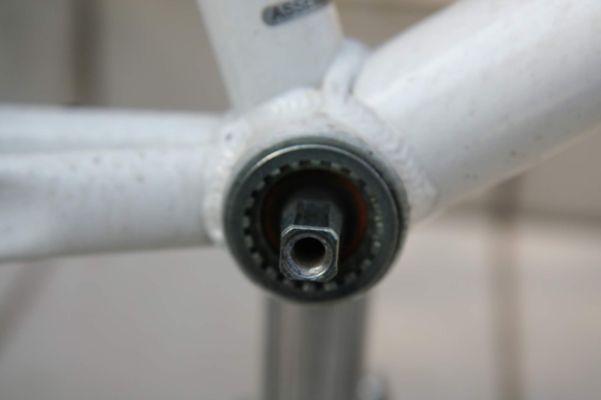
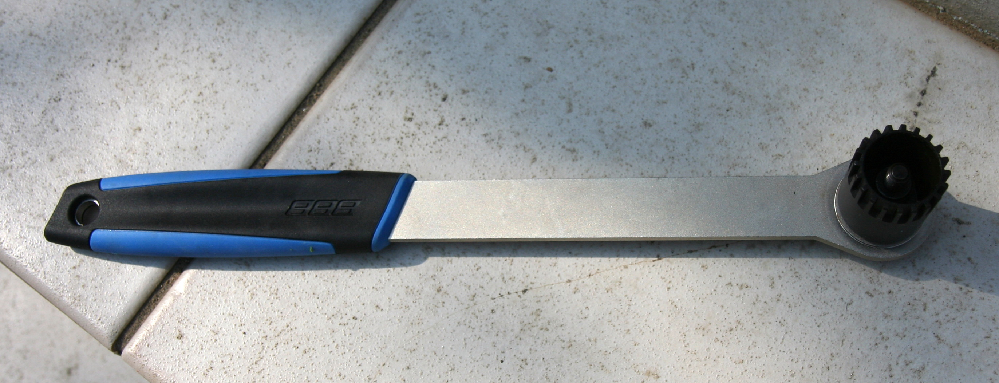
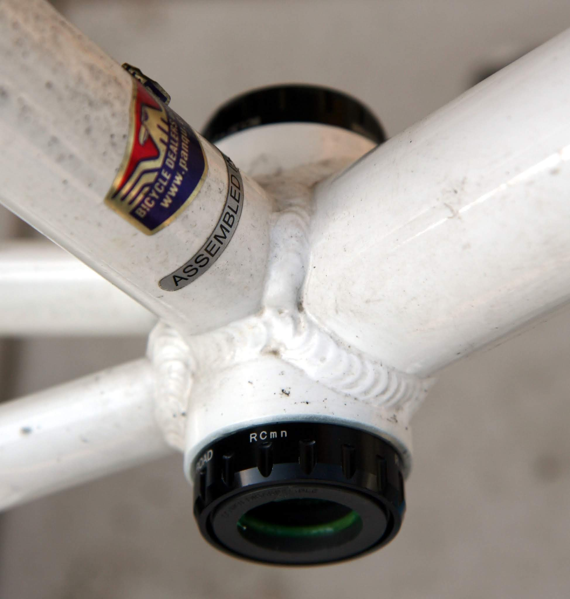

---
categories:
- 自転車
- bike
date: "2025-02-15T22:56:06+09:00"
draft: false
image: images/IMG_4443.JPG
summary: ロードバイクに採用されている剛性の高いクランク軸の規格であるホローテック。通勤自転車のミニベロ ルイガノ LGS-M１のボトムブラケットを交換しホローテック化してみました。効果はいかに！？
tags:
- ホローテック化
- LGS-MV1
title: LGS-MV1 ミニベロ ホローテック化
---

通勤自転車のミニベロ ルイガノ LGS-M１をホローテック化してみました。

## ホローテック化のメリット

シマノ公式サイトによると「剛性と軽量性の高次元バランス、そして優れた回転性能」とか書いてあります。
コッタレス式ボトムブラケットに比べてベアリングがフレームの外に配置されるためベアリング間距離長く、右側クランクとシャフトが一体構造でシャフト径も大きいので剛性が高く、漕いだ時の力が逃げにくいのがメリットと思います。

## 必要なもの

ボトムブラケットはシェル幅の確認とクランクセットも交換が必要です。

-   ホローテックボトムブラケット　シェル幅68mmと70mmがあります
-   ホローテック用クランクセット　クランクも交換必要です

特殊工具もいくつか必要です。

-   ボトムブラケット工具
-   コッタレスクランク抜き工具
-   チェーンカッターかミッシングリンク外し工具

## 交換してみました

交換前のボトムブラケットとクランクです。スクウェアテーパ軸にクランクを差し込むコッタレスタイプで、一般的なママチャリ用のカップ＆コーン式では無く、少し世代の新しいカートリッジ式ボトムブラケットが付いています。

まずチェーンを外します。KMCのミッシングリンクを使っているので簡単に外せます。

クランクを外していきます。クランクのキャップボルトを六角レンチで緩め外します。

キャップを外すとクランクの□穴にボトムブラケットの軸が入っているのが見えます。テーパが付いているので簡単に抜けそうですがかなり固いのでコッタレスクランク抜き工具という専用工具が必要です。

コッタレスクランク抜き工具です。シマノ純正です。

外側のネジをクランクにねじ込み固定し、内側の軸を回すことで先端がボトムブラケットの軸を押してクランクを外す仕組みです。二面幅は16mmでしたので16mmのスパナで回していきます。

右側クランクが外れました。左も同様に外します。

カートリッジ式ボトムブラケットは内側にスプライン溝が切ってあり、外すのに専用工具が必要です。写真はBBBの工具で柄が長く、ボルトで工具を軸に固定できるため力をかけ易いです。

工具を入れて回します。右側が左ねじになっているのでこの写真では右回しで外すので注意です。左側は右ねじです。

外したカートリッジ式ボトムブラケットです。外観がサビサビですが回転は問題なさそうです。

フレーム幅は67.80mmなので交換するボトムブラケットはシェル幅68mmのものを選びます。普通はJIS規格の68mmですがITA規格の70mmも存在するので念の為確かめておきます。

フレームにホローテックのボトムブラケットをねじ込みます。

このホローテック用ボトムブラケットも外径が3種類存在します。一番外径の大きい44mmが初期のホローテックIIで、最近BBR60の41mm、BB9000の39mmの2種類が追加されました。BBR60、BB9000にはアダプターが付属しているので44mm用の工具があれば使用できますが、アマゾンレビューではこのアダプターがシマノ純正工具でないと微妙にきつく使えなかったりするようです。今回はBBR60を購入し、ノグチの3種類に対応したボトムブラケット工具を購入しました。

BBR60に対応しています。裏側がBB9000対応の径になっています。

締め付けます。ちなみにボトムブラケット付属のアダプターはこの工具の44mmにはきつくて入りませんでした。

両側にボトムブラケットが付きました。

クランクセットはホローテックIIに対応したものが必要です。アマゾンで購入した中華製の安物ですが、ロゴのXTがどこかで見たような、、、？

右クランクを差し込みます。

左はスプラインになっています。

クランクを軸に差し込みクランプボルトを締めて固定します。

キャップボルトを入れます。これもトルクスねじのような星型の溝ですが工具が付属していました。

クランクを付けたら、外したクランクからチェーンリングとペダルを移します。

完成です。ボトムブラケットが外に出たことでガッチリいた印象になりました。

自転車全体の写真です。ボトムブラケットはぱっと見わかりませんが、クランクが黒くなったので印象が変わりました。

## 結果

ペダルを漕いでみると、確かに剛性がありねじれる感覚が全く無くなり、力のロスが少なくなった気がします。

まあ、たいして脚力も無いので気がするくらいかもしれません。
