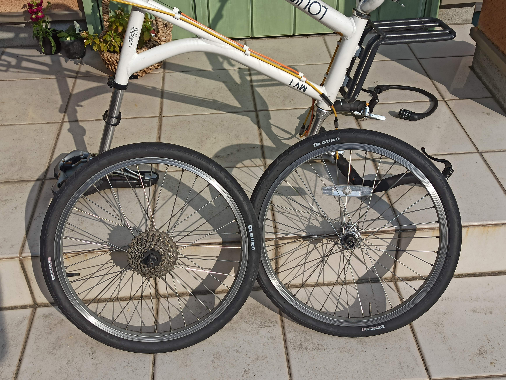
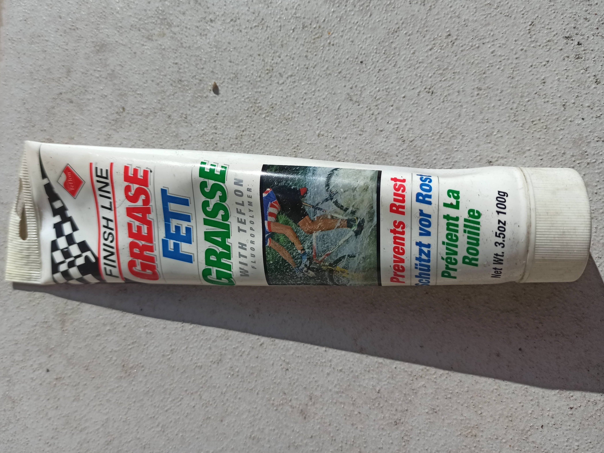

---
categories:
- 自転車
- bike
date: "2025-02-15T23:42:38+09:00"
draft: false
image: images/IMG_20200209_101153.jpg
summary: 自転車通勤で毎日酷使しているLGS-MV1のハブのグリスアップをしました。ハブのベアリングへのアクセスの、玉押し調整のやり方をまとめました。
tags:
- LGS-MV1
- ハブ
- グリス
title: LGS-MV1 ハブのグリスアップ
---

自転車通勤で毎日酷使しているLGS-MV1のハブのグリスアップをしました。

まずはホイールを外します。

クイックリリースなのでシャフトを外すのは簡単ですが、タイヤの空気を抜かないとブレーキの間をタイヤが通りません。キャリパーブレーキだとブレーキ開放のレバーがあり、Vブレーキでも通常のロングアームは手でブレーキを閉じながらワイヤーを外すことができるのですが、ブルホーン化でショートアームのVブレーキに交換しているので一度タイヤの空気を抜く必要がありました。まあ、それほど手間ではありません。

ホイールを抜いたところです。

ハブのロックナットが見えます。まずはフロントハブからベアリング部をばらしていきます。

ハブ両側におそらく防水目的のゴムがあるのでマイナスドライバーでこじり外します。

ロックナットと玉押しが見えます。

ロックナットと玉押しはお互いに締め付けられて固定されています。ハブコーンレンチ13mmと17mmのレンチでロックナットを緩めます。

ロックナットと玉押しを取ると鋼球が見えます。グリスは見えますが、玉が転がる部分は油切れで少しカップが少し茶色く変色していました。

ウエスでグリスを落とし、パーツクリーナーできれいにします。

新しいグリスはフィニッシュラインのテフロン強化グリスを使用しました。

グリスをもりもり入れて玉を一つづついれていきます。

シャフトを通したら最後に玉当たり調整をします。ハブコーンレンチと普通のレンチでガタ無く調整します。精度の高いハブであればスムースかつガタ無く調整を狙えるのですが、これはママチャリに怪我生えた程度の安物ハブなので、あまり精度は期待できず、少しコリコリくらいで調整しました。

次にリアホイールですが、こちらはカセットスプロケットを外す必要があります。

カセットスプロケットは専用のロックナットリムーバーとチェーンの付いたカセットスプロケットを固定する工具が必要です。ロックナットリムーバーは二面幅26mmで、モンキーレンチ目一杯開いてなんとか掴めました。

カセットスプロケットを外すとフロントと同様玉押しとロックナットが見えます。

ベアリングをばらし同じように洗浄後、グリスを詰めます。

玉押し調整をして完了です。

ホイールを自転車に取り付けました。体感ではまあ、何も変化は感じられませんが、しっかり潤滑されていると安心して乗ることができますね。
